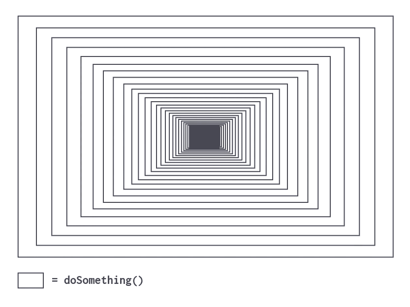
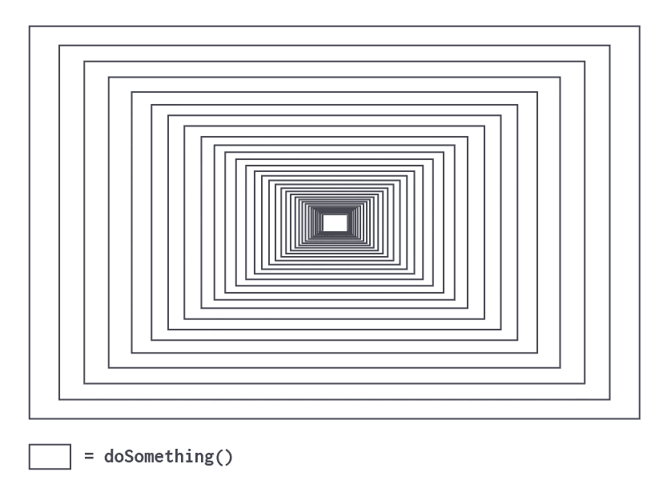
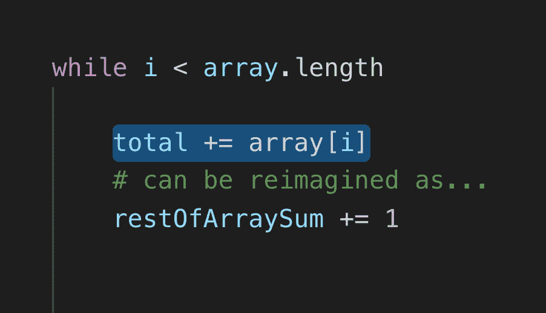
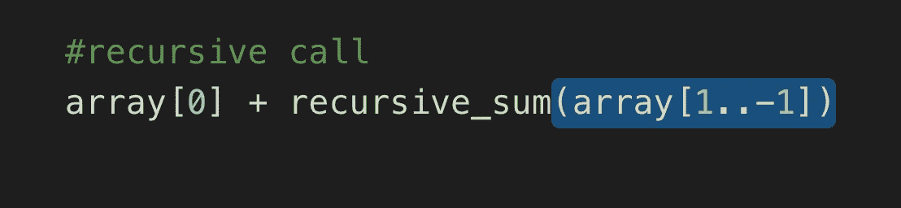
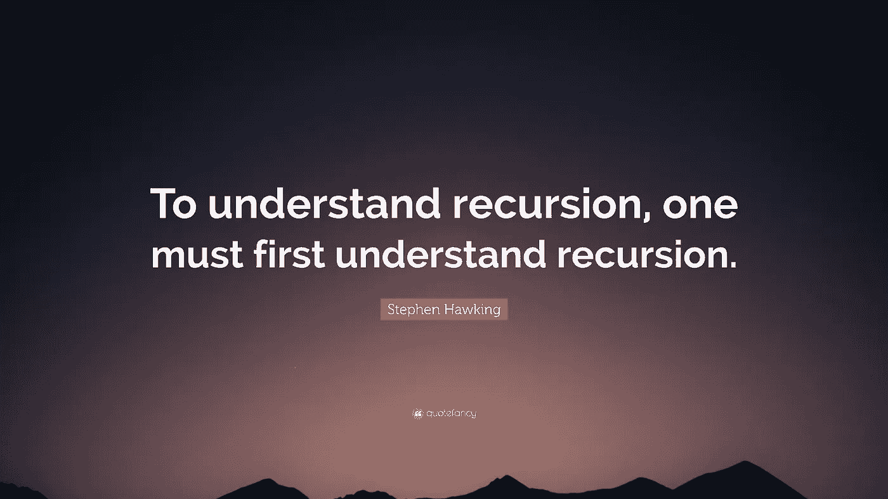

# 递归的外行介绍

> 原文：<https://betterprogramming.pub/a-laymans-introduction-to-recursion-9d5c6727f83a>

*“人生只能倒着理解；但它必须向前生活。”* —索伦·克尔凯郭尔


由 [Jantine Doornbos](https://unsplash.com/@jantined?utm_source=unsplash&utm_medium=referral&utm_content=creditCopyText) 在 [Unsplash](https://unsplash.com/s/photos/code?utm_source=unsplash&utm_medium=referral&utm_content=creditCopyText) 上拍摄

Ruby 最灵活的方面之一是它不可思议的可枚举方法套件，它以其轻松剖析数据的强大能力打开了许多编程之门。

事实上，用迭代可以解决如此多的问题，以至于我们经常不去关注它稍微有点吓人的表亲:递归。

递归到底是什么意思？根据韦氏词典，它的定义是:

> "根据包含有限步数的规则或公式，通过对一个或多个在前元素的运算来确定一系列元素(如数字或函数)。"

我不知道你怎么想，但对我来说这有点过了。从编码的角度来说，这个定义是“调用自身的方法”的一种复杂表达方式。

就像一个俄罗斯洋娃娃有许多层，可以重复打开以揭示其中几乎相同但稍微更具体的“问题”一样，递归编程依靠一套相对简单的原则来解决问题，否则这些问题可能具有挑战性，方法是将问题分成尽可能小的部分，然后使用这些部分作为我们最终答案的构建块。


递归方法分为两个截然不同且极其重要的方面。

第一个是*递归调用*，它(您猜对了)是负责方法调用本身的代码行。递归方法必须返回一个值，代码的任何层都可以将它作为参数处理，因为它必须处理更深层的返回值，并向它上面的层提供返回值。

递归调用的第二个非常重要的方面是*基础用例*，，这是一个允许无限调用链自行停止的条件。如果一个方法不断地调用自己(因此重新开始这个方法，最终重复这个过程)，它应该如何停止自己呢？

我们不能让相同的代码一次又一次地重复，我们必须创建一个条件，将问题的最小可能部分隔离出来，然后可以用来解决一个稍微大一点的问题，可以用来做同样的事情，等等。

通常，这采用了`if`语句的形式(或其表亲条件句，除非和`case` / `when`)，但无论如何，至少有两种可能的结果:一种导致额外的调用，另一种说“够了”。

在这里，我们可以看到有无基本用例的方法之间的理论差异:当没有基本用例执行时，我们可能会一直这样下去。



一种具有基本情况的递归方法



一种没有基本用例的递归方法

基本情况最重要的方面是问题*不能再简单了*，因此答案几乎是微不足道的。这意味着潜在的返回值通常是非常简单的数据类型，比如基本的整数、字符串或数组。

当在大范围内讨论时，递归是可怕的，但是如果你把它分解成上述概念，它可能看起来奇怪地熟悉。

让我告诉你一个秘密:它应该是！这是因为当你使用一个可枚举的数组进行迭代时，你利用了某种形式的递归调用和基本情况！

在某些方面，你甚至不知道*已经在实现递归编程概念*。

让我们来看一些简单的代码。问问你自己:“为什么这个会无限循环？”

```
total = 0
i = 5while x > 2
    total += 1
    i += 1
end
```

你猜对了:这是因为`while`循环的条件永远不会被满足，所以永远不会有循环无法继续的场景(如果你愿意，可以称之为*基础案例*)。

每当`while`循环的新迭代被触发时，块中的所有代码都将顺序触发:就像已经被*递归调用过的*方法将重复一样。

让我们并排比较一下用迭代和递归解决问题的过程。

在这个例子中，我们试图找到一个数组中整数的和(是的，我们假装这个方法还没有内置到 Ruby 类中)。让我们从迭代解开始:

```
*array = [1, 2, 3, 4]*def iterative_sum(array)
    total = 0
    i = 0while i < array.length
        total += array[i]
        i +=1
    end

    total
end
```

现在对于递归方法:

```
*array = [1, 2, 3, 4]*def recursive_sum(array)

    #base case
    return 0 if array.empty? #recursive call
    array[0] + recursive_sum(array[1..-1])
end
```

这些解决方案具有相同的总体结构:

1.  隔离数组中每个元素的方法。
2.  对每一个孤立的元素进行操作
3.  记录总金额。
4.  在给定元素处或之后停止循环。

这些方法中的每一种都找到了*隔离数组*中每个元素的方法。

对于可枚举的，它是`array[i]`，其中`i`只是在`while`循环中的当前迭代。

对于递归的例子，我们使用`array[0]`,如果你仔细想想，它反映了这个方法被调用了多少次，因为我们每次都是从数组的一个稳定的较小部分中获取第一项。

```
Iteration 1: [1, 2, 3, 4]      # array[0] = 1Iteration 2: [2, 3, 4]         # array[0] = 2Iteration 3: [3, 4]            # array[0] = 3Iteration 4: [4]               # array[0] = 4
```

这些实现中的每一个然后*在那些隔离的元素中的每一个上操作。*同样，制造工艺有所不同，但核心概念保持不变。

对于迭代示例，行`total += array[i]`完成了所有工作。我们简单地将预先确定的总变量增加给定的量，看看这个，我们有一个累积和！

```
array[0] = 1
```

另一方面，如果我们知道在这个例子中递归调用的第一次迭代中的`array[0]`将是`1`，那么我们可以重新解释递归调用听起来像这样:


重新想象递归调用

注意到相似之处了吗？如果我们使用相同的逻辑重构迭代示例，我们可以这样理解:



重新想象的迭代增量

在这种情况下，我们代码的两个例子都设法*跟踪总数。*

这两种方法之间最后一个显著的相似之处是*都在给定元素处或之后停止循环。这以两种不同但明确的方式表达。*

在我们基于可枚举的实现中(见上文)，我们使用条件行`while i < array.length`和递增动作`i += 1`来精确命中数组的每个索引一次:不多也不少。

如果我们仔细观察递归调用，我们可以看到，我们实际上是通过使用参数`(array[1..-1])`对数组的*余数*(所有非`0`索引)调用函数来对增量进行硬编码。



事实是递归和迭代非常相似，尽管它们看起来是截然相反的实现。

让我告诉你第二个秘密:*任何可以用迭代解决的问题也可以用递归来解决，反之亦然。*轰。强大。

# 用史蒂芬·霍金的话说



而且，如果你有兴趣了解更多这方面的知识，一定要在谷歌搜索中输入“递归”。(有好玩的小复活节彩蛋等着你。)