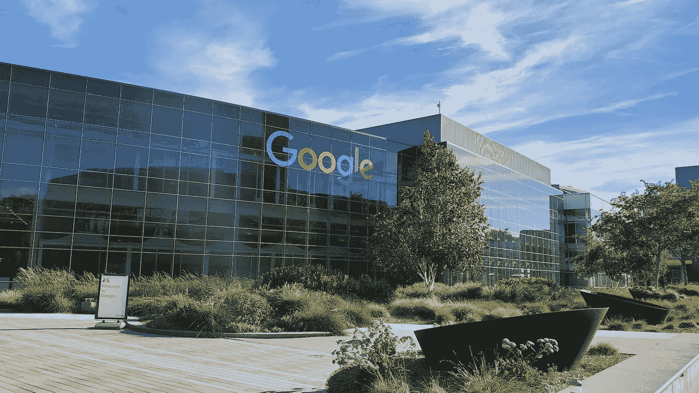

# 自信的一课:作为一名软件工程师，我从谷歌工作中学到了什么

> 原文：<https://betterprogramming.pub/a-lesson-in-confidence-what-ive-learned-from-working-at-google-as-a-software-engineer-b19ecc091df7>

## 我希望我开始的时候就知道这些事情

作者照片

今年七月标志着我在谷歌的第三个年头。随着我的谷歌周年纪念日的临近，我一直在思考我从一个焦虑的新毕业生到一个繁荣的 SWE 的旅程。

我于 2019 年从俄亥俄州立大学毕业后加入，获得了计算机科学与工程学士学位。我记得当时很兴奋

从那以后，很多事情都变了。

我的旅程始于谷歌的工程驻地计划，这是一个针对新毕业生的轮换计划，提供了接触谷歌内部多个团队的机会，并使其更容易与其他成员建立关系。完成该项目后，会员们经常会在谷歌成为全职员工。该计划还提供额外的导师，以帮助从学术界过渡到行业。遗憾的是，这个项目已经不存在了，所以这个时间对我来说很合适。

加入谷歌对我来说是一次难忘的经历。我不敢相信我成功了。即使工程研究没有标准的 L3 职位好，但这是一个我无法拒绝的机会。我收拾好东西，买了一张从克利夫兰到旧金山的单程票。

在我第一次在 eng res 轮岗期间，我在谷歌电视团队工作。我渴望展示我的技能，以证明我值得转行做全职工作。

我很幸运能走到今天这一步。在谷歌电视工作期间，我得到了一些杰出的指导。我的经理教会了我很多关于生活的东西；你在大学的护墙里或你母亲安全的地下室里学不到的东西。在他手下工作后，我永远不会忘记指导的价值。每天我都有很多问题要问他。

这给我们带来了我学到的第一课，也可能是最重要的一课。

# 不要害怕问问题。

说真的，这再低调也不为过。不管你是新聘的 L3 还是 L5 技术主管。永远不要害怕提问。当然，随着你的成长和发展，你问的问题应该改变。

如果你不知道某事的答案，找一个知道的人。有时候，你可以在网上或者一些内部文档中找到答案。有时候，你需要问你团队中的人，甚至是不同团队的人。

提出问题可以立即解决技术问题，或者打开设计解决方案的新途径。解除对自己的阻止越快，完成任务的速度就越快。知道如何追踪信息有着巨大的价值，尤其是当你的团队中没有其他人拥有这些信息的时候。获取新知识并与你的团队分享是展示价值的一种不可思议的方式。

不要不好意思问。寻求帮助的好处超过了任何可能的成本。此外，我们都必须从某个地方学习。那些似乎知道所有答案的高级工程师可能会在某个时候问他们的上级。

在我的头几个月，我问了一大堆问题。在谷歌工作最大的好处是你周围都是聪明的人。几乎总会有人在某个地方找到答案。通常，他们会愉快地分享他们的知识。

我在谷歌电视团队的表现远远超过了预期，所以我很早就成为了一名全职的软件工程师。团队里没有我的位置，所以我加入了 Google Play 电影团队。我很兴奋能够在一个新的团队中学到更多，但也担心必须开发一个完全不同的产品。

那里的情况与我在谷歌电视上已经习惯的完全不同。流程要松散得多，似乎需要不断地灭火。但是也有大量的工作要做。当时的工程负责人将其描述为“狂野的西部”。我很快就提升了，并获得了许多小项目。我的代码提交统计数据一飞冲天。我开始觉得我正在成为团队的一个有价值的贡献者。

大约在这个时候，COVID 19 疫情全力出击。我可以花一整天来谈论 Covid，但我会把它留给另一个故事。

那年晚些时候，我接受了第一轮绩效评估。导航这些过程通常涉及更多的政治和魅力，这与软件工程的技术前景相去甚远。即使你有工件来证明你的成就，你仍然需要以突出其重要性的方式来展示它们。通过一些反复试验和许多坦率的讨论，我学到了我想分享的下一课。

# 不求则已，不求则已。

人们普遍认为，经理们为了让他们的报告满意，做了最起码的事情。对我来说幸运的是，我在谷歌的经理们通常会考虑我的利益。然而，情况并非总是如此。你应该始终让你的目标和期望与你的经理保持一致。绩效评估比其他任何事情都更容易加剧这种现象。如果你的老板认为 X 级会让你满意，但你实际上认为你应该得到 Y 级，那么你大概可以猜到最终结果。

要求一些东西不会有什么坏处。最坏的情况是你会听到一个“不”。即使你被拒绝了，现在你的经理知道你的期望是什么，他们的目标应该是与你合作，确保你能在下次合适的时候证明你的请求是正确的。当然，这种体验是根据谷歌的流程编写的，但这些原则也适用于其他公司。当要求升职、加薪或改变头衔时，也可以提出同样的理由。

刚开始加入一个团队时，提出要求可能会令人生畏。事实是你的需求和目标和其他人的一样有价值。不要让任何人告诉你不是这样。

大约在这个时候，Google Play Movies 被 Android TV 组织吸收，该应用程序被更名为 Google TV Mobile。巧合的是，我基本上回到了起点。

Google Play 电影客户端依靠 Google Play 获得推荐和内容，而 Google TV 则采用了搜索拥有的新内容后端。为了完全迁移到谷歌电视，我们的团队必须从头开始重建应用程序，以正确迁移到他们的后端。虽然这似乎是一次不愉快的经历，但我发现这是塞翁失马焉知非福。当帮助你的团队从头开始构建一些东西时，你很快就能学会一切是如何工作的。此外，大量展示影响力的渠道将开始打开。您可以每天实施关键系统并审查重要的设计文档。你不必去挖掘数百行样板代码，只需查看昨天签入的代码，就能理解核心流程是如何实现的。

我开始为更大的项目承担更多的责任。我大量参与的一个项目是谷歌电视虚拟遥控器，这是在谷歌电视生态系统中推广跨设备体验的最重要的努力。然而，我吃了苦头才知道一天只有 24 小时。这就引出了我们的下一课。

# 学会说不。

这个有点棘手。显然，你不能对所有的事情说不。真正的诀窍是知道何时以及如何说不。或者，你可以妥协，让事情对自己来说更容易。

如果你知道你没有足够的带宽在特定的期限内尽你所能完成一个项目，你有三个选择。

1.  说自己没时间，让别人拿。
2.  在不同的截止日期上妥协或者缩小范围。
3.  与团队中的其他人协作。

这两种选择都没有错。他们都很好。说不很难，尤其是当你还年轻，渴望有机会证明自己的才华的时候。然而，精疲力尽是极其危险的，承担超出你能力范围的事情只会让你退步。

与团队中的项目经理和 UX 设计师保持积极的关系会让妥协变得容易得多。即使在谷歌这样的大型科技公司，业务和工程方面也可能不同步。这导致了对什么样的时间表或规格是可行的误解。如果有什么东西不工作，尽快通知项目经理。他们的工作是根据自己掌握的工程进度设定优先级和截止日期。

一旦我开始争取一个更高级的职位，第三个选项就成了我最难以理解的。放弃你知道自己能完成的工作可能很难接受，但作为一名工程师，成长的一部分是学会如何委派给年轻的工程师，并专注于更大规模的问题。

在推出虚拟遥控器和重建的谷歌电视移动应用后，我终于升到了 L4。自从我在 2020 年初第一次加入以来，这个团队已经发生了巨大的变化。我们失去了四名 L4 工程师和一名 L5 技术负责人。在他们的位置上，我们有三个 L3 工程师加入我们的团队，其中两个是新毕业的。尽管我在谷歌电视的任期看似短暂，但不知何故，我发现自己比团队的一半人都更有经验。

事情发生了有趣的转变。当我第一次加入这个团队时，我很尊敬其他人，因为他们知道的比我多得多。突然，我发现自己的处境正好相反。尽管我对自己没有完全的信心，年轻的工程师们还是向我寻求帮助。在这里，我学到了我想分享的最后一课。

# 对自己的知识有信心。

你应该几乎每天都在学习新的东西，即使你没有意识到。这可能会在短短一两年内积累数量惊人的信息。我们很容易忘记我们知道多少，直到我们不得不开始回答详细的问题或帮助调试测试失败。突然，您可以雄辩地解释事情，并解决任何堆栈跟踪。技术障碍缩小成减速带，最终完全变平。

将这些知识作为自信的来源。展示你处理任何项目并交付杰出成果的能力。人们会注意到这种虚张声势，这可能对你有利。对你作品的解读通常与作品的实际质量和数量同等重要。

当我晋升到 L4 后，我的态度转变了。突然，我变得更加自信，也更加欢迎技术挑战。我开始专注于通过授权和杰出的技术贡献成为人们期望我成为的领导者。我利用我对谷歌电视手机的全面技术知识来促进这一转变。

自信通常会转化为更高的表现，从而进入自信循环。你越早开始这个过程，你就能越快开始你的进步。诚然，改变你的举止很有挑战性，尤其是如果你刚刚开始你的职业生涯或者仍然患有冒名顶替综合症。幸运的是，随着时间的推移，这个过程变得越来越容易。不要放弃。

# 结论

我发现在短短三年内发生了如此大的变化(全球流行病并没有帮助)，这太疯狂了。反思这些变化，让我对未来三年会发生什么感到兴奋。

像我在这里一样把想法写在纸上帮助我完全处理我的想法，并建立我可以与他人分享的具体想法和信念。我会不时鼓励其他人也这样做。

完全披露:这里分享的一切反映了我在过去三年中观察到的情况。我的经历不一定能与其他软件工程师的经历相比，也不能完全描述在谷歌工作的感觉。我热爱我的工作，我相信谷歌是一家优秀的公司。我无法想象我会在其他任何地方得到如此令人难以置信的指导。欢迎关注我，我将来可能会写一些关于在谷歌的生活。感谢阅读！