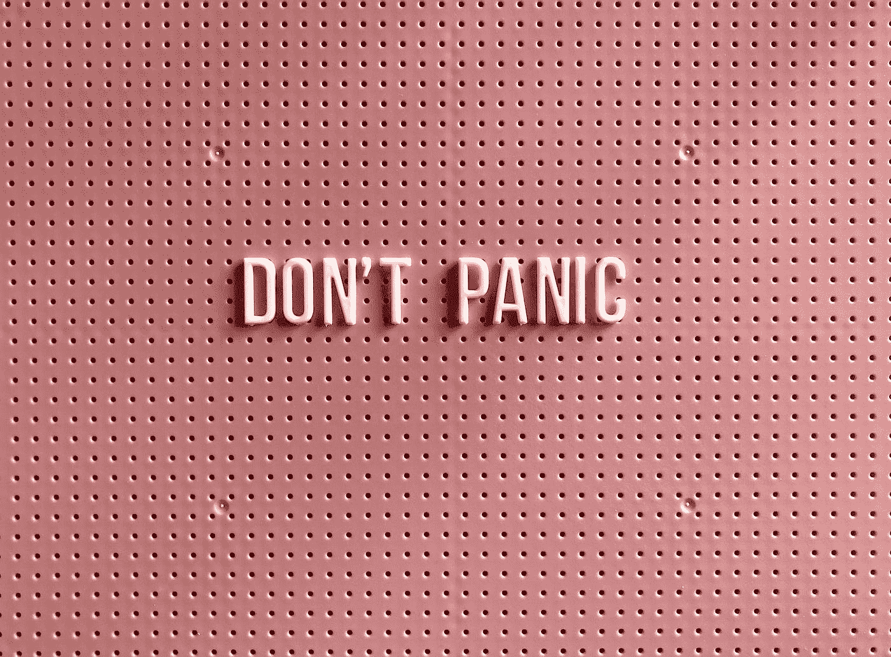
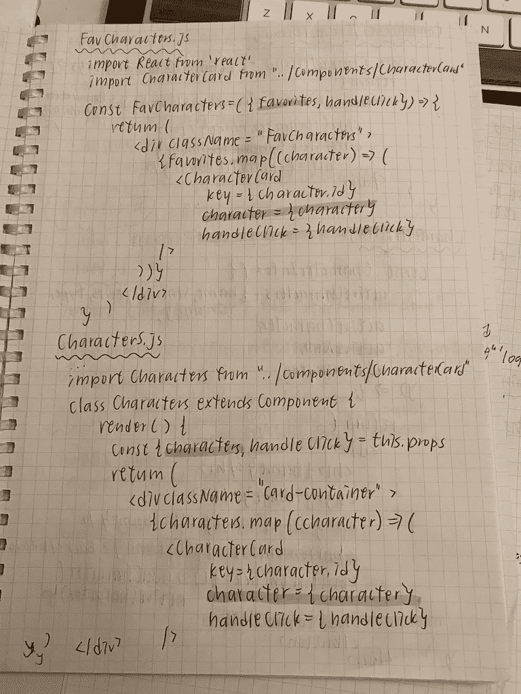
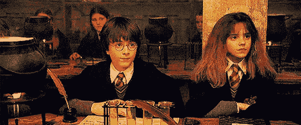
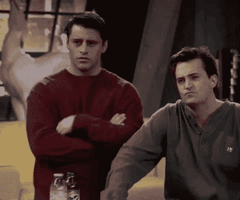

# 给刚开始(或即将开始)编码训练营的学生的一封信

> 原文：<https://betterprogramming.pub/a-letter-to-students-who-just-started-or-about-to-start-coding-bootcamps-e469551eb0e9>

## 我在 bootcamp 编写代码的经验有望帮助你克服第一天上班前的焦虑和紧张

托尼克在 [Unsplash](https://unsplash.com?utm_source=medium&utm_medium=referral) 上拍摄的照片。

嗨，我叫梅根。首先，我要祝贺你开始/被允许参加你选择的训练营！你可能会想，“这个给我们写信谈论编码训练营的陌生人是谁？”我目前正在接近 Flatiron 编码训练营的尾声。是啊，我知道。我还没有完成这个项目，但这并不意味着我不能为你写一篇文章。当我在准备我的期末项目时，我想写这篇文章不仅是为了我自己，也是为了今天读到这篇文章的人。

你感到紧张吗？焦虑？也许是什么冒名顶替综合症？有这种感觉很正常。这是你人生的新篇章。您可以:

1.  可能刚刚离开原来的工作，即将进行一次重大的职业转变，这将永远改变你的生活。
2.  我们目前在做兼职，所以你不必担心你的费用，在晚上上课，同时获得新的技能，为转行做准备。
3.  只是想学习一些新技能和/或温习你的 web 开发技能。
4.  像我一样，刚从大学(或高中)毕业，决定不走传统的大学路线，希望寻找更好的工作机会和技能。

如果我漏掉了你们中的一些人，请随意评论！我希望你们在阅读这篇文章的时候能有归属感。

关于我自己:我目前在 Flatiron 参加沉浸式软件工程项目。有这么多种类，但我希望我能在这封信中包括你——即使你正在参加其他类型的编码训练营。

每个公司都有不同的项目设置。在训练营的第一天之前，我必须完成 100 多个小时的准备工作。在那之前，我必须经历一次行为面试，然后在技术面试之前做 80 多个小时的准备工作。激烈吗？很好。但是我很喜欢——尤其是技术面试。诚然，我确实推迟了几次技术面试，只是因为我太紧张了，觉得自己根本没有准备好。我希望你们不要犯我的错误，因为我应该早点接受采访。再次恭喜你！你成功了！

我记得当我接到我的录取专家的电话时，我感到非常兴奋，因为我进入了我关注了几个月的训练营。他告诉我所有我必须做的准备工作，我想，“是的！我更爱编码！”但是有时候我会觉得有点没有动力，我的代码会几天都没动过。

你猜怎么着？在训练营第一天前的最后两周，我不得不赶着完成所有的工作，这样我就可以赶上并开始和我预定的伙伴们一起训练。如果你也是一个拖延者，请举手。*

这些问题可能听起来很熟悉，会引起你的共鸣。

# #第一天露营

在训练营的第一天之前，我非常焦虑，以至于很难入睡。“如果每个人都比我优秀那么多呢？如果我落在课程后面，我没赶上怎么办？”

然而，在训练营的第一天，虽然每个人都是陌生人，但我和我的同伴们有了某种相互理解。我们一起开始这个，我们会握着彼此的手直到训练营结束。每当有人问我去训练营的好处时，我总是告诉他们的一件事是“我们有一个小而紧密的社区，当你有问题时，每个人都愿意帮助你。”我希望这是一个令人放心的答案，因为这是我在参加强化课程之前想听到的。当我学习如此新、如此陌生而又如此有趣的东西时，我希望有一个没有竞争的环境。

# #流程

我们在三个月的时间里讲述了五个模块:

*   模块 1:红宝石
*   Mod 2: Ruby on Rails
*   Mod 3: JavaScript 作为前端(主要焦点)+ Ruby on Rails 作为后端
*   mod 4:React(JavaScript 中的一个库)
*   模式 5:个人项目(我现在正在做)

就我自己而言，我几乎每周都会经历一次情感的过山车。第一个 mod 是全新的，你必须适应这个新的时间表。一旦你通过了你的第一个代码挑战，那感觉就像是一个*少校*的解脱。然后是项目周。剧透:这总是国防部最紧张的一周。要么你和队友一起工作，要么[单干](https://meganslo.medium.com/i-failed-my-code-challenge-but-thats-okay-c68ba423f1c6)。然后还有剩下的 mod。你的情绪会起伏不定。有好日子和坏日子。有时你会觉得漫不经心，但有时你会觉得你已经准备好要消磨一天了。

我喜欢在一天结束时大家谈论他们的胜利和奋斗，并且我们的教练提供了一个额外的有趣问题。这是当你认识到你的同学的起起落落，看看你是否能理解，并知道你不是唯一一个正在经历压力和困难的人。

如你所知，代码挑战失败也没关系！每个人在吸收新事物时的学习风格和步调都不一样。我的一些同学是视觉学习者，而我更多的是实践者。我喜欢把一切都写下来，包括在笔记本上重写和突出代码。

我的笔记来自 Mod 4 React。

我对自己有很高的标准。我曾经认为如果我没有通过代码挑战，我就完了。事实证明，独自完成这个项目对我来说是一次非常宝贵的学习经历，但作为一个团队完成这个项目非常艰难，有一天我崩溃了。如果你在训练营的时候不需要完成独奏项目，那就太棒了！

# #自我保健

因为去训练营是一个艰难的过程，所以总是需要积极的态度。从大学开始，心理健康对我来说就是一件大事。我的一些同伴会时不时地开玩笑，或者如果你重视 1:1，你也许可以在实验室时间或小组项目时间找到同伴中的某个人进行一些深度的交流。像这样的小事会极大地提高个人和整体的积极性。

自我保健是我的导师、教练和同伴们一直强调的重点。在一天结束的时候，如果你必须休息，那就休息一天吧！准备好了就回来编码。我的一些同学会在我们的空闲时间/实验室时间出去散步或做一些冥想。我的一个同伴在训练营开始时写了一篇关于[拉伸](https://cooliomoded.medium.com/a-strategy-to-deal-with-stress-9229b4e2d5f5)的中型文章，他一直在提醒我们，每当有人谈论他们的背痛或肩痛(因为坐得太久)时，就进行拉伸。

因为我的下背部疼痛，我开始这个习惯有点晚(大约在第 8 或 9 周)。我希望我能早点开始。在夏令时之前，当我们结束一天的工作时，天空仍然明亮，我会每隔一天慢跑 40 分钟。但是现在，因为晚上 6 点天已经有点黑了，我开始每天用这个叫做 [DailyYoga](https://dailyyoga.com/#/) 的非常酷的应用练习瑜伽。应用程序中有一个水跟踪器，它提醒我每两个小时喝一次水，这样我就可以达到一天八杯水的最低目标。我已经这样做了两个星期了。有一些冥想，我从来没有感觉如此健康和神奇。

# #结论

我不确定这封信是让你第一天更紧张还是更兴奋。不管怎样，我保证你会玩得很开心。如果可以，确保参与课堂。几周前，我和我的一个同伴进行了一次谈话。我注意到，随着时间的推移，他们在课堂上更加投入，每当他们有不明白的地方，就会问更多的问题。他们告诉我，他们对这些概念感觉舒服多了，并通过问更多的问题和在课堂上更加专心来帮助澄清他们不理解的内容。他们希望能早点完成，这样就不会觉得落后了。

然而，你可能不是那种举手提问的学生。

你要么是一脸困惑的哈利，要么是无所不知的赫敏。

尽管如此，你选择了参加这个训练营，所以一定要让你的钱花得值！

你是来学习的！

成千上万的学生经历过你今天的处境！

当我在大学期间指导游泳队的孩子们时，每当他们因为我的令人兴奋的项目感到筋疲力尽时，我总是鼓励他们相信，如果他们实现了第一个里程碑，他们可以做得更多。你猜怎么着？这也适用于你和我！再过几个月，你就会和我一样了。

你能行的！