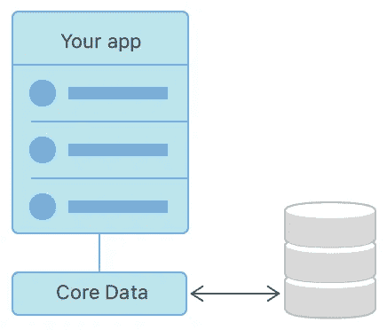
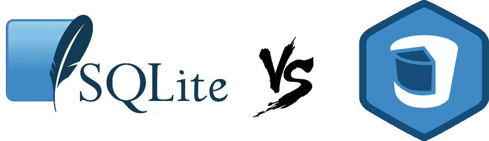
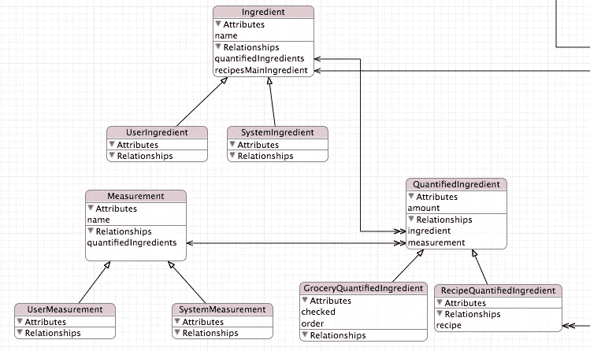
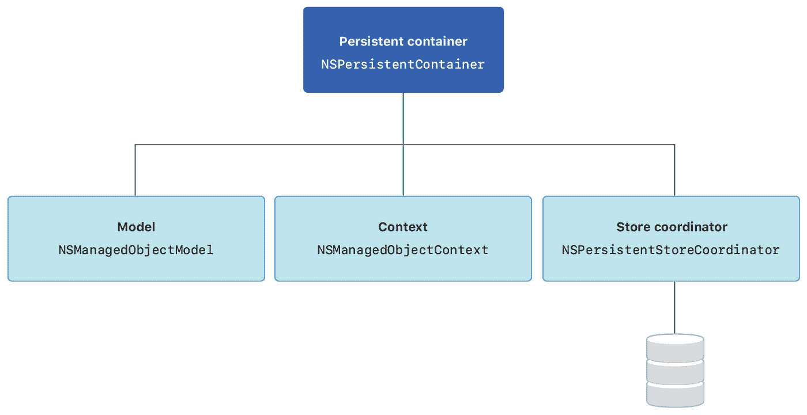
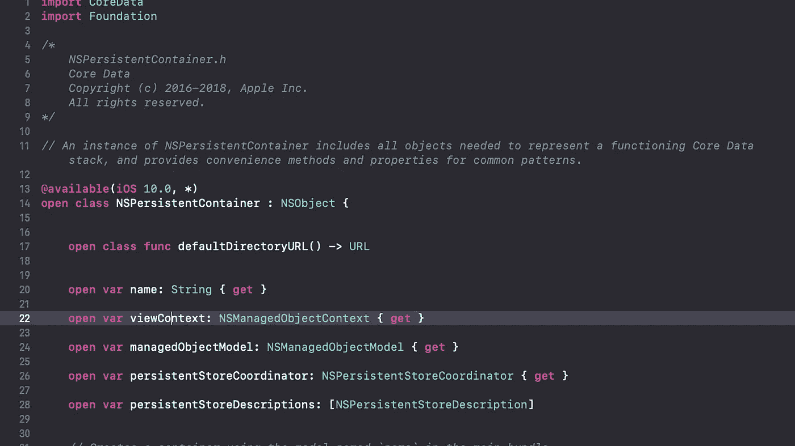
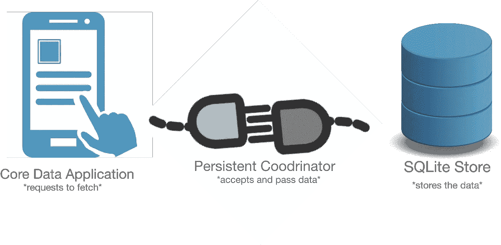

# 核心数据简介

> 原文：<https://betterprogramming.pub/a-light-intro-to-core-data-part-un-e344f9d1528>

## 介绍苹果核心数据框架的底层理论

# 概观

某些 iOS 应用程序需要在移动设备上存储数据以供离线使用。比如苹果让你在 iTunes 上播放下载的音乐，亚马逊的 Audible 让你不用上网就能听电子书。这些特性之所以能够实现，是因为有一个称为核心数据的客户端缓存框架。在这个由两部分组成的系列中，我们将仔细研究在使用不依赖后端服务器的应用程序时需要理解的理论组件。

# 什么是核心数据？

> “核心数据是一个框架，用于管理应用程序中的模型层对象”——Apple

模型层对象？框架？如果您是 iOS 编程或一般编程的新手，您可能会问这些问题。

让我们来定义这些术语:“ ***框架***”—这是一组预定义的方法、类和模块，我们可以在高层次上使用它们来处理核心数据，而不用担心完全靠我们自己来构建它。在 iOS 编程中，苹果提供了一个框架。在面向对象编程中， ***模型层对象*** 是指将数据封装成 ***模型*** 的应用组件。例如，具有名称、id、电子邮件和密码属性的用户模型。

本质上，核心数据为我们提供了一组预定义的模块，我们可以用它们来创建、读取、更新和删除持久层中的对象。

# SQLite 和核心数据

请记住，核心数据本身并不是 MongoDB 或 SQL 之类的数据库。相反，它使用每个 iOS 设备自带的内置数据库系统 [SQLite](https://www.sqlite.org/index.html) 。核心数据是管理对象图的框架，而 SQLite 是实际的关系数据库。你可以在这里阅读更多关于这个[的内容。现在让我们深入核心数据框架的主要组件。](https://cocoacasts.com/what-is-the-difference-between-core-data-and-sqlite/)

# 实体

实体是在对象图中表示的类。它有名称、属性和(可选的)关系。创建的每个实体都是 [NSEntityDescription](https://developer.apple.com/documentation/coredata/nsentitydescription) 类的一个实例，我们将在第 2 部分中更详细地讨论这个实例。例如，看看下面的类声明:

我们希望使用核心数据在本地存储每个餐馆和所有者对象，以供离线使用。为此，我们必须在对象图中创建它们，如下所示:

对象图中餐馆实体的表示。

这是您需要了解的关于核心数据中的实体的最基本的知识。在本文的第二部分，我们将研究如何创建一个功能完整的核心数据应用程序。现在让我们看看如何在代码中操作这些实体。例如，我们可以显示一个充满商品和商店的表格视图。

# 对象图

Xcode 为开发人员提供了一个界面，可以在类似数据库的视图中查看每个实体及其关系。这被称为对象图，当你点击“xcdatamodeld”文件时可以看到。对象图对很多事情都很有用，包括查看和编辑实体、创建实体之间的关系，以及我们将在本文的第 2 部分研究的许多其他功能。

对象图的 Xcode 表示。

# 核心数据堆栈

把核心数据栈想象成一个运行游戏的主要玩家团队。有 4 个主要组件我们必须注意: ***持久容器，托管*** ***对象模型*** ， ***托管*** **对象上下文**， ***存储协调器*** 。每个组件都有特定的任务，并与其他组件协调以支持核心数据。让我们来看看每一个。

## 持久容器

持久容器是更高层次的抽象类，它封装了核心数据栈中最重要的组件。用持久性容器创建核心数据栈可以让您轻松地与核心数据进行交互。这是框架对持久容器的声明:

苹果的 NSPersistentContainer 接口。

我们将详细讨论其中的每一项，但以下是一般概念:

*   名字:无论你给自己起什么名字。xcdatamodeld”。
*   viewContext:这允许我们保存、删除和获取数据。
*   managedObjectModel:表示我们在内存中创建的实体。
*   persistentStoreCoordinator:帮助上下文和存储进行通信。

> NSPersistentContainer 通过处理托管对象模型、持久性存储协调器和托管对象上下文的创建，简化了核心数据堆栈的创建和管理—苹果公司

## 托管对象模型

接下来，我们有了托管对象模型(NSManagedObjectModel)。这是。xcdatamodeld 文件。这是因为当您从存储中获取数据(在创建和保存之后)时，核心数据需要一种在代码中表示它的方式，以便您可以显示、更新或删除它。

> “托管对象模型允许核心数据从持久性存储中的记录映射到您在应用程序中使用的托管对象。”—苹果公司

这里的主要情况是，所有的实体以及它们的属性和关系都由托管对象模型来表示。你可以阅读[这里](https://developer.apple.com/documentation/coredata/nsmanagedobjectmodel)了解更多信息。

## 托管对象上下文

在处理数据存储时，有不同类型的操作。我们可以创建、读取、更新、保存和删除数据。这就是托管对象上下文发挥作用的地方。您的应用程序的业务层通过对象上下文与核心数据堆栈进行交互，每当我们需要对存储中的数据进行更改时，对象上下文又会保留对持久性存储协调器的引用。我们将在本文的第 2 部分研究如何使用对象上下文执行 CRUD 操作。

## 持久存储协调器

最后但同样重要的是持久的协调者。这充当了核心数据栈和存储(数据库)之间的桥梁。当一个对象上下文请求获取数据库中的所有项时，持久化协调器从 SQLite 存储中加载这些项，并将它们传递回对象上下文。

持久存储协调器是核心数据栈和存储(SQLite)之间的链接。

# 结论

我们已经了解了很多关于核心数据框架的知识。这将极大地帮助我们在第 2 部分中创建核心数据应用程序，因为我们已经知道每个类和组件是做什么的。核心数据是 iOS 工程师必须理解和使用的最复杂的框架。耐心点，很快你就会把这些点连接起来！