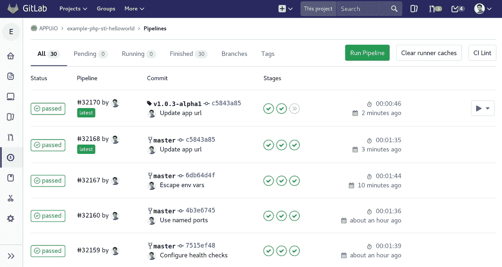
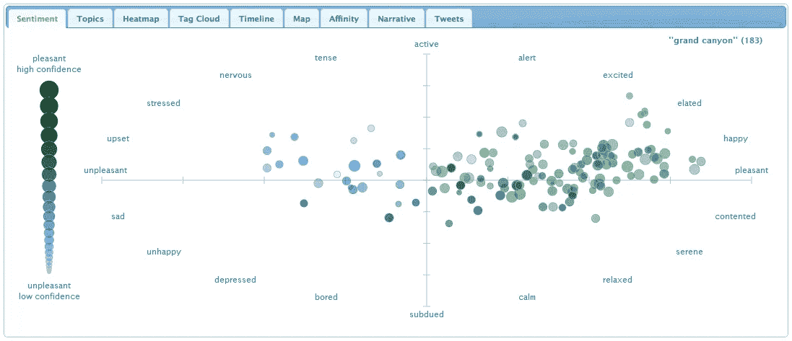

# 作为一名开发人员，你可以创建一些有趣的东西

> 原文：<https://betterprogramming.pub/a-list-of-fun-things-you-can-build-as-a-developer-bc07fd21c6e3>

## 作为一名开发人员，通过动手实践来提高自己

萨法尔·萨法罗夫在 [Unsplash](https://unsplash.com?utm_source=medium&utm_medium=referral) 上拍摄的照片

> 一个人经过 1000 天的训练后成为初学者。一个人经过 10000 天的练习成为大师。

这是 Mas Oyama 的一句话，很好地总结了事情。成为优秀开发人员的秘诀在于付出努力。花大量的时间在键盘后面，弄脏你的手，会让你成长为一名开发人员。

作为一名开发人员，这里有 7 个项目可以帮助你提高。请随意选择您自己的技术组合—使用您喜欢的任何技术。

# 项目 1:吃豆人

构建吃豆人是一个很好的方式，可以从一个非常基础的角度感受游戏是如何开发的。这可以通过像 React 或 Vue 这样的 JavaScript 框架来实现。

你将学到的东西:

*   实体的移动
*   检测按键被按下
*   冲突检出
*   你可以通过给幽灵添加转向行为来做更多的事情

你可以在这里找到 GitHub 库[的例子](https://github.com/mbfassnacht/pacman-react)。

# 项目 2:用户管理

查看 GitHub 库[这里](https://github.com/indreklasn/laravel-5.4-crud-example)

制作一个用于用户管理的 CRUD 应用程序会教会你很多关于开发的基础知识。这对于刚刚起步的开发者尤其有用。

您将学到的内容:

*   按指定路线发送
*   处理表单和验证用户输入
*   与数据库交互—创建、读取、更新和删除操作

# 项目 3:查看你所在地的天气

查看 GitHub 库[这里](https://github.com/SwiftTsubame/iOS11Weather)

如果你想开始构建应用程序，天气应用程序是一个完美的开始。这个项目可以在 Swift 中完成。

除了获得一些构建应用程序的经验，您还将学到:

*   与 API 交互
*   使用地理定位
*   您可以添加一个文本输入，让用户可以输入一个位置来查看该位置的天气，从而使这个过程更加动态

一个可以用来获取天气数据的 API 是 OpenWeather API。你可以在这里找到更多关于 OpenWeather API [的信息。](https://openweathermap.org/api)

# 项目 4:聊天框

我自己的聊天框在两个浏览器选项卡中运行

构建一个聊天框是开始使用套接字的最佳方式。在选择技术组合时，您有很多不同的选择。Node.js 可能是一种方法。

从这个项目中最大的收获是你将学习套接字是如何工作的，以及如何实现它们。

如果你是 Laravel 的开发人员，想使用套接字，我写了一篇文章，讲述如何使用套接字在 Laravel 中实现一个聊天框。

# 项目 5: GitLab CI

[来源](https://vshn.ch/en/blog/automated-build-pipelines-with-gitlab-ci-and-appuio/)

如果您是持续集成(CI)的新手，摆弄一下 GitLab CI 是个好主意。设置多个环境，并尝试让一些测试在您的管道中运行。这不是一个非常繁重的项目，但我相信你会学到很多东西。现在很多开发团队都使用 CI，这是一个非常好的工具。

您将学到的内容:

*   了解 GitLab CI
*   配置一个`.gitlab-ci.yml`来告诉 GitLab 运行程序做什么
*   部署到其他环境

# 项目 6:网站分析器

做一个分析网站语义的刮刀，给网站创建一个排名。例如，您可以检查图像上缺少的 alt 标签，并检查页面上是否有 SEO meta 标签。您甚至可以在不创建 UI 的情况下实现 scraper。

您将学到的内容:

*   铲运机的工作原理
*   制作 DOM 选择器
*   编写算法
*   更进一步，创建一个用户界面，并对你浏览过的每个网站做一份报告

# 项目 7:挖掘社交媒体情感

[信号源](https://www.csc2.ncsu.edu/faculty/healey/tweet_viz/)

挖掘社交媒体情感是了解机器学习的一个好方法。

你可以从挖掘一个社交媒体平台开始，Twitter 是典型的切入点。

拥有更多机器学习经验的开发者可以尝试挖掘不同的社交媒体平台，然后将这些数据结合起来。

您将学到的内容:

*   你将掌握机器学习

# 结论

这些项目会让你忙上一段时间。选择一个项目，然后去做。我期待着看到你的项目成果。

编码快乐！