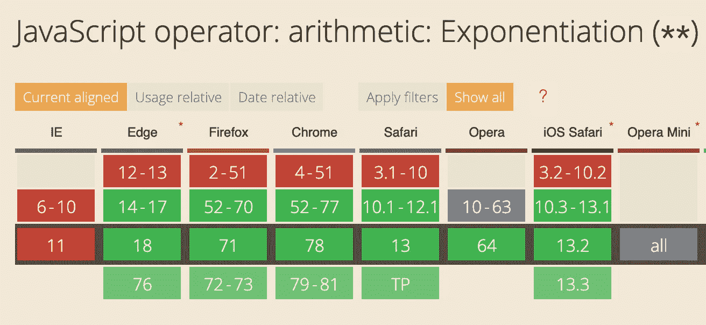

# JavaScript 中有趣的操作符列表

> 原文：<https://betterprogramming.pub/a-list-of-interesting-operators-in-javascript-22fdacfbbce9>

## 让我们看看一些您可能不知道的 JavaScript 操作符


约书亚·科尔曼在 [Unsplash](https://unsplash.com?utm_source=medium&utm_medium=referral) 上拍摄的照片

在 JavaScript 中，有许多操作符既方便又有趣。一些操作符会让你的代码看起来更简单。

# 感叹号(！)—逻辑非

有一些逻辑运算符可以更方便地检查某些值。其中，感叹号，对于`Logical Not`，非常有用。它将一个真值*真值*或假值*假值*转换为布尔值，但该运算符会切换该值的评估布尔值。

如果值为*真*或*真*，则`!value`为*假*或*假*，反之亦然。

```
!1 // false
!-1 // false
!0 // true
!function() {} // false
!{} // false
!'' // true
!NaN // true
!null // true
!undefined // true
```

# 双感叹号(！！)—双逻辑非

这显式地强制将一个值转换为相应的布尔值。跟多加一个感叹号(！)转换为已经转换为布尔值的`!value`。

```
!!true // true
!!{} // true
!!(new Boolean(false)) // true
!!false // false
!!'' // false
!!Boolean(false) // false
```

有趣的是`!!Boolean(false)`和`!!(new Boolean(false))`给了我们不同的结果。如果不带`new`调用`Boolean`构造函数，它将返回一个布尔值。但是，如果用`new`调用它，它会返回一个`Boolean`的实例对象。所以`!!Boolean(false)`等于`!!false`，但是`!!(new Boolean(false))`等于`!!(instance of Boolean)`，就像`!!Object`一样。

# 双星号(**) —取幂运算

这和`Math.pow(x, y)`完全一样，相当于 x^y.，你们很多人可能只在需要的时候才使用`Math.pow`。这个操作符会让代码更漂亮！



求幂(**)的浏览器支持——源码来自[我能用吗？](https://caniuse.com/#search=Exponentiation%20operator)

需要记住的一点是，IE 不支持取幂(**)操作符。嘘…

```
2 ** 3 === Math.pow(2, 3) // 8
-(2 ** 2) === -Math.pow(2, 2) // -4
10 ** -1 === Math.pow(10, -1) // 0.1
```

# 波浪号(~) —按位非

波浪号(~)是键盘上数字 1 旁边的曲线，是 JavaScript 中用于处理位的运算符。JavaScript(以及其他编程语言)在处理数字时使用位。如果你不知道[二进制补码](https://en.wikipedia.org/wiki/Two's_complement)，请查看维基百科中的文章，了解 JavaScript 如何处理负数。

这个公式实际上非常简单。如果一个整数是 *K* ，那么 *~K* 就变成了 *-(K + 1)* 。

```
~9 => -(9 + 1) => -10
~-10 => -(-10 + 1) => 9
```

# 双颚化符(~~) — Math.floor & Math.trunc

正如`!!`使*中的`true`变为真*和*中的`false`变为假*一样，双波浪号(`~~`)也使浮点数变为整数。单个波浪号(`~`)是一个数字的按位 NOT。它的 MSG，最高有效位，由正变负，或由负变正。对于单个波浪号的结果，我们只需添加一个额外的波浪号，将其放回原始的符号编号。但是一旦我们在一个数字的开头放置了一个波浪号，小数点(`.`)右边的浮点数就会被忽略。

```
~5.5 => -6
~-6 => 5~~5.5 === Math.floor(5.5) // true
~~-5.5 === Math.trunc(-5.5) // true
```

根据 [stackoverflow](https://stackoverflow.com/questions/5971645/what-is-the-double-tilde-operator-in-javascript) 显示，这比`Math.floor`要快。而当一个数字是负数的时候，`Math.trunc`将是最适合你的。

# 双周期(..)带 toString

关于把十进制数转换成二进制数，你知道些什么？`toString`是将十进制改为二进制的典型方式。它对此的常用用法可能是`Number.toString`。但是，也可以这样写。

```
5..toString(2) // '101'
Number(5).toString(2) === 5..toString(2) // true
```

# 有运营商的生活

如何用 JavaScript 写一个 IIFE(立即调用的函数表达式)？最常见的方式可能是这样。

```
(function() {
  // do your work
})();
```

然而，还有其他方法可以立即运行一个函数，尽管它们并不常见。

你注意到这是怎么回事了吗？主键是将运行操作数的运算符放在它的右边。例如，`!5`返回`false`。为什么？因为`!`评估`5`并决定`!5`应该是`true`，因为它是一个*真值*。这样，任何运行和评估操作数的操作符都可以运行后面的函数，因为函数也必须为它们的操作符运行和评估，例如`!`或`~`。

# 结论

当然，并不是所有这些都在现实中被广泛使用。但有时你可能需要它们。其中一些可以确保更快的速度和更好的性能。那么，为什么不考虑哪天使用它们呢？

# 资源

*   [逻辑不在 MDN 中](https://developer.mozilla.org/en-US/docs/Web/JavaScript/Reference/Operators/Logical_Operators#Logical_NOT)
*   [MDN 中的 math . pow](https://developer.mozilla.org/en-US/docs/Web/JavaScript/Reference/Global_Objects/Math/pow)
*   [MDN 中的算术运算符](https://developer.mozilla.org/en-US/docs/Web/JavaScript/Reference/Operators/Arithmetic_Operators#Exponentiation)
*   [MDN 中的按位运算符](https://developer.mozilla.org/en-US/docs/Web/JavaScript/Reference/Operators/Bitwise_Operators)
*   [维基中的二进制补码](https://en.wikipedia.org/wiki/Two%27s_complement)
*   与经营者的生活