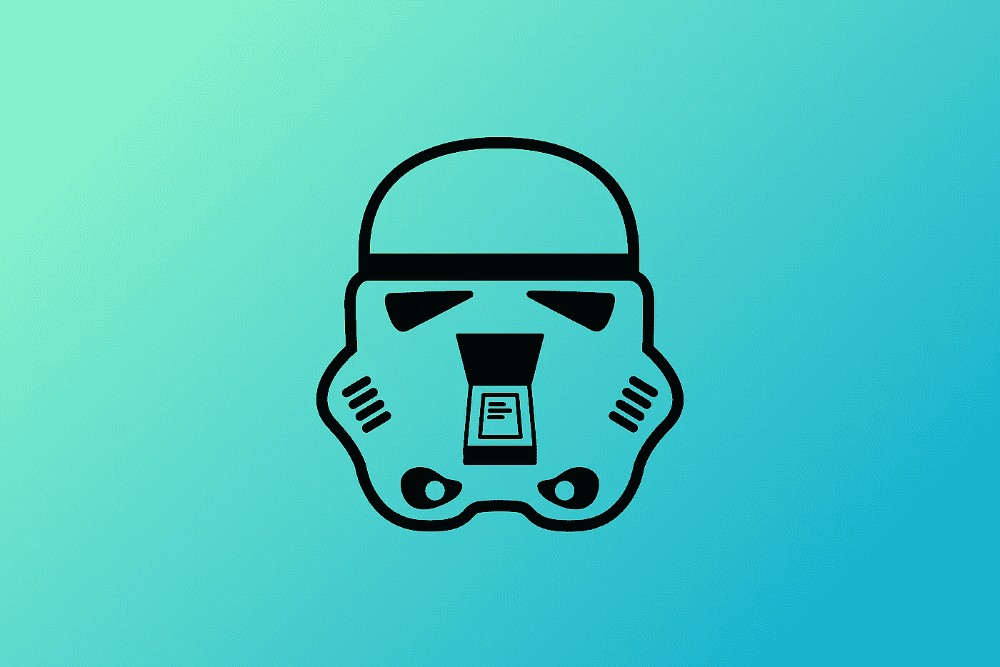
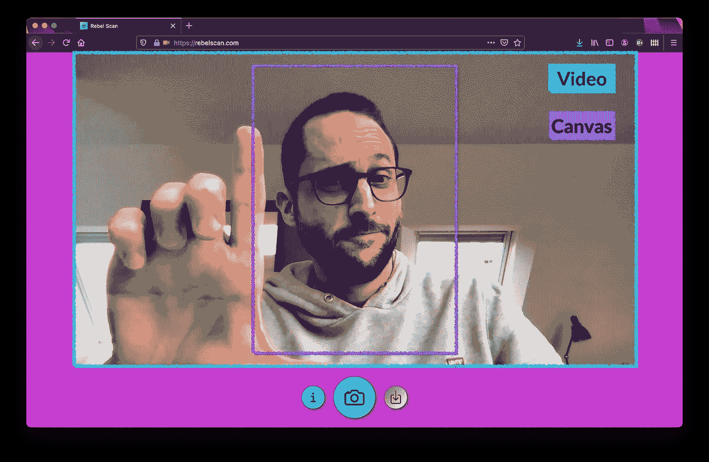
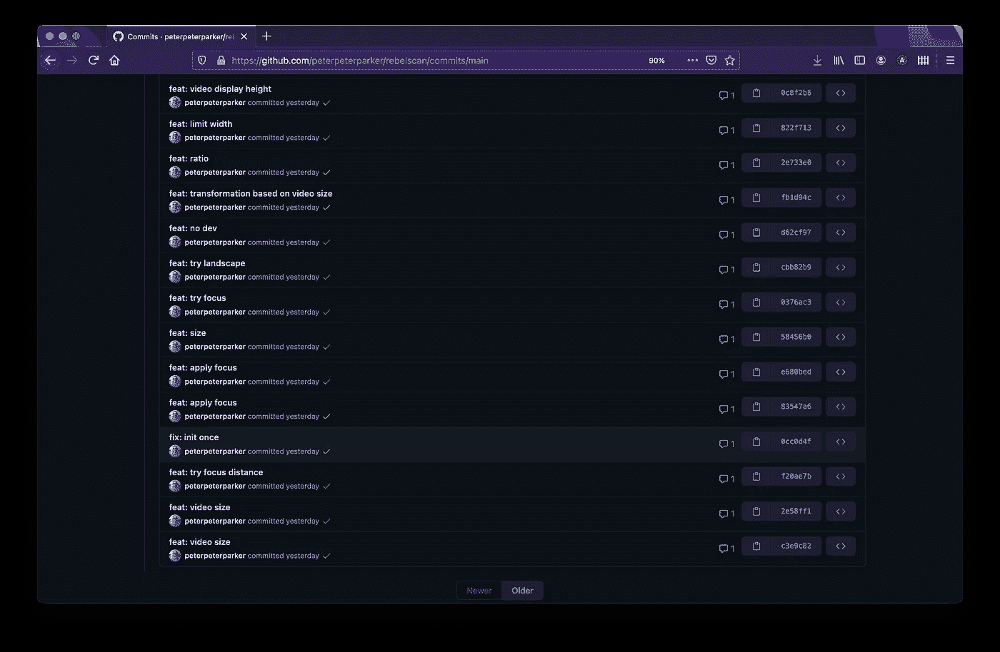
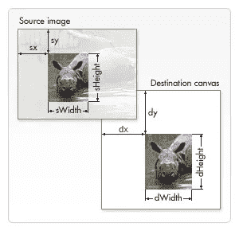

# 一个用网络制作的小扫描仪应用程序

> 原文：<https://betterprogramming.pub/a-little-scanner-app-made-with-the-web-dc9ebe1f2d4>

## 我在圣诞节假期用网络开发了一个小扫描仪原型，来学习和尝试新技能



图片来源:作者

去年的圣诞节假期，除了去看望父母几天(在强迫自己进入一种自我封闭期之后)，我没有任何大的计划。这就是为什么，我抓住机会提高我的软件开发知识。

由于我更好地通过将概念应用到实际应用中而不是编写示例来学习概念，所以我决定创建一个完全由网络构成的小型扫描仪渐进式网络应用程序(PWA)。

我把它叫做[反叛扫描](https://rebelscan.com)因为它只是一个小小的扫描仪应用程序，你这个反叛渣滓！

[叛军扫描](https://rebelscan.com)的土豆演示视频

# 介绍

值得注意的是，这个小扫描仪并不打算成为世界上有史以来最完美的扫描仪。我都不确定以后会不会用。图像处理不是最好的，没有文本提取，在移动设备上，它只能共享 png 文件(详见本文最后一节)。除了帮助我学习新技能，它绝对没有别的目标。

因此，在开始开发之前，我定义了以下目标——我以前从未尝试过但渴望测试的东西:

*   试试 [Next.js](https://nextjs.org/)
*   使用[media devices . getuser media()](https://developer.mozilla.org/fr/docs/Web/API/MediaDevices/getUserMedia)API 捕获和裁剪视频流
*   为使用[模板](https://stenciljs.com/)开发的 web 组件生成 [React](https://reactjs.org/) 绑定
*   仅使用[网络共享 API](https://developer.mozilla.org/fr/docs/Web/API/Navigator/share) 共享文件

在不透露结局的情况下，我可以肯定这是成功的——我能够开发我的小应用程序了。然而，一路上还是有一些惊喜。让我们一步一步地解决这些问题。

# 元

这篇文章和我的实验的结果 PWA 可以在[rebelscan.com、](https://rebelscan.com)在线获得，它的源代码可以在 [GitHub](https://github.com/peterpeterparker/rebelscan) 上获得。

# Next.js

在这个实验之前——我要说大约一年——我最喜欢的实现网站的技术栈是用于开发的 [Gatsby](https://gatsbyjs.com/) ,用于部署目的的 [GitHub Actions](https://github.com/features/actions) ,以及用于托管的 [Firebase](https://firebase.google.com/) 。

接下来由 [Vercel](https://vercel.com) ，没有任何惊喜，是一次极好的体验。我只是触及了它的表面，我只是用它来部署一个预渲染的应用程序，但它证实了我读过的所有关于它的推文和博客的积极作用。

它真的很好- [文档化](https://nextjs.org/docs/getting-started)并且入门很简单。与 Gatsby 相比，我真的很喜欢它，它让我完全没有花时间去发现如何设置 [TypeScript](https://nextjs.org/docs/basic-features/typescript) ，并且它的配置看起来更接近于一个基本的依赖设置。

此外，Next 还内置了对国际化( [i18n](https://nextjs.org/docs/advanced-features/i18n-routing) )路由的支持。不用说，作为一个瑞法人，生活在瑞德部分，用英文写帖子，我非常看重这样一个特点。

另一方面，在没有做任何研究或统计的情况下，我得到的印象是 Gatsby 的生态系统，特别是在插件方面，目前更加广泛。例如，使用 Gatsby 有一种方法可以自动生成您的`sitemaps.xml`和`robots.txt`文件，而使用 Next 则需要更多的编码。

话虽如此，我说的是花生。这两个堆栈都很棒，让我可以开发高性能的网站和应用程序。他们两个我都爱。

# MediaDevices.getUserMedia()

哦，天啊，这个让我很难受。

API 本身就是一个很棒的软件，能够通过网络捕捉视频流真是太棒了。但我想开发的功能在跨设备响应方面有点挑战。事实上，我的目标是在一个裁剪部分(“两个不同的元素”)后面显示完整的视频，没有断点，也不考虑屏幕或摄像机的大小。



对某些人来说，这不是火箭科学，但对我来说，这有点挑战性，原因如下:

1.  没有 HTTPS(来自另一台设备)，您无法使用视频。
2.  视频大小不可预测。
3.  找到合适的比率和方法需要多次迭代。

# HTTPS

可以在本地开发和测试相机流，但一旦你想用手机测试，你需要一个 HTTPS 连接。

因此，我有两个选择:要么生成一个证书并在我的笔记本电脑上运行一个 HTTPS 服务器(我将从我的设备连接到该服务器),要么使用“提交、推送、测试、再努力”的方法。

我将让您检查我从 1 月 2 日开始的提交历史，以猜测我选择了哪种方法。



# 视频大小不可预测

你的智能手机有过这样的经历吗？求人像，得风景。求风景，得人像。

基本上，你的安卓手机就像我的一个最好的朋友:他做他想做的事，就这样。

```
const stream = await navigator.mediaDevices.getUserMedia({
  audio: false,
  video: {
    width: {ideal: 1920},
    height: {ideal: 1080},
    facingMode: 'environment',
  },
});const [track] = stream.getVideoTracks();const settings = track.getSettings();videoRef.current.width = settings.width;
videoRef.current.height = settings.height;// Android (portrait): <video width="1080" height="1920"/>
```

# 比例

我花了几次迭代才找到合适的方法和比例(视频对裁剪部分)来实现我的目标。

在第一个版本中，一切正常，但扫描文件的质量太像素化了。在第二张照片中，我确实设法改进了它，但一旦应用到我的手机上，它就像是给相机不断增加了一个巨大的变焦镜头。

最后，我发现我必须处理纵向和横向视频大小，将它们裁剪到我的画布上，并找到确切的 CSS 规则，以使任何设备都能响应。

```
const canvasPadding = 64;let y = videoSize.height - canvasPadding;
let x = (y * 210) / 297;

const maxWidth = videoSize.width - canvasPadding;

if (x > maxWidth) {
  x = maxWidth;
  y = (x * 297) / 210;
}

const deltaX = (videoSize.width - x) / 2;
const deltaY = (videoSize.height - y) / 2;

const context = scanRef.current.getContext('2d');
context.drawImage(videoRef.current, 
                  deltaX, deltaY, x, y,
                  0, 0, 2100, 2970);
```

在上面的代码片段中，我使用 A4 格式计算图像的部分，我希望在裁剪它的同时确保结果不会比视频大(记住，大小是不可预测的)。如果是，我反其道而行之，取宽度为最大值。最后，我用我期望的比例在 2D 画布上画出我的部分。



来源: [MDN 网络文档](https://developer.mozilla.org/en-US/docs/Web/API/CanvasRenderingContext2D/drawImage)

# 外卖食品

开发这个视频转换有点像情绪的过山车，直到我最终能够实现我最初的想法，但我对结果很满意。我肯定会在未来的新闻应用中重用这项技术。网络非常光滑(一旦到位)。

# 还有一点

哦，还有一件事:它可能无法在 iPhone 上工作，即使它在 OSX 的 Safari 上工作得很好。我用我的(真正的)iPhone 做了一些测试，起初，它抛出了一个错误。

> > NotAllowedError:用户代理或平台在当前上下文中不允许该请求，可能是因为用户拒绝了权限。

经过一些研究，我发现了一个 WebKit [帖子](https://webkit.org/blog/6784/new-video-policies-for-ios/)解释说，在一定的规则下，视频可以在 iOS 上自动播放。不管怎样，它都不起作用，所以我改变了 iPhone 上的 UX，只在用户交互后才开始这个过程。

尽管如此，它确实解决了视频问题，但它导致了另一个问题。视频没有在裁剪好的画布中流动。

由于我没有找到任何解决方案，作为最后的手段，我决定打出我的最后一张牌:打电话给我妈妈，请她在她的 iPad 上测试这个功能。在电话上，她试了一下，然后打电话给我爸爸，让他给设备拍照，然后通过 WhatsApp 把这些“截图”发给我。

令我惊讶的是，它真的成功了！因此，我得出的结论是，内存低的 iPhones 无法将视频流式传输到画布。

# 将绑定与模板反应

如果你是第一次阅读我的文章，你可能不知道，但是我是 Web 组件和[模板](https://stenciljs.com/)的忠实粉丝。

即使我已经创建了多个库和应用程序——特别是我们用于演示的开源编辑器的大部分生态系统，[DeckDeckGo](https://deckdeckgo.com)——我以前从未尝试过为框架生成绑定。

自然，我认为这个实验是这么做的一个好借口。

就像任何其他与模板相关的事情一样，我不得不再次说，整个过程是相对容易的。我基本上只需要遵循[文档](https://stenciljs.com/docs/react)。

关于这个问题，我唯一恍然大悟的时刻发生在我终于明白绑定必须由另一个项目——另一个回购——通过 npm 打包和交付的时候！

这就是为什么要制定产出目标的原因。这会将定义文件从 Web 组件的项目复制到绑定项目。

一旦一切就绪并且[发布了](https://www.npmjs.com/package/web-photo-filter-react)，我就能够使用我的 [web 组件](https://github.com/peterpeterparker/web-photo-filter)在我的实验中将类似 Instagram 的 WebGL 滤镜应用于照片，以便添加扫描效果，使用去饱和、饱和和对比度的组合。

与此同时，由于我已经在那里，我还开发了一些组件的改进和突破性的变化。我甚至实现了(参见[分支](https://github.com/peterpeterparker/web-photo-filter/tree/webworker))一个`[OffscreenCanvas](https://developer.mozilla.org/en-US/docs/Web/API/OffscreenCanvas)`的用法来将 WebGL 工作委托给一个 web worker，以便改进我的小扫描仪中的渲染。不幸的是，我最终决定不释放这个特性。Chrome 确实很好地支持它，但它只在 Firefox 的一个标志后面可用，甚至没有在 Safari 中实现。

你可以在这里看到它的[展示区](https://webphotofilter.com/)。

# 使用 Web 共享 API 共享文件

我过去使用过[网络共享 API](https://developer.mozilla.org/en-US/docs/Web/API/Navigator/share) ，但从未共享过文件。由于小扫描仪的结果必须是 PDF 格式并存储在云中，这也是完美的用例。

关于这个特性，如果我没有告诉你我在实现它的时候损失了两个小时，那我就是在撒谎。这并不是说代码或 API 不清楚，即使 TypeScript 定义还没有处理`files`选项，但是我在运行时遇到了一些奇怪的错误。即使是在 Chrome 中，当涉及到 API 实现时，它也是众所周知的顶级。

> > DOMException:无法在“Navigator”上执行“share”:必须处理用户手势才能执行共享请求。

最后，我发现我犯了两个错误:

1.  要共享的`files`必须是`File`。跟`Blob`没用。
2.  目前，*不支持*pdf！我找到了一个受支持格式的列表(这个文档被存储为一个 Google 文档，并被链接到 web.dev 上的一篇博客文章的中间)。在[发推文](https://twitter.com/daviddalbusco/status/1344637324798398464)后，确认这是一个[已知问题或请求](https://bugs.chromium.org/p/chromium/issues/detail?id=1006055)。

好吧，因为我不能分享 PDF，至少现在，我用 PNG，它最终工作得很好。

```
export const shareImage = async (src) => {
  const res = await fetch(src);
  const blob = await res.blob();
  const file = new File([blob], 'rebelscan.png', 
                   {type: 'image/png', lastModified: Date.now()});

  await navigator.share({
    // @ts-ignore
    files: [file],
    title: 'Rebel Scan',
    url: 'https://rebelscan.com',
  });
};
```

对于桌面，在 Chrome 的下一个版本 v89(相关[问题](https://www.chromestatus.com/feature/4777349178458112))支持它之前，我实现了我的定位策略——也就是说，如果可以的话，使用[文件系统 API](https://web.dev/file-system-access/) ，如果不行，就依靠老派的下载。

此外，我妈妈发现`files`似乎还没有在 iOS 上实现。至少在她的 iPad 上(我没有问她是哪个版本)，分享被成功触发了，但结果邮件中没有附上图片。这就是为什么，我也为这类设备实现了老派的下载解决方案。

```
export const savePdf = async (src) => {
  const blob = convertToPdfBlob(src);

  if ('showSaveFilePicker' in window) {
    await saveFilesystem(blob);
    return;
  }

  download('rebelscan.pdf', blob);
};/* File System API */const saveFilesystem = async (content) => {
  const fileHandle = await getNewFileHandle();

  await writeFile(fileHandle, content);
};

function getNewFileHandle() {
  const opts = {
    types: [
      {
        description: 'PDF',
        accept: {
          'application/pdf': ['.pdf'],
        },
      },
    ],
  };

  return showSaveFilePicker(opts);
}

async function writeFile(fileHandle, content) {
  const writer = await fileHandle.createWritable();
  await writer.write(content);
  await writer.close();
}/* Old school is the new school (download) */const download = (filename, blob) => {
  const a = document.createElement('a');
  a.style.display = 'none';
  document.body.appendChild(a);

  const url = window.URL.createObjectURL(blob);

  a.href = url;
  a.download = filename;

  a.click();

  window.URL.revokeObjectURL(url);

  if (a && a.parentElement) {
    a.parentElement.removeChild(a);
  }
};
```

# 外卖食品

在你在真正的移动设备上尝试之前，这都是有趣的游戏。

我用上面的句子(有点)开玩笑，但它很好地提醒了我们，任何 web 应用程序都应该进行测试。如果可能的话，最好不要在多个设备上进行模拟。

从我个人的角度来看，我真的很高兴投入了一些时间来学习这些精彩的软件，我希望将来在我的个人项目或我的客户的项目中重用这些知识。

新年快乐