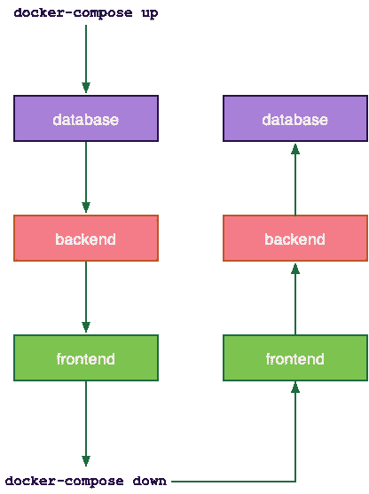
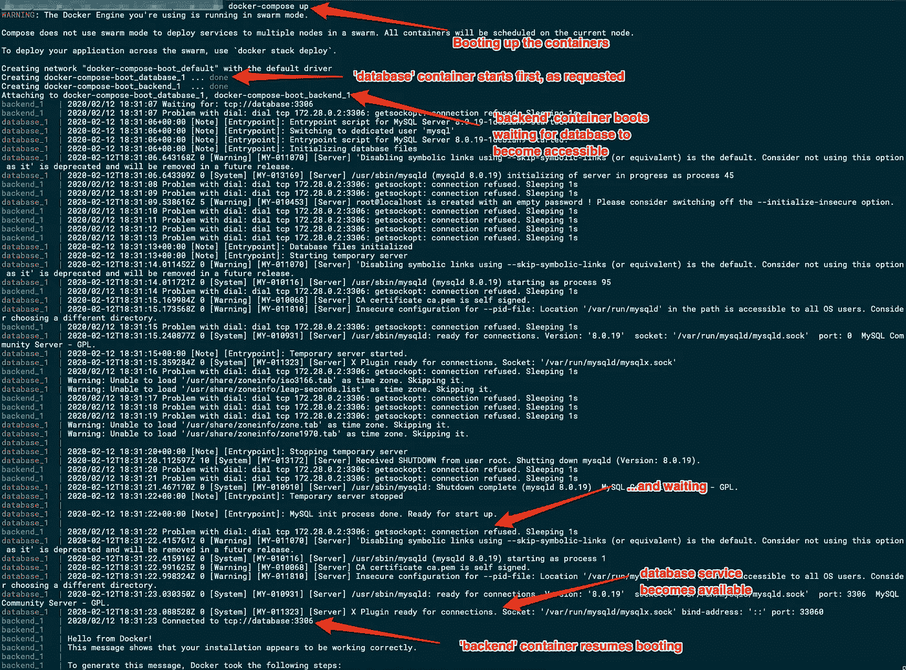

# 看看 Docker Compose 的启动序列

> 原文：<https://betterprogramming.pub/a-look-at-docker-composes-bootup-sequence-1f597049cc65>

## 如何管理应用程序堆栈中对时间敏感的容器间依赖关系


[Denys Nevozhai](https://unsplash.com/@dnevozhai?utm_source=medium&utm_medium=referral) 在 [Unsplash](https://unsplash.com?utm_source=medium&utm_medium=referral) 上拍照。

作为好的 Docker 公民，我们都通过分离关注的区域来创建容器:一个容器用于我们的后端，另一个用于我们的前端，第三个用于持久服务。

但是，当后端容器启动并运行，而您却发现数据库容器仍在试图变得可用时，会发生什么呢？您的应用程序是无法启动，还是会一直重试，直到数据库服务可以访问？

在本文中，我们将回顾不同的选项，以确保容器不仅以预期的顺序启动，而且在另一个依赖容器启动并试图使用它们之前变得可访问。

# 在 Docker 编写中定义依赖关系

从版本 2 开始，Docker Compose 允许您使用`depends_on`键明确定义容器的相互依赖关系。通过在 Docker Compose YAML 文件的服务规范中添加一个`depends_on`键，您可以有效地告诉 Docker Compose“Container FOO 依赖于 container BAR”这有多简单:

上面的 YAML 将让 Docker Compose 不仅知道如何以特定的顺序启动容器，还知道如何以完全相反的顺序关闭它们:



Docker 编写上下排序(图片由作者提供)。

所以，那是小菜一碟！我们的容器完全按照我们希望的顺序启动，当我们的后端试图访问数据库时，它已经在那里了，准备好并监听请求…对吗？嗯，没那么快。

# 开始的容器不是就绪的容器

你看，一个容器被报告为 *started* 的事实并不一定意味着它已经准备好提供它的服务。在容器内部运行的应用程序可能需要经历一个初始化阶段，在这个阶段完成之前，它可能不会响应。

Docker Compose 不知道在容器内部检查什么或者如何检查，以找出在容器内部运行的应用程序的实际状态。它所关心的是`CMD`或`ENTRYPOINT`被成功执行。让我们用下面的 Docker 合成文件样本做一个快速测试，看看这一点在实践中是如何实现的:

让我们用`docker-compose up`来运行它:


“数据库”容器比需要访问它的“后端”容器晚 26 秒准备好接受请求。

正如您在上面看到的，尽管 Docker Compose 尊重我们的依赖定义，并在后端容器之前启动数据库容器，但后者需要更长的时间来准备接受请求。如果后端容器在前一个容器准备好之前的 26 秒内试图访问数据库，它就会失败。

显然，需要一个更好的服务状态检查机制——这种机制要考虑到知道如何测试其状态的底层嵌入式服务的性质。接下来让我们看看如何实现它。

# 实施服务状态检查

有几种不同的方法来检查容器中的底层服务是否准备好接受请求，而不管 Docker 本身对其托管容器报告了什么。让我们回顾一下我们的选择。

## 使用容器健康检查

虽然 Docker health checks 是一个非常有用的概念，但是你不能用它来让一个容器等待另一个容器。我只是在这里提到它，因为你可能会发现对它的在线参考，不幸的是对 Docker Compose 的现代版本不再有效。在 Docker 的 GitHub repo 上有一个关于这个主题的[长讨论](https://github.com/moby/moby/issues/31333)，以及为什么这个功能被移除(并且永远不会回来)。另一方面，如果你想实现健康检查来监控你的容器，我已经在之前的文章中写过了。

## 使用第三方工具和集成

从 Docker Compose 的早期开始，人们就试图用定制的解决方案来解决容器相互依赖的问题。以下是三种最广泛使用的方法:

1.  `[**wait-for-it**](https://github.com/vishnubob/wait-for-it)`wait-for-it.sh 是一个纯粹的 bash 脚本，它将等待主机和 TCP 端口的可用性。这对于同步相互依赖的服务(如链接的 Docker 容器)的启动非常有用。因为它是一个纯 bash 脚本，所以它没有任何外部依赖性。
2.  `[**dockerize**](https://github.com/jwilder/dockerize)`
    dockerize 是一个简化 Docker 容器中运行应用程序的实用程序。它允许您在容器启动时从模板和容器环境变量生成应用程序配置文件，将多个日志文件添加到`stdout`和/或`stderr`，或者使用 TCP、HTTP(S)等待其他服务可用。
3.  `[**await.sh**](https://github.com/vegardit/await.sh)`
    await.sh 是一个自包含的 POSIX shell 脚本，用于等待资源和服务的可用性。与`wait-for-it`类似，它具有最低的系统要求(POSIX shell、timeout、nc、wget ),可以与 BusyBox 以及 Alpine Linux 映像一起工作。

从技术上讲，上面的工具都不需要修改容器的 Docker 映像才能工作。然而，它们需要——以某种方式——在容器内部可被访问以被执行。让我们尝试用 dockerize 包装我们的 hello-world 容器，然后用`docker build . -t hello-world-dockerize`重新构建它:

```
FROM hello-worldFROM jwilder/dockerize
COPY --from=0 hello /ENTRYPOINT dockerize -wait tcp://database:3306 -timeout 60s /hello
```

接下来，更新 Docker 合成文件以使用包装的图像:

现在是时候使用`docker-compose up`再次运行我们的演示应用堆栈了:



让一个容器等待另一个容器(图片由作者提供)。

这一次，后端容器耐心地等待，直到数据库容器中运行的数据库服务可用。

# 容错简介

在上面只涉及两个容器的场景中，手动定义它们之间的相互依赖关系并不是一件困难的任务。然而，在现实世界中，您的堆栈可能包含多个自治容器，手动处理相互依赖和正确的启动顺序可能会变得非常复杂。

此外，如果您在容器中引入运行状况检查(这是您应该做的),您可能很容易出现活锁的情况，在这种情况下，等待另一个容器变得可用的容器会由于运行状况检查超时而自行重置。

这种情况下的设计范例是将容错引入到您的系统中。例如，后端容器不是因为数据库容器不可用而无法引导，而是可以继续引导，只是在建立对底层数据库的访问之前尝试处理请求时返回一个错误代码。后台进程可以检查数据库服务的可用性，并在准备就绪时透明地连接到数据库。

引入容错不仅解决了初始启动序列的问题，而且在您无法控制容器的位置或可用性的分布式环境中，它也是有帮助的，甚至是必要的。将您的应用程序设计为在底层资源不可用时正常降级，并在资源再次可用时自动切换到正常模式。

# 结论

当您有一个由 Docker 容器组成的应用程序堆栈时，您可能会发现自己处于需要特定引导顺序的情况。为了实现这一点，您可以集成第三方解决方案，让一个容器等待另一个容器中服务的可用性。然而，如果可能的话，你应该在你的设计中引入容错，允许你的容器在资源变得不可用时优雅地降级。

感谢您阅读这篇文章。希望下一部能见到你。