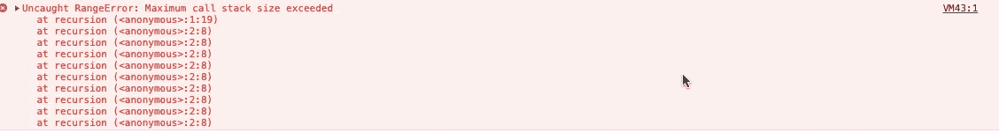
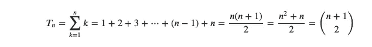

# 用例子看看 JavaScript 中的递归

> 原文：<https://betterprogramming.pub/a-look-at-recursion-in-javascript-with-examples-e5d27ebacf1e>

## 递归在调用堆栈中是什么样子的？


普里西拉·杜·普里兹在 [Unsplash](https://unsplash.com/s/photos/loops?utm_source=unsplash&utm_medium=referral&utm_content=creditCopyText) 上的照片

随着 ECMA6 脚本和 ES2020 的广泛支持，曾经经常在 JavaScript 中作为参考或编码面试练习示例的递归现在变得越来越普遍。

让我们来看一些实用有效的递归例子，包括:

*   在 JavaScript 中定义递归
*   调用栈
*   迭代与递归解决方案
*   利弊

# 什么是递归？

递归是一种编程技术，它通过优雅地将重复执行简化为具有相似性质的较小执行来解决复杂问题。

更进一步的研究表明，通过利用 JavaScript 中的调用栈，递归卷起嵌套函数，然后展开它们。在许多情况下，实现递归解决方案可以帮助提供可读性，并减少调试代码所需的时间。

但是我们不要想太多。首先，让我们先定义递归。递归是一个调用自身的函数。

例如，下面的一些伪代码展示了递归是如何工作的:

```
function recursion() {
return recursion()
}
recursion()
```

*注意我们执行了两次递归函数，一次在函数范围内，另一次在全局范围外。*

我们首先在全局范围内执行递归函数，然后运行*递归函数脚本*，然后从我们的递归函数中调用递归函数*。这又会再次运行函数，再次调用递归——不断地将递归添加到我们的调用堆栈中，从而创建一个循环。*

按照代码的原样，嵌套函数的无限循环被添加到调用堆栈中。

调用栈是一个提供连续内存的区域，允许本地上下文并跟踪多个函数。然后，事件循环监控调用堆栈，并在调用堆栈为空时发送事件或*函数回调*。

如果我们在开发控制台中运行上面的递归函数，我们会收到以下错误:



这让我们知道如何在函数中建立递归模式。

通过为我们的递归函数提供一个**基础用例**，我们可以调整嵌套函数的调用栈。基本情况是我们可以编写的条件，它将调用堆栈从递归缠绕切换到展开。

# 递归模式函数

```
function recursionPattern(num) {
**// base case**
if(num <= 0) {
return 0 
} else {
**// recursion execution**
return recursionPattern(num  - 1)
}}
recursionPattern(5)
```

我们的递归将不再超出并中断调用堆栈，因为我们已经提供了一个**基础用例:** `if(num <= 0).` 。现在，一旦参数`num` 小于或等于零，我们的函数将返回零。

我们通过调用参数为`num`减 1 的递归函数来进一步修改我们的递归执行。`recursionPattern`函数现在将总是返回零，调用栈将不再折叠。

# 阶乘和与递归

我们用阶乘和一些代数刷新器更深入地探究递归的预备知识。

在编程中，一个数的[阶乘](https://en.wikipedia.org/wiki/Factorial)求和是一个`number`加上一个`number minus one`，直到`number` 达到其条件完成。

观察下面的二项式系数公式:



这可能看起来像一个很长的数字链，但我们不要关注每个转换。相反，我们可以从简单公式的摘录中抓住我们需要的东西:`(n^n + n) / 2`。

给定这个等式，让我们通过稍微修改函数来求解带有求和的阶乘，从而为上面的`recursionPattern`函数提供一个实际的上下文。

我们可以通过简单地返回函数的参数`num` +带有参数`num — 1`的递归执行来做到这一点:

```
function factorialSum(num) {
if(num <= 0) {
return 0 
} else {
return num + factorialSum(num  - 1)
}}
factorialSum(5)
// returns 15
```

让我们在上面的函数中分解递归模式的执行。

首先，我们的函数接受一个参数`num.`,然后我们设置我们的基本情况，这是条件`if`代码块。`if(num <= 0) {
return 0`。

如果我们的参数小于或等于零，我们返回`0`并结束，向调用堆栈添加一个新的嵌套函数。

我们的`else`语句通过将我们的 num(参数)连接到我们的递归执行`factorialSum(num — 1`来执行阶乘求和等式。我们在函数调用中从参数中减去`1`，这样每次我们再次调用函数时，num 参数都会丢失一个值`1`。

调用堆栈从`5` 开始——初始参数:`factorialSum(5).`，然后 JavaScript 会将内存中的`5`添加到调用堆栈中，并从我们的参数中减去 1，因此我们的新参数号现在是`4`。接下来，`ot`会将内存中的`4`添加到调用堆栈中，并再次执行该函数。我们现在的新论点是`3`。这一直持续到我们到达我们的基本情况，`0`。


一旦我们到达我们的基本情况，调用栈已经结束了所有的递归嵌套函数，然后它以第一顺序(调用的最后一个函数)返回到最后一个函数(调用的第一个函数)。

乍一看，这似乎有悖常理。然而，在下面的例子中，我们将对其进行分解，以便更清楚地查看。

# 迭代解决方案与递归解决方案

对于每一个递归解，都有一个相等的迭代解。从这个意义上说，递归充当了自身的循环机制，并利用调用堆栈来完成其任务。同一问题的迭代解决方案依赖于迭代循环结构。

例如，如果我们在编码挑战或面试问题中被要求寻找递归解决方案，这样做的技术将是首先写出迭代解决方案，然后使用它来绘制递归解决方案。

让我们检查下面的问题，写出一个迭代解，然后是一个递归解。通过浏览这个过程，我们可以检查这一切是如何工作的。

# 迭代求解示例

看一下下面的代码:

在上面的例子中，我们看到一个函数有两个参数，`startVal`和`endVal.`，顾名思义，`startVal`是数组参数的起始编号，`endVal`是数组的结束编号。

该函数的目的是通过在调用该函数时提供这两个参数，我们返回一个数组，该数组包含了在`startVal` 和`endVal.`之间按顺序排列的所有数字

因此，如果我们的起始号码`startVal`是`1`并且我们的结束号码`endVal` 是`5`，那么函数将返回:`[1,2,3,4,5]`

让我们看看这在上面的迭代解决方案中是如何工作的。首先，我们创建一个空数组。然后我们用三个条件设置我们的`for...loop`。我们将`i`(索引)初始化为我们的`startVal`的起始数。然后我们设置我们的循环，设置`i`(索引)运行，直到我们到达`endVal`。

我们的最终条件是在每次运行到`i`后增加一个。最后，我们将结果放入数组`arr.push(i)`。这一切都很合理，布局也很好。

既然我们已经完成了在两个数字之间创建包含数组的迭代解决方案，那么让我们按照循环模式的类似基本逻辑构建一个递归解决方案，但是应用于调用堆栈而不是循环结构。

# 递归解比较

首先，让我们用同样的两个参数创建函数:

```
function inclusiveArrayParamRecursive(startVal, endVal) {}
```

接下来，我们创建一个基本案例，它遵循我们应用于`for…loop` 条件的类似逻辑条件。

在我们之前函数的`for…loop`中，我们写道:

`for(let i = startVal; i <= endVal; i++)`

我们将`i`设置为`startVal`，然后运行`i` 的循环，现在是`startVal` ，直到它小于或等于`endVal`。

对于递归解决方案中的基础案例,我们可以应用类似的方法。通过设置一个`if else`条件块，一旦 `startVal`大于或等于`endVal`，我们返回起始值并结束递归。否则，我们运行递归执行。

我们的`inclusiveArrayParamRecursive` 现在看起来是这样的:

```
if(startVal >= endVal) {return [startVal]} else {
}}
```

然后，我们可以简单地创建一个变量，并将其设置为我们的递归执行，用我们的开始值和结束值减一，以在调用堆栈中创建 wind 结束点。在新变量中，我们将每个`endVal`的结果推入数组，然后调用堆栈在我们遇到基本情况时返回所有嵌套的函数。

我们最终的递归解决方案如下:

虽然我们从每个`endVal` 中减去 1，并且从`6`的`endVal` 参数开始，将每个新的`endVal`推入数组，但是我们从`2`的`startVal`开始收到一个增量订单。

这可能看起来违反直觉，但希望注意到调用堆栈现在是如何工作的，这现在更有意义。调用堆栈将这些数字打包并存储嵌套的函数，然后在满足基本情况时返回它们。因此，我们接收的是一个增量数组，而不是减量数组。

# 结论

现在我们已经讨论了迭代和递归，一个很好的练习是创建一个递归函数，它产生一个从`0`到`n`开始的增量数组。从写迭代解开始，然后转向递归解。

通过分解和观察递归的实际例子，以及它们是如何作为更常见的 JavaScript 问题的有效解决方案形成的，我们可以提供一个更好的上下文，来说明递归模式如何成为我们编程的有益实现。

虽然递归有助于提高代码的时间复杂度和清晰度，并有助于更好地调试代码，但警惕它的缺点也很重要。这些包括这样一个事实，即它会占用更多的内存，并且比某些迭代解决方案要慢。

许多已经在这个行业工作了至少几年的 web 开发人员都会同意 JavaScript 在过去十年中经历了相当大的发展。

密切关注 JavaScript 中递归的实现进度和模式，是了解该语言现状和未来发展方向的一个好方法。

就是这样。感谢您的阅读，我希望您能从中受益。

请在下面找到关于递归的完整视频教程，可以添加或检查的递归与迭代解决方案库，以及下面的一些其他资源。

[视频教程](https://youtu.be/j0TlQf_tUjU)

[源代码](https://github.com/01Clarian/RecursionExamples)

[](https://www.geeksforgeeks.org/recursion/) [## 递归-极客 forGeeks

### 什么是递归？函数直接或间接调用自己的过程称为递归，而函数调用自己的过程称为递归

www.geeksforgeeks.org](https://www.geeksforgeeks.org/recursion/) [](https://softwareengineering.stackexchange.com/questions/242889/are-there-advantages-for-using-recursion-over-iteration-other-than-sometimes-r) [## 使用递归比迭代有优势吗——除了有时可读性和…

### 首先，尽管确实总是存在与任何递归算法等价的迭代算法，但它…

softwareengineering.stackexchange.com](https://softwareengineering.stackexchange.com/questions/242889/are-there-advantages-for-using-recursion-over-iteration-other-than-sometimes-r)