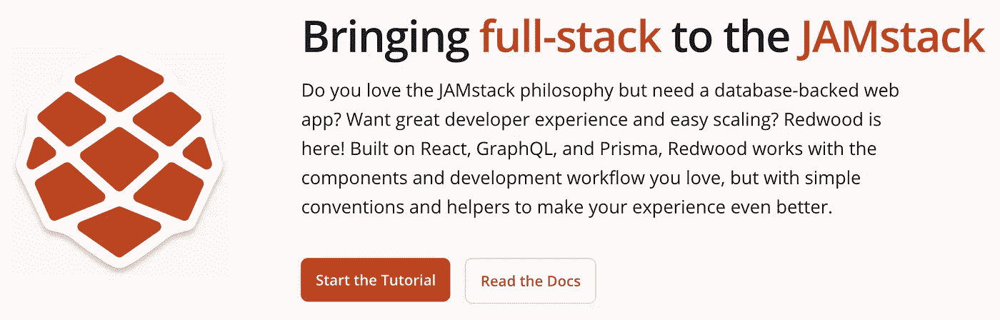
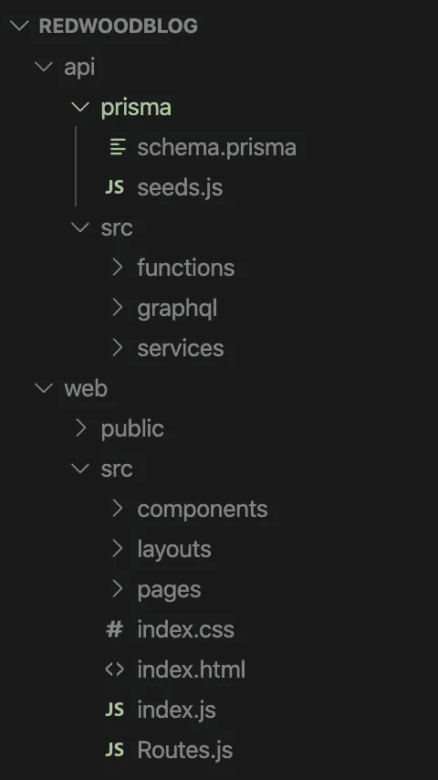
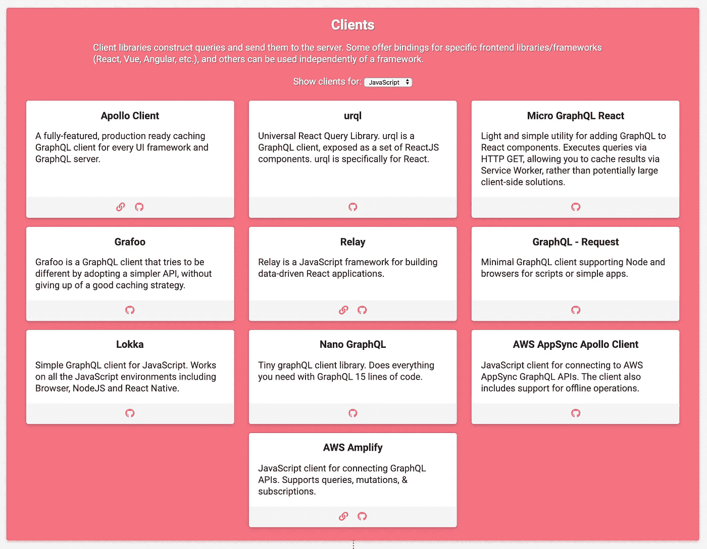

# 看红杉树

> 原文：<https://betterprogramming.pub/a-look-at-redwoodjs-cf0e1d117f5>

## 将全栈带到 JAMstack

照片由[乔希·卡特](https://unsplash.com/@midwestiscool?utm_source=unsplash&utm_medium=referral&utm_content=creditCopyText)在 [Unsplash](https://unsplash.com/s/photos/redwood?utm_source=unsplash&utm_medium=referral&utm_content=creditCopyText) 拍摄

几天前，我在浏览黑客新闻时看到了一篇有趣的[帖子](https://news.ycombinator.com/item?id=22537944)，标题是“Redwood:一个用于 JAMstack 的集成的、全栈的 JavaScript web 框架。”在评论帖中有一些有趣而生动的讨论——我建议你去看看。

[https://redwoodjs.com/](https://redwoodjs.com/)

我最近完成了 RedwoodJS [教程](https://redwoodjs.com/tutorial/welcome-to-redwood.html)，其中涉及到构建一个简单的博客应用程序。在本文中，我将分享我在 Redwood 工作的一些初步想法。

# 概观

让我们先来看看来自[自述文件](https://github.com/redwoodjs/redwood/blob/master/README.md)的 Redwood 的官方描述(着重部分由作者添加):

> “Redwood 是一个自以为是的、全栈的、无服务器的 web 应用程序框架，它将允许您轻松地构建和部署 JAMstack 应用程序。**想象一个由 CDN 静态提供的 React 前端，它通过 GraphQL 与运行在世界各地的 AWS Lambdas 上的后端对话，所有这些都可以通过一个** `**git push**` **进行部署，这就是 Redwood。**
> 
> Redwood 为您做了许多决定，让您能够致力于使您的应用程序与众不同的东西，而不是浪费时间反复选择各种技术和配置。此外，因为 Redwood 是一个**合适的框架**，随着时间的推移，您可以以最少的努力从持续的性能和功能升级中获益。"

如果你熟悉 React，你就能很快学会 Redwood。在完成 Redwood 教程之前，我没有深入研究过 GraphQL、Prisma 或 AWS Lambda。然而，通过一些外部阅读，我能够在阅读 Redwood 教程的同时掌握这些技术的基本原理。本教程还很好地介绍了通过 Netlify 进行部署。

Redwood 主要建立在 React 开发流程之上。我使用 React 已经有一段时间了，我发现这个库最难的一点是，它只是一个库，而不是一个完整的 web 框架。像许多开发人员一样，Rails 是我学习的第一个框架，并且(像许多其他人一样)我爱上了它的简单性和强大的组织原则。

当我开始学习 React 并去创建一个新项目时，我经常感到被所需的配置选项和附加技术(Webpack、Babel、React Router 等)所淹没。).

Redwood 试图如何解决这一痛点？

# **Redwood 的项目组织和工具**

Redwood 提供了一致的目录结构——所有文件和资产的固定位置——并为您做出许多关于底层技术和工具的决策。

## 目录结构

这是 Redwood 的高级文件夹和文件结构:

【https://redwoodjs.com/tutorial/redwood-file-structure 号

如果你坚持 Redwood 的这个组织，一切*都可以正常工作*——就像 Rails 一样，你可以这么说！严格的组织格式也为开发人员协作带来了巨大的好处。Redwood 的作者对这种“标准的力量”提出了一个很好的观点:

> Redwood 相信标准的力量，并为您决定使用哪些技术，如何将代码组织成文件，以及如何命名。有了对 Redwood 约定的共同理解，开发人员应该能够投入到任何 Redwood 应用程序中，并快速上手。

在我看来，这种 Rails 风格的、约定胜于配置的方法在 React 和更广泛的 JS web 开发社区中非常需要。组织 React 项目的方法实在太多了，这使得开发人员很难钻研新的代码库。

## 相关技术和工具

Redwood 使 React 开发人员的生活变得更容易的第二种方式是选择相关的技术和工具。例如，看看 GraphQL 客户端库的众多可用选项，这只是典型 GraphQL 堆栈的一部分:

[https://www.graphqlstack.com/](https://www.graphqlstack.com/)

这种多样性和必要的决策在现代 JavaScript 生态系统中很普遍——这让我抓狂！

尽管 Rails 几乎处处固执己见，但 React 是一个相对较小的库，在如何组合项目方面，它给了开发人员很大的自由和灵活性。直接比较起来，Rails 和 React 简直是风马牛不相及。然而，我通常更喜欢放弃一些可定制性，以使用一组可靠的技术，我知道这些技术可以很好地协同工作。

对于上面的 GraphQL 客户端示例，Redwood 为您做出了选择，并选择了 [Apollo 客户端](https://www.apollographql.com/docs/react/)。更好的是，您可以广泛地使用 Redwood，而不需要非常熟悉如何设置和实现 Apollo 客户端本身。实际上，Redwood 使得使用 GraphQL 变得更加容易和容易。

# **路由**

我喜欢使用 Redwood 的另一个原因是它的路由解决方案。在我最近的几个项目中，我发现使用 [React Router](https://reacttraining.com/react-router/) 有点痛苦。Redwood 自带内置路由解决方案。我发现 Redwood 的路由实现起来比 React 路由器简单得多。

使用 [Redwood Router](https://redwoodjs.com/docs/redwood-router) ，不需要将`routerProps`传递给组件，也不需要管理复杂的历史和匹配对象。最后，Redwood Router 利用了命名路由函数，它允许开发人员更新路由的路径，而不会中断到它的任何链接。这是一个很好的特性，有助于代码库不那么脆弱，更经得起未来的考验。

# **附加福利**

使用 Redwood 的另外两个好处是它强大的 CLI 生成器和 monorepo 方法，Rails 开发人员应该对这两个都很熟悉。Redwood 的生成器可以快速设置一个基本的 CRUD 应用程序。

Redwood 提供的另一个简化器是在 GitHub monorepo 中用前端和后端轻松构建项目的能力。在能够构建单一回购 Rails 应用程序之后，我一直不喜欢管理 React 前端回购和 Rails(或类似的)API 后端回购所带来的额外复杂性。

# **总结**

我发现 Redwood 教程很简单，容易理解，甚至很有趣。该框架的生成器和配置默认值使得构建全栈应用变得快速而简单——并且减少了打字错误和其他常见开发错误的空间。

Redwood 还有许多其他有趣的方面，我期待着尽快探索它们。我迫不及待地想看到 Redwood 如何发展，并希望自己能为该项目做出贡献([未决问题](https://github.com/redwoodjs/redwood/issues))。

总而言之，Redwood 还处于早期阶段，还没有准备好投入生产，但是我想我会喜欢使用这个框架的！

# **资源**

*   RedwoodJS 官方网站:

 [## 将全栈带到 JAMstack

### 你喜欢 JAMstack 哲学，但需要一个数据库支持的 web 应用程序吗？想要出色的开发人员体验和简单的…

redwoodjs.com](https://redwoodjs.com/) 

*   黑客新闻上的 Redwood 发布帖子:

 [## Redwood:用于 JAMstack |黑客新闻的集成式全栈 JavaScript web 框架

### 可能是这样，尤其是当你在学习或整合许多小项目时，但我的观点是人们…

news.ycombinator.com](https://news.ycombinator.com/item?id=22537944) 

*   你可以在 GitHub repo 中查看我基于 Redwood 教程创建的博客:

 [## 卢克沃林/雷德伍德-博客

### 注意:RedwoodJS 还不能用于生产。它严重依赖于 Prisma2，目前正在测试中…

github.com](https://github.com/lukewaring/redwood-blog) 

*   博客的部署版本可在[此链接](https://vigorous-jang-8b3e97.netlify.com/)获得。我以前没有使用过 Netlify，Redwood 和 Netlify 让部署过程变得如此简单，让我大吃一惊。