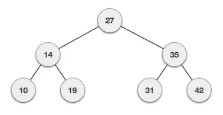
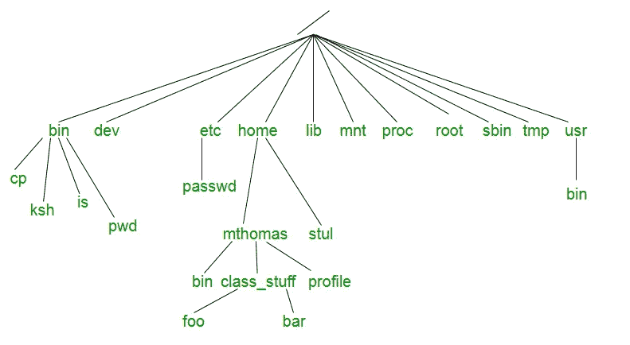

# C++中的树形数据结构

> 原文：<https://betterprogramming.pub/a-look-at-the-tree-data-structure-in-c-49a33bc841eb>

## *树可以解决各种各样的计算机科学问题*


在 [Unsplash](https://unsplash.com?utm_source=medium&utm_medium=referral) 上 [veeterzy](https://unsplash.com/@veeterzy?utm_source=medium&utm_medium=referral) 拍摄的照片

树是计算机科学中最有趣的数据结构之一。除了有常见的名字如*兄弟姐妹、树叶、父母、孩子、*等。，来表示它们，树可以用来解决计算机科学中一些最具挑战性的问题。

让我们深入了解树的基本概念，它们在 C++中的用法，以及它们在一些最重要问题上的应用。

# 树木背后的概念

树属于非线性数据结构类。不同于线性数据结构，如堆栈或列表，其中元素以线性顺序存储*，*非线性数据结构分层存储元素。因此，树或图的遍历不能在一次运行中完成。

下面是一个典型的树的例子。



二叉树的例子

圆圈内的元素称为树的*节点*。二叉树是一种数据结构，其中每个节点最多有两个子节点。最顶端的节点称为*根*节点。没有孩子的节点称为*叶*。这里的根节点是 27。14 处的节点是节点 27 的左子节点，35 处的节点是右子节点。类似地，父节点 14 的左右孩子分别是 10 和 19。上例中的叶子是 10、19、31 和 42。树的高度被定义为从根到叶子的最长路径。在上面的例子中，树的高度是 2。

树的优点是可以有效地利用内存。在堆栈的情况下，删除中间的元素是困难的，因为我们必须将元素移到堆栈的右边。但是在树的情况下，我们可以删除节点 *x* 并修改其父节点以指向 *x* 的子节点。

# 树的类型

**全二叉树:**如果每个节点都有 0 或 2 个子节点，那么二叉树就是全二叉树。

**完全二叉树:**一棵二叉树是一棵完全二叉树，如果所有的层次都被完全填充，除了可能的最后一层，并且最后一层有尽可能多的所有键。

**完美二叉树:**如果一棵二叉树的所有内部节点都有两个子节点，并且所有叶节点都在同一层，那么它就是完美二叉树。

**平衡二叉树**:如果树的高度为 O(Log n)则二叉树是平衡的，其中 *n* 是节点数。

**二叉查找树:**在二叉查找树中，节点左子节点的值必须小于其父节点的值，节点右子节点的值必须大于其父节点的值。

# **编码树**

用 C++表示树的代码如下所示。它由一个数据部分和分别对左右节点的引用组成。

```
struct node {
   int data;   
   struct node *left; //Reference to left child
   struct node *right; //Reference to right child
};
```

为了简单起见，让我们考虑一个二叉查找树(BST)。可以在这个树形数据结构上执行的基本操作是插入、搜索和遍历。

## 将元素插入 BST

在下面的例子中，我们将值为`val` 的元素插入到树中。如果`val`小于根值，树的遍历继续向左，因为`val`需要被插入到左边的子树中。如果`val`大于根值，我们继续右子树遍历，将`val`插入右边。如果`val`等于根键，我们简单地返回根键以避免重复。如果树是空的或者树遍历到了末尾没有结果，那么我们调用`getNewNode`函数来获得一个新的节点。

## 在 BST 中遍历树并搜索元素

为了在二叉查找树中搜索关键字，我们检查根值是否等于`NULL`。如果树是空的，或者如果树遍历到达末尾而没有找到键，就会发生这种情况。如果密钥不存在，我们返回`NULL`。

如果根值等于键值，我们返回根地址。

在所有其他情况下，如果键值小于根值，我们执行左树遍历，如果键值大于根值，我们执行右树遍历。

# 树木的应用

树可以用来表示数据中的层次和结构关系。此外，当插入和搜索的时间复杂度为 O(h)时，它们是有效的，其中 *h* 是树的高度。与列表和数组等其他数据结构不同，子树可以轻松地移动。

## 操作系统

最流行的操作系统之一，Linux，利用树形结构来表示它的层次文件系统。Linux 中的文件系统以如下所示的树形结构排列。



Linux 中的文件系统

## 编译程序

*语法树*是用编程语言编写的源代码的抽象语法结构的树表示。树的每个节点表示源代码中出现的一个构造。

编译器在语法分析阶段构建语法树。该树用于检查在编写计算机程序时是否遵循了正确的语法。

## 网桥和路由器

*最小权重生成树* 是连接的、边加权无向图的边的子集，该图将所有顶点连接在一起，没有任何圈并且具有最小可能的总边权重。这种树用于计算机网络的网桥和路由器中的数据包路由。

## 特里

一个 *trie* 是一种高效的信息检索数据结构。使用 trie，搜索复杂性可以达到最佳极限(密钥长度)。如果我们在二叉查找树中存储关键字，我们需要与 M * log N 成比例的时间，其中 M 是最大字符串长度，N 是树中关键字的数量。使用 trie，我们可以在 O(M)时间内搜索密钥。

# **结论**

*B 树*，也称为*自平衡树*，用于在数据库中建立索引，以实现高效的信息检索。

计算机科学中有几种树可以用于多种目的。树是每个开发人员都需要知道的最重要的工具之一。这使得解决问题变得更快更容易，尤其是对于处理层次结构的问题。