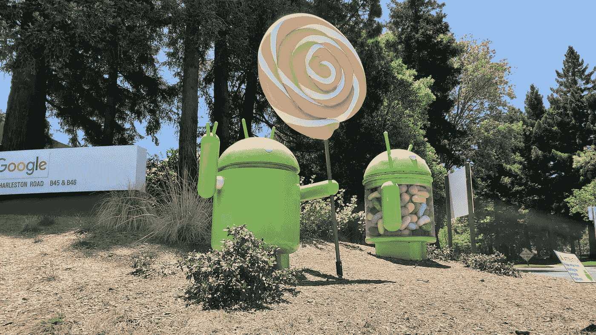

# 给安卓的情书

> 原文：<https://betterprogramming.pub/a-love-letter-to-android-fba3ca7e4fe3>

## 我是如何以及为什么爱上 Android 开发的



作者照片

我记得我 16 岁的时候打开了我的第一部智能手机。我带着一辆白色三星 Galaxy S3 离开了美国电话电报公司商店。第一次拆箱和安装智能手机的经历对我十几岁的自己来说是神奇的。老实说，我不记得我为什么没有选择 iPhone，但我的决定让我走上了一条影响我余生的道路。

大约在 2014 年，Android 有一个奇怪的名声。虽然 iOS 的精致体验吸引了所有人，但 Android 似乎吸引了书呆子和技术迷。尽管 KitKat 让事情朝着正确的方向发展，但 Android 仍然有些粗糙。但是伴随着这种粗糙而来的是一些让我觉得 Android 很突出的怪癖。当时，安卓市场仍然竞争激烈。一场争夺安卓设备巨大国际市场的残酷军备竞赛推动智能手机制造商以独特的方式进行创新，以使他们的手机脱颖而出。我开始痴迷于跟踪 Android 市场的最新发展。我会花无数的时间看科技 YouTubers 评论最新的设备，研究最先进的处理器的规格，并眯着眼看最新旗舰产品之间的相机比较。

作为一名计算机科学专业的学生，我对开发自己的 Android 应用程序感兴趣并不奇怪。在完成了大一的 OOP 入门课程后，我在我的 Thinkpad 上下载了 Android Studio，然后一头扎了进去。我不知道我在做什么，但我很兴奋地学习。这是在 Kotlin 和 Flutter 等框架起飞之前的一段时间，所以 Java 和 XML 是 Android 的核心构建块。幸运的是，我对这两件事都有一些(尽管很少)的经验。

经过几个小时的反复试验，我设法组装了一个简单的科学计算器应用程序。这不是什么令人印象深刻的东西，但是在花了一个学期的时间做递归和基本的 OOP 之后，我认为构建我可以使用的东西是世界上最酷的事情。由于忙于学业，我没有太多时间投资，所以我能做的事情非常有限。当暑假来临的时候，我有足够的时间去深入 Android 世界。我不只是想学习基础知识。我想尝试一些新的东西，创造一些独特的东西。我决定将我的两个爱好结合到一个项目中:防护和编码。击剑是美国比较小众的运动之一，所以我可以开发很多独特的应用。

我最终开发了一个配套应用程序，旨在帮助裁判。除了记分和计时，该应用程序还包括一个即时回放功能，允许用户记录比赛的部分内容并观看。我对最终产品感到自豪，因为 Google Play 上没有其他应用程序具备这一功能。我想与我的朋友和击剑伙伴分享我的创作，所以我在我的同龄人中进行了一些封闭测试。我收到了很多积极的反馈，所以我通过谷歌 Play 商店公开发布了这款应用。

招聘会上的代表注意到了我的热情。个人项目向招聘人员展示了主动性和独特的技能，所以我更容易吸引那些寻找实习生的公司的注意。我在 Progressive 找到了一份实习工作，在那里我可以开发他们的移动应用程序。虽然它没有方的实习那么迷人，但我仍然学到了很多关于在行业环境中大规模构建和部署应用程序的知识。

我在大学期间一直在开发 Android 应用程序。毕业时，我在 Google Play 上推出了三款不同的应用。我获得了各种 Android 工具和库的知识，包括 Firebase、Google Fit、凌空和 Realm。毕业后，我很高兴有机会在谷歌开发 Android 应用程序。

我对 Android 开发的热情源于有机会在大范围内产生实质性的影响。智能手机几乎已经渗透到日常生活的方方面面。它们是我们每天每分钟都随身携带的非常私人的小玩意。几乎每个大公司和服务都有移动应用。应用程序开发使开发者能够为我们与手机之间的这种有意义的关系做出贡献。

Android 占据了全球智能手机市场的很大份额。在全球活跃的数十亿部智能手机中，大约 70%运行安卓系统。即使是一个开发者在这个生态系统中的潜在影响也是不可抗拒的。今天有太多的独角兽是通过移动应用取得成功的。

我一直很喜欢前端开发。尽管我非常尊重后端工作，但没有什么能比得上设计和构建实际终端用户体验的激动人心。我一直喜欢艺术地表达自己，但我笨拙的双手永远也画不出任何值得炫耀的东西。前端工作让我可以用头脑而不是用手来表达自己。我可能不太会拿画笔，但我知道我会打字。我相信，一个漂亮的网站或手机 app 可以被认为是一种艺术形式。

有人错误地说移动前端比后端开发容易。事实上，两者都有挑战性。从难度上比较他们没有任何意义。移动空间提供了几个独特的障碍。例如，开发人员必须考虑网络不稳定性、电池使用、内存空间、操作系统版本以及各种屏幕尺寸和密度。工程师在设计复杂的解决方案时必须考虑所有这些因素。

尽管硬件领域的创新已经放缓，但软件领域仍在继续发展。每年都有新版本的 Android 发布，为开发者带来新的特性和 API。

Android 也有大量的资源供开发者利用来构建创新的体验。Android SDK 在过去十年里已经走过了漫长的道路。无数的库和 API 的存在进一步拓展了这个界限。由于 Google Play 开发者控制台的有效性，甚至发布过程也变得令人惊讶地简化，它提供了您可能需要的一切，只需一次性支付 25 美元。对于个人项目，我可以毫不费力地运行 alpha 和 beta 测试，跟踪崩溃和安装率，并创建定制的商店列表。

加入谷歌后，我体验了应用程序如何在最高水平上扩展。谷歌电视的安装量超过 50 亿。在这种范围内工作非常困难。一个影响 1%用户的错误意味着数百万人可能受到影响，所以所有提交的代码都需要彻底的检查和测试。开发人员必须考虑每一种边缘情况，包括通常被遗忘的情况，如可访问性、翻译、功能不足和过时的设备。作为一名 Android 开发人员，经历这些严格的标准帮助我学习和成长。

一旦我完全掌握了 Android 开发，我很想在某个时候尝试构建 iOS 应用。尽管我从未真正投入到苹果生态系统中，但对该平台的深刻理解将迫使我走出舒适区，了解面临类似挑战的陌生技术。

# 结论

作为一名 Android 开发人员，我将永远珍惜我的旅程。我计划尽我所能继续开发 Android。如果你正在寻找一个新的职业道路或一个新的副业项目的想法。考虑研究 Android 应用程序开发。在不断发展的移动领域，机会是无限的。

感谢阅读。

```
**Want to Connect?**If you aren’t already, follow me on [Twitter](https://twitter.com/allegretti813)
```