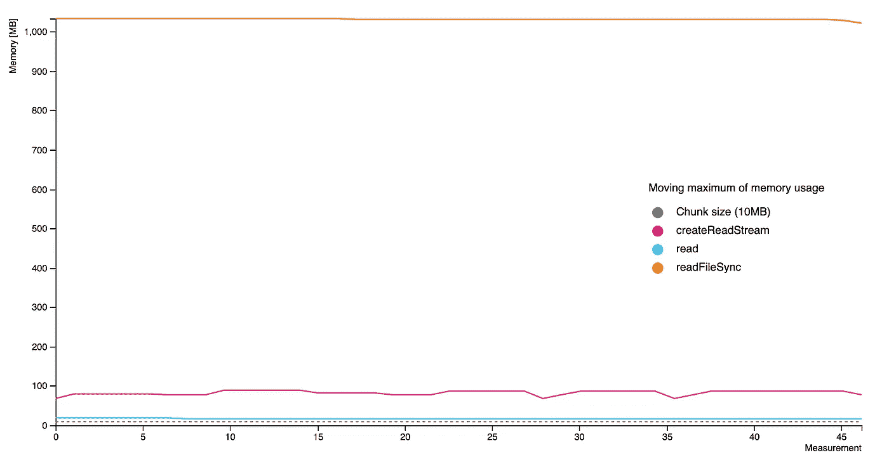
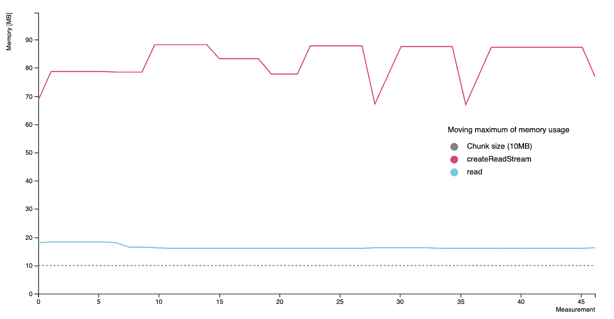
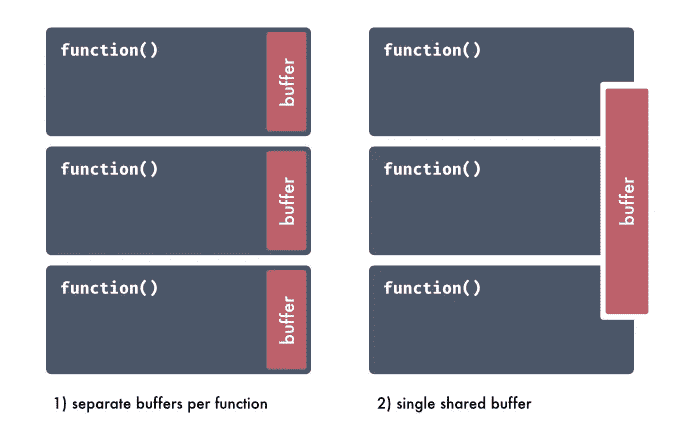

# 一种读取 Node.js 中文件的内存友好方式

> 原文：<https://betterprogramming.pub/a-memory-friendly-way-of-reading-files-in-node-js-a45ad0cc7bb6>

## 如何用有限的内存读取千兆字节的数据

照片由[扎克·哈里斯](https://unsplash.com/@zackeithharris?utm_source=unsplash&utm_medium=referral&utm_content=creditCopyText)在 [Unsplash](https://unsplash.com/?utm_source=unsplash&utm_medium=referral&utm_content=creditCopyText) 拍摄。

在各种情况下都可能需要读取文件。它可以是解析错误日志的一次性工作、应用程序的功能、预定的数据迁移任务、部署管道的一部分等。不管什么原因，读取 Node.js 中的文件是一项非常简单明了的任务。但是，当文件大小超过计算机的 RAM 容量时，就会出现问题。除了硬件限制，内存还会受到 VPS 提供商、Kubernetes pod 设置等的限制。

简单的`fs.readFile`做不了这个工作。闭上眼睛希望这次会过去是没有用的。

是时候进行一些内存感知编程了。

在本文中，我将研究 Node.js 中读取文件的三种方法。我的目标是找到在内存使用方面最有效的*方法。我将介绍:*

1.  内置`fs.readFileSync`
2.  迭代`fs.createReadStream`
3.  `fs.read`带共享缓冲区

# 实验

我将每种方法都实现为一个小型 Node.js 应用程序，并在 Docker 容器中运行。每个应用程序的任务是以 10MB 的块来处理 1GB 的文件。

在程序执行期间，我多次测量 Docker 容器的内存使用情况。注意，在本文显示的图表中，测量的内存是 Node.js 程序本身和 Docker 容器中所有进程(包括 OS)使用的内存的总和。

你是否注意到单个块的大小相当大？10MB 的文本数据包含 10，000，000 个字符(在 UTF-8 中，一个字符占用一个字节)。它远远超过了普通日志文件或 CSV 的单行字符数。在实际应用中，单线的大小是合理的。我使用与空闲 Docker 容器相当大小的块。这样，对块大小敏感的实现之间的任何差异将在图表中更加明显。

让我们快速看看我们在处理什么。在下面的图表中，我们可以看到每个程序的内存使用量的移动最大值:

移动 createReadStream、read 和 readFileSync 的最大内存使用量。

我们清楚的看到最差的是`readFileSync`，占用了 1GB 以上的内存。下一个，足迹更小的是`createReadStream`。最好的是`read`，它使用不到 20MB(块大小的两倍)。

下一张图显示了相同的数据，但仅针对最后两个函数:

移动 createReadStream 和 read 的最大内存使用量。

现在我们有了一个很好的概述，让我们进入每种方法的实现。

# 最简单也是最致命的方法是`readFileSync`一个文件

`readFileSync`，或者它的异步兄弟`readFile`，是最容易的选择。读取一个文件只需要一行代码，然后一个`for`循环就可以遍历内容:

文件的全部内容保存在`data`变量中。所以这并不奇怪:它至少需要 1GB 的内存。当我们处理大文件时，这种方法显然不是最好的。然而，它的简单性和我们可以在一行代码中访问所有数据的事实使得它值得考虑使用较小的文件。

# 使用`createReadStream`释放一些压力

从使用的简单性来说，`fs.crateReadStream`和`readFile`一样简单。读取一个文件仍然需要一行代码。事实上，这两个代码片段甚至看起来很相似。不同之处在于，这个方法返回的是一个流，而不是文件的内容。流需要额外的处理才能访问实际数据。

流可能听起来很可怕，甚至可以被认为是“高级”编程。然而，正如您在代码示例中看到的，我们可以只使用一个`for-await`循环来读取它。这就像迭代一个数组一样简单:

`highWaterMark`选项告诉 Node 一次只读取提供的字节数。这使得它的内存效率更高，因为在单次迭代中，内存中保存的数据量是有限的。

这种方法已经给了我们一个好得多的结果:90MB。该容器的内存使用量比前一个示例低 10 倍。尽管如此，它还是比块大小大九倍。

此外，测量值之间的偏差相当大。然而，我们指示 Node.js 在单次迭代中读取 10MB，这并不保证在单个时间点运行时内存中会保留一个块。旧的块最终会被垃圾收集器移除，但我们无法控制何时会发生这种情况。

有一种方法可以在内存使用的水平和稳定性方面取得更好的结果。让我们看看如何使用带有共享缓冲区的`fs.read`来实现它。

# 通过 R `ead`和共享缓冲器实现更多控制

这种方法比前两种稍微复杂一点。然而，我能够通过这种方式实现最低的内存使用和变化。

该应用程序由三个简单的部分组成，我将逐步介绍这三个部分:

1.  许诺过的`fs.read`
2.  异步发电机
3.  处理数据的主应用程序循环

## 但是首先，什么是“共享”缓冲区？

独立缓冲区与共享缓冲区

共享缓冲区是通过引用传递给所有函数的变量。我没有在每个函数中创建一个新的缓冲区，而是在程序开始时创建一个单独的缓冲区，并传递下去。在代码示例中，我通过一个名为`sharedBuffer`的变量来引用它，所以它应该是清晰可见的。

这是允许我降低内存使用和变化的实际技术。在下面的图表中，有两个程序之间的比较。如果没有共享缓冲区，程序将会对相同的数据进行多次复制，从而使数据变得多余。从图表中我们可以看出，这是非常昂贵的。此外，内存使用量在 20MB 到 80MB 之间变化，这是由于垃圾收集造成的。

共享缓冲区允许我们降低内存使用，使它更一致。

有和没有共享缓冲区的内存使用情况

## `readBytes —` 被许诺的`fs.read`

首先，我们为`fs.read`创建一个包装器。将内置的`fs.read`转换成承诺会简化它的用法。根据文档中的[，我们使用以下参数调用`fs.read`:](https://nodejs.org/api/fs.html#fs_fs_read_fd_buffer_offset_length_position_callback)

*   `fd` —表示文件描述符的整数。它将在程序的后面创建。
*   `sharedBuffer` —我们要写入数据的缓冲区。
*   `0` —缓冲区中开始写入的偏移量。我们总是在`sharedBuffer`的开头写数据。
*   `sharedBuffer.length`—要读取的字节数。在我们的例子中，它总是我们缓冲区的长度。
*   `null` —文件中开始读取的位置。当位置设置为`null`时，文件将从第一个字节开始读取，然后位置将自动更新。
*   最后一个参数是回调函数。

## `generateChunks` —异步发电机

JavaScript 中的生成器返回*迭代器*——我们可以在`for`循环中使用的特殊对象。我们可以把它们想象成动态更新的数组。在迭代的每一步中，生成器可能会追加下一个元素。这就是我们实际正在做的事情。在每一步中，我们读取下一部分字节，*产生*作为这个“虚拟数组”的下一项

使用由`generateChunks`生成器返回的迭代器，我们可以在一个`for`循环中迭代文件:

在迭代的最后一步，我们必须格外小心。数据的最后部分可能比我们的缓冲区大小短。但是，缓冲区本身的大小是恒定的。这意味着缓冲区可能在开头由新块组成，在结尾由以前的块组成。

我们通过用`buffer.slice(0, end)`访问数据来处理这种情况。它从开始到`end`返回部分缓冲区，等于当前步骤读取的字节数。

## 强大又冒险…

虽然使用共享缓冲区的`fs.read`是对内存最友好的方法，但是*共享缓冲区*部分有点棘手。如果使用不当，这种技术可能会导致:

*   数据泄漏—当缓冲区中填充了来自以前或将来迭代的字节，并且被错误地处理为当前字节时。尤其是在读取文件结尾时，可能会发生这种情况。
*   数据畸形——共享缓冲区在程序的不同部分被无意修改。

使用这种方法时要格外小心！

# 摘要

在读取 Node.js 中的文件时,`fs.createReadStream`和`fs.read`都可以降低内存使用量。如果数据结构允许它被流式传输，那么这两种方法中的任何一种都是合适的。我们的应用程序直接使用的内存量取决于块的大小，应该根据数据结构或可用内存等特性进行设置。

当块大小增加时，`fs.createReadStream`和`fs.read`之间的差异会更加明显。`fs.read`的内存使用量大约低 10 倍。在这个基准测试中，我使用了 10MB 的内存块，所以内存使用量相差 10 倍就是 100MB。在实际应用程序中，块可能会小得多，因此所用内存量的差异可以忽略不计。在这种情况下，方法的简单性和安全性可能是决定性因素。

# 资源

*   [GitHub 库](https://github.com/kmoskwiak/articles/tree/master/202012-Memory-friendly-way-of-reading-files-in-Nodejs)
*   [节点单据](https://nodejs.org/api/fs.html#fs_fs_read_fd_buffer_offset_length_position_callback)