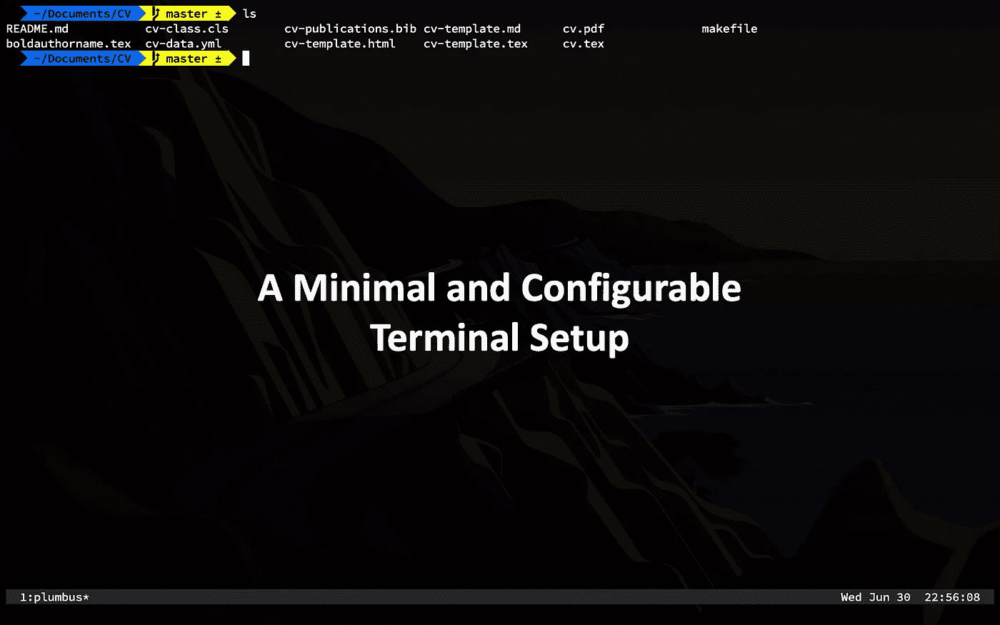

# 最小且可配置的终端设置

> 原文：<https://betterprogramming.pub/a-minimal-and-configurable-terminal-setup-72aa833672e>

## 为最小化设置配置 alacritty、tmux 和 zsh



图片由作者提供。

我的终端设置非常简单。它是一个黑匣子，告诉我一些有用的信息。最好的部分是 aspect 的所有东西都有一个配置文件——甚至是终端模拟器。

在这篇文章中，我将描述这个对于极简主义者来说非常理想的设置。

# 目录

[Shell 设置:zsh](#c5f8)
[终端设置:alacritty](#beea)
[多路复用器设置:tmux](#8bff)
[最终想法](#80d7)

# 1.Shell 设置:zsh

我最近换成了`zsh`，仅仅是因为它现在是 macOS 上的默认设置。我爱上了用“哦，我的天啊”来制作一个漂亮的、信息丰富的提示是多么容易。

## **安装哦我的 Zsh**

通过将以下代码粘贴到您的终端来安装 [Oh My Zsh](https://ohmyz.sh/#install) :

一旦安装完毕，这将在`~/.zshrc`创建一个配置文件。

这个配置文件中有许多设置，您可以打开/关闭它们。我不打算讨论这些，因为它们超出了本文的范围。

对我的配置文件的相关更改如下所示:

此配置进行了以下更改:

*   将`ZSH_THEME`设置为`agnoster`。
*   加载我的 Zsh 附带的插件。
*   自动启动`tmux`。

下面的小节描述了这些变化。

## 哦，我的 Zsh 主题

更改`ZSH_THEME`将改变提示的整体外观。有大量不同的主题可供选择。在 GitHub 上查看它们[。](https://github.com/ohmyzsh/ohmyzsh/wiki/Themes)

我使用去掉用户名@主机名的`[agnoster](https://github.com/ohmyzsh/ohmyzsh/blob/00ec11d3c0a2b2b7413ad84940ddec299aafbb04/themes/agnoster.zsh-theme#L63)`主题。这是通过修改`prompt_context()`来实现的:

要使其生效，必须在`.zshrc`结束。

## Zsh 插件

哦，我的 Zsh 包括大量不同的[插件](https://github.com/ohmyzsh/ohmyzsh/wiki/Plugins)来扩展你的终端。这些功能可以为您经常使用的命令提供快捷方式。并非所有的插件都是默认加载的，因为并非所有的插件对于每个设置都是必需的，加载太多会减慢启动速度。

以下是我加载的插件:

*   `[git](https://github.com/ohmyzsh/ohmyzsh/tree/master/plugins/git)` →提供便捷的`git`快捷方式。
*   `transfer`→使 [transfer.sh](https://transfer.sh/) 更容易使用。
*   `[tmux](https://github.com/ohmyzsh/ohmyzsh/tree/master/plugins/tmux)` →允许`tmux`在我打开终端时自动启动。
*   `[osx](https://github.com/ohmyzsh/ohmyzsh/tree/master/plugins/osx)` →像在 finder 中打开目录一样方便的别名。
*   `[web-search](https://github.com/ohmyzsh/ohmyzsh/tree/master/plugins/web-search)` →从命令行使用您最喜欢的搜索引擎，并在网络浏览器中打开它。我不经常使用这个。

## tmux 自动启动

`tmux`插件提供了一种自动启动`tmux`的方法，方法是在`.zshrc`中添加下面一行代码:

```
# Open tmux on startup, requires tmux plugin
ZSH_TMUX_AUTOSTART=true
```

# 2.终端设置:alacritty

[Alacritty](https://github.com/alacritty/alacritty) 是一款 GPU 加速的终端仿真器，速度快，可移植，可定制。在撰写本文时，alacritty 正处于测试阶段。无论如何，我没有遇到任何重大的错误。

## **安装**

你可以使用[自制软件](https://brew.sh/)在 macOS 上安装 alacritty。

```
brew install alacritty
```

其他操作系统参见[说明](https://github.com/alacritty/alacritty)。

## 开发者未经验证

如果您得到“开发者未验证”的错误消息，只需导航到`/Applications`，右键单击`alacritty.app`，然后单击`open`。

## **配置文件**

Alacritty 可通过配置文件进行高度定制。这是相对于流行的 [iTerm2](https://iterm2.com/) 终端仿真器的一个优势。

默认情况下，alacritty 不会创建该文件。在 macOS 上，alacritty 将首先在`~/.config/alacritty/alacritty.yml`中查找一个配置文件。

Alacritty 不会[为您创建配置文件](https://github.com/alacritty/alacritty#configuration)，但它会在以下位置查找:

1.  `$XDG_CONFIG_HOME/alacritty/alacritty.yml`
2.  `$XDG_CONFIG_HOME/alacritty.yml`
3.  `$HOME/.config/alacritty/alacritty.yml`
4.  `$HOME/.alacritty.yml`

在 Windows 上，配置文件应该位于:

```
%APPDATA%\alacritty\alacritty.yml
```

以下是我的`alacritty.yml`文件及评论:

这仅仅触及了您可以在 alacritty 中更改的设置的表面。参见 GitHub 上的文件[了解所有可以更改的设置。](https://github.com/alacritty/alacritty/blob/master/alacritty.yml)

我做的主要改变是配色方案和字体。

## 更改配色方案

其他配色方案的列表可以在 GitHub 上找到[。简单的用你喜欢的设置改变那部分配置。](https://github.com/alacritty/alacritty/wiki/Color-schemes)

## 更改字体系列

如果你使用一个带电力线的`zsh`主题，比如`agnoster`，你将需要一个电力线字体。我更喜欢`Source Code Pro for Powerline`。

## 电力线字体

按照 GitHub 上的说明[安装电力线字体。](https://github.com/powerline/fonts)

# 3.多路复用器设置:tmux

如果您使用 alacritty，多路复用器是必不可少的，因为终端不允许制表符，如果不在配置文件中添加一个键绑定，您甚至无法打开另一个窗口。这迫使我不要打开太多的窗口，也不要有一个看起来像我的网络浏览器的标签栏。

谈到多路复用器，有两种选择:`screen`和`tmux`。我更喜欢后者。然而，一些默认设置有点傻。

`tmux`配置文件需要在这里:`~/.tmux.conf`。

如果没有空文件，您可以创建一个。

```
​​touch​​ ​​~/.tmux.conf
```

以下是我的`.tmux.conf`配置及注释:

`tmux`高度可定制。你可以在主页上看到所有的选项，或者在*实用程序员*中查看这篇文章的简要概述:

[](https://medium.com/pragmatic-programmers/introducing-the-tmux-conf-file-ba92253f05c9) [## 介绍. tmux.conf 文件

medium.com](https://medium.com/pragmatic-programmers/introducing-the-tmux-conf-file-ba92253f05c9) 

## 大写锁定→控制

控制键经常和`tmux`一起使用。这是在一个尴尬的位置，所以我重新映射大写锁定控制。以下是在 macOS 上实现这一点的步骤:

1.  打开“系统偏好设置”
2.  点击“键盘”
3.  点击右下角的“修饰键…”。
4.  使用下拉框将“caps lock”重新映射到“control”

# 最后的想法

这种设置是:

*   简约主义。
*   审美愉悦。
*   通过提供适量的状态信息来提供信息。
*   可通过配置文件自定义。

我希望这能给你一些关于如何设置一个简单的、最小的终端的想法。

# 相关文章

[](https://towardsdatascience.com/the-ultimate-guide-to-your-terminal-makeover-e11f9b87ac99) [## 2021 年终端改造终极指南

### 今天你将度过的最好的 11 分钟:程序员的终端提示

towardsdatascience.com](https://towardsdatascience.com/the-ultimate-guide-to-your-terminal-makeover-e11f9b87ac99) 

*感谢阅读和支持媒体作者*

[](https://lukegloege.medium.com/membership) [## 通过我的推荐链接加入 Medium—Luke Gloege 博士

### 作为一个媒体会员，你的会员费的一部分会给你阅读的作家，你可以完全接触到每一个故事…

lukegloege.medium.com](https://lukegloege.medium.com/membership)