# 使用 Kotlin 的多平台库

> 原文：<https://betterprogramming.pub/a-multi-platform-library-with-kotlin-episode-1-6c0f46d49944>

## 第一部分

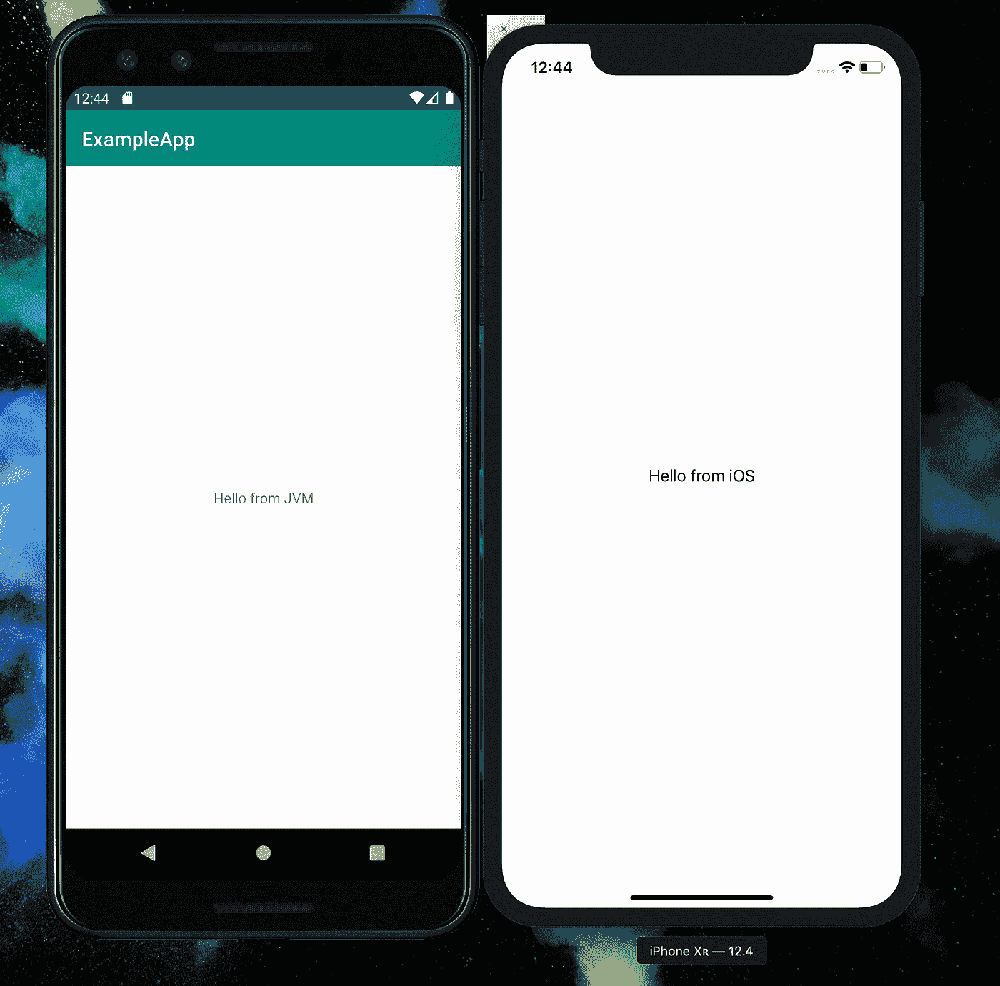

对我来说，移动应用程序开发的优势之一就是尽可能地偏好原生开发。也就是说，如果有一个足够大的团队，两个应用程序可以同时存在于 Android 和 iOS(可能更多)上，做同样的事情，支持同样的操作。

优势有很多，我们甚至不需要开始列举它们。

缺点只有一个:无论团队投入多少时间来解决这个问题，这两个应用程序的行为总是会有点不同。它可以很小，就像不同的标签或略有不同的错误处理策略，但它也可以很大:发送到后端的不同结构的输入检查过于松散或错误实现的逻辑。您可以使用 UML 图、PowerPoint 演示文稿或几乎任何工具来解决这个问题，但最终，会有两个人在同一概念上工作。他们最终总是会写出不同的东西。

你可以接受这一点，并依靠你的 QA 来找出这些差异，或者你可以强迫开发人员互相交流，让他们在两个平台上进行一些结对编程。或者，您可以跟随我在 Kotlin 中编写跨平台库的旅程，以支持 iOS 和 Android 的中型应用程序的开发。

# 目标

我的示例应用程序分为两部分:一部分是逻辑/后端，称为*核心*(谈谈想象力，嗯？)和一个 UI/前端侧。我的目标是将尽可能多的*内核*移植到一个可以在 Android 和 iOS 上使用的共享模块中。我们将把那个模块叫做… <鼓声> *多核*。

在这第一集，我还不会把多核放到实际的应用中。我们将看到它在两个空白应用程序中运行，以隔离更大代码库可能出现的任何问题。

# 创建库

在 Kotlin 中开始开发跨平台库的第一件事是创建一个新的多平台项目。要做到这一点，我们得下载 Android Studio 的老大哥:IntelliJ IDEA。不用担心；即使听起来很贵，也有适合我们需求的免费版本。你可以在这里找到[。](https://www.jetbrains.com/idea/download/)

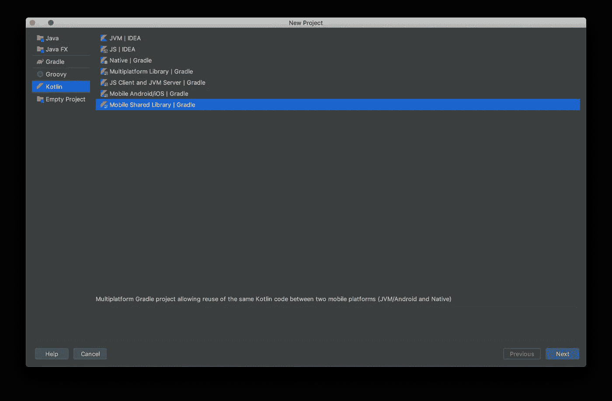

“移动共享图书馆”，又名。“欢迎来到多平台世界。”

IntelliJ 在配置我们的项目方面做得非常好。我们必须输入一个名字并选择一个地点，剩下的事情就交给我们了。

默认配置创建三个模块，并为每个模块创建一个测试模块，总共六个模块:

*   这是真正的魔法发生的地方。这个模块包含了所有用纯 Kotlin 编写的共享逻辑。这里的任何类都可以在任何平台上共享。
*   `iosMain`:链接 Cocoa 框架的模块，允许我们编写只能在 iOS 上运行的 Kotlin 代码。
*   `jvmMain`:编译成 Kotlin/JVM，链接 Android 框架的模块。这只适用于 Android 系统。

我们将使用它们来编写我们的库。

# 配置

很容易相信项目配置已经足够好了。不幸的是，IntelliJ 没有更新到最新最棒的 Kotlin 跨平台开发。这主要是因为 Kotlin 进展如此之快，以至于完全脱离了 IntelliJ 发布周期。

无论如何，更新项目是很容易的。

首先我们要把 Gradle 更新到最新版本；IntelliJ 选择了 4.10 版本，这是第一个支持跨平台项目的版本，但有些东西(我们将在下一集看到)不太好用。

要更新 Gradle，打开`gradle/wrapper/gradle-wrapper.properties`并在`distributionUrl`属性中更改版本。

在撰写本文时，最新版本是 5.5.1，但是您可以在这里查看新版本。

更改该文件后，IntelliJ 将要求您重新加载项目并下载新版本。这可能需要一段时间，具体取决于您的连接。

转到`build.gradle`文件，如果你习惯于 Android 开发，你会发现这与正常情况有点不同。我们在顶部有`plugins`声明，它导入了`kotlin-multiplatform`，我们有通常的`repositories`部分，然后我们有一个新的`kotlin`块。

这个块定义了两件事:

*   我们库的目标，基本上是我们想要支持的目标平台。这些默认设置为`jvm()`(又名。Android)和`iOSX64("ios")`(又名。iPhone 模拟器)。
*   我们库的源集，它定义了我们的模块和它们的依赖关系。默认情况下，`common`和`android`导入 Kotlin 标准库，而`ios`不导入任何东西。

这种配置是错误的，原因有很多:

*   首先，我们只支持 iPhone 模拟器，这对于简单的测试有意义，但不适合真实的应用程序。
*   其次，我们没有利用 Kotlin 提供的预设配置。

按如下方式更改`build.gradle`文件:

不同之处在于`kotlin`模块:我们现在从预设开始配置目标；此外，我们根据 Xcode 在编译期间设置的`SDK_NAME`环境变量来选择 iOS 架构。这样，我们将能够构建一个在我们将要运行的架构上工作的框架，而无需每次都更改构建脚本。

IntelliJ 会警告 Gradle 文件中的许多问题，但它会编译得很好。

既然来了，不妨为 Xcode 准备好一切。让我们将这个 Gradle 任务集成到我们的`build.gradle`文件的底部:

这个任务，如这里的[所描述的](https://kotlinlang.org/docs/tutorials/native/mpp-ios-android.html#tuning-the-gradle-build-script)，构建本地库并将其打包到`.framework`目录中。这还会生成一个`gradlew`可执行文件，Xcode 可以使用它来与 iOS 项目一起构建框架。不过，我们将使用另一个解决方案，因为使用生成的 Gradle 包装器要求我们在从 Xcode 构建所有东西之前至少手动运行一次这个任务。

当您将 Gradle 与更改同步时，您可能会注意到 IntelliJ 发出的绿色消息，警告您一些模块将从项目中删除；这是正确的，因为我们已经将默认的“JVM”目标重命名为更容易理解的“android”要做到这一点，我们还必须更新文件系统中实际文件夹的名称:

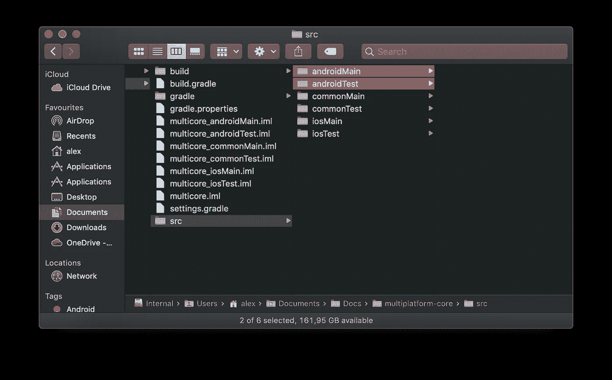

你在“src”文件夹里看到“jvm”的地方，只要把它改成“android”就行了。

# 写一些代码

就是这个！我们准备开始在我们的模块中编写一些代码。但是要测试它是否工作，我们不需要:我们只需要使用 IntelliJ 为我们生成的`Sample`类。

该示例定义了一个打印`Hello from <platform name>`的`hello()`函数，该函数根据运行它的平台而变化。这使用了许多 Kotlin 多平台特定的命令，我们将在下一集看到，但请随意查看。

# Android 项目

我们将把这个库集成到一个新的 Android 应用程序中，因此启动 Android Studio 并打开一个新项目。

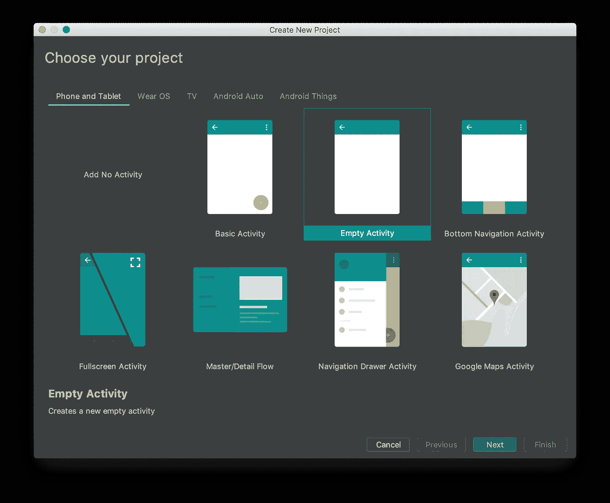

一个空洞的活动正是我们所需要的。

为了在 iOS 和 Android 团队之间轻松共享库，我为跨平台库创建了一个 Git repo，并将其作为子模块导入到现有的 Android repo 中。你可以通过终端或者你最喜欢的 Git 客户端来完成。关于子模块的更多信息可在[这里](https://git-scm.com/book/en/v2/Git-Tools-Submodules)获得；如果你没有喜欢的 Git 客户端，你可以得到 [Fork](https://fork.dev) ，这是一个非常好的免费客户端，也支持子模块。

一旦您导入了您的子模块，您就可以像对待任何其他外部模块一样，将它包含在您的主项目中。

将此添加到您的`settings.gradle`文件中:

您应该更改写在`settingsDir`之后的路径，指向您克隆子模块的文件夹。

你也可以包含这个库，而不需要创建两个单独的 Git repos，但是你将被迫为两个应用程序创建一个单独的库，以使一切都在源代码控制之下。在我看来，这并不理想；根据处理同一个 repo 的人数，可能会在跨平台项目中更改相同的文件，您可能会遇到奇怪的合并冲突。

此外，如果一个团队比另一个团队快，拥有单一回购意味着一旦跨平台项目被更新以支持新功能，两个应用程序必须同时更新。否则，留下的那个可能无法建造。可以想象，这在 CI/CD 环境中并不理想。

Android Studio 会友好地要求您执行 Gradle sync 它会失败。

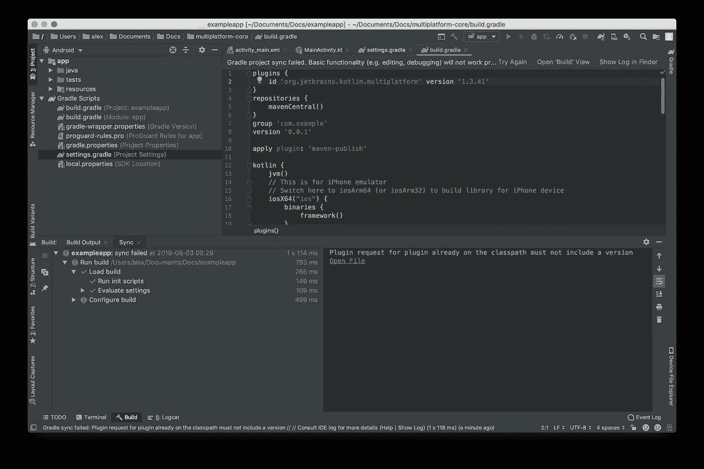

“对已经在类路径上的插件的插件请求不能包含版本”:非常清楚，不是吗？

如果你点击错误日志中的“打开文件”，Android Studio 会在第 2 行打开跨平台项目的`build.gradle`，我们已经在这里导入了`kotlin-multiplatform`插件。你可以看到，有一个版本号写在那里，Gradle 不喜欢这个。

当我们在 IntelliJ 中编辑我们的项目时，我们使用了一个单一的 Gradle 脚本:跨平台项目中的那个。但现在我们正试图将这个项目作为另一个项目的模块导入，所以我们正在将跨平台的 Gradle 脚本嵌入 Android 系统。这意味着我们将继承我们在 Android 项目中包含的所有`classpaths`和`plugins`，Kotlin 也是其中之一，拥有自己的版本。

对我们来说幸运的是，有人已经设法解决了这个问题:在 Gradle 论坛上([这里是](https://discuss.gradle.org/t/error-plugin-already-on-the-classpath-must-not-include-a-version/31814/3))你可以找到一个非常有用的函数，它只在以前没有应用过`kotlin-multiplatform`插件的情况下才应用这个插件。

因此，删除`build.gradle`文件第一部分中的`plugins`块，使它看起来像这样:

其工作原理如下:

*   在我们的 Android 项目中构建库时，Kotlin 插件已经在那里了；您用于 Android 代码的 Kotlin 版本也将用于跨平台项目。
*   当从 Xcode 构建库时，我们的脚本将自动应用我们在上面`ext.kotlin_version`中指定的版本的 Kotlin 插件。

如果您再次同步您的项目，它现在应该可以完美地工作了！

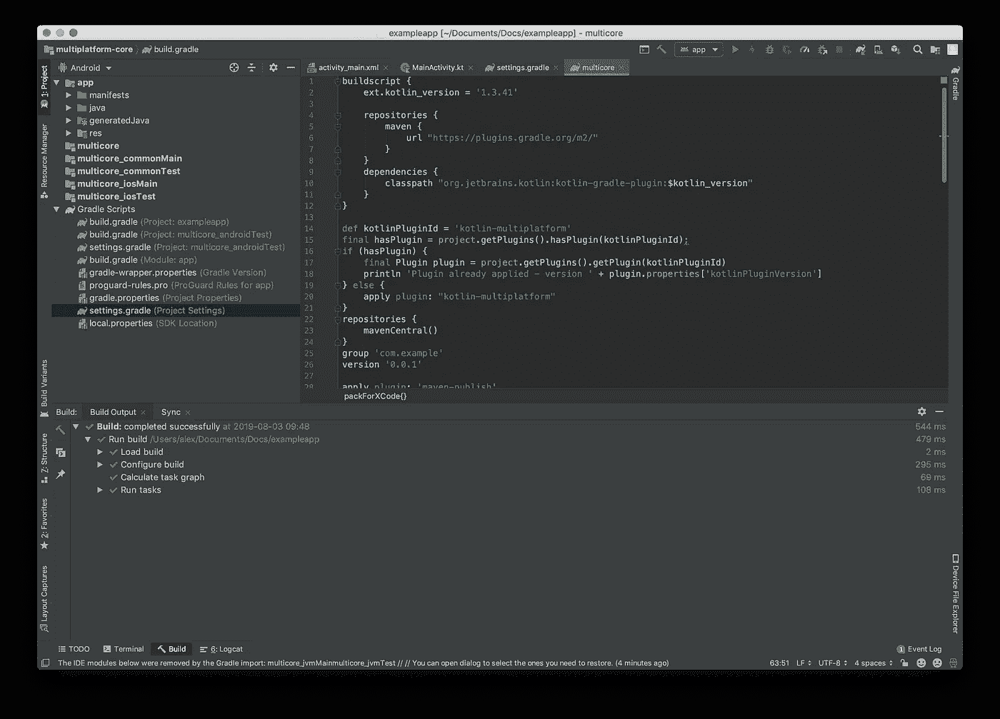

格拉德现在很开心！

我们还有一个步骤:既然跨平台已经包含在我们的主项目中，我们必须告诉 Gradle 我们的应用程序需要它作为一个依赖项。这很简单，只需在安卓应用`build.gradle`和其他`dependencies`中添加这一行:

```
implementation project(path: ':multicore')
```

# 释放力量

现在我们的 Android 项目中有了这个库，让我们开始 MainActivity 并调用 IntelliJ 在跨平台项目中为我们定义的`hello`函数。

我们可以稍微修改一下`activity_main.xml`布局，为“Hello World”标签添加一个 ID，然后调用`MainActivity.kt`中的`onCreate`方法中的`hello`函数，并将返回值设置为 TextView 的内容。

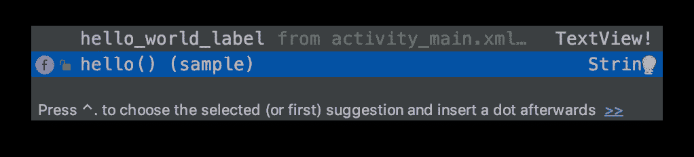

示例包中的 hello()函数！

构建并运行，这就是您得到的结果:


你能感觉到力量，对吗？

# iOS 项目

到目前为止，我们所做的只是在一个 Kotlin 项目中添加一个 Kotlin 库；听起来不复杂吧？

现在是时候更进一步，在 iOS 应用中使用我们的跨平台库了。让我们打开 Xcode，创建一个新的 iOS 应用程序。

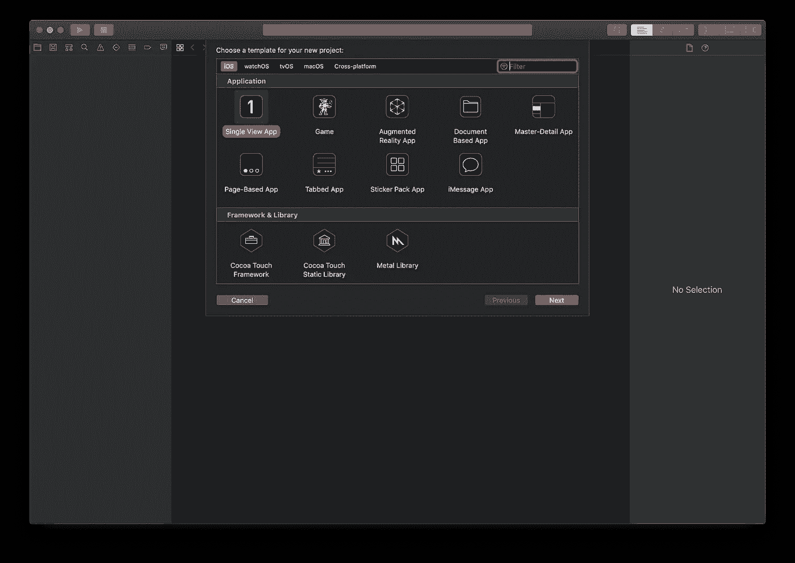

单一视图应用程序正是我们所需要的。

让我们将一个`UILabel`添加到`Main.storyboard`文件中的默认视图控制器，并在我们的视图控制器实现中将它连接到一个`IBOutlet`。

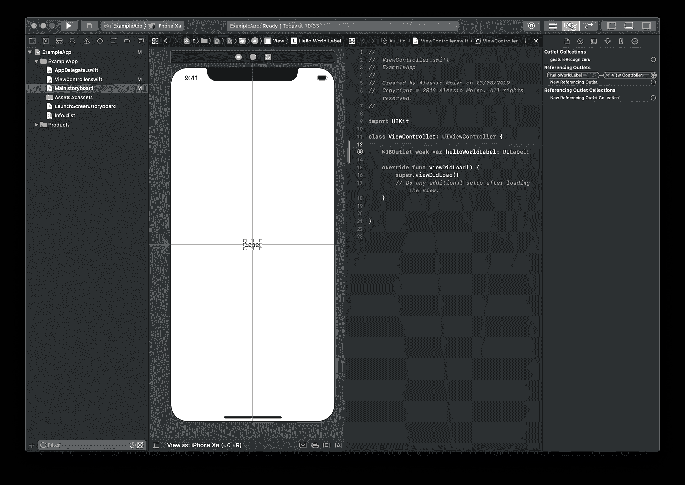

您还应该设置 AutoLayout，使文本字段在屏幕上居中。

既然我们的 UI 已经准备好了，我们应该动手做点什么，在 Xcode 中放一些 Gradle。首先要做的是将子模块克隆到我们的 iOS repo 中。然后我们必须设置 Xcode 来导入 Kotlin 库。

还记得我们之前添加到`build.gradle`中的`packForXcode`任务吗？现在是使用它的时候了。我们必须运行该任务来生成一个可以导入到我们项目中的`.framework`文件夹。但是要运行这个任务，我们需要一个 Gradle 实例…

在 Android 上工作，我们习惯于在我们的根文件夹中总有一个配置好的 Gradle，在`gradlew`可执行文件下。显然，Xcode 没有为我们生成包装器。在他们的[指南](https://kotlinlang.org/docs/tutorials/native/mpp-ios-android.html#tuning-the-gradle-build-script)中，JetBrains 建议从 Android Studio 或 IntelliJ 运行一次任务，然后在 Xcode 中使用生成的`gradlew`。我不喜欢这种解决方案，因为这意味着当第一次克隆 repo 时，每个人都必须在 Android Studio 中打开子模块并运行一次任务，才能成功地用 Xcode 构建。此外，它使持续集成解决方案的配置变得复杂。

我宁愿安装一个 Gradle 实例并从 Xcode 使用它。用[家酿](https://brew.sh)很容易做到这一点:如果你还没有在 Mac 上安装，你应该检查一下。

Gradle 需要 Java 1.8 或更高版本。如果你没有安装，家酿将返回一个错误，并建议你通过木桶打开 JDK；您也可以从 Oracle 网站下载普通安装程序。

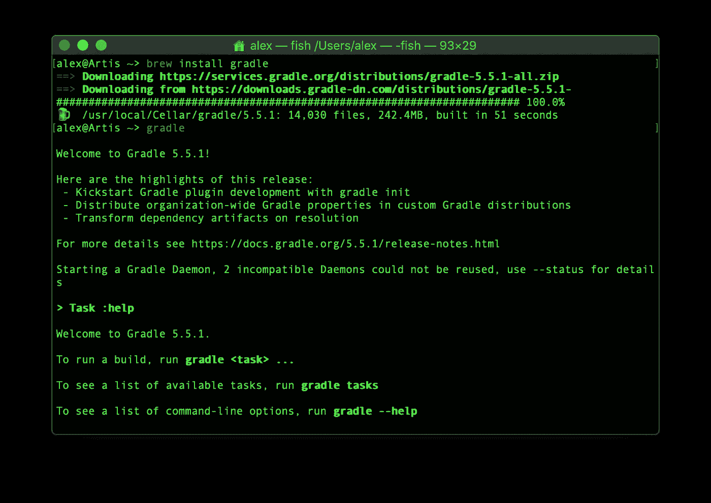

爬起来跑！

不要将 Gradle 的这个实例与您在 Android 上工作时通常使用的实例相混淆。IntelliJ 和 Android Studio 捆绑了他们的 Gradle 版本，默认情况下，即使你安装了另一个版本，也要使用它。另外，当 Gradle 包装文件可用时，两个 ide 都会更喜欢这个版本。您可以(但不应该)在 IDE 设置中更改这种行为。

现在我们有了 Gradle，我们可以配置 Xcode 项目在构建时运行 Gradle 任务。

*   从 Xcode 导航器中选择 iOS 项目，然后点按“构建阶段”
*   单击视图右上角的“+”并选择“新运行脚本阶段”这将在列表底部创建一个“运行脚本”项目。
*   打开新阶段并输入以下脚本，确保将`cd`之后的路径更改为子模块相对于`${SRCROOT}`(iOS 项目的根文件夹)的实际路径:

*   将“运行脚本”阶段重命名为更容易理解的名称(比如“Gradle”)，然后将它移到列表的顶部，就在“目标依赖项”之后
*   构建项目！

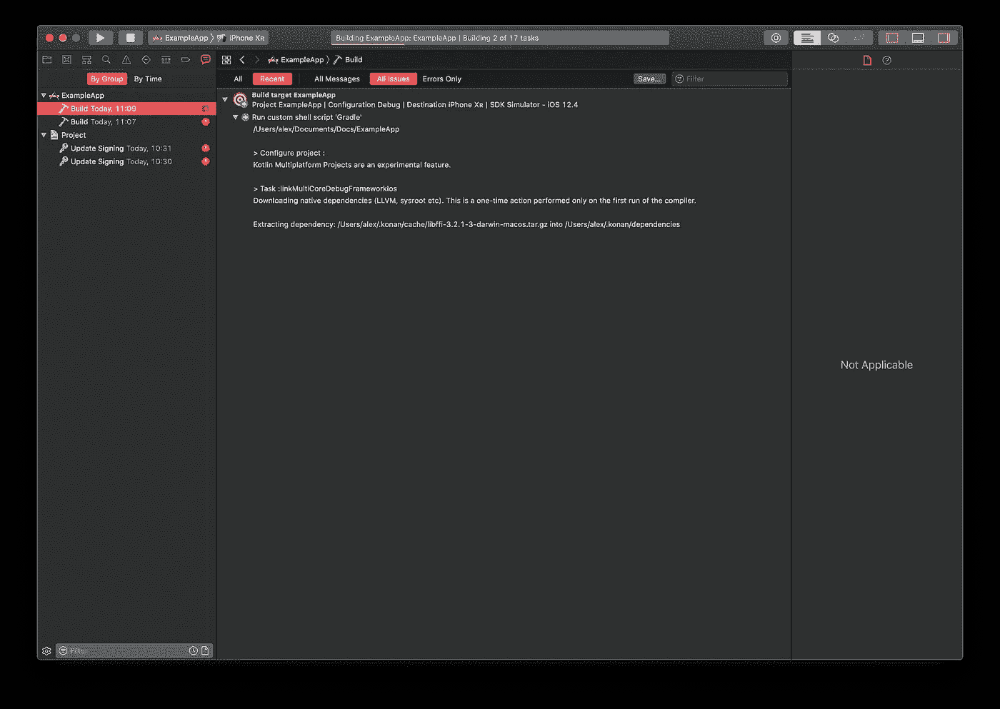

Xcode 正在运行 Gradle！

第一次构建将花费更长的时间，因为 Gradle 必须打开一个环境，下载所有的依赖项，并构建 Kotlin 项目。后续的构建会更快，因为 Gradle 在内存中保持环境就绪。

如果你在`build/bin/ios/MultiCoreDebugFramework/`查看跨平台项目，你会发现我们的`.framework`文件(带有调试符号！)准备导入。

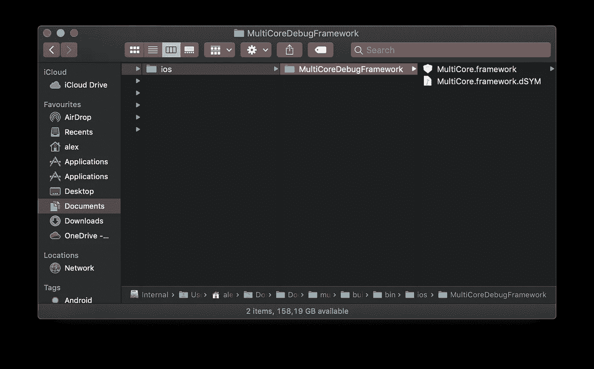

这很容易，不是吗？

现在，就像我们在 Android 项目中告诉 Gradle 将跨平台库作为一个依赖项包括在内一样，我们需要告诉 Xcode 将该框架包括在我们的应用程序中:

*   再次从 Xcode 导航器中选择 iOS 项目。
*   切换到“常规”选项卡。
*   向下滚动到“嵌入式二进制文件”并点击“+”按钮。
*   如果你已经将跨平台项目作为子模块包含，Xcode 会自动找到`.framework`文件，放入列表中；如果没有，可以点击“添加其他”，手动选择。在任何情况下，确保关闭“如果需要，拷贝项目”

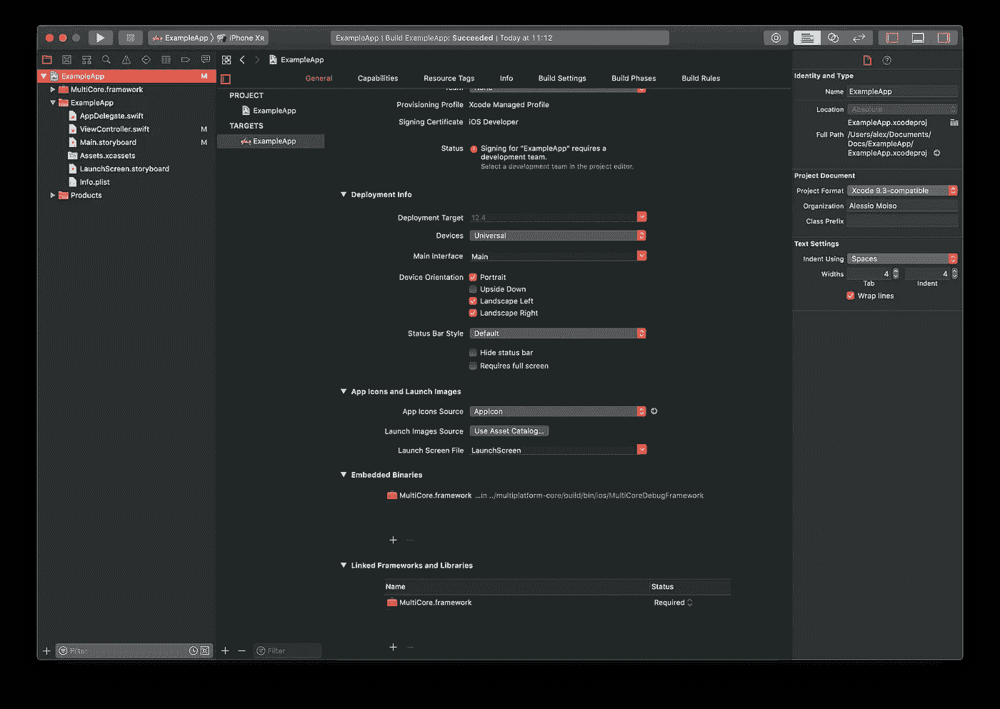

这就是我们的框架！

如果您使用“添加其他”来选择框架，还有一个额外的步骤:Xcode 不会在构建时自动知道在哪里寻找框架，所以即使您正确地添加了框架，您也会得到一个错误。

*   打开 Finder，导航到跨平台项目，然后导航到`build/bin/ios`。
*   选择`MultiCoreDebugFramework`文件夹并记下路径。
*   返回 Xcode，切换到“构建设置”标签，点击顶栏中的“全部”来移除“基本”过滤器。
*   使用搜索栏过滤“框架搜索路径”
*   双击右边的空白区域，然后按弹出窗口中的“+”按钮。
*   输入从`${SRCROOT}`到`MultiCoreDebugFramework`文件夹的相对路径。
*   再次建造；如果输入正确的路径，构建将成功结束。

# 再次释放力量

现在我们终于有了包含在项目中的框架，我们可以像在 Android 上一样使用它了。

打开`ViewController.swift`，从导入`MultiCore`框架开始。

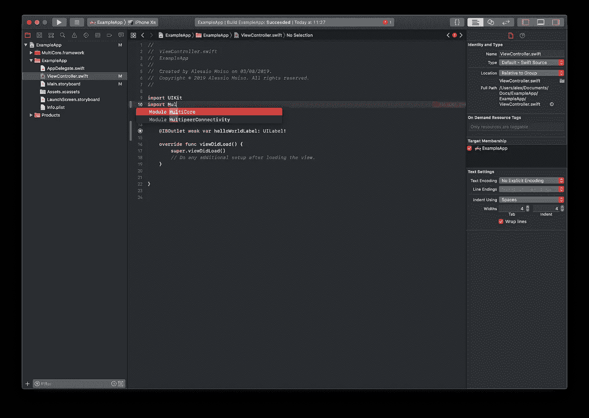

Xcode 知道我们的框架！

如你所见，Kotlin 编译器为我们生成了一个 Swift 可以看到的模块。但是，我们不能直接调用`hello`函数。

不在类中的 Kotlin 函数不会直接转换为 Swift 函数。为了访问`hello`函数，Kotlin 生成了一个`SampleKt`类，它将该函数公开为一个静态方法。

所以我们的`ViewController.swift`文件变成了这样:

构建并运行，您将得到以下结果:

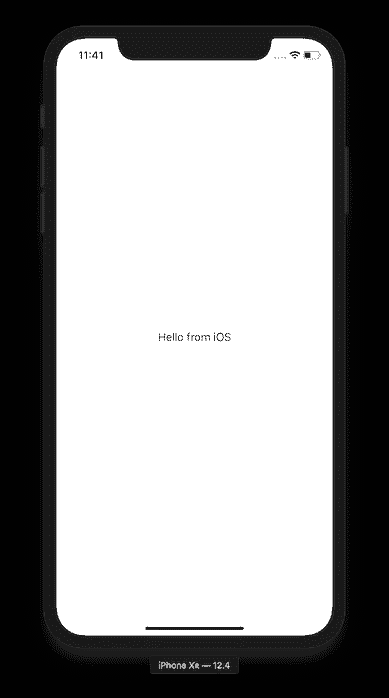

现在我确信你能感受到这种力量！

# 结论

我们已经成功创建了一个 Kotlin 跨平台库，并将其包含在一个新的 iOS 应用程序和一个新的 Android 应用程序中。我们现在可以做和探索的事情有一长串，但这一集已经够长了。

我还在 GitHub 上创建了一个[配套 repo，它包含了对本文中的结构稍加修改的结构，但是在已经配置好的环境中测试 Kotlin 多平台技术是很有用的。](https://github.com/MrAsterisco/KotlinMultiPlatformPlayground)

[第二集](https://link.medium.com/jPdbH9iWlZ)现已上映！