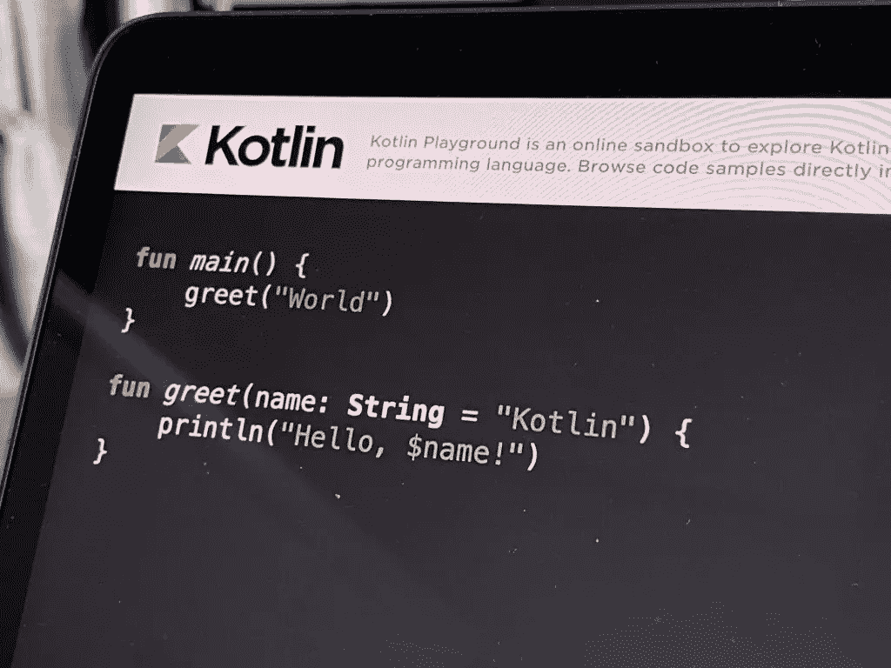
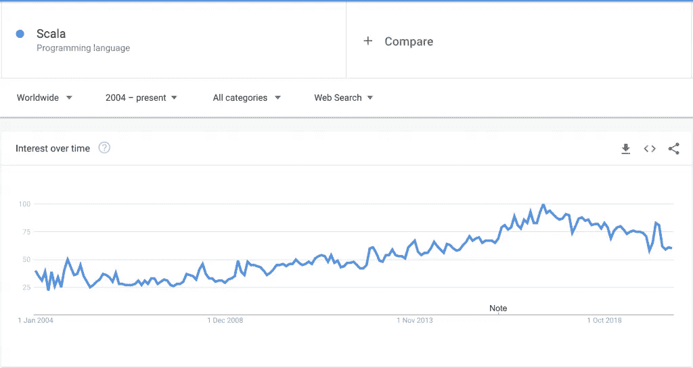
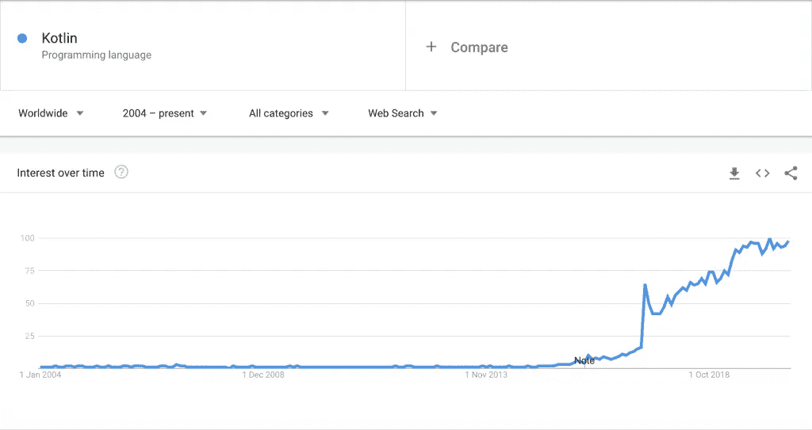

# Java 的新未来

> 原文：<https://betterprogramming.pub/a-new-future-for-java-b10a6789f962>

## JVM、Kotlin 和 Java 在 2020 年后的发展方向


Javier Allegue Barros 在 [Unsplash](https://unsplash.com?utm_source=medium&utm_medium=referral) 上拍摄的照片

我们行业的大部分人一直对 Java 有相当多的批评。这种批评主要集中在 Java 的冗长和它在许多不必要的情况下生成的样板代码的数量上。虽然我一直喜欢 Java，但我不能说这些指控是错误的。的确，Java 的冗长和杂乱在很多情况下会变得非常烦人。然而，很多时候，我们不得不接受我们并不是生活在一个完美的世界里，而且在大多数情况下，我们不得不接受两害相权取其轻。所以，是的，Java 并不完美，我们都知道这一点，但主要的问题是为什么以前没有做任何事情来解决这些问题。

在我个人看来，改变花了这么长时间的唯一原因是 Java 没有足够的竞争，事情就像它们原来那样。Java 语言主宰了市场，这可能是因为缺乏强有力的竞争者，以及 Sun 和 Oracle 先后做出的巨大努力。

Java 提供的强大的类型安全性和它作为一种结构良好的语言的一些特性使它成为大型项目中非常受欢迎的语言。使用 Java，事情变得真正失控通常更困难。此外，Java 的一个主要特点——它是一种在自己的虚拟机上运行的多平台语言——使它成为许多组织的完美搭档。如果您通过其著名的 JIT 编译器添加其执行自动性能优化的固有功能，这在许多情况下可以最小化糟糕代码的影响，那么您就有了使用 Java 的充分理由。

但是后来发生了什么？所发生的是，能够在与 Java 相同的 JVM 中运行的新语言被引入市场，这些语言消除了 Java 中的一些最大的烦恼，并且在某些情况下为学习曲线相当平坦的开发人员提供了更好的环境。

在我们继续之前，让我们简要回顾一下 JVM 语言的历史。

# JVM 语言的历史

在我们开始之前，我想澄清一件事，我跳过了一些现有的 JVM 语言，主要是因为它们从未获得足够的吸引力，不能被认为是在我们的行业中广泛使用的候选语言。说到这里，让我们开始快速浏览 JVM 语言的历史。


马克西米利安·魏斯贝克尔在 [Unsplash](https://unsplash.com/s/photos/java?utm_source=unsplash&utm_medium=referral&utm_content=creditCopyText) 上的照片

我们必须从 [Java](https://en.wikipedia.org/wiki/Java_(programming_language)) 说起，当然，它是 JVM 世界中最古老和最流行的语言。

Java 于 1996 年 1 月正式发布，因此它已经存在了 24 年；不错吧，嗯？最初，Java 是一种纯粹的命令式语言，遵循纯粹面向对象的编程风格；它也是一种强类型语言。Java 的语法在某些方面类似于 C++和 C[语言，但它被认为是一个改进的版本，因为用 Java 编写代码比 C 或 c++容易得多。另一方面，我们认为批评者最大的争论是它的冗长。](https://en.wikipedia.org/wiki/C_(programming_language))

第二个发布的 JVM 语言是 Groovy。它在 2003 年就出现了，尽管直到 2007 年 1 月它的第一个官方和标准化版本才出现。Groovy 的优势还在于它可以被用作脚本语言。Groovy 是一种动态类型语言，所以类型检查发生在运行时；这也是一些开发者不喜欢 Groovy 的原因之一。你用 Groovy 写代码，它在编译时看起来是正确的，但是在运行时，你意识到有问题。


来源:维基百科

接下来出现了一种流行了几年的语言。我们说的是 [Scala](https://www.scala-lang.org/) 。Scala 于 2004 年正式发布，它为 JVM 世界带来了一种新的编程模型，包括函数式编程及其声明式方法。我们可以肯定 Scala 是第一个引入我们之前讨论过的不变性概念的，所以它为 Java 转换做了很好的事情。另一方面，Scala 的批评者不喜欢它，因为它语法复杂，可读性差。


来源:维基百科


来源:维基百科

下一种出现在 JVM 世界中的语言是 [Clojure](https://clojure.org/) ，一种纯粹的函数式语言。最近它变得相当流行，但是它**第一次出现是在 2007 年。Clojure 是一种基于 [LISP](https://en.wikipedia.org/wiki/Lisp_(programming_language)) 的语言，其特点是简单和使用纯函数。在它的缺点中，我们可以提到它是动态类型的(与 Groovy 相同),学习曲线更陡峭，因为它的语法与其他 JVM 语言完全不同。**

如果你对学习 Clojure 感兴趣，有几本好书值得一读:《Clojure 的乐趣》和《Clojure 编程:第三版》

最后但同样重要的是，我们有[科特林](https://kotlinlang.org/)。Kotlin 于 2016 年 2 月首次发布，从那以后，它的人气就没有停止过增长。它是由 JetBrains 公司设计的，有一个明确的目标:消除所有最流行的 Java 问题。按照它的设计方式，它保留了 Java 的所有优点，同时消除了它的大部分问题。这就是它变得如此流行的原因，许多人认为它可能在未来几年内打败 Java。

如果您想了解更多关于 Kotlin 的知识(我鼓励您这样做，因为它是一种很棒的语言)，我建议您阅读书籍" [Kotlin in Action](https://www.manning.com/books/kotlin-in-action) ",这是一本面向从 Kotlin 开始的 Java 开发人员的极好的书籍。



照片由[路易·蔡](https://unsplash.com/@louis993546?utm_source=unsplash&utm_medium=referral&utm_content=creditCopyText)在 [Unsplash](https://unsplash.com/s/photos/kotlin?utm_source=unsplash&utm_medium=referral&utm_content=creditCopyText) 上拍摄

这些是最重要的 JVM 语言。我们跳过了一些不太流行的，但是我们可以提到其中的一些:Jython、JRuby、Ceylon、Fantom 等等。你可以在维基百科上查看现有 JVM 语言的完整列表。

我们注意到的一件事是，在最初的八年或十年里，Java 没有多少竞争对手，但从那以后，它开始有了一些竞争。那么有竞争是好是坏呢？

# 竞争加剧的好处

正如我们前面提到的，Java 在早期没有太大的变化，可能是因为不需要它。尽管这种语言远非完美，但它被广泛使用并非常流行。

但是后来新的竞争者出现了，更多的现代语言带来了新的特性，解决了 Java 开发人员长期以来的一些痛点。

例如，让我们看看 Scala 语言。自 2009 年以来，Scala 越来越受欢迎。开发人员欢迎这种新的函数式风格，这种风格允许他们有更大的灵活性，并且能够安全轻松地编写并行代码。我们可以在下面的谷歌趋势图中看到这一趋势:



资料来源:theboreddev.com

甲骨文对这一新趋势的反应是什么？Java Lambdas 和 Streams 是 2014 年发布的。我想我们都同意，那是 Java 迈出打败 Scala 的最大一步的时候。目前在业界工作的每个人都可以感受到 Scala 近年来一直在遭受的蒸汽损失。

JVM 世界中有更多竞争者的另一个好处是 JIT 编译器和 JVM 本身正在经历的持续改进。现在有更多的人对优化的 JVM 和改进的性能优化感兴趣。所以竞争对每个人来说都是一件好事！

最后一个出现在舞台上的竞争对手是 Kotlin，Kotlin 非常重要，因为在某些方面，它为 Oracle 指明了前进的道路。Kotlin 已经表明，保留 Java 的优点，但创造一种更简洁、编码更快的语言是可能的。

如果我们看看谷歌趋势，看看 Kotlin 在过去几年里有多受欢迎，这是我们得到的:



资料来源:theboreddev.com

看起来科特林很快就变得很受欢迎。然而，在过去几年里，它似乎已经稳定下来。

甲骨文已经注意到业界对科特林的反应。如果你看一下 [JDK 15 发布说明](https://jdk.java.net/15/release-notes)，你会发现 Java 的一些新特性基本上是 Kotlin 所改变的复制。例子包括[新的 Java 记录](https://openjdk.java.net/jeps/359)，新的文本块(带三重引号的多行字符串)，以及新的`switch`语句，它或多或少是 Kotlin `when`语句的副本。

我们讨论的所有这些我称之为“Java 的 Kotlinisation”通过成为更强有力的竞争者，Kotlin 向 Java 展示了前进的道路。从我的角度来看，Kotlin 是我见过的唯一一种可以在我们的行业中超越 Java 的语言。

# Java 的“kotline 化”

一些即将到来的 Java 特性在可读性和改进 Java 的主要弱点之一——冗长性方面将是 Java 的一个巨大改进。我们可以肯定他们都与科特林的某些特征有可疑的相似之处。

请记住，这些功能大部分是*功能预览*。这意味着，如果你在 JDK 14 或 JDK 15 发布时安装了它们，你将无法默认使用它们。

Java 特性预览是一个版本中引入的新特性，但默认情况下是禁用的。它们被包含在发布中只是为了收集来自开发者社区的反馈，所以它们仍然会有变化。这就是为什么不建议在生产代码中使用它们。

要在编译时启用它们，您必须执行以下操作:

```
javac --enable-preview --release 14
```

如果您想在运行时启用它们，您必须运行以下命令:

```
java --enable-preview YourClass
```

当然，您也可以在 IDE 中启用它们，但是注意不要在所有新项目中默认启用预览！

让我们来看看那些将对我们未来版本的 Java 编码产生更大影响的变化。

## Java 记录

Java 记录是我们许多人长期以来一直要求的一个特性。我猜您已经多次遇到过这种情况，当您不情愿地必须实现`[toString](https://docs.oracle.com/javase/8/docs/api/java/lang/Object.html#toString--)`、`[hashCode](https://docs.oracle.com/javase/8/docs/api/java/lang/Object.html#hashCode--)`、`[equals](https://docs.oracle.com/javase/8/docs/api/java/lang/Object.html#equals-java.lang.Object-)`，并且为每个现有的字段获取器时。(我假设您不再使用 setters，并且您也绝对不应该使用它。)

Kotlin 提供了[数据类](https://kotlinlang.org/docs/reference/data-classes.html)来解决这个问题，Java 也打算通过发布[记录类](https://openjdk.java.net/jeps/359)来做同样的事情，Scala 的 [case 类](https://docs.scala-lang.org/tour/case-classes.html)也有这样的东西。

这些类的主要目的是在对象中保存不可变的数据。让我们通过一个例子来看看在 Java 中会好到什么程度。这是我们需要编写多少代码才能实例化和比较我们的`Employee`类:

以及它包含的`Address`对象:

这么简单的东西代码太多了，不是吗？

现在让我们看看新的 Java 记录会是什么样子:

还有我们的`Address`班又来了:

这和我们之前用这么多代码写的完全一样。你将不得不同意我的观点:这是惊人的，我们将要节省的代码量和它的简单程度！

现在让我们看看新的 switch 语句有什么不同。

## 改进的 switch 语句

Java 中新的 switch 语句解决了在 Java 中使用 switch 语句的一些固有问题。此时应该避免使用 Switch 语句，因为它们很容易出错并导致代码重复。例如，目前很容易让一个案子不了了之。
有了新的 switch 语句，这个问题就解决了，因为如果我们的 switch 语句没有覆盖属于我们传递给 switch 的类型的整个域范围，它就无法编译。

为了举例说明这一点，我们将在 Java 中创建一个`DayOfTheWeek` enum:

有了这个，我们的开关就会告诉我们一周中的哪个位置对应于那一天。让我们先来看看目前我们如何使用 Java 11 来做到这一点。

使用当前的 switch 语句，我们将不得不使用一个变量，而且，如果我们错过了一周中的某一天，我们的代码将完美地编译。这是 switch 语句的问题之一:它非常容易出错。

那么 Java 14 如何改善这种情况呢？让我们快速了解一下:

您将很快看到，新的 switch 语句可以用作表达式，而不仅仅是语句。

结果更简洁，更有表现力。这足以说服我们中的许多人使用它们，但主要的改进之一是，如果我们没有覆盖 switch 中的所有情况，现在 switch 语句将无法编译。它会向我们显示以下错误，例如:

```
Error:(9, 24) java: the switch expression does not cover all possible input values
```

从现在开始，在我们的 switch 语句中不可能漏掉一个案例。太棒了，不是吗？

这非常类似于科特林`when`声明，你可以在[文档](https://kotlinlang.org/docs/reference/control-flow.html)中读到。

让我们也来看看新的文本块。

## 文本块

你有没有抱怨过在 Java 中将一大块 JSON 赋值给一个变量是多么的丑陋和困难？Java 将引入多行字符串，您可以通过用三重引号将它们括起来来定义它们。当这个特性正式发布时，在多行中定义长字符串将变得更加容易。

让我们来看看这两种模式的区别。目前，如果我们想在一个变量中存储一个格式化的 JSON，它看起来就像这样:

另一方面，当新的文本块发布时，它会像下面这样简单明了:

我认为那样好多了，你同意吗？这也是 Kotlin 支持的，你可以在它的[类型定义](https://kotlinlang.org/docs/reference/basic-types.html)中找到。

我们已经看到，Java 从它的竞争对手 Kotlin 那里“继承”了许多解决自己问题的方法。我们不知道这一次甲骨文是否及时做出了正确的反应来对抗科特林的崛起，或者它是否来得太晚了。就个人而言，我认为 Java 正在向前迈出正确的步伐，即使这些变化是由其竞争对手以某种方式引发的，并且可能来得有点晚。

如前所述，如果这篇文章激发了您学习 Kotlin 语言的兴趣，我建议您阅读“ [Kotlin in Action](https://www.manning.com/books/kotlin-in-action) ”，这是一本非常好的面向 Kotlin 初学者的 Java 开发人员的书。

# 结论

我认为竞争是 Java 语言有史以来最好的事情。我的印象是，否则的话，Java 将会固步自封。此外，Java 的竞争对手已经展示了一种不同的编程方式是可能的，展示了前进的道路，并避免停留在一种过时和生疏的编写代码的方式。

我最近在 Java 中看到的变化，以及所有即将到来的特性和改进，正在使 Java 变得比以往任何时候都更强大，一种适应当前时代的语言，一种希望发展并忘记传统做事方式的语言:Java 的新未来！

我真的希望你喜欢这次阅读，我希望我能很快再次见到你。

非常感谢您的阅读！