# 数据分析入门指南(第 1 部分)

> 原文：<https://betterprogramming.pub/a-newbies-guide-to-analyzing-data-part-one-33e88a41884e>

## 对数据分析感兴趣但不知道从哪里开始？从这里开始！


卢克·切瑟在 [Unsplash](/s/photos/data?utm_source=unsplash&utm_medium=referral&utm_content=creditCopyText) 上的照片

作为一名数据科学专业的学生，我对数据分析这个话题很感兴趣，所以我搜索了互联网，试图获得一些分析数据的第一手经验。

我的努力毫无效果。在线课程涵盖复杂的数据相关主题，如机器学习、深度学习、神经网络或人工智能。高中是个死胡同——老师只教流行的计算机科学语言，比如 Java 或 Python。

本指南是为那些发现自己处于这种不幸境地的人准备的，也是为那些想学习分析数据的基本 Python 技能的人准备的。

在本文(第一部分)中，我们将探索 pandas——一个用于数据科学的 Python 软件库。我们还将在另一篇[文章](https://medium.com/@charlesshi12/a-beginners-guide-to-analyzing-data-part-two-5bb5d7e2f728)(第二部分)中探索 matplotlib——一个流行的 Python 数据可视化库。我们将从 pandas 和 Matplotlib 中学习重要的方法和函数，帮助我们清理、操作和可视化数据集。希望这些经历能让你体会到数据分析的感觉。

## 先决条件

本指南面向对 Python、统计学和数学有基本了解和经验的人。

# 内容

*   [安装巨蟒导航器和熊猫](#064d)
*   [熟悉 JupyterLab](#4e34)
*   [探索熊猫的数据结构](http://Exploring Data Structures in Pandas)
*   [下载并读取我们的数据集](http://Downloading and Reading our Dataset)
*   [查看和观察我们的数据](#3d59)
*   [操作我们的数据框架](#ca1d)

# 安装 Anaconda-Navigator 和熊猫

首先安装 Anaconda-Navigator 链接的[，这里是](https://www.anaconda.com/products/individual)。我将下载用于 macOS 的 64 位图形安装程序，您应该根据您的偏好和电脑下载正确的安装程序。Anaconda-Navigator 允许您使用许多顶级的计算应用程序——JupyterLab、Jupyter Notebook、Spyder、Gluevis 等等。对于我们的项目，我们将在 JupyterLab 中完成所有的问题解决和编程。

完成安装后，打开 Anaconda-Navigator。导航器的主屏幕应该如下所示:

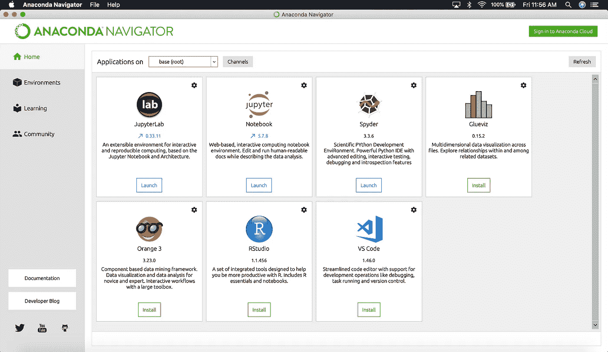

anaconda-MAC OS 导航器的主屏幕

接下来，我们将安装熊猫。安装 pandas 有多种方式——通过 Anaconda、Miniconda 等。前提条件是您的计算机上已经安装了 Python。我将使用终端和 pip 来安装熊猫。如果你还没有安装 pip 或者在安装 pip 时遇到问题，请查看这篇文章以获得帮助。

首先打开终端，键入以下命令:

```
pip install pandas
```

这将开始在您的计算机上安装 pandas Python 包。安装软件包应该需要几分钟时间。当你完成后，祝贺你自己——你离学习熊猫的基本知识又近了一步。


照片由 [david swindell](https://unsplash.com/@sailing69?utm_source=unsplash&utm_medium=referral&utm_content=creditCopyText) 在 [Unsplash](/s/photos/pandas?utm_source=unsplash&utm_medium=referral&utm_content=creditCopyText) 上拍摄

# 熟悉 JuyterLab

我们指南的下一部分是在 JupyterLab 中完成的。我们可以从 Anaconda-Navigator 的主屏幕启动 JupyterLab 开始。

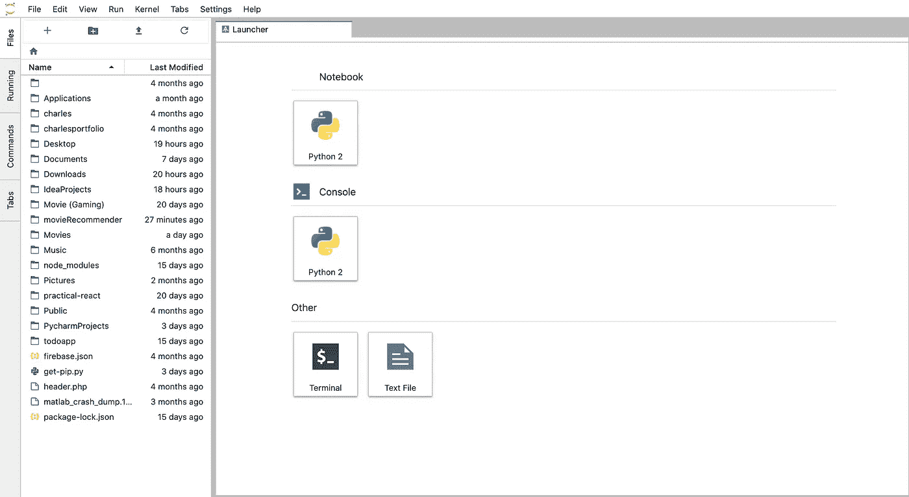

您应该会看到这样的页面。

通过单击左上角的第二个图标(由文件夹和加号组合而成)创建一个新的空文件夹。导航到新文件夹的内容—它应该是空的，名称为“无标题文件夹”。点击“笔记本”下的 Python 2 按钮，新建一个`Untitled.ipynb`。我计划在本指南中使用 Python 2，所以如果你使用 Python 3，要警惕使用 Python 2 和 Python 3 语法可能产生的错误。

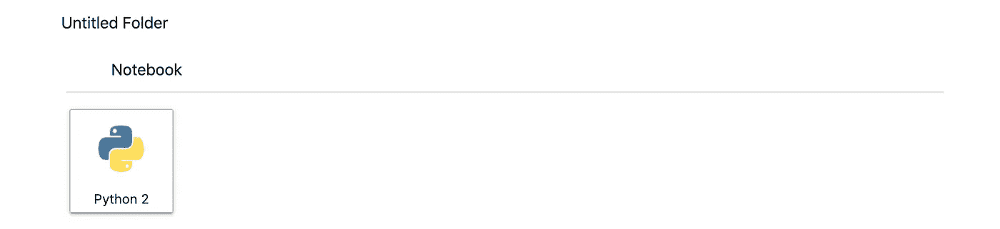

单击“Python 2”按钮创建一个新的 Untitled.ipynb。

重命名您的无标题文件夹和您的`Untitled.ipynb`文件，使您的工作空间更有条理。我将把我的文件夹命名为“学习数据”，把我的`.ipynb`文件命名为“数据分析”

在您的新文件夹中，您应该有一个还没有写代码的`.ipynb`文件。花点时间用 JupyterLab 做实验，习惯环境。当你完成的时候，我们能移动到下一个部分。

# 探索熊猫的数据结构

在我们开始数据分析之前，我应该先简要解释一下 pandas 中的数据结构。存储数据有两种常见的方式:

## 系列(一维)

`[Series](https://pandas.pydata.org/pandas-docs/stable/reference/api/pandas.Series.html)`是一维数组，能够存储任何类型的数据。`Series`的一个例子是:

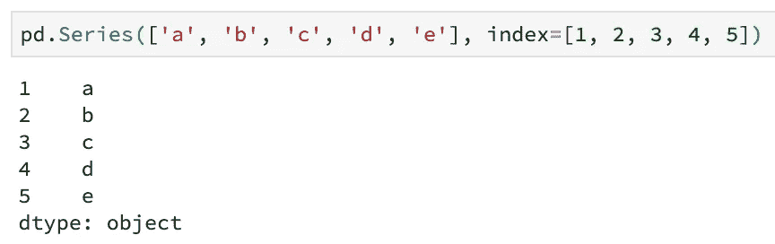

正如我们所看到的，我们能够操作我们的`Series`数据结构的索引。有一些方法和途径可以让你操作`Series`数据结构，比如加、减、乘、除。不幸的是，这是我们能用级数得到的最复杂的东西了。

## 数据帧(二维)

`[DataFrames](https://pandas.pydata.org/pandas-docs/stable/reference/api/pandas.DataFrame.html)`是二维数组，能够存储任何类型的数据。一个简单的`DataFrame`的例子是:

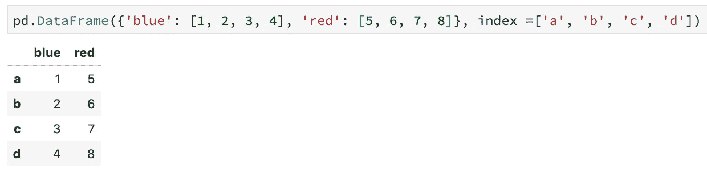

正如我们所看到的，我们可以操作我们的`DataFrame`数据结构的索引和列，这是`Series`和`DataFrame`之间的唯一区别。虽然还有其他存储数据的方式(比如存储数据的三维方式[面板](https://pandas.pydata.org/pandas-docs/version/0.23.4/generated/pandas.Panel.html))，但在本文中我们将只关注`Series`和`DataFrames`，因为这是 pandas 中主要使用的两种数据结构。

我在这里链接了一篇文章[给那些感兴趣并想更深入学习熊猫数据结构的人。然而，因为这篇文章是初学者指南，所以这就是我要介绍的关于 pandas 中的数据结构的全部内容。](https://pandas.pydata.org/pandas-docs/stable/getting_started/dsintro.html)

# 下载和阅读我们的数据集

在这次演示中，我将使用“ [SAT(大学委员会)2010 年学校成绩](https://catalog.data.gov/dataset/sat-college-board-2010-school-level-results-5c6d6)”CSV(逗号分隔值)数据集，该数据集来自[data.gov](https://www.data.gov/)——美国政府的开源数据集。该数据集包括纽约市 2010 届所有毕业班学生的 SAT 成绩。数据集的数据(学校名称、毕业班等。)是通过大学委员会在 sat 考试期间询问的问卷收集的。

首先，我将重命名我的。csv 文件到“sat.csv”来方便我们。以下是您导入的数据集在 JupyterLab 中的外观:

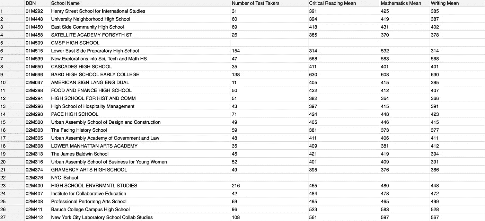

将“sat.csv”文件导入 JupyterLab 后，它的前 27 行应该是这样的。

要开始在 JupyterLab 中编码，我们必须首先导入 pandas 和`Matplotlib`来使用 Python 库中的函数和方法。下面几行代码将完成我们想要的任务:

```
import pandas as pd
```

我们可以使用 pandas 中的`[read_csv() function](https://pandas.pydata.org/pandas-docs/stable/reference/api/pandas.read_csv.html)`来读取我们的 CSV 文件。它的作用是读取你的。csv 文件，并把所有数据放入一个`DataFrame`。确保您的数据集与您的`.ipynb`文件在同一个目录中，以便 pandas 成功读取您的。csv 文件。

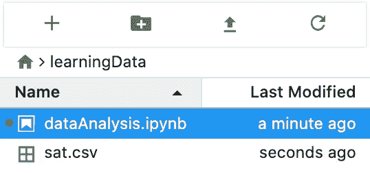

你的。csv 文件应该与您的位于同一文件夹中。ipynb 文件。

以下代码将读取您的 CSV 数据集:

```
data = pd.read_csv('sat.csv')
```

如果您导入的数据还没有像我这样组织，那么您可以使用下面这行代码来读取您的数据集:

```
data = pd.read_csv('your data', sept = 'whatever your data is separated by', names = ['the name of each of your separated columns])
```

# 查看和观察我们的数据

要查看我们的程序是否成功运行，我们只需输入下面一行代码，显示`data`中的所有内容:

```
data
```

您的输出应该类似于下面的两幅图像。

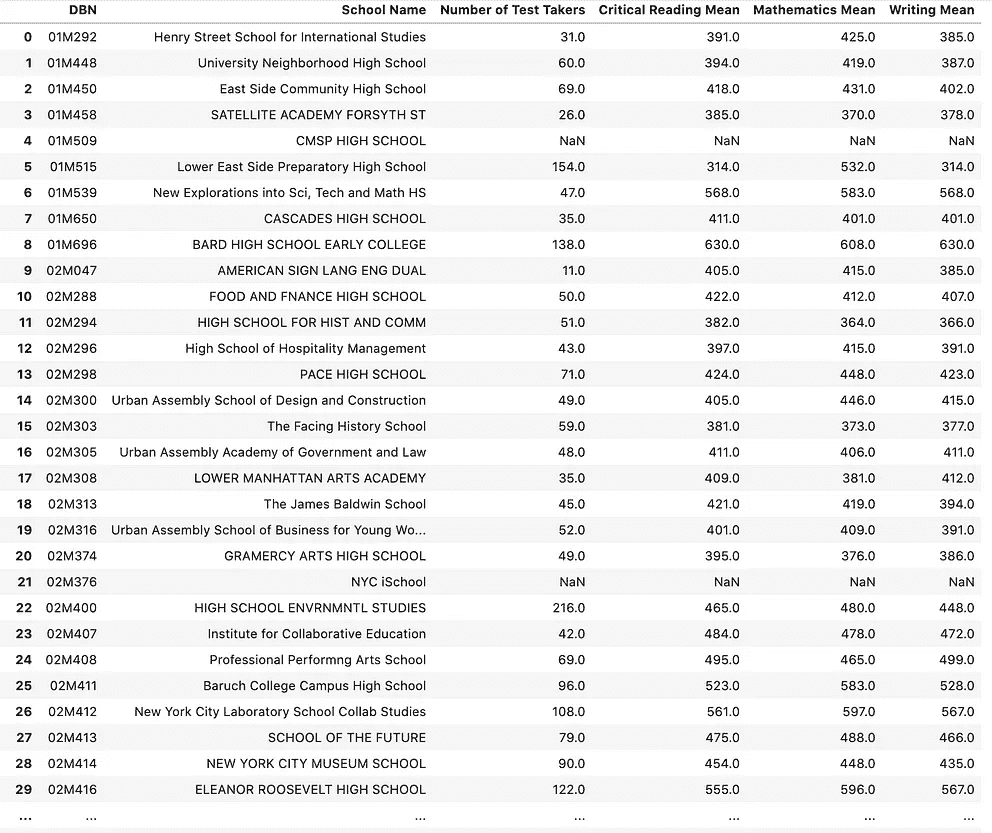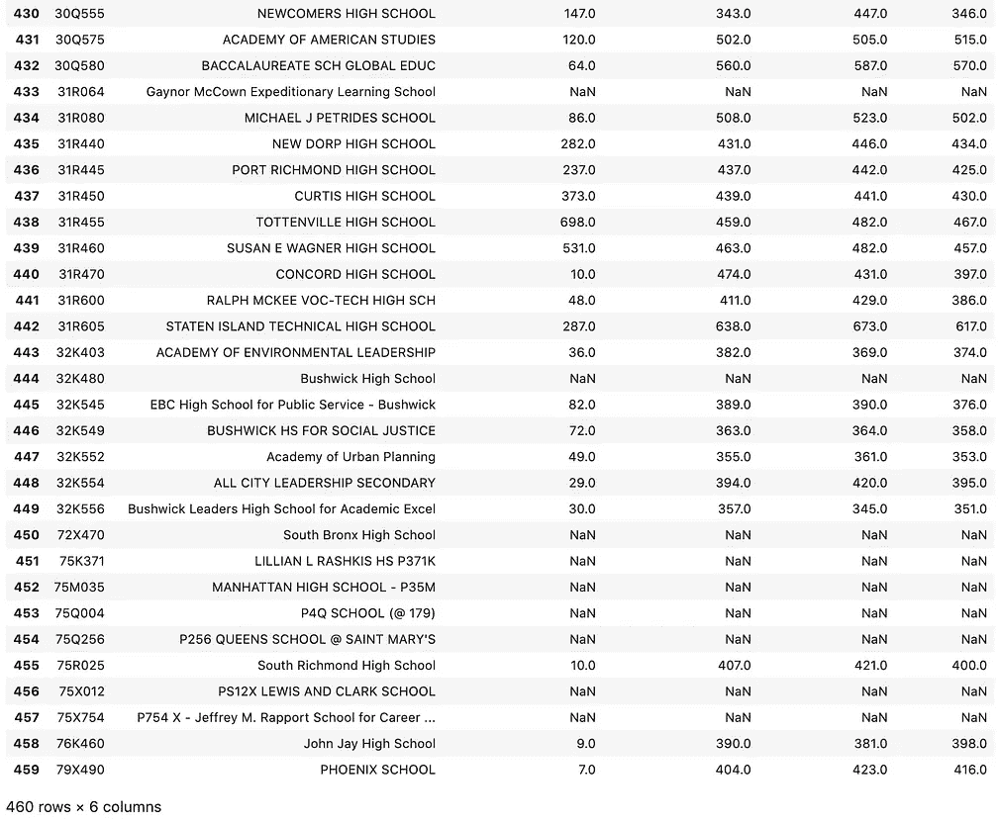

我们的“数据”的前半部分在左图上，后半部分在右图上。请注意，有些行被折叠是因为我们的`data`有太多的行。

查看我们的数据帧的另一种方法是使用`[head()](https://pandas.pydata.org/pandas-docs/stable/reference/api/pandas.DataFrame.head.html)` [功能](https://pandas.pydata.org/pandas-docs/stable/reference/api/pandas.DataFrame.head.html)，它给你一个`DataFrames`的预览。这个函数经常用于调试和确保程序的某些部分按照你想要的方式运行。比起键入您的`DataFrame`的变量名，我更喜欢这种方法，但是这完全取决于您。

```
data.head(10)
```

上面的行将向我们展示`data`数据帧的前十行。记住，`data.head(n)`会显示我们`data` `DataFrame`的前 n 行，`data.head()`会显示我们`data` `DataFrame`的前 5 行。

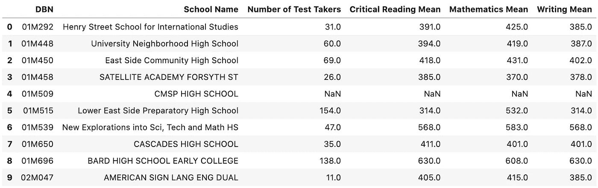

数据帧的前十行。

干得好！我们可以看到，我们从 data.gov 获得的数据集有六列:`DBN`、`School Name`、`Number of Test Takers`、`Critical Reading Mean`、`Mathematics Mean`和`Writing Mean`。

如果我们假设 n、x 和 y 都是正整数，那么您也可以使用`data[:n]`来查看`data` `DataFrame`的前 n 行，或者使用`data[x:y]`来查看从 x 到 y 的行，但不包括 y。

`data[:-1]`会给你`data`T22 的所有行，除了`DataFrame`的最后一行。

最后，`data[data['Number of Test Takers'] >= 100].head()`将给出`data` `DataFrame`中所有在`Number of Test Takers`列中有 100 名或更多考生的行。一般来说，`data[your condition].head()`会返回只满足你的条件的行。

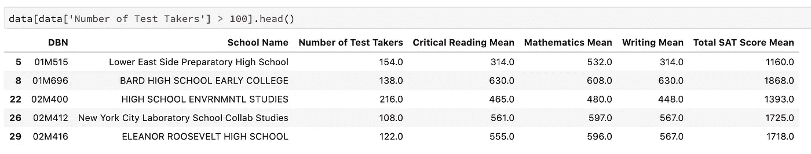

要查看我们数据的描述性统计，我们可以使用 pandas 中的`[describe()](https://pandas.pydata.org/pandas-docs/stable/reference/api/pandas.DataFrame.describe.html)` [函数](https://pandas.pydata.org/pandas-docs/stable/reference/api/pandas.DataFrame.describe.html)。下面的代码生成一些基本的统计计算，帮助我们可视化我们的数据:

```
data.describe()
```

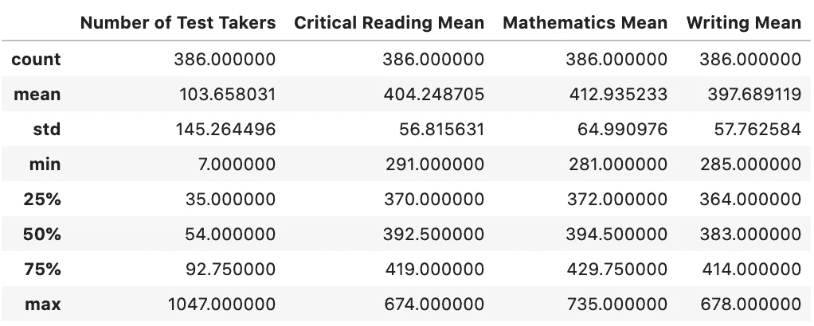

我们的“数据”数据框架的统计描述。

在查看这些数据后，我们可以立即进行一些观察。例如，特定学校的最高考生人数为 1047 人。特定学校的最高批判性阅读平均分、数学平均分和写作平均分分别为 674、735 和 678(记住，SAT 的这些科目分数不必局限于一所学校)。查看测试分数的标准偏差，似乎我们的数学平均值是最分散的，而写作平均值是最不分散的。

此外，您可以使用`[median() function](https://pandas.pydata.org/pandas-docs/stable/reference/api/pandas.DataFrame.median.html)`找到每一列数据的中间值。例如:

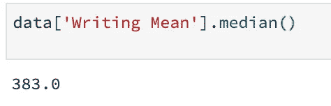

计算机能做所有繁琐的计算，所以你不必亲自去做，这真是不可思议。

我们还可以使用`[info() function](https://pandas.pydata.org/pandas-docs/stable/reference/api/pandas.DataFrame.info.html)`来查看关于我们`DataFrame`的重要信息。

```
data.info()
```

使用上面的函数，我们的输出如下:

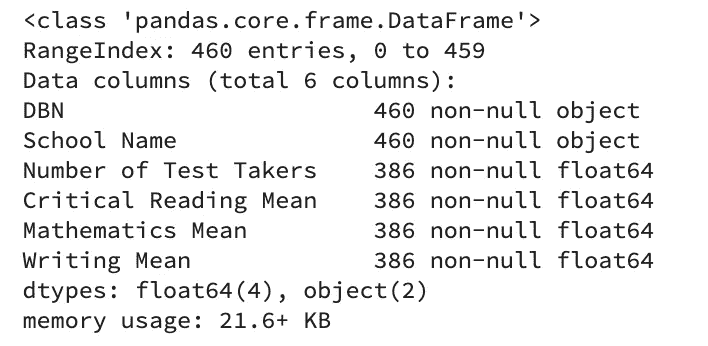

关于我们的“数据”数据框架的一些信息。

如果我们看看上面对我们的`DataFrame`的描述，我们可以看到有 460 个条目(或行)和 6 个数据列(或列)。我们知道我们的`DataFrame`是一张尺寸为 460 x 6 的桌子。

有趣的是，`Number of Test Takers`、`Critical Reading Mean`、`Mathematics Mean`和`Writing Mean`似乎只有 386 个非空值，但是`DBN`和`School Name`有 460 个非空值。发生这种情况的一个可能的原因是，一些学校不能或选择不报告他们的 SAT 成绩数据。因此，除了`DBN`和`School Name`之外，这些学校的每个`DataFrame`值都是空的(意味着没有值存在)。

Python 会自动注意到这一点，并且不会在其计算中考虑具有空值的学校。但是，如果我们愿意，我们可以使用下面的`[dropna() function](https://pandas.pydata.org/pandas-docs/stable/reference/api/pandas.DataFrame.dropna.html)`手动删除所有具有空值的学校。

```
data = data.dropna()
```

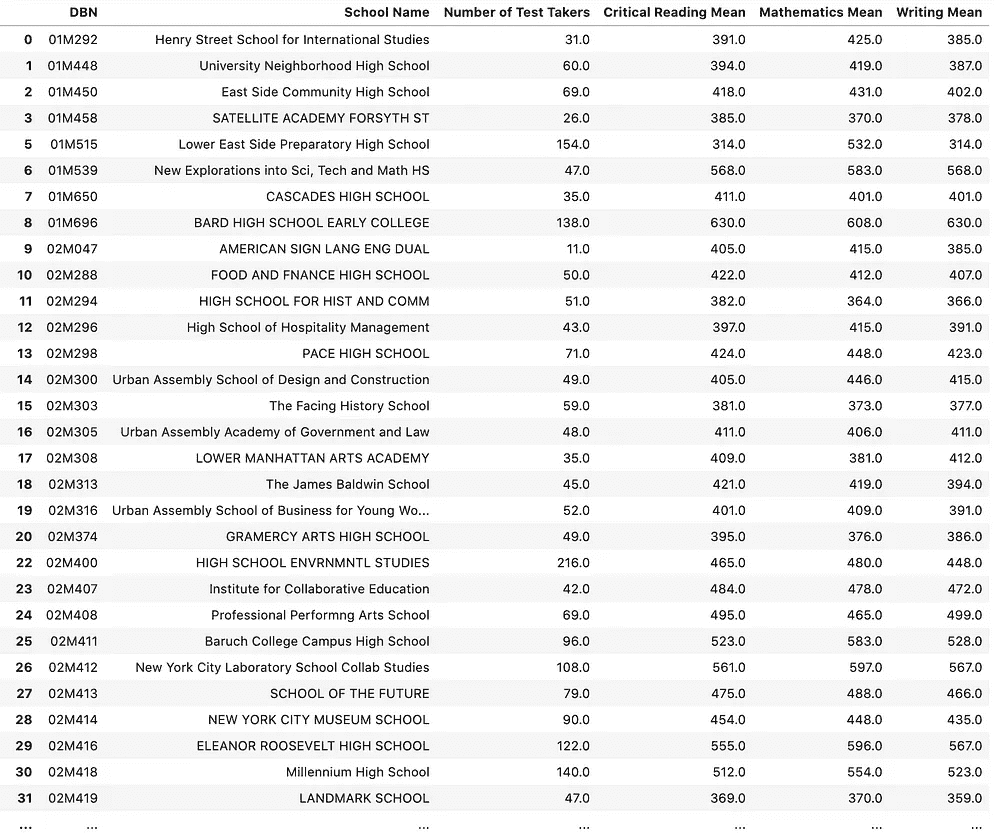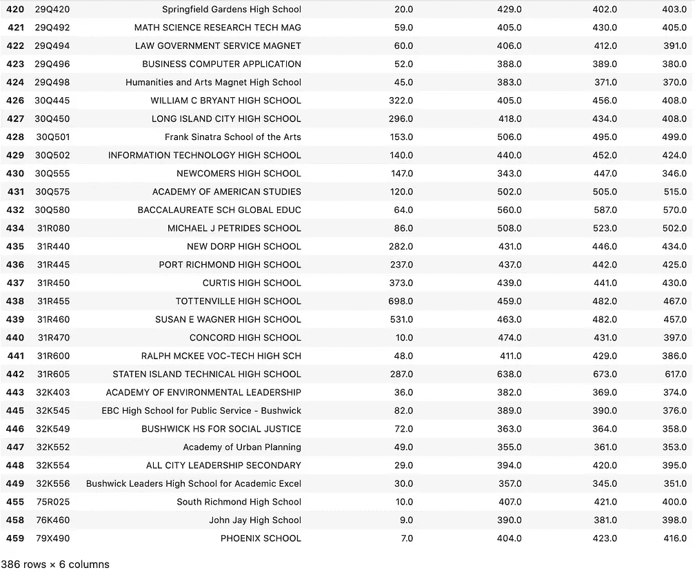

请注意，在第二个图像的底部显示的是 386 行，而不是 460 行。

我们可以看到有 386 行，现在我们已经删除了所有具有空值的学校。此外，如果我查看关于我们修订的`data` `DataFrame`的信息，它和以前一样。


在我们删除了所有具有空值的学校之后，一切都没有改变。

如果您想访问数据帧中的特定值，您可以在 pandas 中使用`[.loc[] function](https://pandas.pydata.org/pandas-docs/stable/reference/api/pandas.DataFrame.loc.html)`或`[.iloc[] function](https://pandas.pydata.org/pandas-docs/stable/reference/api/pandas.DataFrame.iloc.html)`。它们之间的区别是`.loc[]`使用你的`DataFrame`中的标签，而`.iloc[]`使用你的`DataFrame`的索引。这里有一个例子:

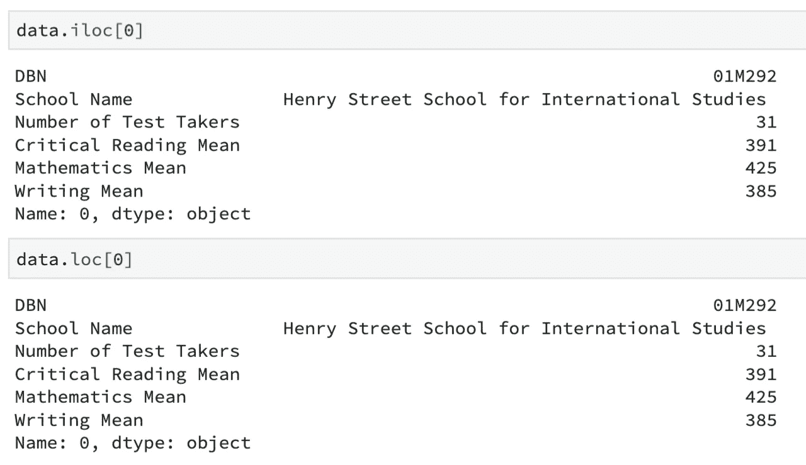

遗憾的是，由于我的第一个指标的名称是`0`，所以无法突出`.iloc[]`和`.loc[]`的区别。然而，如果我在第一个索引处的值的名称是`Henry`，我将写`data.loc['Henry']`或`data.iloc[0]`来访问我的`DataFrame`的第一个元素。

您可以使用`[sort_values() function](https://pandas.pydata.org/pandas-docs/stable/reference/api/pandas.DataFrame.sort_values.html)`对数据进行排序。下面的代码将把`DataFrame`从最高到最低排序:

```
data.sort_values('Writing Mean', ascending = False)
```

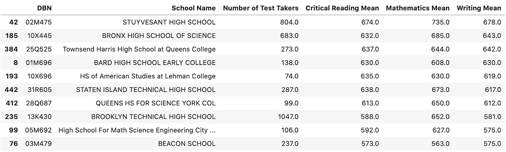

如您所见，我们的`DataFrame`中的所有值都是从最高到最低排序的。如果您想从最低到最高排序，请移除`ascending = False`。我们不必输入`ascending = True` ,因为熊猫库使用`ascending = True`作为默认参数。要使用不同的列进行排序，请将`'Writing Mean'`更改为`'whatever your intended column name is'`。


图片来自[维基百科](https://en.wikipedia.org/wiki/Pandas_(software))

这些是 pandas 中用于查看和观察数据集的一些最重要的工具。在下一节中，我们将学习如何操作我们的数据，并根据我们的数据操作得出结论。

# 操纵我们的数据框架

指南这一部分的主要目标是在 pandas 中创建一个新的列，包含每个学校的 SAT 总分平均值，并在 pandas 中学习一些有用的数据清理技术。

第一部分涉及从我们在线收集的数据集中提取一条重要信息。由于我们的`sat.csv`没有 SAT 总分均值栏，所以了解某个学校 SAT 总分的平均值对我们来说会很有用。这对于正在寻找学术水平高的学校的新家庭来说非常有帮助。

下面的代码将创建一个名为“Total SAT Score Mean”的新列，它总结了每所学校的三个单独的子分数:

```
data['Total SAT Score Mean'] = data['Critical Reading Mean'] + data['Mathematics Mean'] + data['Writing Mean']
```

当在您的`DataFrame`中创建一个新列时，只需编写`data['name of your new column']`。确保将新列设置为适当的值。

此时，我们的`DataFrame`应该是这样的:

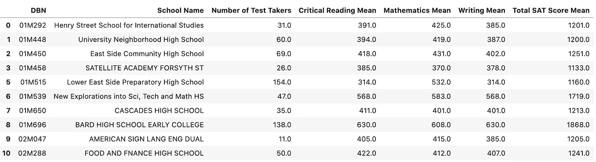

我使用 data.head(10)生成了这个图像。

现在我们可以将`Total SAT Score Mean`从最高到最低排序，看看纽约市一些学术实力很强的学校。

```
data.sort_values('Total SAT Score Mean', ascending = False).head(10)
```

运行上面的代码给了我:

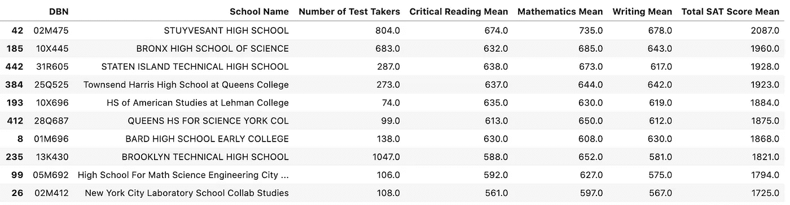

厉害！由于我们的数据处理，我们能够发现与纽约市的其他学校相比，Stuyvesant 高中是 SAT 成绩最好的学校。此外，如果你想去掉那些考生人数少于 100 人的学校，以便得出更准确的观察结果，你可以这样写:

```
data[data['Number of Test Takers'] > 100].sort_values('Total SAT Score Mean', ascending = False).head(10)
```

这是我们应该得到的:

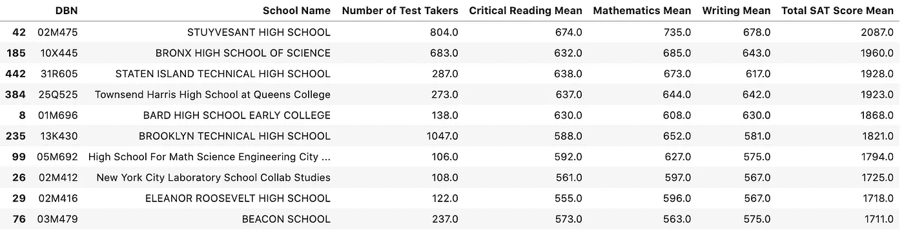

因此，我们可以把这十所高中推荐给一个正在纽约寻找以学术为主的学校的家庭。当然，这个数据现在有些过时了，但如果是在 2010 年，这个数据集对一些想在纽约市定居的家庭会很有帮助。

太好了。让我们继续讨论熊猫中常用的几种简单易行的数据清理方法。

我们要学习的第一个数据清理方法是删除您的`DataFrame`中的列和行。要删除 pandas 中的列，可以使用`[drop() function](https://pandas.pydata.org/pandas-docs/stable/reference/api/pandas.DataFrame.drop.html)`或`del[]`方法。两种方法都很好，然而，`del[]`方法更短。

例如，如果我想删除数据集中的 DBN 列，我可以使用`drop()`方法:

```
data.drop(['DBN'], axis = 1)
```

我也可以使用`del[]`方法得到完全相同的结果:

```
del data['DBN']
```

使用`head()`函数，两个输出看起来应该如下所示:

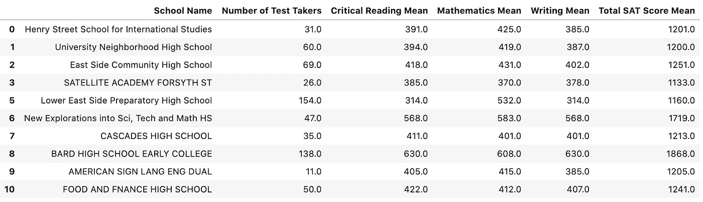

删除行也涉及到使用`drop()`方法。如果我们想删除我们的`DataFrame`的第一行，我们可以执行下面一行代码:

```
data = data.drop(data.index[0])
```

我们的输出如下所示:

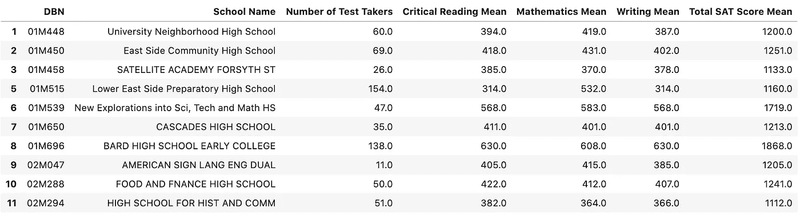

我们可以清楚地看到，我们的第一个索引不见了，这意味着我们的代码工作了。

如果您想重命名您的列标题，您可以使用`[rename() function](https://pandas.pydata.org/pandas-docs/stable/reference/api/pandas.DataFrame.rename.html)`。要查看示例，让我们运行下面的代码行:

```
data.rename(columns={"School Name": "A", "Number of Test Takers": "B"})
```

我们将数据帧的`School Name`和`Number of Test Takers`列分别重命名为`A`和`B`。我们的前十行应该是这样的:

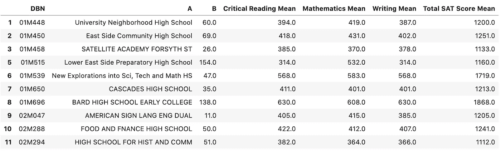

记住，第一行(索引 0)不见了，因为我们删除了它。

为了操作您的数据，本节中的方法对于您的数据科学之旅至关重要。尽管这些函数并不完全难以掌握，但它们在数据分析中非常重要且非常有用。


[丘特尔斯纳普](https://unsplash.com/@chuttersnap?utm_source=unsplash&utm_medium=referral&utm_content=creditCopyText)在 [Unsplash](/s/photos/pandas?utm_source=unsplash&utm_medium=referral&utm_content=creditCopyText) 上拍照

Pandas 是一个非常有助于数据分析的 Python 库。你可以给你的电脑编程来代替你自己分析数据。我们在 pandas 中学到了一些新方法，可以帮助你阅读、查看、描述、操作和清理数据集。在下一篇文章中，我们将重点关注 Matplotlib 中的可视化数据，并为导入的数据集创建一些简单的图形。

这个系列的第二部分现在出来了！请务必查看它，因为它总结了我们的初学者数据分析指南。这篇文章的链接是[这里](https://medium.com/@charlesshi12/a-beginners-guide-to-analyzing-data-part-two-5bb5d7e2f728)。

如果你有任何问题，请在下面的评论区发表，我们在下一篇文章中再见。感谢阅读！

# 参考

[](https://pandas.pydata.org/) [## 熊猫

### pandas 是一个快速、强大、灵活且易于使用的开源数据分析和操作工具，构建于…

pandas.pydata.org](https://pandas.pydata.org/) [](https://www.data.gov/) [## Data.gov

### 最近几天，Data.gov 对其主页进行了一些更新。对于寻求冠状病毒信息的用户…

www.data.gov](https://www.data.gov/)