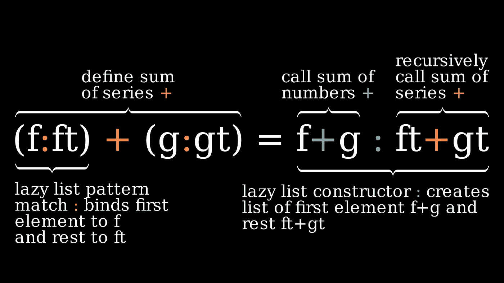
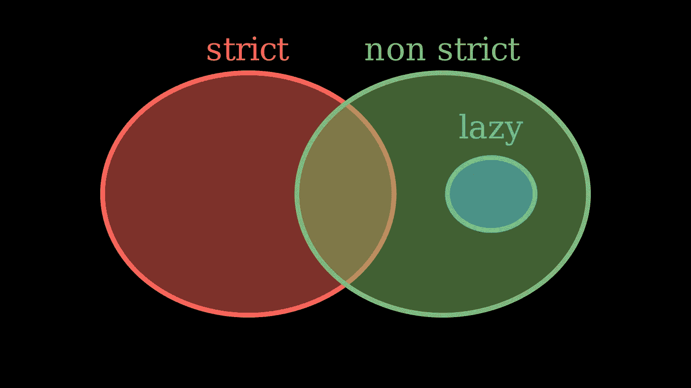

# 懒惰评价的一点点

> 原文：<https://betterprogramming.pub/a-nibble-of-lazy-evaluation-22a93e05df3e>

## 渴望 vs 严格 vs 不严格 vs 懒惰——这一切意味着什么？


我羡慕树袋熊在最尴尬的地方也能极度舒适。照片由[大卫·克洛德](https://unsplash.com/@davidclode)在 [Unsplash](https://unsplash.com) 上拍摄

*啃:咬下的一小块食物。在计算中:半个字节的信息。每一个小字节在五分钟内解释一个计算科学或软件工程的想法。*

每种编程语言都需要选择计算表达式的顺序。几乎都使用*严格求值*:在对一个表达式求值之前，先对所有子表达式求值。例如，函数的参数在函数之前计算。很多人用*热切评价*作为严格评价的代名词。

少数人，主要是 Haskell，使用*非严格评估*。非严格求值由它不是什么来定义:任何不首先求值所有子表达式，或者根本不求值的求值策略都是非严格的。*懒评*是非严格评价的一种特定策略。

让我们试着用一点懒惰的评价来澄清混乱。

# 严格评估

像大多数语言一样，Python 对函数应用程序使用严格的评估:

```
def log(value):
  if log_level == INFO:
    print(value)

log(42 + 33)
```

首先，计算总和，然后记录下来。虽然理解起来很直观，但是这个例子显示了严格求值的一个潜在缺点:如果参数最终没有被使用，如果`log_level`是`WARN`，那么就没有必要进行计算。

发现严格求值的一个简单方法是想象如果一个子表达式进入无限循环会发生什么。如果顶级表达式从不求值，那么求值是严格的。

严格求值并不限制子表达式求值的顺序，只是它们都在顶级表达式之前求值。可以是从左到右，像 Python 中一样；从右到左，像在 OCaml 中；或者像 c 语言一样不定义。

# 非严格评估

不严格的评估并不像乍看起来那么不寻常——例如`if...else...`就是不严格的。

让我们应用我们的技巧来发现严格的评估。即使`else`分支永远循环，下面的 Python 程序也会终止:

```
if True:
  print("I am True")
else:
  while True:
    print("I never terminate")
```

`else`分支根本不求值，所以`if...else...`在 python 中并不严格。

短路布尔运算也是非严格的。下面的`or`表达式终止。

```
True or infinite_loop()
```

# 不严格的 DIY

这对于内置来说很好，但是如果你想把事情做好…

我们可以使用没有参数的[*thunks*](https://www.wikiwand.com/en/Thunk)*:*函数模拟非严格求值。Thunks 延迟评估直到需要。

```
def log(value_thunk):
  if log_level == INFO:
    print(value_thunk())

log(lambda: 42 + 33)
```

Thunks 避免了不必要的工作——如果要记录的值计算起来很昂贵，那么`log`函数只在启用日志记录时才计算它。

# 懒惰评估

thunks 的一个恼人的问题是，每次调用它们时都要重新计算。

```
def log(value_thunk):
  if log_level == INFO:
    print(value_thunk())
    send_to_log_aggregator(value_thunk())
```

为了解决这个问题，我们可以保留第一次计算 thunk 的结果，并重用它。这种评价策略被称为*懒评价*。它结合了两种优化:

*   它从不执行不必要的工作，直到需要时才进行评估。
*   它从不通过缓存第一个结果来重复工作。

这里有一个问题:如果 thunk 有副作用，比如写入磁盘，那么就很难理解副作用何时或者是否会发生。出于这个原因，惰性评估假设 thunks 没有副作用。

函数式编程语言 Haskell 在默认情况下没有使用惰性求值，因为它是纯粹的:Haskell 函数没有副作用。

像 OCaml、F#和 C#这样的严格语言支持使用`lazy`关键字或`Lazy`对象的惰性求值。

下面是 Python 中一个`Lazy`对象的说明性实现:

```
class Lazy:
    def __init__(self, thunk):
        self._thunk = thunk
        self._is_cached = False
        self._value = None

    @property
    def value(self):
        if not self._is_cached:
            self._value = self._thunk()
            self._is_cached = True
        return self._value
```

# 为什么懒惰评估很重要

严格评估更常见，因为它更容易理解，也更容易调试。也就是说，在某些情况下，非严格评估是不可或缺的。

道格·麦克洛伊的 [Power Serious](https://www.cs.dartmouth.edu/~doug/powser.html) 很好地说明了这一点:Haskell 中无穷幂级数的一个完整的 10 行实现。

这是其中的一句:

```
series f = f : repeat 0
```

在 Haskell 中，一个基本的数据结构是懒惰列表。函数`series`创建了这样一个列表。列表的第一个元素是数字`f`，其余都是零。列表构造函数`:`在列表前添加一个元素。标准函数`repeat s`创建了一个`s`的无限列表。

具体来说，`series 13`代表无限列表`[13, 0, 0, 0,...]`。但是由于它很懒，所以只在需要的时候计算元素。获取元素的一种方法是使用函数`take n`，它从列表的前面获取`n`元素。换句话说，`take 4 (series 13)`产生`[13, 0, 0, 0]`。

在这一点上，你可能认为懒惰列表只是迭代器。像惰性列表一样，迭代器是按需计算的，可以用来表示无限的数据结构。下面是作为 Python 生成器的`series`:

```
def series(f: int) -> Iterable[int]:
    yield f
    while True:
        yield 0
```

不同之处在于，惰性列表在对列表元素求值时缓存它们。像这样的程序:

```
myList = series 10 --list thunk is created
some = take 5 myList --eval first 5 elements
somemore = take 20 myList --eval 15 more elements
```

总共只计算 20 个值。迭代器有时无法重置，如果可以重置，整个计算将从头开始。懒惰列表就不是这样了！

回到权力严肃。道格·麦克洛伊使用惰性列表来表示无穷幂级数的系数。换句话说，列表`[1, 2, 3, 4, 0, ...]`代表幂级数 1 + 2𝑥 + 3𝑥 + 4𝑥 +...

这是两个幂级数的加法:

```
(f:ft) + (g:gt) = f+g : ft+gt
```

Haskell 的语法很简洁。在这一行中，`:`和`+`符号都是重载的。等号左边的`:`符号表示列表解构。右边表示列表构造。这张图片用颜色区分了每个符号的不同含义，以阐明:



等等——没有基本情况的递归定义？这只能归功于懒惰的评估。当需要两个序列的和的第一个元素时，表达式`f+g`又需要`f`和`g`，这通过懒惰模式匹配`(f:ft)`和`(g:gt)`触发对左右列表的第一个元素的评估。延迟对`ft+gt`的进一步评估，直到需要更多元素。当需要第二个元素时，重复这个过程，依此类推。

惰性无限列表简化了一切:不需要检查列表何时结束，因为它没有结束，也不需要递归的基本情况，因为我们只在需要时递归。

# 概述

这个小块讨论了一堆术语。



我将*评估策略*分为两类:严格和非严格。

在严格计算中，首先计算表达式的所有子表达式。非严格评估包含所有做其他事情的策略，包括根本不评估某些参数。

严格评估有时被称为热切评估，听起来像是懒惰评估的对应。然而，懒惰评估只是许多可能的非严格策略中的一种。惰性求值非常突出，因为它额外缓存了结果，但只有在表达式没有副作用的情况下才有可能。

最后，严格和非严格求值通常在一种编程语言中一起使用，甚至在同一个表达式中。因此出现了图像中的交叉点。一个例子是`if...else...`:条件的评估是严格的，但是两个子句的评估是非严格的。

感谢阅读！我打算每个月写一个半字节。更多信息，请[订阅我的新信件](https://getcode.substack.com/subscribe?)和[在 Twitter 上关注我](https://twitter.com/kurt2001)。

*原载于*[](https://getcode.substack.com/p/a-nibble-of-lazy-evaluation)