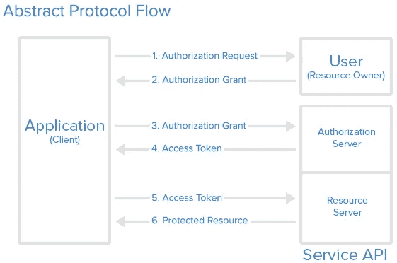
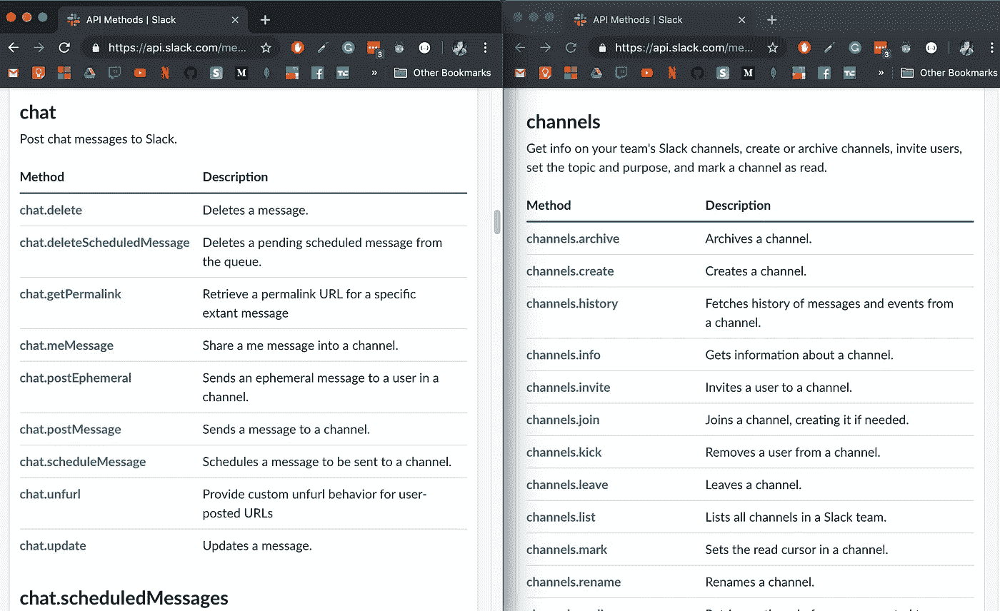

# 使用 Web APIs 的实用指南

> 原文：<https://betterprogramming.pub/a-no-nonsense-guide-to-working-with-web-apis-55ca899a607>

## 关于使用 API 你需要知道的一切


我发誓你能看到他眼中的恐惧！这就是我在使用 API 时的样子——有点害怕，但是将恐惧内化了。照片由[像素](https://www.pexels.com/@proxyclick)上的[代理访客管理系统](https://www.pexels.com/@proxyclick)拍摄

# API 介绍

API 是一个应用程序编程接口。如果你从这篇文章中学到了什么，请不要让它变成那样！

我的定义是:**API 是 URL 的集合**(或者称之为端点)**，为你提供数据或者访问你没有的数据。**

比如 Slack 有一个非常流行的 API。Slack 为开发人员提供了一种方法，允许他们访问用户的组织、渠道、组织中的人员等。

我永远无法获得其他人的空闲组或消息的信息，但是通过 API 我可以。为此，我只需发送带有特定参数的特定请求。

# Web 请求

调用 API 时，有两种非常常见的 web 请求类型。

web 请求只是在 web 上传输数据。HTTP(超文本传输协议)的名字里就有它——它只是一个传输协议。我们在网上发送东西的一套规则。

## 获取请求

GET 请求是用来获取数据的，你猜对了。当你发送一个 GET 请求时，你是在要求一些东西，你会收到它。

GET 请求通常设置了一些参数，这样 API 就知道您在寻找什么。例如:

```
*GET* [*/users?firstName=Alec+lastName=Jones*](https://myAwesomeAPI.com/users?firstName=Alec+lastName=Jones)
```

这个例子表明，我正在尝试获取名为 Alec、姓为 Jones 的用户。

## 发布请求

当您想要告诉 API 对您的信息做一些事情时，可以使用 POST 请求。它们用于创建或更新某些东西。

POST 请求包含一些存储在请求正文中的数据。主体可以以不同的形式存储，但最有可能是 JSON 主体。

```
POST /users/create.php HTTP/1.1
Host: myawesomeapi.com
name1=value1&name2=value2
```

当你发出 POST 请求时，一个 API 99.9%的时候都需要你的认证。

这是有意义的，因为如果 API 不知道你是谁或者你是否被允许这样做，它就不想创建或更改资源。

# 证明

正如我所说的，您很可能需要一些身份验证。API 以不同的方式实现这一点，但是我将介绍两种最常用的方式。

## **API 键**

自从网络出现以来，API 密匙就一直存在。它们与你登录谷歌、脸书或 Medium 的密码没有什么不同。

API 键上手非常快，几乎没有任何麻烦。当您找到服务的 API 键时，您就可以开始了。

不幸的是，API 键也有一些缺点。

首先，它们没有其他选择安全。如果有人拿到了你的钥匙，他们可以做你能做的一切，同时看起来像是你——危险！

其次，当 API 开始被其他人使用时，它们就变得棘手了。如果 Slack 使用 API 密匙，每次你想安装一个新的插件时，你都需要找到你的 API 密匙，这样你就可以把它给这个插件。

每个人都必须搜索他们的 API 键，这不是一个好的用户体验。因此，OAuth 令牌是另一种易于使用且更安全的选择。

## **OAuth 2**

OAuth 是为开发人员认证 API 的一个更复杂的流程。但是，用户体验更简单，因此更优越。

OAuth 也更加安全。有一些精彩的文章比我更好地解释了 OAuth，但我将给出一个真正的简化版本(再次使用 Slack)。

**场景**:我正在建立一个很棒的网站，向你展示你所在的空闲频道列表。

## 流动

**第一步**:我让你用那些小弹出窗口中的一个登录 Slack！

第二步:现在通过登录，你已经给了我一个“授权许可”“授权许可”是我获取访问令牌所需要的。

**步骤 3** :我使用新的“授权许可”并向 Slack 请求一个访问令牌(这些令牌有点像 API 令牌，但是它们会过期)。

**步骤 4** :使用我的新访问令牌，我现在可以从 Slack API 请求您所在的通道列表。



[来源](https://www.digitalocean.com/community/tutorials/an-introduction-to-oauth-2)

那是 OAuth！很漂亮，不是吗？

# 为什么应该使用 API？

互联网上有大量的数据。

BBC 估计谷歌、亚马逊、微软和脸书拥有的数据总量“至少有 1,200”。也就是 120 万兆兆兆字节。”

所有这些数据都分别保存在这些商店中。当我们把这些数据连接起来，我们就有了更智能的网络应用；它们是更好的网络应用。

例如，很多使用 Slack 的人也使用谷歌日历。他们在空闲时间上花费时间，但是他们必须定期检查他们的日程表上的事件。

那么，当有人为 Slack 做了一个谷歌日历应用会怎么样呢？他们允许人们休息，但是要跟上他们日历上的活动。这就是为什么它是安装最多的 Slack 应用之一。

Google Calendar 和 Slack 互不对话，但当有人使用它们的 API 将它们连接起来时，人们会获得好得多的体验。

使用 API 的困难之处不在于试图弄清楚它们是如何工作的。而是弄清楚该拿他们怎么办。如何用 API 创建有意义的东西？

# API 通常是如何构造的？

正如我前面提到的，API 通常有一个端点列表，您可以从中接收数据。

Slack 有一个包含每个 API 方法的页面。



[Slack 的方法列表](https://api.slack.com/methods)

大多数(好的)API 将遵循这种结构。例如，将有一个资源和通道，您可以在一个通道上执行一系列操作。

此外，Slack 很好地命名了它的方法，因为你甚至不需要阅读描述就能知道将要发生什么。

```
[https://slack.com/api/channels.join](https://slack.com/api/channels.join)
```

我认为可以推断，当我到达那个 API 端点时，我正在尝试加入一个通道。

**资源**应该是一个名词:渠道。

**发布方法**应该是一个动词:加入、重命名、创建、存档。 **GET 方法**应该是另一个名词:list、info、history。

最重要的是名字不言自明！

# 什么是 Webhook？

像开发领域的大多数事情一样，围绕 Webhooks 有一些争议。有人说你应该使用它们，也有人说你不应该。但是他们说什么都不重要，因为 webhooks 仍然被广泛使用！

webhook 是一个在 web 上运行的功能。什么？

比方说，一个顾客正在你新的销售猫杯的直运网站上购物。很刺激，对吧？

他们会买价值 100 美元的杯子，但你不会马上知道。你必须检查你的购买历史才能看到购买清单。蹩脚！

相反，当有人在 Slack 中进行新的购买时，您决定想要立即得到通知。

您设置了以下逻辑:

当有人进行新的购买时，向 Slack 发送一个 **POST 请求，其中包含购买的详细信息。然后 Slack 将这些购买细节发布到 Slack 频道。**

那是一个网钩！如果 *x* 发生在这里，那就让 *y* 知道这件事！

# 文档是王道

你需要使用文档。当我说“需要”文档时，我的意思是你将*需要*文档。

如果你试图利用一个 API，文档将需要成为你的新圣经，律法，或可兰经。

它有你需要的一切。我在这篇文章中不能告诉你或不知道告诉你的一切都在文档中。

当然，文档的质量会因 API 的不同而有很大差异。我之所以多次选择 Slack 作为我的例子，是因为他们的 API 非常有文档记录。

文档是如此的重要，你应该根据文档的完善程度来选择你要使用的 API。

当然，如果一个 API 有一些您需要的特殊功能，您将无法选择是否使用它。例如，你可以为 Slack 制作一个应用程序的唯一方法就是通过他们的 API。

但是对于更一般的事情，比如尝试发送 SMS 消息，有大量的 API。确保你选择了一个最好的文档——这样在开发阶段就容易多了。

# 就是这样！

恐怕这就是我能给你的所有关于 API 的无废话建议了！我希望你学到了 API 之外的东西。

感谢阅读！

## 资源

[Slack 的 API](https://api.slack.com)

[Oauth 2 指南——数字海洋](https://www.digitalocean.com/community/tutorials/an-introduction-to-oauth-2)

[Oauth 2 视觉指南——川崎孝彦](https://medium.com/@darutk/the-simplest-guide-to-oauth-2-0-8c71bd9a15bb)

【HTTP 理解指南