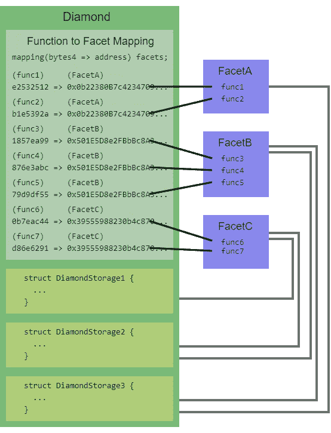
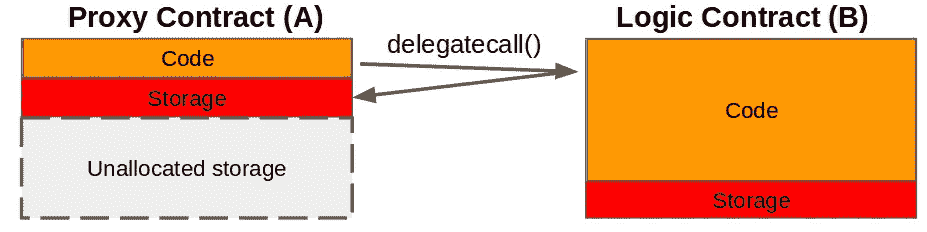

# 关于可升级智能合约的一个注记

> 原文：<https://betterprogramming.pub/a-note-on-upgreadable-smart-contracts-d8fb6fd515da>

## 代理合同的重要性

由 [Reinis Birznieks](https://unsplash.com/@reinis_birznieks?utm_source=medium&utm_medium=referral) 在 [Unsplash](https://unsplash.com?utm_source=medium&utm_medium=referral) 上拍摄的照片。

尽管以太坊在为软件开发带来不变逻辑方面做得很好，但在合同中还是会不断发现错误。此外，如果事先没有一个适当的计划，迁移成本会很高。因此，必须在产品设计时考虑这一价值，然后谨慎实施。安全性和发展性至关重要——尤其是当它涉及到人们的资金时。

任何业务模型中的不变性都超出了这个范围。相反，本文强调了它的技术方面。

由于没有高标准的开发工具来防止犯错误或提前一步识别事件，这个问题限制了智能合约程序员迭代其应用程序的能力。

然而，有一些启发式的技术和模式用于更安全的开发，比如一个优雅的契约销毁，或者通过一个托管地址在紧急情况发生时提取资金。

然而，就可升级的不变性而言，存在一个共同的范式:代理契约。

# **代理模式**

虽然不可能升级已经部署的智能协定的代码，但是可以建立一个代理协定体系结构，它将允许您使用新部署的协定，就像您的主要逻辑已经升级一样。

让我们重点介绍一下与可升级合同相关的最受认可的提案。

*注:以下所有实现都依赖于底层* `*delegatecalls*` *。*

> solidity `delegatecall`操作码使一个契约能够执行来自另一个契约的函数，但是它被执行，就好像该函数来自调用契约一样。本质上，delegatecall 使一个契约能够“借用”另一个契约的功能。用 delegatecall 执行的函数会影响调用协定的存储变量，而不会影响定义函数的协定。—[GitHub 上的 ERC 1538](https://github.com/ethereum/EIPs/issues/1538)

# 以太坊改进建议

## EIP 1538

它由一个契约版本控制系统组成，该系统通过标准事件公开记录对契约的更改，以实现可追溯性。它还支持无限制的存储大小、原子多重升级和用于外部调用的标准接口。

它代表了不可变的无信任透明契约和可升级的模糊委托契约之间的权衡。

术语:

*   透明的契约包含一个回退，它使用`delegatecall`操作码将函数调用转发给委托契约。如果需要，它还支持其他不可变函数。
*   可以通过向一个`updateContract`函数提供新地址来改变委托契约。但是，用户只能与固定地址(透明的地址)进行交互。
*   标准应该有一个认证机制来保护透明契约中的委托更新。
*   每个函数更新都会发出`CommitMessage`和`FunctionUpdate`事件来记录更改。
*   给定函数签名列表，可以一次执行多次更新。
*   当新部署的委托中省略了`updateContract`函数时，可变性可以在任何给定的时间被关闭。

## **EIP 2535**

作为 EIP-1538(也称为钻石标准)的继任者，它为智能合约的迭代开发提供了模块化设计，支持部分和完全升级，依赖于钻石合约和多个方面。

钻石是一种契约，将外部功能与刻面绑定在一起。

方面是公开外部函数的独立契约。

图片来自[以太坊改进建议](https://eips.ethereum.org/EIPS/eip-2535)。

术语:

*   每当调用外部函数时，菱形都会执行回退。它从`selectorToFacet`映射中获取相关的方面地址，然后执行`delegatecall`。
*   给定一个刻面地址及其选择器，加上一个动作(添加、替换、删除)以防止函数冲突，刻面升级通过`DiamondCut`函数调用完成。此外，还会发出一个事件来记录新的更改。
*   刻面状态变量应该驻留在静态存储槽中(菱形存储模式)。
*   [钻石存储](https://dev.to/mudgen/what-is-diamond-storage-3n7c)是一种通过指向一组固定内存槽的指针来控制多个刻面上的状态变量范围的技术。
*   当方面从同一契约或库继承时，它们也可以共享内部函数。
*   刻面可重复使用，并可由多个钻石共享。
*   每个钻石都有一个放大镜刻面，其中包含四个标准外部函数来显示所有其他刻面及其功能。

## EIP 1822 年

这个标准非常简单。它依靠一个可代理的契约来处理升级和执行兼容性检查，以及一个具有唯一存储槽的代理契约，该存储槽引用新的逻辑契约地址。它还支持代理契约字节码的验证。

图片来自[以太坊改进建议](https://eips.ethereum.org/EIPS/eip-1822)。

术语:

*   逻辑契约地址驻留在代理契约内的固定内存槽中: *keccak256("PROXIABLE ")槽*地址。
*   所有后续的逻辑契约都应该继承标准的可代理契约。
*   可代理契约包含一个用于执行升级的`updateCodeAddress`函数(更新 *keccak256("可代理")*槽地址值)。
*   在升级之前执行兼容性检查，以确保逻辑契约符合通用可升级代理标准。
*   后续逻辑契约中变量的实例化顺序对于防止覆盖代理中的现有值至关重要。为此，建议使用所有新协定都继承的基础协定。
*   通常，`Owner`和`LibraryLock`契约与逻辑契约一起部署，以控制访问并限制任何最终的破坏性功能。
*   代理契约支持逻辑契约中包含的多个构造函数，因为它在自己的构造函数中接受任何任意数据。

## EIP 1155

多种令牌类型的外观，包括可替换、不可替换和半可替换令牌的任意组合，该标准可配置为在任何给定时间支持新类型。它还支持跨多种类型的原子操作。

术语:

*   每个令牌都有一个唯一的 ID。
*   合同应实现 ERC-165 `supportsInterface`对目的地址的预先检查。
*   契约中的每个函数都接受一个 ID 参数，以便将请求转发给相关的令牌。
*   允许一次处理多个操作。

# 最后的想法

尽管这些模式已经解决了不变性问题，但它们都依赖于基于操作码的方法，这影响了代码的可读性，从而使开发人员体验痛苦。

一些涉及高风险的事件，比如 DAO hack，需要对规范本身进行低级修改(硬分叉),从而提高协议的可信度。

除了代理，还有其他模式关注数据结构的可升级性，而不是逻辑和存储分离方法，即[永恒存储](https://fravoll.github.io/solidity-patterns/eternal_storage.html)模式。

# 参考

*   [https://eips.ethereum.org/EIPS/eip-1538](https://eips.ethereum.org/EIPS/eip-1538)
*   【https://eips.ethereum.org/EIPS/eip-2535 号
*   【https://eips.ethereum.org/EIPS/eip-1822 
*   [https://eips.ethereum.org/EIPS/eip-1155](https://eips.ethereum.org/EIPS/eip-1155)