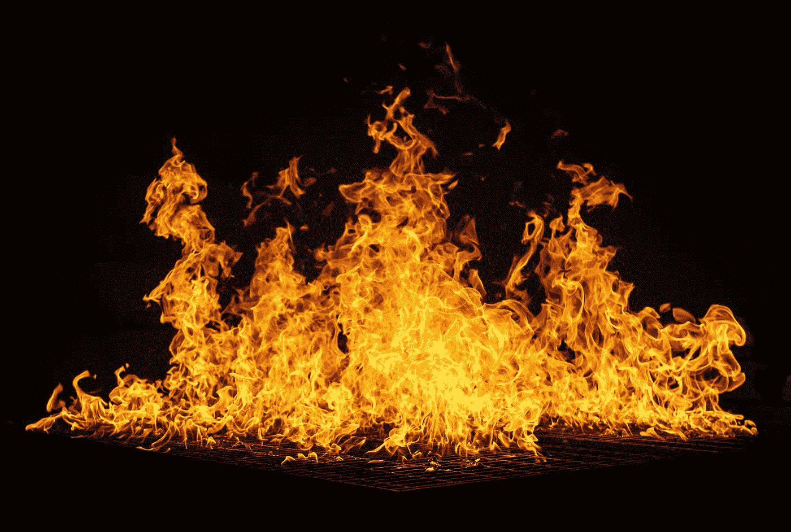
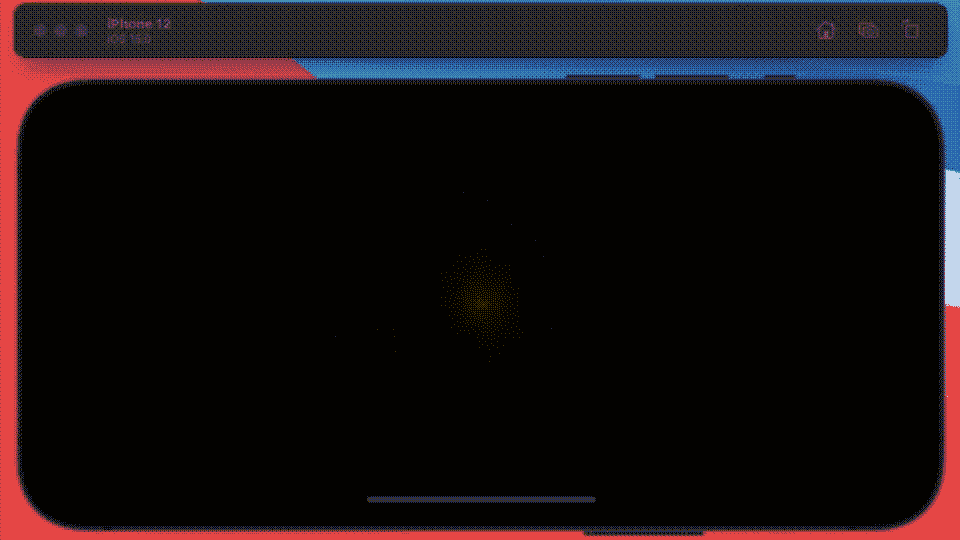
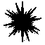
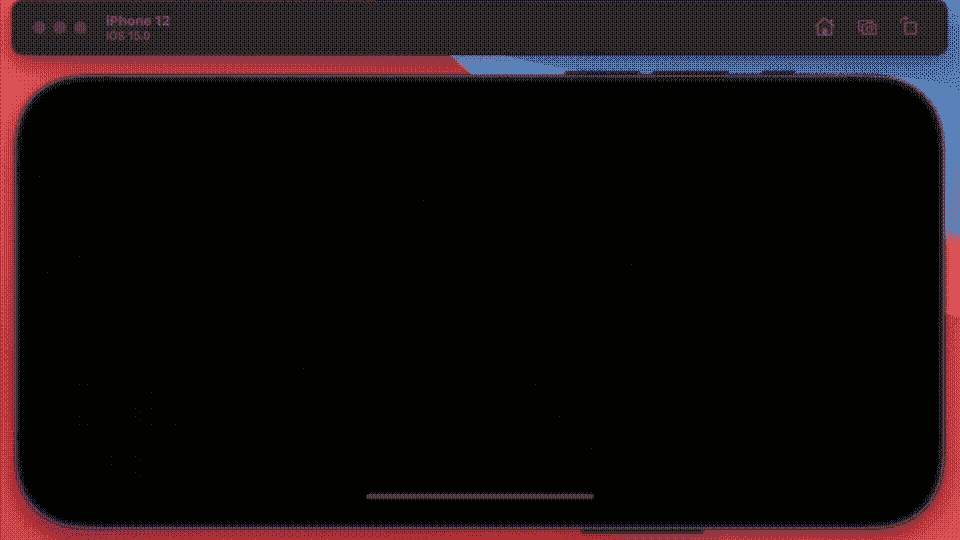

# 使用 Pure SwiftUI 创建粒子效果

> 原文：<https://betterprogramming.pub/a-particle-effects-using-pure-swiftui-dc55edb6b26a>

## 触手可及的强大动画



里卡多·戈麦斯·安吉尔在 [Unsplash](https://unsplash.com/s/photos/particles?utm_source=unsplash&utm_medium=referral&utm_content=creditCopyText) 上的照片

我已经写了几十年的代码，真的——老实说，我比以往任何时候都更喜欢这样做。我特别喜欢用 SwiftUI 编码，因为它很有趣——因为你可以在仅仅几个小时之内，甚至更短的时间内完成一些原型。

和我一起在这篇文章中享受 SwiftUI 的乐趣，为今年(2021 年圣诞节)构建一个合适的粒子效果，仅仅使用 SwiftUI 中强大的动画引擎。

我认为这里的关键成分是颜色混合模式和动画，我前几个月写了一篇关于后者的论文——你可以在这里阅读所有关于[的内容](/canvas-colour-and-blending-in-swiftui-with-ios-15-cbb2bf6bddc5)。

# 案情摘要

总之，概要——我想创造一个爆炸，一个粒子效果——但我不想用 SpriteKit。我想用 SwiftUI。建造这个的目标是—



爆炸的 SwiftUI 粒子演示

现在，你看到的是什么——嗯，它是一个看起来像这样的粒子——更准确地说，是大约 256 个，使用屏幕模式颜色混合，在 ZStack 中一个接一个地装载。图标的颜色是红色的，但当它与自身重叠时会变成白色。随着位置、不透明度、比例和旋转在仅持续 4 秒的动画中被修改，各种白色阴影以不同方式混合。



来自 NounProject.com 的 Alexander Skowalsky 的火花

我从[名词项目](https://thenounproject.com/icon/spark-756346/)下载的，这是一个获取黑白图标的优秀网站。主驱动代码是这样的。

我得到了一个结构体，在这个结构体中我存储了这个动画的所有值，位置，不透明度，角度，比例和旋转。对于我创建的每个粒子，我都用一个值来代替它们。起始值和结束值。

然后我运行第二个视图，它创建了 256 个粒子，然后 SwiftUI 在 4 秒钟内将我刚才提到的所有属性动画化。它使用一些基本的数学方法，通过正弦和余弦，将它们制成动画，并沿着一个圆内的一个角度移动每个粒子。

你在这里看到的爆炸的最终结果是使用我在这里给[的](https://bitbucket.org/wizard1066/fun/commits/65da6e68c1f807f1ebd654021f169d62e4a47514)的 bitbucket 链接下载整个项目，并对它进行处理。您应该能够用这段代码创建各种不同的效果，只需通过更改各种参数——`Range`参数将产生最大的差异——例如，将`AngleRange`更改为 150，您将获得一半的爆炸。添加这段代码，在你的粒子上随意变换各种颜色，得到一个微妙不同的效果。尝试找到一个新的形状。

```
let colors = [Color.red, .blue, .purple, .green, .orange, .yellow, .indigo, .pink]property.color = colors.shuffled().first!
```

你应该能够产生任何你可以用 SpriteKit 得到的效果，只需要在这里或那里做一点调整。这是另一个例子:



我把开始的位置改成了一个随机的数字，并且添加了更多的颜色

```
var startPosition: CGPoint = CGPoint(x: Double.random(in: 0...UIScreen.screenWidth), y: Double.random(in: 0...UIScreen.screenHeight))
```

这个后面的形状看起来像这样—


来自 NounProject.com 的贾斯汀·布雷克带来的《迷离档案》

所有这些都把我带到了这篇短文的结尾——像我一样玩得开心。