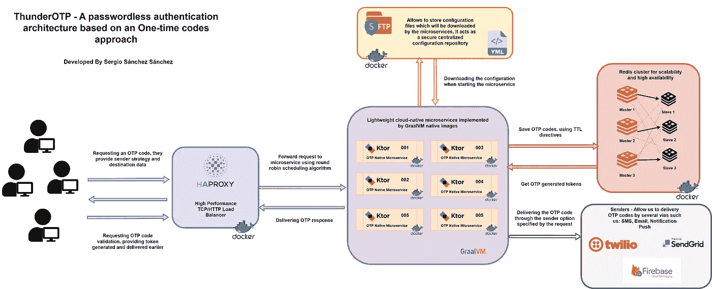
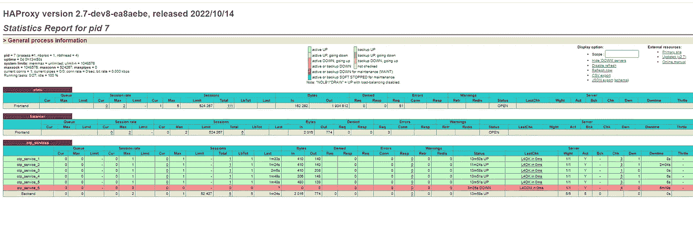
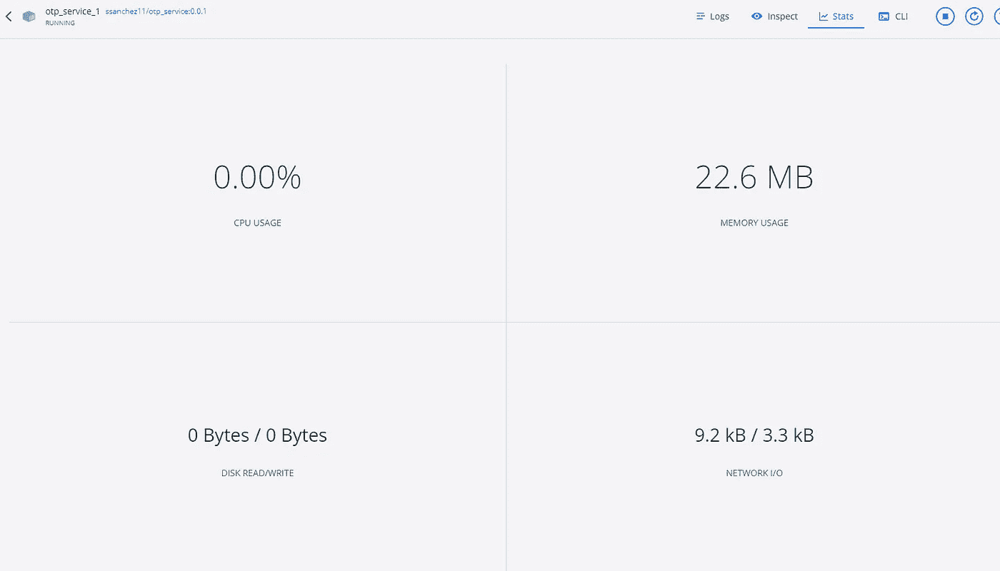
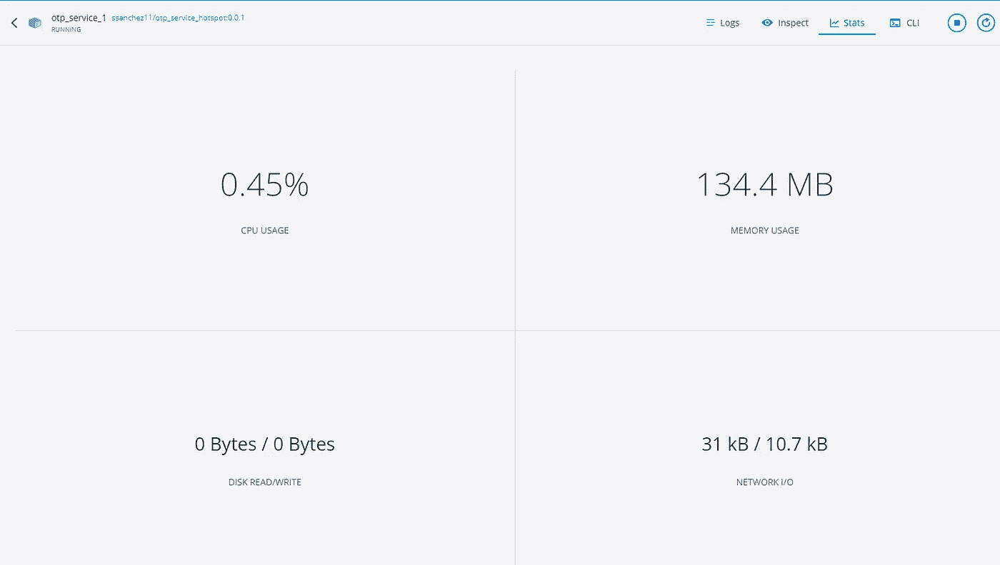
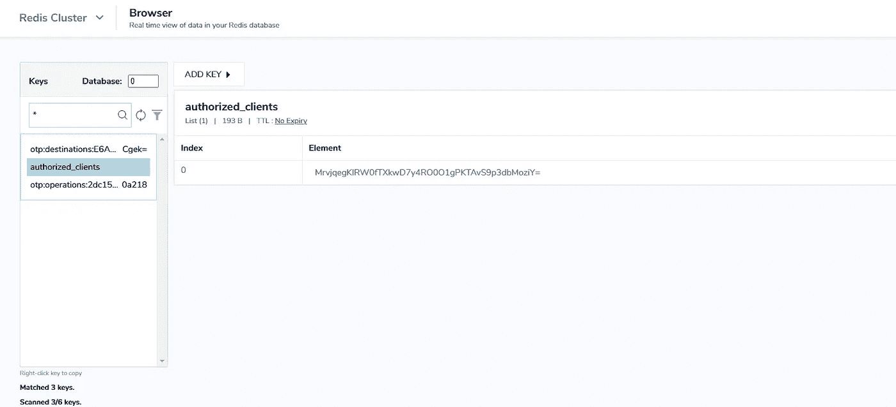

# 基于一次性代码方法的无密码认证体系结构

> 原文：<https://betterprogramming.pub/a-passwordless-authentication-architecture-based-on-a-one-time-code-approach-2ef30d0f25d8>

## thunder OTP——一种由轻量级云原生微服务使用 Kotlin 实现的架构方法


在[与](https://unsplash.com/es/s/fotos/password-security?utm_source=unsplash&utm_medium=referral&utm_content=creditCopyText)之间

无密码身份验证越来越受欢迎，主要原因是当今密码缺乏安全性，因为密码被重复使用和窃取的频率越来越高。第二个原因是密码必须越来越复杂，这降低了用户体验。

安全性和用户体验是任何数字公司的重中之重，通常是直接冲突的。因此，人们对无密码认证感兴趣，因为它承诺同时提供更高的安全性和更好的用户体验。

在本文中，我将解释用于实现无密码解决方案的体系结构方法，该解决方案可以用作独立的身份验证机制或更复杂的 MFA 解决方案的一部分。我将强调使用 Redis 集群应用的水平扩展模型和 GraalVM 的原生映像方法来实现轻量级和高效的服务层。

[](https://github.com/sergio11/passwordless_authentication_architecture) [## GitHub—Sergio 11/passless _ authentic ation _ Architecture:thunder OTP—架构方法…

### 无密码认证将是在线认证的未来！无密码身份验证越来越流行…

github.com](https://github.com/sergio11/passwordless_authentication_architecture) 

# 什么是无密码认证？

无密码身份验证是一种不使用密码来验证用户身份的方法。相反，passwords 使用更安全的替代方案，如所有权因素(一次性密码 OTP，注册智能手机)或生物特征(指纹，视网膜扫描)。

密码已经很久不安全了。它们很难记住，也容易放错地方。他们也是网络罪犯的头号目标。以至于 81%的入侵都与弱密码或被盗密码有关。

明确区分用于提供无密码身份验证的不同方法非常重要。有些更安全，有些提供更好的用户体验。这种架构是使用一次性代码(OTPs)解决方案实现的。它们以多因素身份认证过程而闻名，但一次性密码或代码也可用作独立的身份认证方法。

# 无密码身份验证有哪些类型？

无密码认证可以通过多种方式实现。以下是一些例子:

*   生物识别:身体特征，如指纹或视网膜扫描，以及行为特征，如打字和触摸屏动态，用于唯一地识别一个人。
*   拥有因素:通过用户拥有或携带的东西进行身份验证。例如，智能手机验证器应用程序生成的代码、通过短信或硬件令牌接收的 OTP。
*   神奇链接:用户输入他们的电子邮件地址，系统给他们发送一封电子邮件。该电子邮件包含一个链接，单击该链接即可授予用户访问权限。

# OTP 在无密码身份验证中是如何工作的？

一次性密码(或 OTP)是与参考相关联的数字代码。这些代码被发送给用户，所以只有服务器和用户知道这个代码。当用户在平台中输入代码时，他们被授予访问权限并通过身份验证。

这些代码将通过短信、推送通知或电子邮件发送到用户的手机。

此外，一次性代码总是链接到一个唯一的引用，所以不存在不同的使用超越代码的任何机会。OTP 也有时间限制，这限制了代码的时间有效性。

# MFA 与无密码身份验证

这种架构方法可以用作独立的无密码身份验证服务，用更合适的身份验证因素取代常规密码。另一方面，它也可以用作多因素身份认证系统的一部分和验证用户身份的另一个身份认证因素。

例如，MFA 系统可能使用指纹扫描作为主要身份验证因素，使用 SMS OTPs 作为次要身份验证因素。

人们有时会混淆无密码和 MFA，或者将两者互换使用。这是因为许多传统的基于密码的登录系统已经开始使用无密码技术作为他们的第二身份验证因素。

# 无密码身份验证的优势

无密码身份验证提供了各种功能和业务优势。具体来说，它有助于:

*   改善用户体验-消除密码和密码疲劳，并提供对所有应用程序和服务的统一访问。
*   增强安全性—通过消除危险的密码管理技术并减少凭据盗窃和假冒
*   简化 IT 操作—不再需要发布、保护、轮换、重置和管理密码。

# 建筑的主要技术

在深入了解该项目的工作原理之前，我想向大家简要回顾一下该架构中应用的技术:

## Redis 集群

Redis 是一个开源的内存数据结构存储，它构建缓存和键值 NoSQL 数据库。Redis 集群是 Redis 的特殊版本，有助于提高 Redis 数据库的可伸缩性和可用性。更具体地说，它是 Redis 的一个分布式实现，可以跨多个 Redis 节点自动分片(即分区)数据。

Redis 集群有助于提高 Redis 数据库的可伸缩性、可用性和容错能力，超越 Redis 的基本版本。Redis 集群的功能包括:

*   可伸缩性:Redis 集群最多可以扩展到 1，000 个节点。
*   可用性:Redis 集群要继续运行，有两个条件——大多数主节点必须是可到达的，并且任何不可到达的主节点必须有一个备份辅助节点。这是一项慷慨的政策，有助于提高 Redis 数据库的可用性。
*   写安全:Redis 集群试图以写安全的方式运行。它将尝试保留连接到群集中大多数主节点的任何客户端的写入。

# HAProxy

HAProxy(高可用性代理)是一个 TCP/HTTP 负载平衡器和代理服务器，允许 web 服务器将传入的请求分布到多个端点。这在过多的并发连接使单个服务器的能力饱和的情况下非常有用。客户端将连接到 HAProxy 实例，而不是连接到处理所有请求的单个服务器，ha proxy 实例将使用反向代理根据负载平衡算法将请求转发到一个可用的端点。

# Ktor 框架

Ktor 是一个异步框架，用于创建微服务、web 应用等。从头开始用科特林语写的。

# GraalVM 高性能 JDK 分发版

GraalVM 是基于 [HotSpot](https://en.wikipedia.org/wiki/HotSpot_(virtual_machine)) / [OpenJDK](https://en.wikipedia.org/wiki/OpenJDK) 的 Java VM 和 JDK，用 Java 实现。它支持额外的编程语言和执行模式，如提前编译 Java 应用程序以实现快速启动和低内存占用。

# 网络服务器

Netty 是一个 NIO 客户机服务器框架，它能够快速、轻松地开发网络应用程序，如协议服务器和客户机。它极大地简化了网络编程，如 TCP 和 UDP 套接字服务器。

# Twilio SMS API

Twilio 的可编程 SMS API 可帮助您为应用程序添加强大的消息传递功能。

使用这个 REST API，您可以发送和接收 SMS 消息，跟踪已发送消息的传递，安排以后发送 SMS 消息，以及检索和修改消息历史。

# Firebase 云消息传递

Firebase Cloud Messaging (FCM)是一个跨平台的消息传递解决方案，可以让您可靠地免费发送消息。

# 发送网格

SendGrid 是一个基于云的 SMTP 提供商，它允许您在不维护电子邮件服务器的情况下发送电子邮件。SendGrid 管理所有技术细节，从扩展基础设施到 ISP 拓展和信誉监控，再到白名单服务和实时分析。


新鲜的照片在[前](https://unsplash.com/es/s/fotos/contrase%C3%B1a?utm_source=unsplash&utm_medium=referral&utm_content=creditCopyText)

# 架构概述

在这一节中，我想更详细地介绍一下架构的运作，不过，首先，了解一下我在提出这一设计时所考虑的主要目标会很有意思:

*   更快的启动时间:构建提前编译的微服务，无需预热即可在数毫秒内启动并提供最高性能。
*   低资源使用:构建提前编译的微服务，只使用 JVM 所需资源的一小部分，这意味着它们的运行成本更低，并且提高了利用率。
*   小型容器映像:尝试在轻量级容器映像中压缩本机可执行文件，以实现更安全、更快速、更高效的部署。
*   最小化漏洞:通过从应用程序和库中移除所有未使用的类、方法和字段，尝试使用本机映像来减少攻击面，同时通过将 Java 字节码转换为本机代码来增加逆向工程的难度。
*   使用基于 RAM 存储器的通用且高效的存储系统，并有可能将数据保存在辅助存储器中以便从故障中恢复，提供了高可用性和可扩展性。
*   实施集中式配置存储库。微服务将下载存储配置的最新版本。
*   包括基于循环算法的负载平衡器，以最小化响应时间、提高服务性能并避免饱和。

考虑到上述所有因素，架构设计如下:



无密码建筑

该架构可以用作独立的身份验证服务，也可以作为更复杂的 MFA 解决方案的一部分。客户端将请求一次性代码或密码来验证其身份。他们将指明希望接收令牌的交付服务(电子邮件、SMS 和推送通知是当前可用的选项)。

系统将应用与指定交付服务相关的规则来生成 OTP 令牌。生成的令牌将保留在 Redis 群集中，其 TTL 与服务类型相关联，并将向客户端返回唯一的操作标识符，该标识符可用于后续的验证操作—取消或重新发送。

系统最多允许三次重新提交操作标识符。如果客户端在验证时提供了不正确的 OTP，它将被删除，并且必须请求新的 OTP。该系统执行各种检查以防止滥用该服务。

如上图所示，在该架构中，我们可以突出几个不同的部分:

# 高性能 TCP/HTTP 负载平衡器

负载平衡可确保我们的服务在流量高峰期间的可用性、正常运行时间和性能。负载平衡旨在实现最佳的资源使用，最大限度地提高服务稳定性，并防止单个组件过载。它将一个服务必须完成的工作量分配给两个或多个服务，允许在相同的时间内完成更多的工作。

下面我们将向您展示 HAProxy 是如何使用循环法在这种架构方法中实现的。不过，首先让我们回顾一下 HAProxy 提供的循环算法。

循环算法是最常用的实现方法。它根据服务的权重轮流使用负载均衡器后面的每个服务。这也可能是最平滑和最公平的算法，因为服务器的处理时间保持平均分配。作为一种动态算法，循环调度允许随时调整服务器权重。

负载均衡器的配置是通过`haproxy.cfg`文件完成的，在这里我们可以突出显示两个不同的部分:后端和前端。

后端是一组接收转发请求的服务。后端是在 HAProxy 配置的后端部分定义的。在其最基本的形式中，后端可以定义为:

*   使用哪种负载平衡算法
*   服务器和端口列表

后端可以包含一个或多个服务器。一般来说，通过将负载分散到多个服务器上，向后端添加更多的服务器会增加潜在的负载能力。如果您的一些后端服务器变得不可用，也可以提高可靠性。

```
backend otp_services
  mode http
  option forwardfor
  balance roundrobin
  server otp_service_1 otp_service_1:8080 check
  server otp_service_2 otp_service_2:8080 check
  server otp_service_3 otp_service_3:8080 check
  server otp_service_4 otp_service_4:8080 check
  server otp_service_5 otp_service_5:8080 check
  server otp_service_6 otp_service_6:8080 check
```

`balance roundrobin`行指定了负载均衡算法

`mode http`指定将使用第 7 层代理

在`server`指令末尾的`check`选项指定应该在那些后端服务器上执行健康检查。

前端定义了请求应该如何转发到后端。前端在 HAProxy 配置的`frontend`部分定义。它们的定义由以下部分组成:

*   一组 IP 地址和端口(如`10.1.1.7:80`、 `*:443`等)。)
*   美国学术团体委员会
*   `use_backend`规则，根据匹配的 ACL 条件定义使用哪个后端，和/或`default_backend`规则处理所有其他情况

```
frontend balancer
  bind 0.0.0.0:9090
  mode http
  default_backend otp_services
```

HAProxy 使用健康检查来确定后端服务器是否可以处理请求。这避免了在服务器变得不可用时从后端手动删除服务器。默认的运行状况检查是尝试建立到服务器的 TCP 连接。

如果服务器运行状况检查失败，无法为请求提供服务，它将在后端被自动禁用，流量将不会转发给它，直到它再次运行状况良好。如果后端中的所有服务器都出现故障，服务将变得不可用，直到这些后端服务器中至少有一个恢复正常。

您可以在下面查看完整的配置文件:

```
global
  stats socket /var/run/api.sock user haproxy group haproxy mode 660 level admin expose-fd listeners
  log stdout format raw local0 infodefaults
  mode http
  timeout client 10s
  timeout connect 5s
  timeout server 10s
  timeout http-request 10s
  log globalfrontend stats
  bind *:8404
  stats enable
  stats uri /
  stats refresh 10sfrontend balancer
  bind 0.0.0.0:9090
  mode http
  default_backend otp_servicesbackend otp_services
  mode http
  option forwardfor
  balance roundrobin
  server otp_service_1 otp_service_1:8080 check
  server otp_service_2 otp_service_2:8080 check
  server otp_service_3 otp_service_3:8080 check
  server otp_service_4 otp_service_4:8080 check
  server otp_service_5 otp_service_5:8080 check
  server otp_service_6 otp_service_6:8080 check
```

我们可以通过访问`/haproxy?status`来查看服务器状态和正常运行时间的图形表示，如下图所示:



HAProxy 负载平衡统计

# 由 GraalVM 原生映像支持的轻量级云原生微服务

作为使用微服务开发的分布式系统，新的现代应用程序正在为云而构建。事件驱动、异步和反应式设计应该快速有效地扩展。由于编译器的工作方式，HotSpot JVM 和 JIT 编译器并不是支持这种用例并开发云原生解决方案的理想环境。它需要大量的内存和 CPU。

为了让客户充分利用云的按使用付费模式的潜力，构建占用空间更小的应用程序非常重要，这样他们就不会消耗太多的 RAM 和 CPU。占用空间小意味着运行此类应用程序的资源更少，因此成本更低，这是许多组织的一个重要指标。

除了占用空间更小之外，应用程序启动以快速处理传入请求也很重要。否则，应用程序启动时会丢失大量流量。

由 Java HotSpot VM 实现的微服务保证了只有频繁执行的特定代码段才会被编译成机器代码，因此应用程序的性能主要取决于这些代码段的执行速度。这些关键部分被称为应用程序的热点；因此得名 Java HotSpot VM。

当 JVM 解释字节码时，JIT 分析执行并动态地将频繁执行的字节码编译成机器码。这防止了 JVM 不得不一遍又一遍地解释相同的字节码。

Graal VM 实现提供了更好的 JIT 编译器实现，并做了进一步的优化。Graal 编译器还提供了提前(AOT) Graal AOT 编译选项，以构建可以与嵌入式虚拟机一起独立运行的本机映像。

使用 GraalVM 原生映像技术，我们可以提前将服务编译成本生代码，从而使生成的二进制文件不依赖于 JVM 来执行。这个可执行文件可以作为一个独立的应用程序放在一个容器中，启动速度非常非常快。

正如您在下图中看到的，多阶段 docker 构建用于生成轻量级的基于发行版的映像，该映像将只执行由 GraalVM 本机映像生成的服务二进制文件。

```
# ---- Building phase ----
FROM ghcr.io/graalvm/native-image:22.2.0 AS builder
RUN mkdir -p /tmp/export/lib64 \
    && cp /usr/lib64/libstdc++.so.6.0.25 /tmp/export/lib64/libstdc++.so.6 \
    && cp /usr/lib64/libz.so.1 /tmp/export/lib64/libz.so.1
COPY --chown=gradle:gradle .. /home/gradle/src
WORKDIR /home/gradle/src
RUN ./gradlew clean nativeCompile --no-daemon --debug# ---- Release ----
FROM gcr.io/distroless/base AS release
COPY --from=builder /tmp/export/lib64 /lib64
COPY --from=builder /home/gradle/src/build/native/nativeCompile/otp_graalvm_service app
ENV LD_LIBRARY_PATH /lib64
EXPOSE 8080
ENTRYPOINT ["/app"]
```

有必要考虑本机映像试图通过检测所有这些调用静态分析来解析目标元素(如用户方法、类……)。然而，这种分析无法检测到运行时所需的所有元素。因此，我们必须使用手动配置来指定它们。

为了使准备这些配置文件更加容易和方便，GraalVM 提供了一个代理，它跟踪常规 Java VM 上执行的动态特性的所有使用情况。我在开发阶段通过这个命令使用了它:

```
java -agentlib:native-image-agent=config-merge-dir=./config -jar otp_service.jar
```

在执行过程中，代理与 Java VM 交互，拦截所有查询类、方法、字段、资源或请求代理访问的调用。然后，代理在指定的输出目录中生成文件`jni-config.json`、`reflect-config.json`、`proxy-config.json`和`resource-config.json`。生成的文件是 JSON 格式的独立配置文件，其中包含所有截获的动态访问。

可能需要使用不同的输入多次运行目标应用程序，以触发单独的执行路径，从而更好地覆盖动态访问。代理通过`config-merge-dir`选项支持这一点，该选项将拦截的访问添加到一组现有的配置文件中

因为为了更好地覆盖动态访问，需要用不同的输入多次运行目标应用程序来触发单独的执行路径。代理通过 config-merge-dir 选项支持这一点，该选项将拦截的访问添加到现有的一组配置文件中，正如我在上面的命令中使用的那样。

这些文件需要在原生 Gradle 映像构建时通过`ReflectionConfigurationFile`和`ResourceConfigurationFiles`选项提供。

因此，与使用基于热点的图像消耗 130M 内存相比，我们的轻量级服务仅消耗约 20M 内存，正如您在下面的容器统计图像中所看到的:



本机微服务统计



热点微服务统计

# 基于 Ktor 框架的异步服务

Ktor 是一个为 Kotlin 编写和设计的异步 web 框架，它利用协程，允许您编写异步代码，而无需自己管理任何线程。

这里有一些关于 Ktor 的背景信息。它得到了 Jetbrains 的支持，他们也是 Kotlin 本身的创造者。有谁比从事语言工作的人更适合制作 Kotlin web 框架呢？

在选择 Ktor 作为其他框架的首选方案时，我考虑了几个因素，其中一些总结如下:

**依赖注入由 Koin**

Ktor 被认为是一个微框架，因此它缺少一些功能和实用程序，而这些功能和实用程序是我们在 Spring Framework 等更复杂的框架中可以找到的。其中一个没有 IoC 容器。尽管如此，我们可以集成非常简单的外部库，如 Kodein 或 Koin。在这种情况下，我们选择了 koin，智能 Kotlin 依赖注入库

在 Koin 中定义模块依赖关系非常简单，下面是 Jedis 客户端声明的摘录，它允许我们与 Redis 集群通信:

```
*val* redisModule = module {
    single {
        JedisCluster(hashSetOf(*get<RedisClusterConfig>().nodes.map {
            HostAndPort(it.host, it.port) }.toTypedArray()) )
    }
}
```

## 插件架构

Ktor 允许您通过连接新的插件来扩展其功能，这些插件允许我们在处理信息时拥有更多功能，或者支持其他响应格式。

像`ktor-server-request-validation`这样的插件已经被用来验证请求中接收到的数据，插件`ktor-server-status-pages-jvm`用来充分管理请求处理过程中产生的内部错误。

# 易于部署

Ktor 服务器应用程序可以作为一个独立的包轻松交付，我们只需要首先创建一个服务器。服务器配置可以包括不同的设置:服务器引擎(如 Netty、Jetty 等。)、各种特定于引擎的选项、主机和端口值等等。

`embeddedServer`函数是一种在代码中配置服务器参数并快速运行应用程序的简单方法。

```
fun main() {
    embeddedServer(Netty, port = 8080, host = "0.0.0.0") **{** configureKoin()
        configureAdministration()
        configureSerialization()
        configureValidation()
        configureMonitoring()
        configureAuthentication()
        configureRouting()
    **}**.start(wait = true)
}
```

# 易于扩展并覆盖广泛的需求

Ktor 是一个具有扩展可能性的微框架，可以添加额外的功能，这些功能是我们无法用属于框架生态系统的插件覆盖的。

创建一个额外的`AuthenticationProvider`来验证使用平台服务的客户端是非常容易的。

# Redis 集群实现可扩展性和高可用性

Redis 集群是一个内置的 Redis 特性，提供自动分片、复制和高可用性。它能够在多个节点之间自动分割我们的 OTPs 数据集，并在一部分节点出现故障或无法与集群的其余部分通信时继续运行。

我们的 redis 集群将由八个 Redis 节点组成，其中四个节点将充当主节点，另外四个将充当辅助节点。借助 Redis Insight 工具，我们可以探索我们架构的配置。


Redis 集群配置概述

使用该功能，我已经能够实现以下目标:

*   高性能和线性可扩展性
*   可接受的书写安全度
*   它能够在大多数主节点是可到达的并且对于每个不再可到达的主节点至少有一个可到达的辅助节点的分区中存活

对于配置中的每个节点，我们将创建一个`redis.conf`文件，启用集群模式的配置，此外还有其他必要的配置。

```
port 6379
cluster-enabled yes
cluster-config-file nodes.conf
cluster-node-timeout 5000
cluster-announce-ip 192.168.1.39
cluster-announce-port 6379
cluster-announce-bus-port 16379
appendonly yes
loadmodule /usr/lib/redis/modules/rejson.so
```

要启用集群模式，需要将`cluster-enabled`指令设置为`yes`。每个实例还包含存储该节点配置的文件路径，默认情况下是`nodes.conf`。

所有 Redis 节点都将基于 rejson 模块提供的`redislabs/rejson`映像，以原生 json 格式存储和操作内容。在配置文件中，有必要使用`loadmodule`指令显式加载该模块。

除此之外，还需要配置 Redis TCP 端口和集群总线端口，以允许集群配置内部和外部的通信。

```
# Redis Node 1
  redis-node-1:
      image: 'redislabs/rejson:latest'
      container_name: redis-node-1
      command: redis-server /usr/local/etc/redis/redis.conf
      volumes:
        - ./data:/var/lib/redis
        - ./conf/node_1/redis.conf:/usr/local/etc/redis/redis.conf
      ports:
        - 6379:6379
        - 16379:16379
      networks:
        redis_cluster_network:
          ipv4_address: 192.168.0.30
```

每个 Redis 集群节点需要两个开放的 TCP 连接:一个 Redis TCP 端口用于服务客户端，例如`6379`，另一个端口称为集群总线端口。默认情况下，通过将`10000`添加到数据端口来设置集群总线端口(例如`16379`)。然而，您可以在`cluster-port`配置中覆盖它。

集群总线是一种使用二进制协议的节点到节点通信通道，由于带宽和处理时间都很少，因此更适合在节点之间交换信息。节点使用集群总线进行故障检测、配置更新、故障转移授权等。客户端不应该尝试与集群总线端口通信，而应该使用 Redis 命令端口。

为了方便 Redis 集群部署，我实现了一个 Ruby Rake 任务，来统一启动和运行 Docker Compose 部署以及使用 Redis CLI 创建集群的过程。

```
desc "Start and configure Cluster Containers"
  task :start => [ :check_docker_task, :login, :check_deployment_file ] do 
   puts "Start Cluster Containers"
   puts `docker-compose -f ./redis_cluster/docker-compose.yml up -d`
   puts `docker run -it --rm --network=redis_cluster_redis_cluster_network redislabs/rejson:latest redis-cli --cluster create 192.168.0.30:6379 192.168.0.35:6380 192.168.0.40:6381 192.168.0.45:6382 192.168.0.50:6383 192.168.0.55:6384 192.168.0.60:6385 192.168.0.65:6386 --cluster-replicas 1 --cluster-yes`
  end
```

这里使用的命令是 create，因为我们想要创建一个新的集群。选项`--cluster-replicas 1`意味着我们希望为每个创建的主服务器创建一个副本。

其他参数是我想用来创建新集群的实例的地址列表。

`redis-cli`将提出一个配置。键入 yes 接受建议的配置。集群将被配置和加入，这意味着实例将被引导以相互通信。最后，如果一切顺利，您将看到如下消息:

```
[OK] All 16384 slots covered
```

这意味着至少有一个主实例服务于 16384 个可用插槽中的每一个。

通过 RedisInsight 的实时视图，我们可以检查与每个键相关联的信息，甚至可以对其进行操作。下图显示了链接到操作码`2dc15cf8–1761–48c9-b15d-cd348460a218`的生成的 OTP 模型的 JSON 表示。


生成的 OTP 模型的 JSON 表示

其他本地 redis 数据结构也用于实现访问控制列表。下图显示了`authorized_clients`键的内容，它包含被授权使用服务的客户端的标识符。



授权客户

# OTP 交付服务

我们已经到达了架构的最后一点，在这一点上，我想详细说明用于安全有效地交付 OTP 的服务。每个服务都有不同的配置，通过电子邮件发送的动态口令比通过短信发送的动态口令更复杂，持续时间更长，生成器在这方面很灵活，所有这些方面都可以在下面的`application.yml`文件中进行调整:

还可以定制在每个发送者中发送的消息。在每个发送者中，有必要配置服务密钥，以便能够与相应的第三方 API 进行通信。

发送方的选择是在生成 OTP 令牌时做出的。生成端点调用支持字段`type`和`destination`。

如果您想通过“properties”属性定制文本消息，也可以传递一组属性。

```
curl --location --request POST 'http://localhost:9090/otp/v1/generate' \--header 'ClientId: /0GiNd8HKN3PKjOedxi9g3+7oz14gLLLg4fIRGHHSTc=' \--header 'Content-Type: application/json' \--data-raw '{
"type": "SMS",
"destination": "+34677112233", 
"properties": {}
}'
```

在上面的例子中，我们试图生成一个 OTP 令牌，它将通过 SMS 发送到目的地。有必要考虑使用`ClientId`报头，它允许我们将自己标识为使用服务的授权客户。

前面的请求将激活 OTP SMS Sender 的执行，如下所示:

OTP 手机短信发送器

该发送方将使用 Twilio 库发送带有定制文本消息的 SMS，以及我们之前生成的 OTP 代码。如果在发送过程中出现错误，我们将报告一个`OTPSenderFailedException`异常，该异常将丢弃 OTP 代码并中止该过程。

如果我们想要使用电子邮件服务来传递 OTP 代码，方法将是类似的，简单地说，我们必须将发送者的类型配置为“mail ”,并在目的地中指明电子邮件地址。

```
curl --location --request POST 'http://localhost:9090/otp/v1/generate' \--header 'ClientId: /0GiNd8HKN3PKjOedxi9g3+7oz14gLLLg4fIRGHHSTc=' \--header 'Content-Type: application/json' \--data-raw '{
"type": "MAIL",
"destination": "testmail@yopmail.com",
"properties": {}
}'
```

这样，我们将激活 OTP 邮件发送程序的执行，该程序将使用 SendGrid 库构建电子邮件并将其发送到指定的目的地。在构建电子邮件的过程中，它将指示代表消息内容的所需模板，这些模板可以使用 SendGrid 提供的 WYSWYG 工具来制作。

OTP 邮件发送者

# 二手技术

*   Redis 集群架构(启用 rejson 模块)
*   HAProxy 负载平衡器
*   Ktor 框架
*   网络服务器
*   GraalVM 高性能 JDK 分发版
*   Twilio Java 助手库
*   Sendgrid Java 助手库
*   Firebase 云消息传递
*   Jedis(一个 redis Java 客户端，为性能和易用性而设计)
*   Hoplite(一个无样板的 Kotlin 配置库，用于将配置文件作为数据类加载)

这就是了。我真的很喜欢开发和记录这个小项目。谢谢你阅读它。我希望这是第一次。

如果您对完整的代码感兴趣，这里是公共存储库的链接:

[](https://github.com/sergio11/passwordless_authentication_architecture) [## GitHub—Sergio 11/passless _ authentic ation _ Architecture:thunder OTP—架构方法…

### 无密码认证将是在线认证的未来！无密码身份验证越来越流行…

github.com](https://github.com/sergio11/passwordless_authentication_architecture)