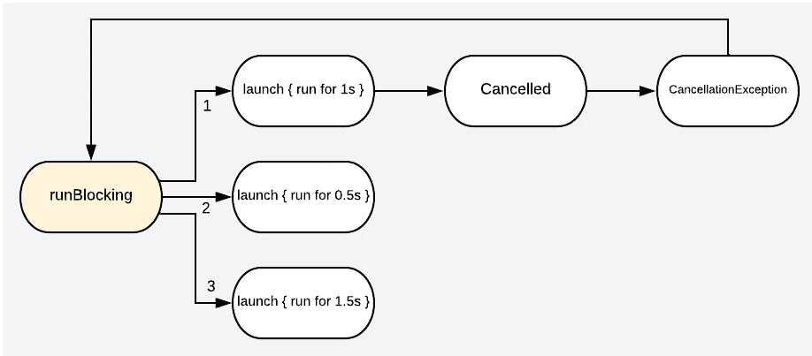
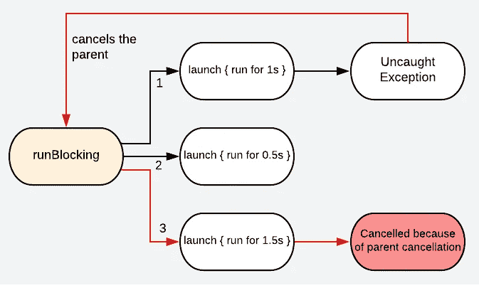

# 科特林协程中的异常感知

> 原文：<https://betterprogramming.pub/a-perception-of-exception-in-kotlin-coroutines-d0b87131510f>

## 别让他们控制你，你来控制他们！


照片由[叶戈尔·迈兹尼克](https://unsplash.com/@vonshnauzer?utm_source=medium&utm_medium=referral)在 [Unsplash](https://unsplash.com?utm_source=medium&utm_medium=referral) 拍摄

异常处理是任何代码执行的一个非常重要的部分，当涉及到协同程序时，它变得非常关键，因为要理解协同程序的异常处理，您需要理解它们的基本操作方式和它们支持的并发模式。在不知道的情况下，编写任何数量的 try-catch 块都没有任何帮助。

*如果你想知道协程是什么，为什么，以及怎样的，读读* [*这个*](https://blog.devgenius.io/kotlin-coroutines-what-why-how-99529c951a2e) *和* [*这个*](https://blog.devgenius.io/kotlin-coroutines-job-and-timeout-d7b8c5416d69) *。你不会失望的。*

假设我们对协程有了基本的了解，在本文中，我们将试图简化和理解异常处理是如何为协程工作的。我们将通过按指定顺序理解以下内容来涵盖这个主题。

*   协程上下文中的异常和取消是什么？
*   异常如何在协程层次结构中传播？
*   如何处理协程中的异常？
*   什么是异常聚合？

# 协程上下文中的异常和取消是什么？

这可能有点棘手和混乱，但在我们处理任何其他事情之前，我们需要非常清楚这一点。简单来说:

异常是意外发生的事情，对于子协程及其父协程来说是不可捕获或不可处理的。任何子协程中未捕获的异常都会取消其父作业。

取消是指用`CancellationException`取消一个协程，但不取消其父进程的作业。父处理程序忽略用`CancellationException`取消协同程序，因为这是被取消的协同程序的预期行为。

虽然这是两种不同的行为，但也是相互关联的，因为取消在内部使用`CancellationException`来更新父代。

是的，就是这么简单。随着我们的前进，我们会对这些有更多的了解。

# 异常如何在协程层次结构中传播？

现在我们知道了什么是异常和取消，让我们看看异常是如何在协程中引发并在层次结构中传播的。

场景 1:协程提供协作取消，即如果子进程未能完成其任务或被取消，它会将其异常传递给其父进程协程。



图片 1

该图显示了`runBlocking`协程有三个子协程。因此，如果第一个被取消，那么它将把`CancellationException`传递给它的父进程，即`runBlocking`，父进程将简单地忽略这个异常，因为它是一个被取消的作业的异常行为。

该代码是图像 1 的实现。我们可以看到，launch 1 没有打印在日志中，因为它被取消了，但其余的作业都已执行。

场景 2:如果协程的子进程未能完成其任务，并抛出一个未被捕获的异常。异常再次被传递给父进程，但是在这种情况下，父进程将取消它的所有子进程和它自己的任务。



图片 2

我们看到，一旦 launch 1 抛出异常，第三次启动就无法完成，因为父进程取消了其子进程的所有作业。

嗯！以上两个场景描述了协作取消，并展示了异常是如何传递到层次结构的根的。现在我们已经知道了异常传播，让我们继续。

# 如何处理协程中的异常？

使用`CoroutineExceptionHandler`可以修改未捕获的异常行为。这是一个异常处理程序，可以与根父级一起使用，并充当通用 catch 块。一旦我们进入异常处理程序块，我们就不能对异常做太多的事情，因为当处理程序被调用时，协程已经完成了它的执行。

> CoroutineExceptionHandler 仅在未捕获的异常上调用，这些异常不会以其他方式处理。

场景 1:让我们首先看看如果我们将这个处理程序传递给我们的子协程会怎么样。

正如我们所见，我们创建了一个`CoroutineExceptionHandler`对象，并将其传递给我们的 launch 1。如果我们运行这段代码，我们会看到在输出中没有调用 launch 3，也没有打印异常日志。为什么？

*嗯，那是因为 launch 1 是* `*runBlocking*` *的子节点，它会把它的异常传递给它的父节点，所以这种情况下的异常处理程序是无效的。*

场景 2:现在让我们看看如果我们将这个处理程序传递给一个根协程会怎么样。

这里，launch 1 是一个根协程，这意味着它不是`runBlocking`的子进程。如果有孩子的话，它就是孩子的父母。现在，当根协程抛出一个异常时，我们打印出异常日志，显示传递异常处理程序只对根协程有效，而不对子协程有效。

场景 3:让我们也看看使用异步构建器的场景 2。

运行代码，我们会看到，即使在传递了根异步构建器中的处理程序之后，异常也在 catch 块中被捕获。这是为什么呢？

*这样做的原因是异步构建器返回的结果被封装在延迟对象中，这意味着即使有未捕获的异常，它也会被封装在延迟对象中。*

因此在 deferred 上调用`await()`意味着我们正在通过 await 调用等待结果，因此这个 await 调用接收到异常并抛出它。因为它在 catch 块中，所以我们在 catch 块中捕获异常，而不是在处理程序中。

我们可能会有一个疑问，为什么我们不把处理程序传递给 runBlocking？答案如下:

> " CoroutineExceptionHandler 总是安装到在 GlobalScope 中创建的协程中。为在主运行阻塞范围内启动的协同例程安装异常处理程序是没有意义的，因为尽管安装了处理程序，当其子例程异常完成时，主协同例程总是会被取消。”

# 什么是异常聚合？

当多个子节点因异常而失败时，第一个子节点赢得传播竞赛，其余的子节点作为被抑制的子节点被附加。这称为异常聚合。

此功能仅受 JDK 7+支持，输出如下所示

```
CoroutineExceptionHandler got java.io.IOException with suppressed [java.lang.ArithmeticException]
```

其中 IOException 由一个孩子抛出，算术由另一个孩子抛出。

哇哦。最后，我们清楚地了解了如何处理协程中的异常。一定要试着自己运行代码片段，尝试不同的场景来理解功能。

*如果你想阅读协程基础知识，可以在这里阅读*[](https://blog.devgenius.io/kotlin-coroutines-what-why-how-99529c951a2e)**和* [*在这里*](https://blog.devgenius.io/kotlin-coroutines-job-and-timeout-d7b8c5416d69) *。**

*希望这能对你有所帮助。会尽量以简化的方式带来更多的内容。如果你有任何建议的话题，请告诉我。*

*如果您喜欢内容，我们可以在 [Medium](https://saurabhpant.medium.com/) 或 [GitHub](https://github.com/aqua30) 上连接。订阅电子邮件以获得新主题的即时更新。*

*目前就这些。敬请期待！*

*下次见。*

*干杯！*