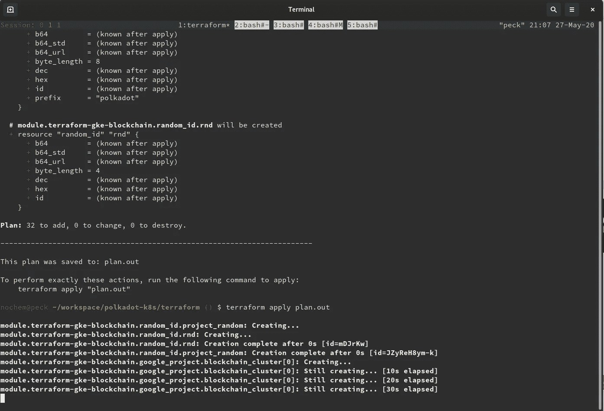
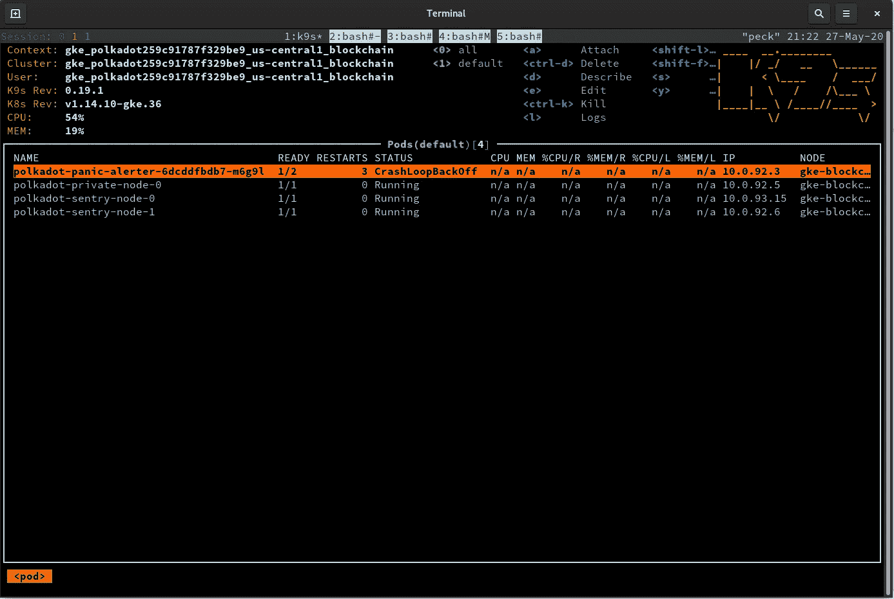
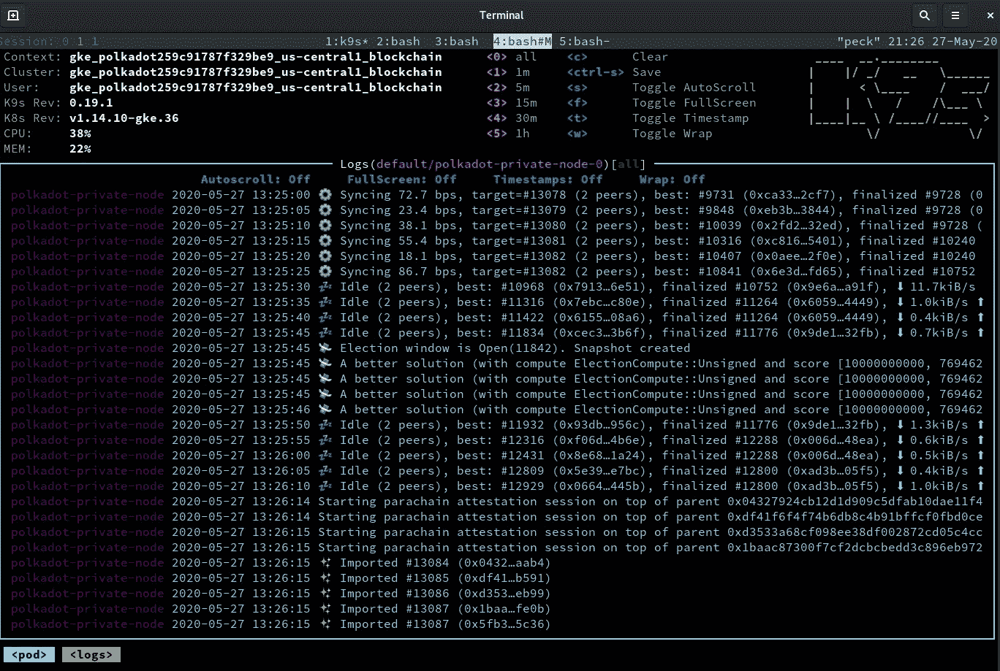
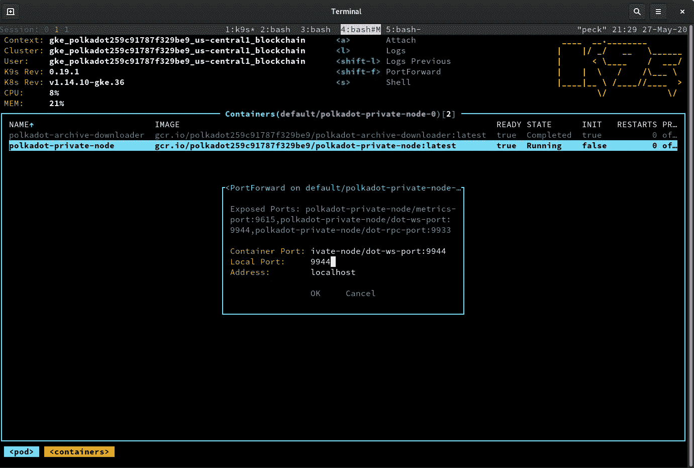
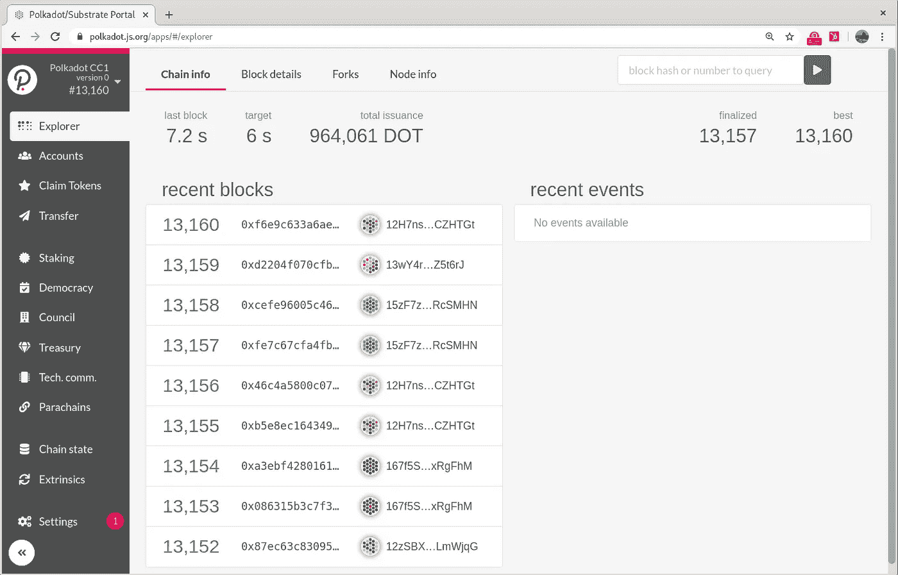

# 如何在 Kubernetes 上运行 Polkadot 验证器

> 原文：<https://betterprogramming.pub/a-polkadot-validator-on-kubernetes-3e694cb43841>

## 介绍 polkadot-k8s


[谭伟](https://unsplash.com/@samtillo?utm_source=medium&utm_medium=referral)在 [Unsplash](https://unsplash.com?utm_source=medium&utm_medium=referral) 上拍照。

我们正在介绍 [polkadot-k8s](https://github.com/midl-dev/polkadot-k8s) ，这是一个开源项目，旨在一次性完成一个安全的 [Polkadot](https://polkadot.network) 或[草间弥生](https://kusama.network)验证器设置。波尔卡多特是一个区块链，草间弥生是波尔卡多特的金丝雀网络。

我们已经使用这个模型成功地运行了草间弥生验证器两个月了。我们还在 Kubernetes 经营一家 [Tezos 面包店。](https://medium.com/@midl.dev/tezos-bakery-kubernetes-c0a2e9df1fc6)

在本教程中，我们将展示如何在您的笔记本电脑上使用几个实用程序在 Google Kubernetes 引擎上部署一个验证器。一切都是自动化的，并在代码中指定。不需要编译任何 Rust 代码或安装任何启动脚本。

这不是灵丹妙药！作为一名验证者需要细心和持续的关注，但是当您建立自己的操作时，您可能会发现这是一个很好的起点。

波尔卡多/草间弥生代币有价值。为了避免资金损失，在网络互动中要谨慎判断。

# 如何部署

首先，熟悉 Polkadot 中的[赌注概念，并通读关于如何](https://wiki.polkadot.network/docs/en/learn-staking)[成为验证者](https://wiki.polkadot.network/docs/en/maintain-guides-how-to-validate-kusama)的指南。

创建一个[谷歌云](https://cloud.google.com)账户。你将获得 300 美元的免费积分。这将让你免费试用本教程。

接下来，下载以下实用程序，并将其安装在您的计算机上:

*   [谷歌云 SDK](https://cloud.google.com/sdk/)
*   库贝克特尔
*   [地形](https://www.terraform.io/downloads.html)

验证和创建本地应用程序凭据:

```
gcloud auth login
gcloud auth application-default login
```

然后克隆 [polkadot-k8s 存储库](https://github.com/midl-dev/polkadot-k8s)并发出以下 Terraform 命令:

```
cd terrraform
terraform init
terraform plan -out plan.out
```

然后，Terraform 会要求您填充一个变量列表:验证器的名称、遥测 URL、链类型、绑定地址等。关于[的完整列表和完整示例](https://github.com/midl-dev/polkadot-k8s#populate-terraform-variables)，请参见自述文件。你也可以用你所有的变量预填充一个名为`terraform.tfvars`的文件。

最后:

```
terraform apply plan.out
```

这是部署一切的一个命令。它将:

*   创建一个 Kubernetes 集群。
*   构建必要的容器。
*   下载并解压一个[预同步的数据库](https://dotleap.com/how-to-import-a-pre-synced-kusama-database/)，如果你传递了一个 URL，可以更快的恢复。
*   旋转哨兵和验证者节点。
*   调出 [Polkadot 紧急警报器](https://medium.com/simply-vc/panic-for-polkadot-2a3a97f0e9cb)预先配置，当设置出现问题时，它会向您发送电报警报。



几分钟内从零到同步。

## 连接到您的群集

运行 Terraform 命令后，您的环境将配置为连接到新创建的集群。

您可以使用 [K9s 实用程序](https://k9scli.io/)来浏览您的集群、显示日志和转发端口。从以下内容开始:

```
k9s
```



一个验证节点由两个哨兵保护。

您可以点击`l`来浏览日志并查看您的节点同步:



验证器节点被配置为只与两个哨兵对等。

您可以点击`shift+f`在您的私有节点上启用端口转发，然后将本地和远程端口设置为 9944 (WebSocket):



WebSocket 端口 9944 将可以在本地访问。

然后在你的网页浏览器中打开 [polkadot.js app](https://polkadot.js.org/apps/#) ，点击页面左上方，选择“本地节点”作为你的端点。



您现在可以绑定您的点令牌并[注入您的会话密钥](https://wiki.polkadot.network/docs/en/maintain-guides-how-to-validate-kusama#generating-the-session-keys)。然后[根据指南注册为验证者](https://wiki.polkadot.network/docs/en/maintain-guides-how-to-validate-kusama#validate)。

# 为什么是 Kubernetes？

在风险证明网络中进行验证并不是一劳永逸的。您需要了解协议的发展，并仔细监控您的基础设施。Kubernetes 提供了一个强大的抽象层，帮助您关注真正重要的东西——运行时。它的架构使得软件的增量更新变得容易。它消除了所有“它在我的机器上工作”的问题。

Kubernetes 还抽象出了云提供商(AWS、GCP、Azure)之间的差异。它减少了摩擦，实现了有利于网络去中心化的多云策略。像 [K3s](https://k3s.io/) 这样的项目使得在你自己的服务器上运行它成为可能。

学习 Kubernetes 对于运行一个可伸缩的分布式风险证明基础设施来说是一项值得的投资。