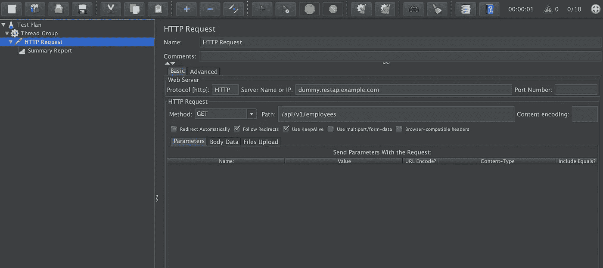
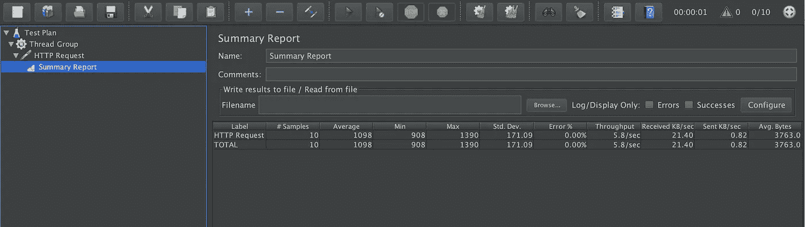
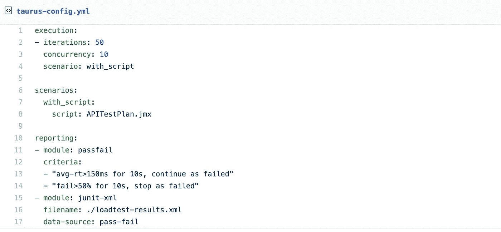
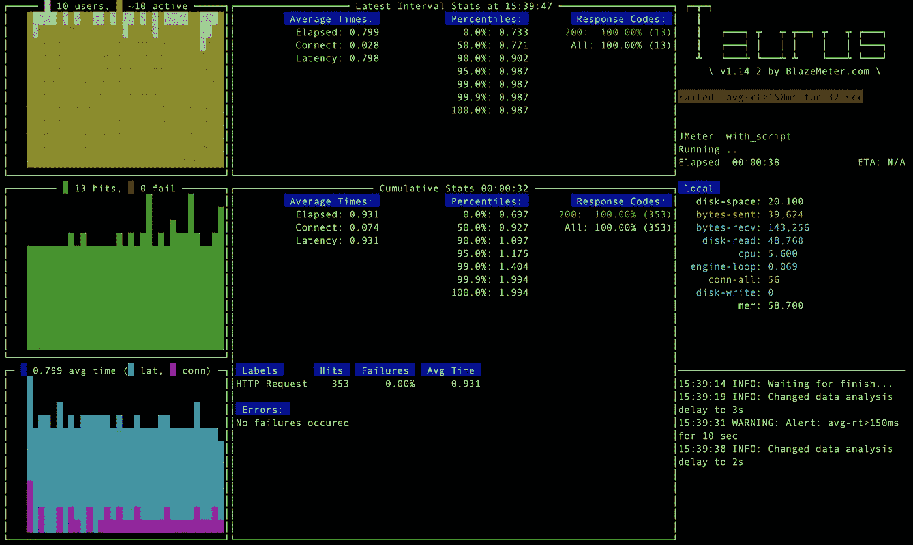
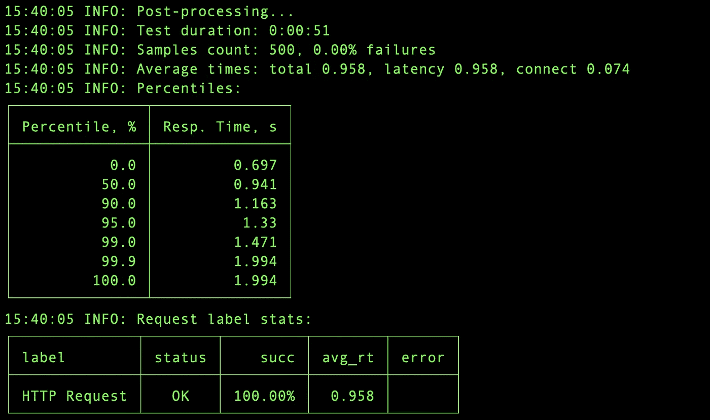
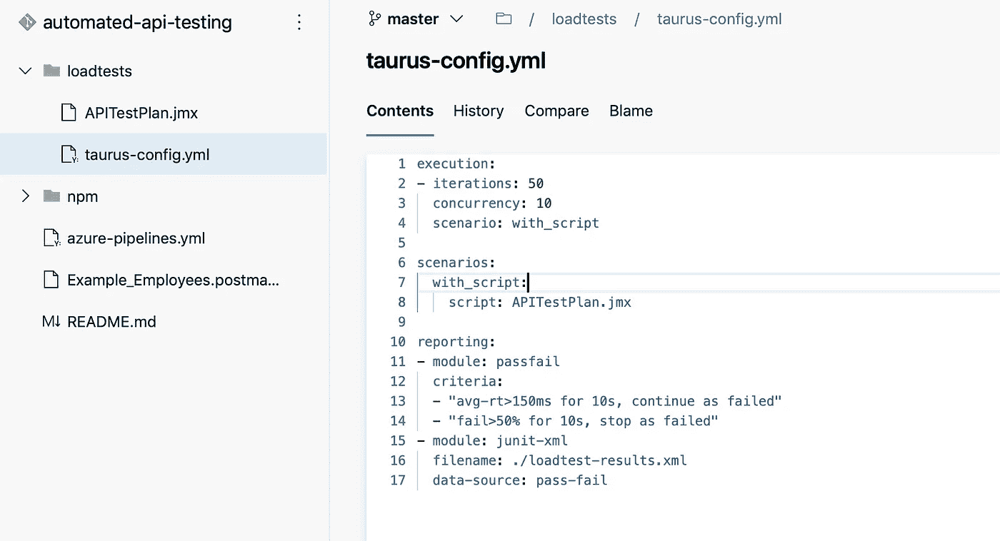
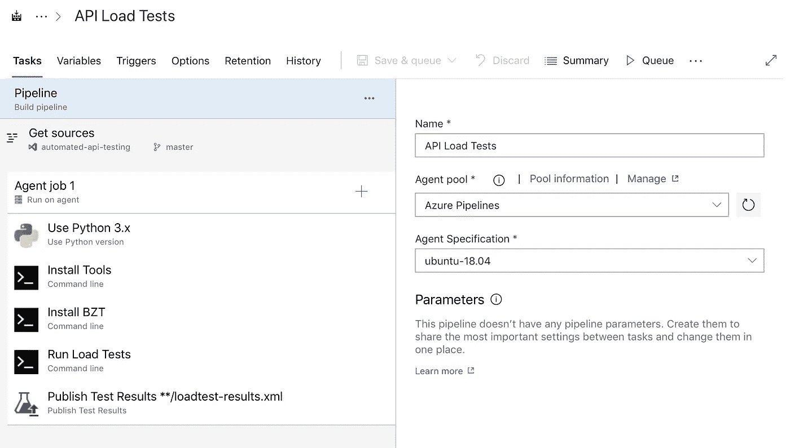
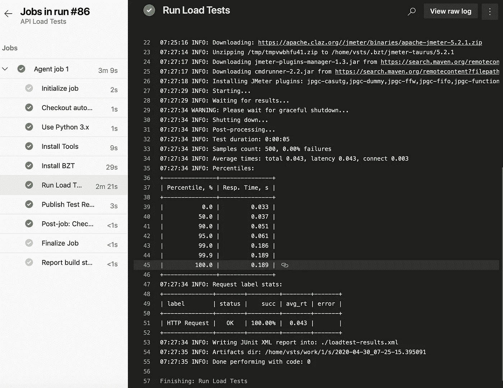
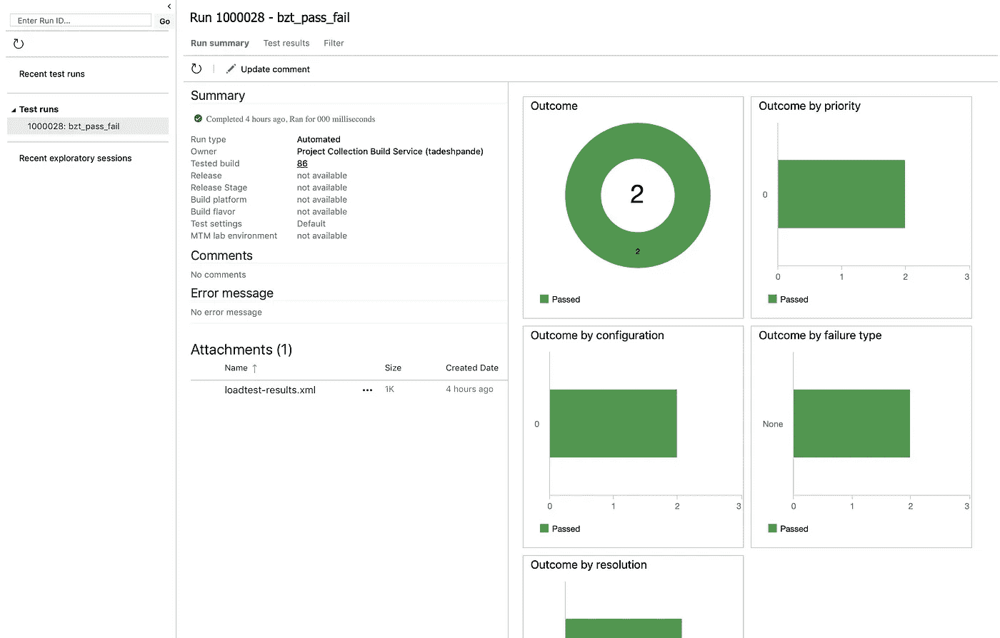

# 加载测试 API 的强大而实用的方法

> 原文：<https://betterprogramming.pub/a-powerful-and-practical-way-to-load-test-apis-48128ecf1bd>

## 使用 Apache JMeter、Taurus 和您最喜欢的 DevOps 平台


埃里克·麦克林在 [Unsplash](https://unsplash.com/s/photos/gauge?utm_source=unsplash&utm_medium=referral&utm_content=creditCopyText) 上的照片

根据维基百科，

> “持续测试是执行[自动化测试](https://en.wikipedia.org/wiki/Test_automation)的过程，作为软件交付管道的一部分，以获得与软件发布候选相关的业务风险的即时反馈。”

在我之前的[文章](https://medium.com/better-programming/automate-your-api-testing-with-ci-pipelines-ee6b8d133114)中，我写了如何使用 Postman/Newman 执行 API 的功能测试，并将其集成到 DevOps 平台中。自动化测试的另一个重要方面是负载测试，它帮助我们分析应用程序在压力下的行为。

市场上有各种工具可以帮助我们执行负载测试。 [Apache JMeter](https://jmeter.apache.org/) 是这个领域中使用最广泛的开源工具之一。

本文期望您对 REST APIs、Apache JMeter 和持续测试有一个基本的了解。

# 阿帕奇 JMeter

Apache JMeter 帮助我们在各种应用程序上执行负载测试，例如:

*   SOAP/REST API
*   文件传送协议
*   通过 JDBC 的数据库
*   轻量级目录访问协议
*   通过 JMS 的面向消息的中间件(MOM)
*   邮件— SMTP、POP3 和 IMAP
*   本机命令或 shell 脚本
*   传输控制协议（Transmission Control Protocol）
*   Java 对象

它为我们提供了一个很好的 GUI，可以用来创建测试计划。它还为我们提供了一个命令行工具，帮助我们将负载测试作为一个无头流程来运行。这个特性帮助我们将 JMeter 集成到各种自动化工具中。

在本教程中，我使用了一个非常简单的来自 dummy.restapiexample.com 的 REST API。

使用 JMeter，我将在 Get All Employees API 上运行负载测试。

# 准备并执行测试计划

使用 JMeter GUI，您可以很容易地创建一个调用 API 的测试计划，并准备一个总结报告，如下面的屏幕截图所示。



执行之后，您可以在摘要报告部分检查结果，如下所示。



为了获得详细的报告，您可以使用 JMeter 命令行工具运行测试计划:

```
jmeter -n -t APITestPlan.jmx -l result.txt -e -o reports/
```

这里的`APITestPlan.jmx`是我在上一步中创建的测试计划。`result.txt`是存储测试结果的文件，`reports`是创建 HTML 报告的文件夹。如果你打开`reports/index.html`页面，你会看到非常直观的结果:


您可以根据业务需求增加测试的复杂性。

# 金牛星座

Taurus 是一个开源自动化框架，用于运行各种开源负载测试工具和功能测试工具。对于常规的自动化测试运行，您只需要坚持使用 Apache JMeter。但是如果您计划进行连续测试，那么您需要使用像 Taurus 这样的工具来运行负载测试，并以一种通用的格式生成结果，如 JUnit results。

安装金牛座很容易。可以在[安装页面](https://gettaurus.org/install/Installation/)查看详情。

```
pip install --upgrade pip wheel
pip install bzt
```

安装完成后，您需要创建一个配置文件`taurus-config.yml`，如下所示:



[https://gist . github . com/deshpendanmay/436 cf 345667057 ad 5 aead 351 a 03 b 76d 1](https://gist.github.com/deshpandetanmay/436cf345667057ad5aead351a03b76d1)

在上面的脚本中，您需要给出 JMeter 测试计划的路径。这里您需要 JUnit 格式的报告，这样您就可以使用测试结果并将它们上传到 DevOps 平台。金牛座还提供其他报告选项[和](https://gettaurus.org/kb/Reporting/)，您可能想探索一下。

要检查一切是否正常，您可以运行 Taurus 命令行，如下所示:

```
bzt taurus-config.yml
```



运行后，您将能够在命令行上看到详细的报告，如下所示:



# 与 Azure DevOps 集成

既然您已经能够在您的 PC/笔记本电脑上执行测试，那么是时候将这些集成到持续测试管道中了。

为此，您需要将 Taurus 配置文件以及 Apache JMeter 测试计划文件提交给 Git repo。



接下来，您需要创建一个管道，它由以下步骤组成:



在这里，我使用 Azure DevOps 托管代理。如果您使用自己的代理，那么您不需要在每个管道运行时安装先决条件。

1.  使用 Python-在此步骤中，您告诉代理我们需要使用 Python 3.x。
2.  安装工具-在这一步中，您将安装对安装其他工具有用的 Python 工具。

```
python -m pip install --upgrade pip setuptools wheel
```

3.安装 BZT——在这一步中，您将安装 Taurus 工具。

```
pip install bzt
```

4.运行负载测试—在这一步中，您将运行实际的负载测试并收集结果。

```
bzt loadtests/taurus-config.yml
```

如果运行成功，步骤 4 将生成一个 JUnit 格式的 XML 文件。

注意，如果还没有安装，Taurus 会下载 Apache JMeter 二进制文件。

5.发布测试结果—在这一步，您将测试结果发布到 Azure DevOps 测试计划。这里您需要给出用于以 JUnit 格式记录结果的文件名。

# 运行管道

完成上述步骤后，您需要运行管道。在成功执行时，你会得到管道的结果，如下所示:



作为最后一步的结果，测试结果也将发布在 Azure DevOps 测试计划中。



```
Hey, if you enjoyed this story, check out [Medium Membership](https://deshpandetanmay.medium.com/membership)! Just $5/month!*Your membership fee directly supports me and other writers you read. You’ll also get full access to every story on Medium.*
```