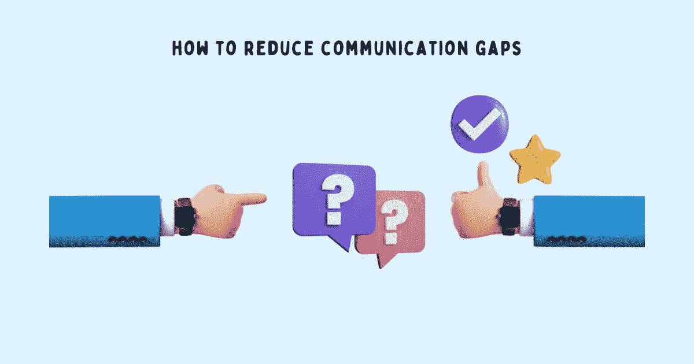

# 缩小工作中沟通差距的强大框架

> 原文：<https://betterprogramming.pub/a-powerful-framework-to-reduce-communication-gaps-at-work-c240103367d>

## 当沟通在工作中中断时，更多的时间被浪费在填补一致和期望的差距上，而更少的时间被浪费在富有成效的工作上



鸣谢:作者

工作中是什么成就或破坏了一个项目？是什么决定了员工是喜欢一起工作还是尽量避免任何需要协作的事情？什么因素使管理者能够授权给他们的团队成员？什么能与利益相关者建立信任？

有效沟通。这是一起工作、推进职业发展、让工作成为快乐经历的关键因素。当沟通在工作中中断时，更多的时间被浪费在填补一致和期望的差距上，而更少的时间被浪费在富有成效的工作上。除此之外，还有所有的挫败感、压力和焦虑，它们来自于你无法控制的感觉，你对此无能为力。

在团队环境中，当你理解有效沟通的细微差别时，你可以运用策略来减少沟通不畅的影响。不要寻求完美的一致——这在团队环境中是不可能的，只会增加失望感——而是关注你能控制的范围，以及你能采取的让与他人合作不那么痛苦、更有趣的做法。

向内审视你自己的行为和行动——存在什么差距，需要什么改变，你能做什么——是一种授权。这是一种微妙的心态转变，对控制你自己的工作体验非常有效。

> “该关心的时候了；是时候承担责任了；领导的时候到了；是改变的时候了；是时候忠于我们最伟大的自我了；是时候停止指责别人了。”史蒂夫·马拉波利

当我在工作中遇到沟通问题时，我采用了开始、停止和继续的框架。这个框架虽然以团队回顾、设定个人发展目标、给予和获得反馈而闻名，但对于采用沟通实践来填补工作中的沟通缺口也非常有用。

这就是开始、停止和继续框架的工作方式。反思你过去的项目、讨论和会议。思考您所面临的沟通挑战——什么有效，什么导致了问题，以及您可以采取什么措施来缩小这些差距。

然后写下:

1.  开始:为了减少工作中的沟通问题，你必须采取哪些行为，采取哪些主动行动？
2.  停止:哪些行为和行动没有帮助，只会增加更多的问题？
3.  继续:哪些行为和行动是有帮助的，你必须继续？

你必须创造你自己版本的“开始、停止和继续”,并养成每月反思、适应和完善的习惯。开放性、灵活性和好奇心将使你打破沉思的消极循环，这只会浪费时间，相反，你可以把时间花在建设性的行为和行动上。

这就是我如何将开始、停止和继续框架付诸实践的。您可以根据自己的具体情况和环境进行调整。

# 为了减少沟通的差距，开始这样做吧

我没有指责那些毫无意义且会导致自我挫败的行为，而是发现了那些有机会减少沟通问题但从未付诸实施的行为。

在剖析了过去的对话、冲突和其他紧张时刻后，我开始将这些实践融入到我的日常对话中:

1.  在项目开始时花时间澄清依赖性并寻求一致性。将这个问题留到以后，会在团队之间产生摩擦，破坏信任，并使与其他人的合作变得更加困难。
2.  明确你的需求。需要培训、获得特定的资源、问题的背景、需求的清晰性，甚至需要他人的帮助？不要假设别人知道你想要什么，明确地提出要求。
3.  如果某件事很重要，就值得关注。确保被听到的唯一方法就是重复一遍。继续做，直到每个人都明白为止。重复可能会激怒一些人，但激怒总比任由混乱好。
4.  不要假装在听，实际上要注意，要活在当下。远离干扰(电子邮件、聊天、电话),致力于成为谈话的一部分——精神上和身体上。你会得到更好的解决方案和更好的结果。
5.  如果你不打算做某事，不要说“也许”或“我会考虑一下”拒绝。不管怎样，他们都会失望的。最好坦白一点。
6.  当交流困难的事情或任何有可能被误解的事情时，清楚地陈述意图。

> “带着好奇心去听。诚实地说话。正直行事。沟通的最大问题是我们不听不理解。我们听听回复。当我们带着好奇心听的时候，我们不会带着回答的意图去听。我们倾听话语背后的内容。”——罗伊·T·贝内特

# 为了减少沟通的间隙，停止这样做

为了确保我自己的行为和行动不会妨碍我与他人合作、交流和工作的方式[，我决定停止这样做:](https://www.techtello.com/cross-functional-collaboration/)

1.  讨论围绕着指责和确定谁是错的，而不是找到解决办法。
2.  将个人目标置于团队成功之上。
3.  用借口和受害者心态来证明结果。
4.  拒绝承担责任。
5.  用肤浅的解释隐藏问题，而不是深入挖掘。
6.  掩盖错误，而不是公开谈论错误，寻找前进的方法。
7.  当事情没有按预期发展时，假设人们有不良意图，而不是考虑环境和其他因素。
8.  假设每个人都有做出好决策所需的背景和清晰的思路，而不需要付出努力去实现它。
9.  让我的自负妨碍了有用的对话。
10.  把所有的信息都留给自己，不与他人分享，成为一个瓶颈。
11.  避免冲突而不是正面解决冲突。

> “我们不能控制人们解释我们的想法或思想的方式，但我们可以控制我们选择用来传达它们的语言和语调。和平建立在理解上，战争建立在误解上。”—苏西·卡西姆

# 为了减少沟通的差距，继续这样做

过多地关注消极的一面会让你失去辨别什么有效的能力。审视你的积极行为和行动——无论多么微小——并战略性地运用它们，可以解除他人的武装，建立信任，并展示你的优势。这也是确保你的工作被他人看到和认可的一个好方法。

多年来，我一直依赖这些行为和行动，它们很好地帮助我减少了沟通中的空白:

1.  与我的经理和其他利益相关者分享每周更新。突出关键里程碑、正在进行的项目、风险区域中的项目以及后续步骤。这个简单的更新花费了我 10 分钟的时间，节省了会议中数小时的时间——主动异步沟通让每个人都能及时了解问题以及我为降低任何风险而采取的步骤。没有必要浪费时间面对面地开会讨论一些通过电子邮件就能很好完成的事情。
2.  根据目标受众调整沟通方式。这包括确定他们关心的信息和他们理解的语言，例如，与我的经理分享技术更新，同时与产品和业务利益相关方一起关注业务指标。
3.  了解最适合他们接收这些更新的渠道(电子邮件、面对面、聊天),并调整此类沟通的频率。随着每个人的一致，在临时对话中浪费的时间就更少了。
4.  记录关键的假设和观察结果(而不是把它们记在脑子里),并在开始开发之前得到涉众的认可，以减少理解上的差距，减少可避免的错误。
5.  通过做适当的工作评估来清楚明确时间表，而不是对我的[承诺](https://www.techtello.com/keeping-commitments/)含糊其辞。
6.  让其他人负责坚持他们的交易，并确保他们了解不满足这些期望的影响。
7.  调整成功标准——如何衡量它——以避免结果不符合他人的期望。例如，如果我必须交付具有特定功能的 API 端点，那么预先同意是什么使这些端点成功(格式、错误代码、QPS、响应时间等)。).

你不可能找到一个人和团队 100%一致的完美工作环境。当来自不同背景、背景、技能和愿望的人一起工作时，沟通问题必然会发生。

然而，不要认为事情会自行好转。不要抄袭。不要抱怨。不要接受现状，学会带着沟通问题生活。采用开始、停止和继续框架，成为变革的一部分。

> “你可以灰心丧气很多次，但只要你不开始责怪别人并停止努力，你还不是一个失败者。”—约翰·巴勒斯

# 摘要

1.  良好的沟通是授权。它建立信任，提高生产力，并激发合作。沟通不畅会让人感到不满意、被误解或不重要。
2.  没有一个工作场所没有沟通问题。然而，责怪别人并不能解决问题。从内部审视你自己的行为和行动。
3.  采用这些方法来减少沟通中的空白——澄清依赖关系，明确你的需求，使用重复，集中注意力，学会说不，陈述你的意图。
4.  摒弃那些让沟通变得更困难而不是更容易的行为和行动——指责、找借口、拒绝承担责任、假设不良意图、成为瓶颈或避免冲突。
5.  继续致力于良好的沟通实践将会显示积极的结果——分享更新、适应受众、记录假设、明确陈述时间表，以及成为成功的共同定义的一部分。

```
Follow me on [Twitter](https://twitter.com/techtello) for more stories. This story was originally published at [https://www.techtello.com](https://www.techtello.com/reduce-communication-gaps/).
```