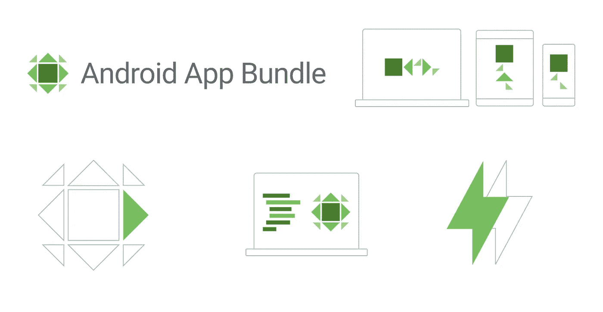
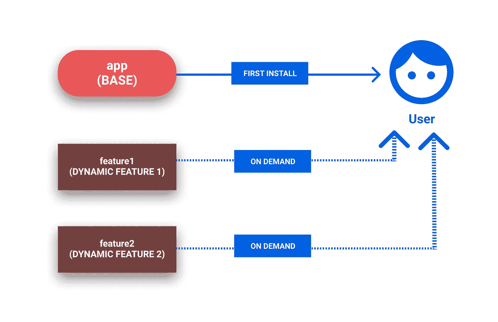
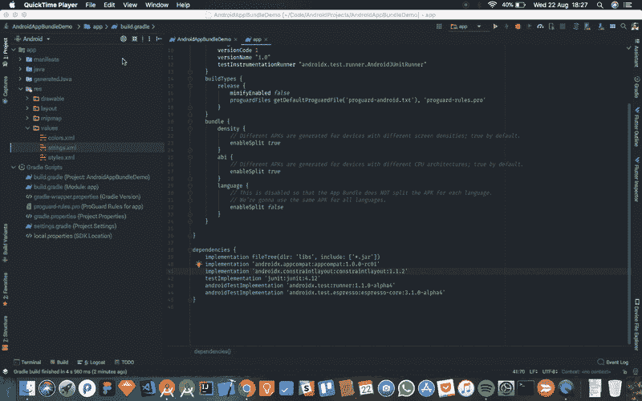
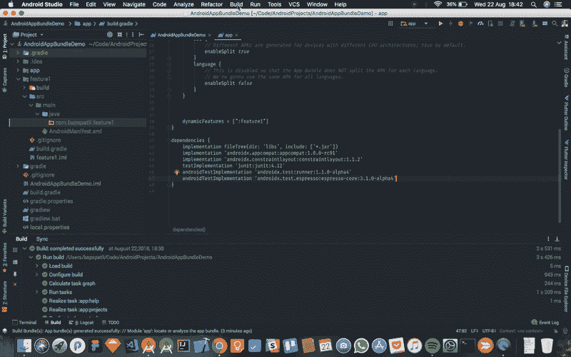

# 面向初学者的 Android 应用捆绑实用指南

> 原文：<https://betterprogramming.pub/a-practical-guide-to-android-app-bundle-for-beginners-7e8d93831828>

## 探索 Google Play 的新应用发布格式



图片来自[安卓开发者](https://developer.android.com/guide/app-bundle/)

[Android 应用捆绑包](https://developer.android.com/platform/technology/app-bundle/)是谷歌的一种应用发布格式，支持仅在您需要时下载您应用的部分内容。比起为你的 Android 应用构建一个单一的、通用的 APK，这是一个更好的选择，而且这一切都不需要重构你的代码！

Android 应用捆绑包的文件扩展名为`.aab`，是将你的 apk 上传到 Google Play 控制台的一种替代方式。

当用户根据用户的设备配置从谷歌 Play 商店安装应用程序时，会为每个用户动态生成应用程序的 APK。这样，他们只下载他们需要的应用程序的资源和代码，从而减小应用程序的大小。

在本文中，我将介绍如何为您的应用程序构建一个 Android 应用程序包。我还将为本教程提供一个示例应用程序，以防有人想看看源代码和文件结构。它可以在这里找到:

 [## bapspatil/AndroidAppBundleDemo

### 这是一个演示应用程序，展示了如何在你的 Android 应用程序中实现 Android 应用程序捆绑包。

github.com](https://github.com/bapspatil/AndroidAppBundleDemo) 

# 使用 Android 应用捆绑包的优势

*   较小的应用程序大小-较小的 APK 大小意味着用户以较小的下载量获得您的应用程序。
*   不再需要多个 apk—您不再需要管理多个 apk。Google Play 控制台为您处理 apk 的生成和签名。
*   动态功能模块—仅在用户需要时，即按需将功能加载到您的应用中。这些特性应该作为不同的*模块*出现在你的应用程序项目中。
*   即时启用(即将推出)—您的用户无需安装应用程序，即可通过链接立即运行您的应用程序*。*

# *入门指南*

*请注意，Android 应用捆绑需要 Android Studio 3.2 或以上版本。在写这篇文章的时候，[最新的测试版本](https://developer.android.com/studio/preview/)是 Android Studio 3.2 beta 5，所以对于这篇文章，我将坚持使用 Android 插件为 [Gradle](https://gradle.org/) 3.2.0-beta05。*

*我们将为一个应用程序构建一个 Android 应用程序包，该应用程序有一个基本模块(默认的`app`模块)，以及两个我们将动态加载的功能模块(`feature1`和`feature2`)。*

*这些将为你不想包含在你的应用基础版本中的特性编码，并希望用户仅在需要时下载。*

*下面是向用户交付的应用模块的样子:*

**

# *构建您的第一个 Android 应用捆绑包*

## *第一步*

*修改您的`app`的`build.gradle`文件。*

## *第二步*

*要构建`feature1`模块，在 Android Studio 中进入*文件>新建>新建模块*。*

*从这里选择对话框中出现的*动态特征模块*，点击*下一步*。从那里开始:*

*   *选择`app`模块作为*基础应用模块。**
*   *指定`feature1`作为*模块名称。**
*   *为`feature1`模块指定一个*包名* 和一个*最低 API 级别*，然后点击*下一个*。*

*在*配置按需选项* 部分:*

*   *将*模块标题*指定为“特征 1”。*
*   *勾选*启用按需* 和*定影*的复选框。*

*然后，点击*完成*。*

**

*第二步*

*在添加活动后，您的`feature1`清单文件应该包含以下内容:*

*并且`feature1`的`build.gradle`文件应该在第一行有这个，因为它是一个动态特性:*

```
*apply plugin: 'com.android.dynamic-feature'*
```

*对`feature2`重复上述步骤。*

## *第三步*

*让我们回到您的`app`的`build.gradle`文件，并检查动态特性是否指定如下:*

## *第四步*

*现在，转到您的`feature1`和`feature2`的`build.gradle`文件，检查您的`app`模块是否被添加为依赖项。*

## *第五步*

*让我们在`app`模块中编写代码，以便在需要时下载`feature1`模块。*

*将以下依赖项添加到您的`app`的`build.gradle`文件中:*

```
*implementation 'com.google.android.play:core:1.3.4'*
```

*在您希望动态特性按需加载的活动/片段中，编写以下代码:*

*同样，在需要的地方对`feature2`重复同样的操作。*

## *第六步*

*在引擎盖下，Android Studio、Gradle 和 Google Play 使用一种叫做`bundletool`的工具来构建你的应用捆绑包，这也是一种命令行工具。*

*要构建应用捆绑包的*调试版本*:*

*点击*构建>构建捆绑包/APK>构建捆绑包*，或者您可以在命令行中完成如下操作:*

```
*./gradlew :base:bundleDebug*
```

**

*步骤 6:调试 Android 应用捆绑包的版本*

*该包可以在:`project-name/app/build/outputs/bundle/`找到。*

*要构建您的应用捆绑包的*签名发布版本*以上传到您的 Google Play 控制台:*

1.  *点击*Build>Generate Signed Bundle/APK*，然后选择*Android App Bundle***，点击 *Next* 。***
2.  ***然后，从*模块*下拉列表中选择`app`模块，这是为其构建 App Bundle 的基础模块。***
3.  ***选择密钥库后，输入密钥的详细信息，就像通常签署 APK 一样。在这一步，我建议选中*导出加密密钥*复选框。您需要稍后将这个加密的密钥文件上传到 Google Play 控制台。完成此处的操作后，单击下一步。***
4.  ***选择您的*目标文件夹*并选择*构建类型*中的`release`和*风格*中您想要构建应用捆绑包的所有风格，然后点击*完成*。***

******

***步骤 6:发布 Android 应用捆绑包版本***

***上传到 Google Play 控制台:***

*   ***确保您注册了 Google Play 的[应用程序签名。](https://support.google.com/googleplay/android-developer/answer/7384423)***
*   ***在此申请[动态特性测试程序](https://docs.google.com/forms/d/e/1FAIpQLSdjGJg_wLO7GwiMaP23ZI8-E1GHktAzN6rdaGZTCjd1h24axw/viewform)。***

***一旦您被授予访问权限，您就可以将您的 Android 应用捆绑包发布到生产环境中了！***

***仅此而已。您已经完成了您的第一个 Android 应用捆绑包！***

# ***结论***

***我用来构建 Android 应用捆绑包的演示应用的源代码可以在这里找到:***

 ***[## bapspatil/AndroidAppBundleDemo

### 这是一个演示应用程序，展示了如何在你的 Android 应用程序中实现 Android 应用程序捆绑包。

github.com](https://github.com/bapspatil/AndroidAppBundleDemo)***