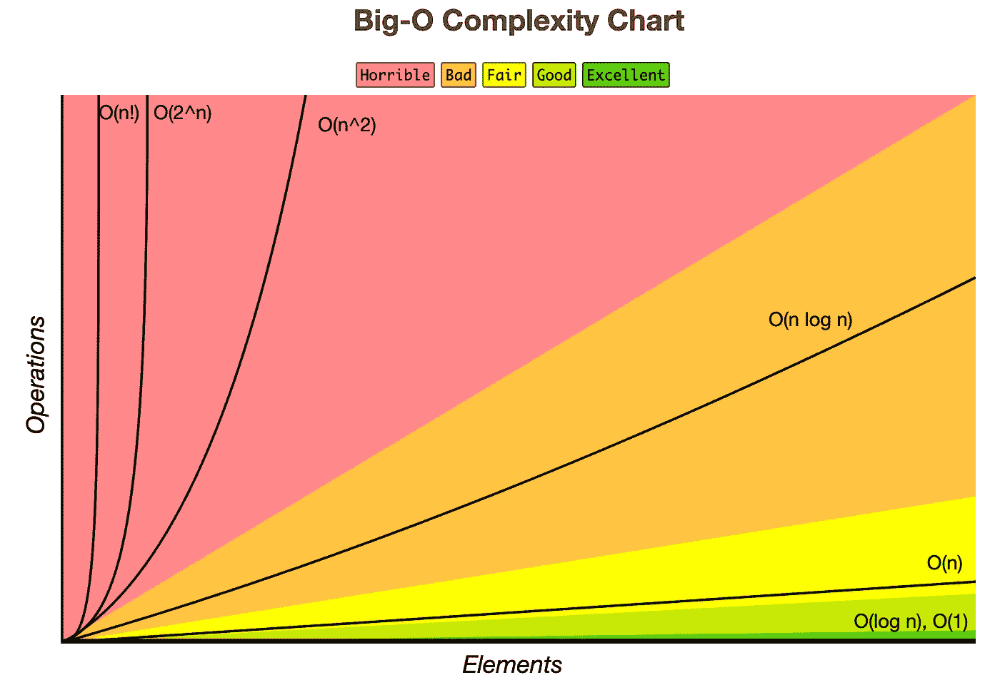
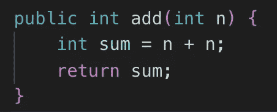
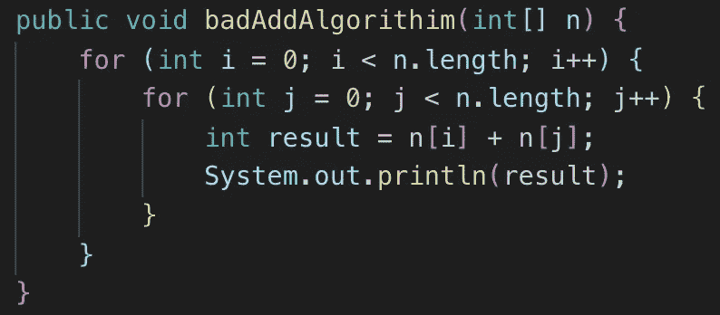
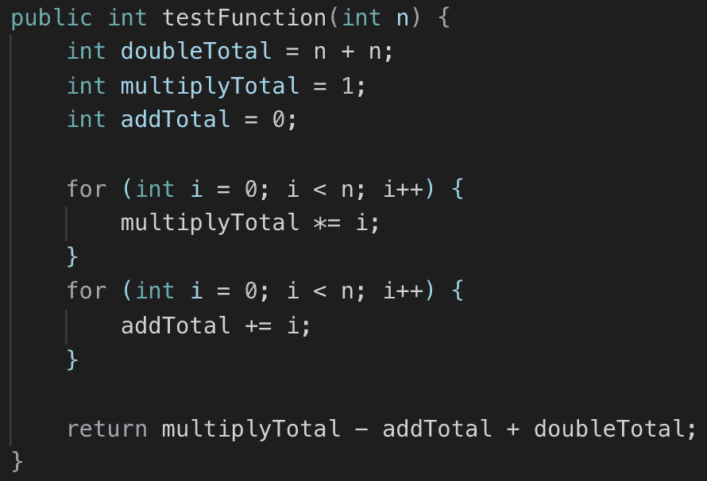
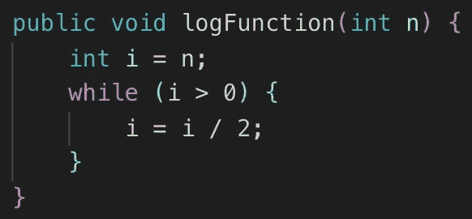

# 大 O 实用介绍

> 原文：<https://betterprogramming.pub/a-practical-introduction-to-big-o-a9f9c416aaaf>

## 不用数学术语来表达算法的效率

[JESHOOTS.COM](https://unsplash.com/@jeshoots?utm_source=unsplash&utm_medium=referral&utm_content=creditCopyText)在 [Unsplash](https://unsplash.com/search/photos/maths?utm_source=unsplash&utm_medium=referral&utm_content=creditCopyText) 上拍照

每当“大 O”这个词被提起时，你可能会联想到你可能在大型科技公司遇到的算法测试。

虽然这是真的，但它不应该被用作完全跳过软件开发如此重要的一个方面——代码如何运行——的理由。

用通俗的话来说，我们将讨论大 O 实际上是什么，为什么您应该关心它，以及您如何着手评估某些代码段的大 O 是什么。

# 什么是大 O？

大 O 是一个已经在编程世界中被接受的概念，在编程世界中，我们可以表达一个算法有多高效，而不必通过推导复杂的数学表达式的方式。

让我们面对现实吧，并不是所有的开发人员都吃数学、睡数学、呼吸数学。

您可能会面临这样的问题:“为什么我不能看到我的本地机器处理代码需要多长时间？”

检查您的代码在您的机器上运行的速度并不是您的代码总体运行速度的最佳决定因素，因为不同的用户将处于不同的环境中。

因此，我们需要一个指标来描述一个东西运行的有多快，不管它实际运行在什么环境中。这就是大 O 的用处。

说到大 O，我们可以指代码的运行时复杂度，也可以指空间复杂度(内存)。哦，作为免责声明，我将互换使用复杂性和效率这两个词。

# 为什么要在乎大 O？

在日常场景中，过分关注您正在处理的代码的复杂性可能有点不现实。你的工作也可能不需要你知道这些信息。

然而，理解 Big O 允许您确定解决问题的不同方法的优点和缺点，并允许与其他开发人员创建对话来讨论这样的权衡。

随着您继续研究不同的算法，您将会看到时间与空间的权衡。

# 评估大 O

这里有一些你应该熟悉的常用术语。这些大 O 项按照从最快到最慢的顺序排列:

1.  O(1) —常数
2.  O(log n) —对数
3.  O(n) —线性
4.  O(n log n) — n log n
5.  O(n ) —二次
6.  O(n ) —立方
7.  O(2^n) —指数
8.  O(n！)—阶乘

大 O 时间复杂度图—【https://www.bigocheatsheet.com/ 

大 O 运行时是高度一般化的。我们通常默认使用变量`n`作为算法接收的输入。尽管我们永远不会确切知道输入的大小，但我们必须假设它非常大。

我们对一个代码块进行最昂贵的计算，并以此为基础提高算法的效率。

在本文的结尾，我们将能够创建一个表达式，它包含某个代码块中大多数计算的运行时。

下面是我们可能会看到的示例表达式:

`O(n) + O(n^2) + O(1)`

在这个表达式中，我们取代价最大的运行时，称之为算法的大 O 运行时。在这个假想的例子中，运行时间是`O(n²)`，因为在给定的表达式中，计算将花费最多的时间。

但是等等…这个例子中的`n`是什么？当指定一个运行时，澄清`n`指的是什么同样重要。在这个例子中，我们可以这样说:“运行时间将是`O(n²)`，其中`n`是我们的输入数组的长度”。

通俗地说，我们可以说那个大 O 是一种在给定`N`输入的情况下衡量某物表现的方式。

处理大 O 的另一个经验法则是:我们在表达式中去掉常数。例如，`O(n) + O(n) + O(n)`会变成`O(3n)`，但我们实际上从未声称我们的运行时是`O(3n)`。相反，我们简单地称它为`O(n)`。

现在我们对不同的复杂性有了基本的了解，让我们检查一些常见的运行时，看看它们在代码中是什么样子的。

# O(1)复杂度

这指的是持续的操作。换句话说，不管我们的输入`N`有多大，这个操作仍然会做固定量的工作。考虑下面的例子:

无论我们的输入是大是小，我们仍然在做固定量的工作，占用固定量的内存。因此，该`add()`函数将具有`O(1)`的运行和空间复杂度。

# O(n)复杂度

这种复杂性指的是线性操作。因此，无论`n`被定义为什么，我们的运行或空间复杂度都与`n`成正比。让我们看一个例子。

这个算法的时间和空间复杂度都是`O(n)`，其中`n`是我们的输入数组的大小。

为什么？对于空间，我们在内存中创建一个新的数组，它与 n 的长度成正比。如果我们不创建这个数组，我们会有一个`O(1)`空间复杂度。

对于时间，我们迭代`n`元素。由于这不是一个固定的数量(与`n`的大小成比例)，我们说它有一个`O(n)`复杂度，因为这个 for 循环是我们最重的计算。

# O(n)复杂度

`O(n²)`算法最常见于两个嵌套的 for 循环中，我们迭代相同的长度。考虑下面的例子:

为了清楚起见，我们举一个简单的例子来定义`n = [1,2,3,4,5]`。

对于`i`中的每次迭代，我们在嵌套的 For 循环中遍历整个数组。使得当`i = 0`和`j = 0`时，`j`将不得不在`i`增加 1 之前迭代到`n.length-1`。

这也可以表示为`O(n*n)`运行时。

在剖析运行时时要遵循一个好的规则:每当我们有一个迭代`n`次的 for 循环时，这个 for 循环中的任何额外工作都要乘以`n`。

在前面的例子中，我们看到了正在进行的`O(n*1)`工作。如果代码没有嵌套在 for 循环或类似的东西中，我们用一个`+`符号分隔各个部分的运行时间。

考虑以下代码:

我们可以将这个运行时表示为:

`O(n) + O(n)`只是简化为`O(n)`——注意我们没有乘法`n by n`，因为它们不是嵌套循环！

# O(log n)复杂度

乍一看，这似乎有点令人困惑，因为我有意避开数学。让我们考虑下面的代码:

我们最初定义一个变量`i`等于`n`(一个常量运算)。

当`i`大于零时，在每次迭代中，我们将`i`减半。这就是对数运行时的组成。如图所示，这是我们能得到的最接近恒定运行时间的结果。

# 结论

大 O 符号是一个相当复杂的话题，但我希望你现在比以前有更好的理解。我们能够看到代码中存在常量、线性、二次和对数运行时的情况。

如果你对符号有任何问题，请随意提问。