# 为讨厌动态编程的人提供的动态编程实用介绍

> 原文：<https://betterprogramming.pub/a-practical-introduction-to-dynamic-programming-for-people-who-hate-dynamic-programming-765fa91642f1>

## DP 和 5 个清晰解释的示例问题的介绍


一张与我相似的凌乱的桌子——来自 Unsplash。

在所有的编程基础中，我发现动态编程是最难的。有什么比写文章更好的学习方法呢？我们先跳进去简单介绍一下，然后解决几个问题！

# 什么是动态编程？

## 一堂历史课

动态规划(DP)是由兰德公司的理查德·贝尔曼开发的一种优化技术。在 20 世纪 50 年代，数学研究并不是优先考虑的事情——尤其是贝尔曼的老板。

不幸的是，DP 正是如此。为了向雇主隐瞒贝尔曼正在进行数学研究的事实，贝尔曼选择了“动态编程”这个名字。引用贝尔曼自己的话:

> "这甚至不是一个国会议员可以反对的事情。"

## 为什么是 DP？

动态规划用于解决传统技术难以解决的某一子类问题。它比暴力破解更快更有效。让我们用一个示例问题来解释暴力破解和动态编程解决方案。


你有三枚硬币，价值分别是 V₁ = 1，V₂ = 3，V₅ = 5。找出最小数量的硬币，使它们的总和为 S =11。你可以重复硬币任意次。


对人类来说，一开始解决这个问题相当简单。马上就会弹出一个解决方案:5+5+1，也就是三个硬币。这是这个问题的最佳解决方案。

但是，如果你有 1000 个硬币，你要求和到 S = 12390 呢？一个最佳的解决方案可能不会马上出现在你面前，需要一些反复试验。

你怎么能确定这是最优解？你可以找到这些硬币的每一个组合，并看到解决方案是最小的一个。你要不断选择各种组合，看看它们是否等于 S，以及是否是硬币的最小数目。

这就是所谓的暴力方法。随着 *N* (硬币数量)值的增加，手动求解变得越来越困难。随着 *N* 越来越高，即使使用计算机来做这件事也会非常慢。

这就是像 DP 这样的优化技术可以用来快速解决问题的地方。

# DP 是如何工作的？

假设我们的任务是解决问题“I ”,我们需要找到这个问题的最优解。我们称这个问题为 Sᵢ，并认为它太难直接解决。

所以，我们试着解决一个子问题，Sⱼ，这里 j < i，我们发现这也太难了。我们重复这个过程，直到我们达到一个可以解决的基本情况 S₀。

一旦我们找到了 S₀的解，我们就可以用它来找到 S1，然后 S2 等等。直到我们找到 Si。这正是 DP 的工作原理。这也被称为自下而上的方法！


DP 的状态转换图

为了使用 DP，我们需要将问题分成称为“状态”的子问题，以便我们可以找到这些状态之间的关系，称为*递归关系*。

这可能听起来很难，但是我会用从简单到困难的例子来解释清楚。然后，如果你重新阅读上面的文章，它应该对你更有意义。

# 简单的问题

## 问题 1:硬币零钱

让我们用 DP 解决我上面描述的问题。

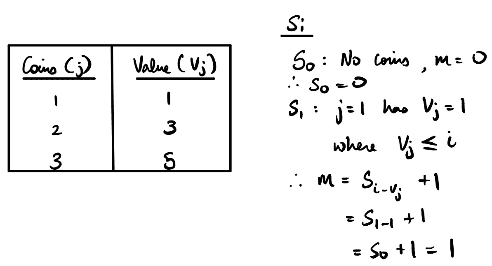

我们把这个问题分成子问题，进入状态 *i* 其中 *i* 是硬币需要加起来的值。对于每一个硬币 *j* 其中 *Vⱼ ≤ i* ，看在此之前有解的子问题，即用 *i-Vⱼ* 求和的状态。

设解为代表最优解(最小硬币数)的“m”。如果*m+1*<*s**的当前值，那么 *Sᵢ = m + 1* (其中 *m* 是状态为和 *i-Vⱼ* 的最优解，我们加 1 包括硬币 *j* )。*

*为了以编程方式解决这个问题，我们首先将所有状态 Sᵢ初始化为无穷大，将状态 0 初始化为 0，因为 0 个硬币的总和为 0。*

*所以，基本情况:S₀ = 0。*

*S₁ = 1。只有硬币 V₁ = 1 具有小于或等于状态 I 的值，其中 i = 1。现在，S₁ ₋ ᵢ = S₁ ₋ ₁ = S₀ = 0。所以 m = 0，因此，S₁ = 0+1 = 1。因此，S₁的解是一枚价值为 1 的硬币。*

*S₂ = 2。同样，只有一个硬币 V₁ = 1 的值小于或等于状态 I，其中 i = 2。现在，S₂ ₋ ᵢ = S₂ ₋ ₁ = S₁ = 1。所以 m = 1，因此，S₂ = 1+1 = 2。因此，S₂的解是两个价值为 1 的硬币。*

*S₃ = 1。这次有两个有效硬币 V₁ = 1 和 V₂ = 3，它们的值小于或等于状态 I，其中 i = 3。现在，对于价值为 1 的硬币，S₃ ₋ ᵢ = S₃ ₋ ₁ = S₂ = 2。所以 m = 2，因此，S₃ = 2+1 = 3。*

*现在，对于价值为 3 的硬币，S₃ ₋ ᵢ = S₃ ₋ ₃= S₀ = 0。所以 m = 0，因此，S₃ = 0+1 = 1。由于 1 小于 3，我们覆盖 S₃值为 1。这是 S₃.的最佳解决方案*

*这个过程一直持续到 S₁₁，如下图所示:*

*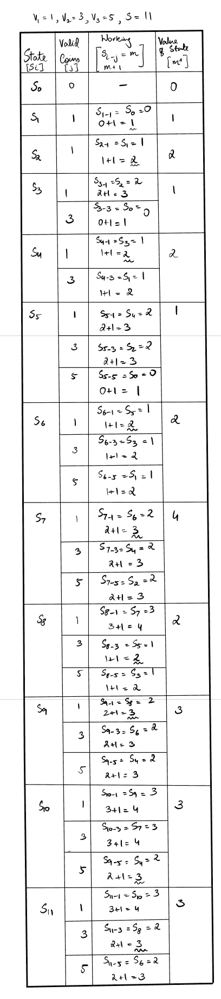*

*因此，我们发现 S₁₁的最优解是 3 个硬币。从表中我们可以看出:*

```
*S11 = S8 + coin with value 3 
S8 = S5 + coin with value 3 
S5 = coin with value 5
Therefore, S11 = coin with value 5 + coin with value 3 + coin with value 3! 5, 5, 1 is also a valid solution.*
```

*通过使用在 S₁₁之前找到的最优子解，我们保证能找到 S₁₁.的最优解*

*这就是为什么 DP 如此擅长不用蛮力的方法找到解决方案！它可以直接得到最优解，一旦我们得到最终状态的答案，我们就不必再做进一步的检查。*

## *密码*

*下面是解决这个问题的 Python 代码。如果找到，它返回最终的最优解，否则，它返回-1。*

## *问题 2:到 1 的最少步骤*

*给定一个数“n”和以下三个运算:*

1.  *如果 n 能被 2 整除，那么你可以执行 n = n/2。*
2.  *如果 *n* 能被 3 整除，那么你可以执行 n = n/3。*
3.  *可以执行 n = n-1。*

*使用这三种运算中的任何一种，将 n 变成 1 最少需要多少步？*

*例如:n = 5。*

*   *n = n-1 = 5–1 = 4*
*   *4 能被 2 整除，所以 4/2 = 2*
*   *2 能被 2 整除，所以 2/2 = 1*
*   *因此，从 5 到 1 需要三个步骤。*

*我们可以看到，这个问题与前一个问题非常相似，我们可以将这个问题分成子问题，然后先解决较简单的子问题，以找到最优解。当值为 1 时，基本情况是 S1。*

*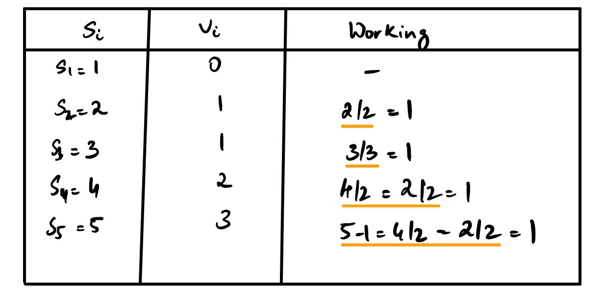*

## ***代码***

## *问题 3:增长最长的子序列*

*给定一个数列 A = [1，2，3，7，4，5]，求这个数列中增长最长的子序列的长度。A 的解是 5，由[1，2，3，4，5]给出。*

*列表的最优解由最长的子序列给出。把这个问题分成几个子问题，这样 Sᵢ就是一个 Vᵢ值的状态，如果我们考虑前“I”个元素，这就是最优解。*

*所以，基本情况下，S₀ = 1。这是因为我们只考虑列表 A 中的第一个元素 1，并且最长的递增子序列的长度为 1。*

*S₁ = 2。在这种状态下，我们考虑元素 1 和 2。因为 2 大于 1，所以值 V₁ = V₀ + 1 = 2。*

*继续这样做，直到列表结束。我们使用的条件是:*

1.  *当前数字是否大于前一个数字？*
2.  *当前数字的状态值是否大于前一个数字的状态值？*

*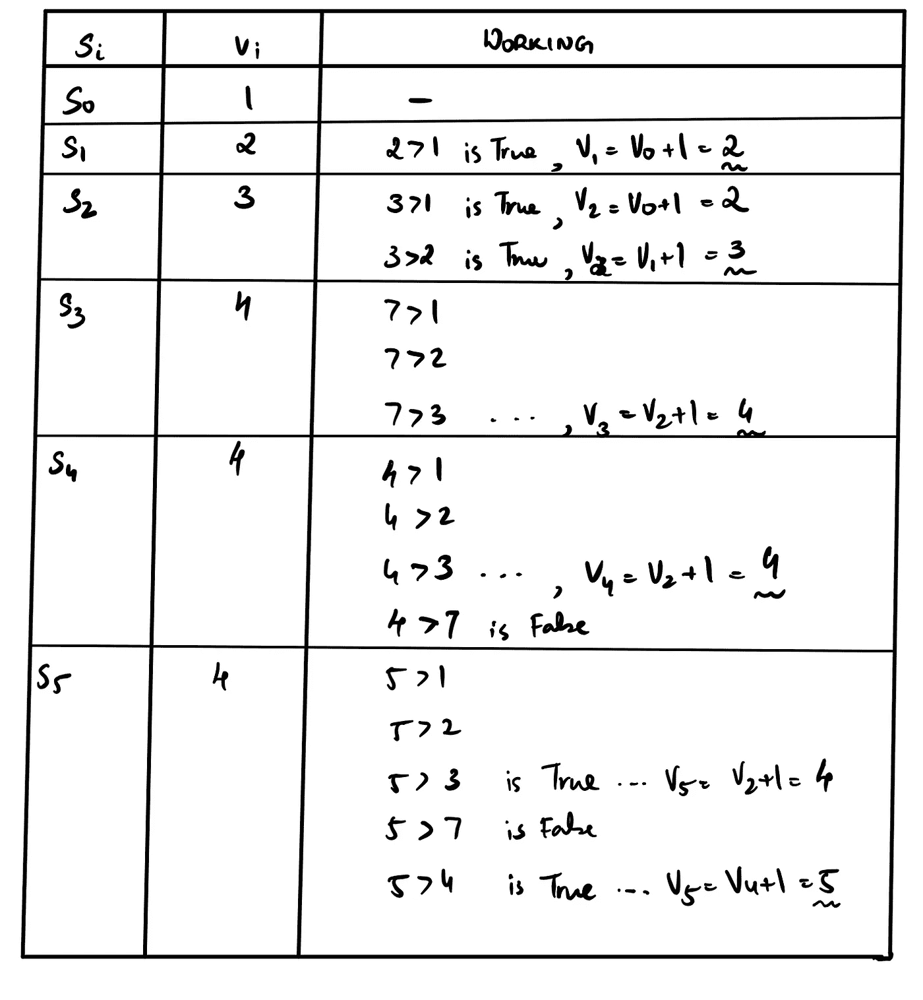*

## ***代号***

# *中等问题*

## *问题 1:背包问题*

*背包问题是一个著名的优化问题，给你一组重量为 w，值为 v，最大背包大小为 w 的项目。*

*给定 w = [1，2，3]，v = [60，100，120]，W = 4，找出项目的最佳组合，使我们最大化背包的价值，并使项目适合背包。*

***变种 1:背包中的物品可以重复***

*如果允许我们重复物品，这个问题就很像硬币找零问题。*

*基本情况:dp[0]= 0。*

*递归关系:对于 wts 中的每个 w:如果 w ≤ i 则 dp[i] = max(dp[i]，dp[w] + dp[i-w])。*

*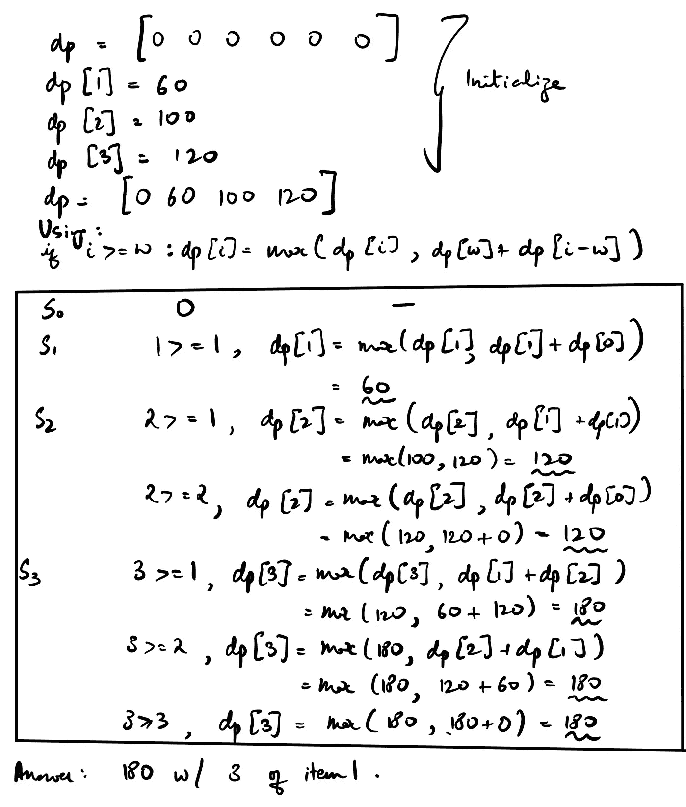*

***代码***

***变型 2:项目不重复***

*这个问题稍微有点挑战性，因为我们现在需要跟踪背包中的物品。要做到这一点，我们可以利用二维数组代替一维数组，我们已经利用了所有上述问题。*

*符号: *dp* 是一个 2d 表格，其行索引代表索引为 *u* 的物品，列索引代表背包的重量 *wᵢ* 范围从 0 到 w， *wtᵤ* 代表该物品的重量。*

*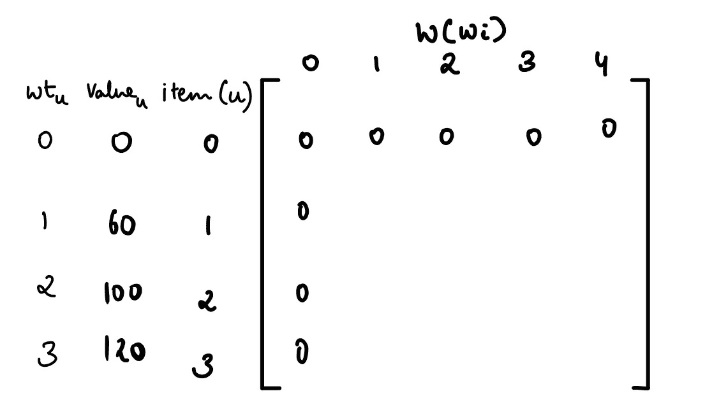*

*基础案例:*

1.  *dp[0，w]= 0-项目 0 没有权重或值，因此所有值都是 0。*
2.  *dp[i，0] = 0 —当背包重量为 0 时，不能添加任何物品，因此值为 0。*

*重复关系:*

*如果物品 *u* 的重量小于或等于当前背包的重量，那么 *dp* 的值是物品*重量= wᵢ - wtᵤ* 的背包的 vᵤ+最优值(因为该物品已经加入背包减去它)或没有前一行计算的物品的背包的最优值中的最大值。*

*这由下式给出:*

*如果 wtᵤ ≤ wᵢ: dp[u，wᵢ] = max(dp[u - 1，wᵢ - wtᵤ] + vᵤ，dp[u - 1，wᵢ])*

*否则，项目 *u* 不适合具有权重 wᵢ的背包，因此我们只放置在先前状态找到的最优值。*

*否则:dp[u，wᵢ] = dp[u - 1，wᵢ]*

*使用该算法的最终表格如下所示。*

*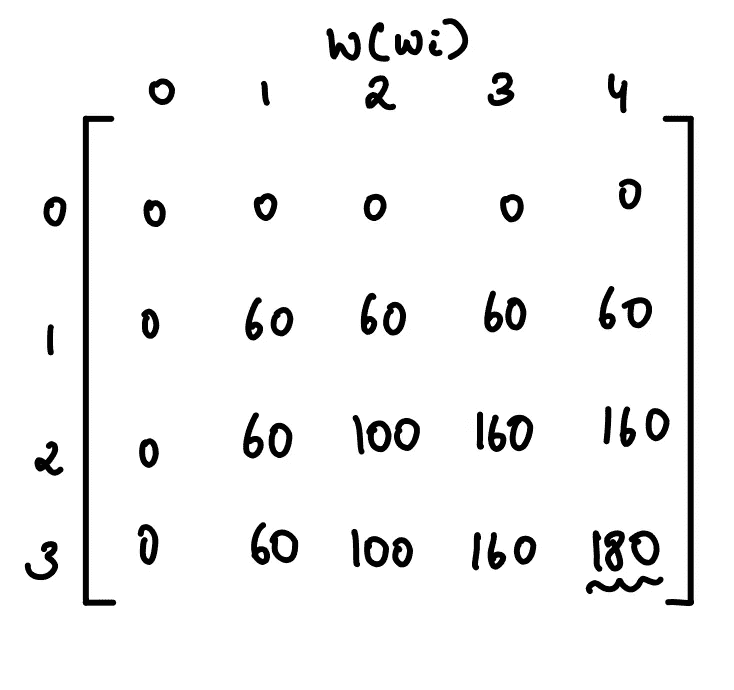*

*程序结束时的 DP*

***代码***

## ***问题 2:编辑距离***

*给定两个字符串 s1 和 s2，找出使 s1 = s2 的最少编辑次数。可能的编辑是:插入字符、删除字符、替换字符。*

*示例 1 **:** s1 = "cat "*

*s2 = "狗"*

*【猫】-->*替换*->-【cot】->-*替换*->-【圆点】- > *替换*->-【狗狗】= > 3 编辑*

*示例 2: s1 = "ducky "*

*s2 = "鸭子"*

*【ducky】-->*插入*-->>" ducksy " =>1 编辑*

*那么，我们如何以 DP 的方式实现这一点呢？*

*我们可以再次利用一个 2d DP 表，如下所示:*

*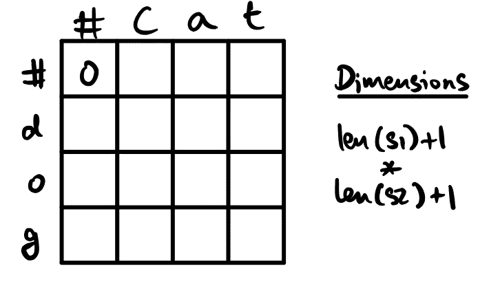*

*在此表中，#代表无字符。每个单元格都是一个子问题，最优解是编辑次数。s1 用于索引列，s2 用于索引行。*

*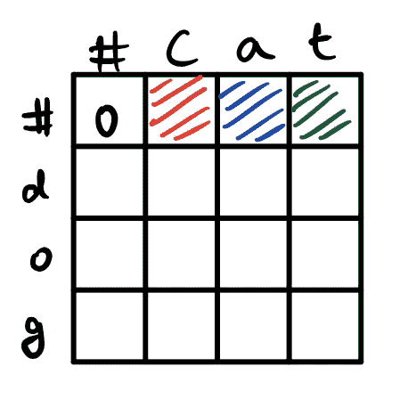*

*考虑红色阴影的单元格。此单元格需要填充从“c”到空字符串“”的编辑次数。蓝色代表“ca”，绿色代表“cat”。*

*从“c”到“”，我们知道需要 1 次编辑，即删除“c”。类似地，对于“ca”和“cat ”,分别需要 2 次和 3 次编辑。同样，我们可以填充第一列，从“”到“d”、“do”和“dog”。*

*由此可见，如果 i = 0，那么 dp[i，j] = j，如果 j = 0，dp[i，j] = i 就是我们初始化数组的方式。*

*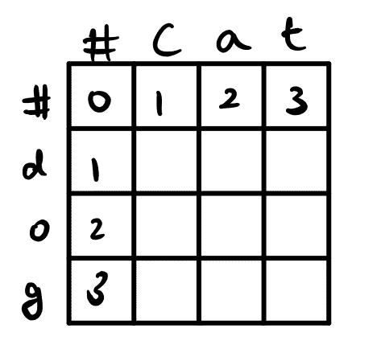*

*这里我们可以看到如何初始化 DP 表。现在，考虑具有行“d”和列“c”的单元格。此单元格表示从“c”到“d”的最小编辑次数。*

*我们有三个选择:*

*a.删除 c(向后移动一列)，然后添加 d。*

*b.添加 d，然后删除 c(向下移动一行)。*

*c.将 c 替换为 d(向后移动一列，向下移动一行)。*

*选项 a 和 b 的编辑距离为 2，而 c 的编辑距离为 1。因此，选择选项 c。我们可以在这里看到一个模式！*

*dp[i，j] = min(dp[i-1，j] + 1，dp[i，j-1] + 1，dp[i-1，j-1] + 1)*

*如果字符相同，则最小值为 0。*

*完整的表格将如下所示:*

*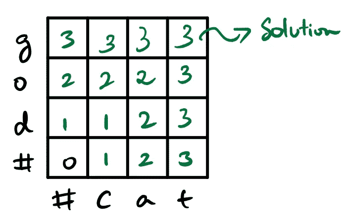*

*因此，从“猫”到“狗”的最小编辑次数是 3。*

## *密码*

# *结论*

*我希望通过这些问题，你可以看到 DP 是有趣的，好玩的，有用的！随着我解决更多的 DP 问题，我将在本文中添加更多有趣的问题。*

# *来源*

*这些都是对理解动态编程和撰写本文非常有价值的资料。*

1.  *[理查德·贝尔曼论动态编程的诞生](https://pubsonline.informs.org/doi/pdf/10.1287/opre.50.1.48.17791)*
2.  *[动态编程—维基百科](https://en.wikipedia.org/wiki/Dynamic_programming)*
3.  *[斯通布鲁克演讲](https://www3.cs.stonybrook.edu/~algorith/video-lectures/1997/lecture12.pdf)*
4.  *[代码厨师——最长递增子序列](https://www.codechef.com/wiki/tutorial-dynamic-programming#Problem_:_Longest_Increasing_subsequence)*
5.  *[动态编程从新手到进阶](https://www.topcoder.com/community/competitive-programming/tutorials/dynamic-programming-from-novice-to-advanced/)*
6.  *[极客对极客——编辑距离](https://www.geeksforgeeks.org/edit-distance-dp-5/)*
7.  *[动态编程编辑距离问题](https://algorithms.tutorialhorizon.com/dynamic-programming-edit-distance-problem/)*