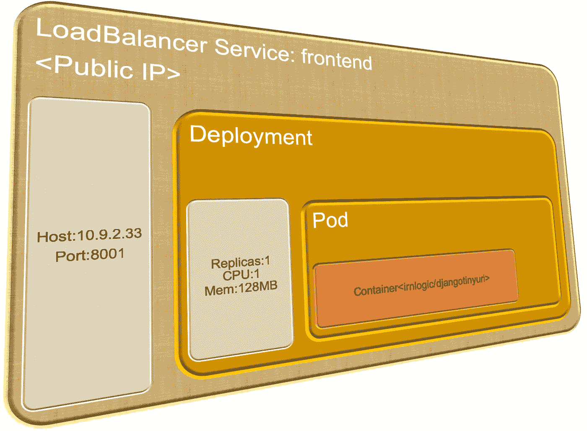
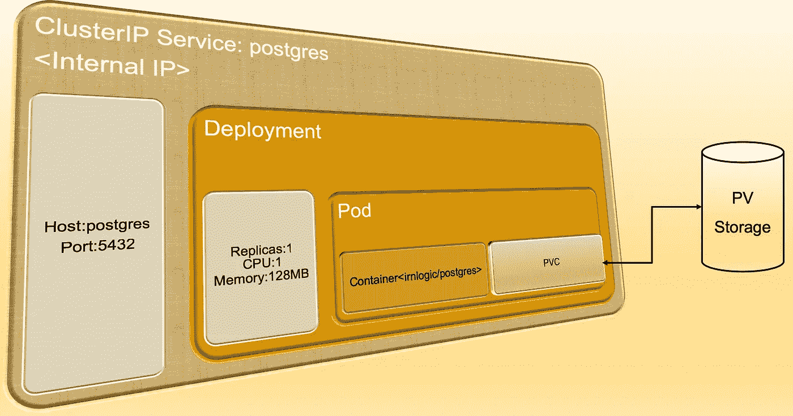
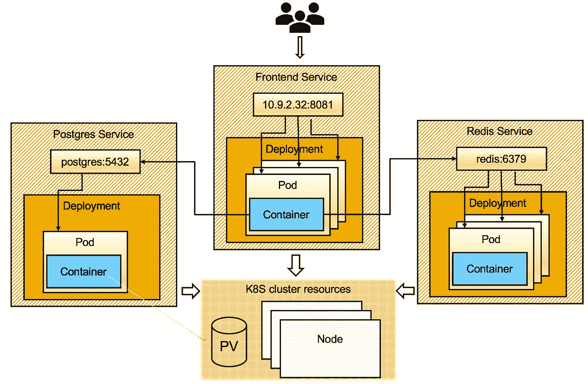
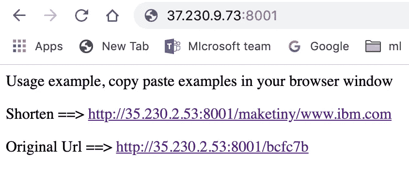

# 理解 Kubernetes 的实用分步指南

> 原文：<https://betterprogramming.pub/a-practical-step-by-step-guide-to-understanding-kubernetes-d8be7f82e533>

## 部署分布式应用程序并理解关键的底层概念


## 快速介绍

简言之，Kubernetes 或 K8S 是一个运行容器化应用程序的开源平台。它广泛的功能使其成为容器编排者的首选。在本帖中，我们将通过实际部署一个应用程序，尝试从实用的角度来学习 Kubernetes。在我看来，这样的练习只有在很好地掌握了背后的关键概念之后才会有所收获；因此，我将向您介绍几个概念，并解释它们与应用程序的关系。虽然这篇博客的重点是应用程序架构，但实用的介绍应该对软件架构师、软件开发人员和开发人员也有帮助。

我们将部署上一篇[文章](https://medium.com/better-programming/building-a-massively-scalable-tinyurl-application-with-python-docker-compose-and-kubernetes-90ff5d4d7f91)中描述的 Tinyurl 应用程序，在这篇文章中我们简要地提到了 Kubernetes。有必要介绍一下 TinyURL 应用程序的基础知识来建立上下文；现在，这个问题解决了，我们可以完全专注于 Kubernetes。[这里的](https://github.com/irnlogic/tiny)是本教程的 git repo。

对于本教程，我假设您对 Docker 映像、容器和微服务架构有所了解。如果不是这样，请阅读那篇[文章](https://medium.com/better-programming/building-a-massively-scalable-tinyurl-application-with-python-docker-compose-and-kubernetes-90ff5d4d7f91)。

在这里，我们将涵盖 Kubernetes 的关键概念，跳过此时不重要的细节。

# Kubernetes:行政观点

首先，快速介绍 Kubernetes 的机制:K8S 集群由主节点和一个或多个工作节点(也称为 minions)组成。作为应用程序开发人员，我们使用名为`kubectl`的命令行工具与 Kubernetes 集群通信，该工具通过位于主节点的 API 服务器执行请求。Kubernetes 集群中还有一个 etcd 分布式弹性键值存储，用于存储关于状态的关键信息和集群运行所需的其他信息。


一个 Kubernetes 集群(来源:维基百科)

注意:为了与 Kubernetes 集群通信， [kubectl](https://kubernetes.io/docs/reference/kubectl/overview/) 命令行工具在$HOME/中查找名为`config`的文件。kube 目录或环境变量 KUBECONFIG 指向的文件中。这个配置文件包含您的凭证和要与之对话的集群端点。登录到您的 Kubernetes 提供商后，您应该能够下载这个文件。我们将使用预先配置了凭证的 Google Cloud power shell。

像谷歌 Kubernetes 引擎(GKE)，你应该能够轻松地在其他供应商[如微软 Azure 和亚马逊](https://kubernetes.io/docs/concepts/cluster-administration/cloud-providers/)上部署应用程序。

# 将您的应用程序映射到 Kubernetes 资源

我们想在 Kubernetes 上部署 TinyURL 分布式应用程序。它由三个微服务组成:Django TinyURL，一个使用 PostgreSQL 数据库为最终用户服务的前端，以及一个 Redis 缓存。因此，如果您遵循最后一条，我们最终会在 Docker 注册表中获得三个 Docker 图像(或您自己的等效图像):

*   `irnlogic/djangotinyurl`
*   `irnlogic/postgres`
*   `irnlogic/redis`

在本练习的最后，这三个包含代码+操作系统的 Docker 映像将被包装在 Kubernetes 对象中并进行部署。

## 容器

通过容器化我们的应用程序，我们有了一个良好的开端(例如，我们为每个服务的代码制作了 Docker 映像，并将其推送到 [Docker registry](http://hub.docker.com/) )。我们能够使用 Docker Compose 在笔记本电脑上将这些图像作为一个单元一起运行。同样，Kubernetes 可以在云环境中将图像作为网络容器运行。记住，容器本质上是一个在 Docker 映像中运行代码的操作系统进程。

## 分离舱

容器必须在 Kubernetes 节点中运行。但是 Kubernetes 中最小的部署单元是一个 Pod，它的行为就像一个虚拟主机，可以有一个或多个容器(固定数量)。pod 中的容器共享对 pod 的相同文件系统和网络的访问。因此他们可以称呼对方为`localhost`。

例如，可以想象一个有两个容器的 pod:一个容器用于应用程序，另一个容器用于收集日志并将其推到一个中心位置。

我们的服务将只有一个集装箱。

## 部署

我们可以将 Docker 映像的单个实例作为 pod 运行，如下所示:

```
*kubectl run <pod_name> — image=<docker_image_name>*
```

为了支持更大的用户群，我们需要运行多个 pods 实例。我们该怎么做？我们要一个接一个地启动多个豆荚吗？当其中一个崩溃时会发生什么？这是不是意味着我们必须监控每个吊舱？这显然不切实际。因此 Kubernetes 的部署有助于同时运行多个 pod。这里，请求的 pod 数量称为期望状态。虽然某个时间点的当前状态可能不同—例如，一些 pod 可能无法启动或已经崩溃— Kubernetes 将持续监视部署的状态，并尝试使当前状态尽可能接近所需状态(在部署描述符中指定)。

最后，部署只是 Kubernetes 支持的工作负载类型之一，它非常适合无状态的工作负载，比如我们的前端。

## 服务

接下来，Django web 服务器必须与 Redis 缓存通信。一个部署背后通常有多个 pod，因此通过维护一个 pod IPs 列表来单独处理 pod 是不切实际的。此外，pod 的寿命很短，会被新的 pod 取代，从而导致以前的 IP 不再有效。

因此，Kubernetes 有一个服务的概念，它通过部署建立可靠的端点，并将传入的请求路由到运行您的代码的 pods。

我们将创建 ClusterIP 类型的 Kubernetes 服务，它通过各自的主机/端口在集群内部公开 Redis 和 PostgreSQL 部署。因此，Kubernetes 服务提供了一个端点来接收来自消费方的请求。

接下来，我们还将通过在 Django web 服务器上放置一个类型为的负载平衡器服务，在公共 web 上公开 Django web 服务器，这将创建一个公共 IP。请注意，云提供商可能根本不提供负载平衡器。幸运的是，它使用了谷歌云。

有了它，我们的服务可以扩展、相互通信，并且应用程序可以通过公共 IP 访问。

## 坚持

Kubernetes Pods 是短暂的，其文件系统上的数据不会在 pod 的生命周期内存活。因此，数据必须保存到外部存储器。我们可以直接在 pod 上安装文件系统，但是 pod 需要直接管理存储端点和凭据。这使得 pod 依赖于集群，消耗了我们的可移植性。因此，Kubernetes 持久卷子系统有助于确保卷的供应/管理与它们在 pod 中的使用相分离。这就是工作原理。

*   永久卷(PV)是一个已配置的存储，其生命周期独立于 pod。它还抽象出了存储的细节。它是一种群集资源，就像节点一样，只是它提供存储而不是 CPU。
*   PersistentVolumeClaim (PVC)是从 PV 请求特定数量的存储，就像 pod 从集群节点请求 CPU 和内存一样。

PVs 可以由管理员手动调配，也可以由 PVC 中指定的存储类动态调配。PVC 作为卷安装在机架上。当一个 pod 启动时，一个合格的 PV 专门与 PVC 匹配(在此之后，任何其他 pod 都不能要求它)。在我们的例子中，我们将利用 Google Cloud 的默认[存储类](https://cloud.google.com/storage/docs/storage-classes)为我们的 PVC 自动提供 PV。

# 配置图

最后，服务必须能够发现彼此，并且是可配置的。例如，Django web 服务器需要一个 PostgreSQL 数据库的主机/端口，它本身可以配置为启用特定的用户和密码。这是通过创建一个包含这些参数的[配置图](https://kubernetes.io/docs/tasks/configure-pod-container/configure-pod-configmap/)并附加到相关部署来完成的。这些参数可以作为相关窗格中的环境变量进行访问。值得注意的是，配置图存储在 Kubernetes 的 etcd 服务器中。所以可以看做是一种坚持的形式。

在 Kubernetes 中有另一个非常相似的名称-值存储，叫做[秘密](https://kubernetes.io/docs/concepts/configuration/secret/)，适合存储密码。我暂时把那件事留给你。

# 部署工件

有了这些信息，我们现在可以开始在 Kubernetes 上部署我们的应用程序了。这将需要以下条件:

*   三个部署——Django Web server、PostgreSQL 和 Redis——每个微服务一个。
*   [PostgreSQL](https://www.postgresql.org/docs/current/storage-file-layout.html) 数据库的持久卷和持久卷声明
*   两个 ClusterIP 类型的服务，使 PostgreSQL 和 Redis 对 Django web 服务器内部可见
*   一个 LoadBalancer 类型的服务，使前端 Django web 服务器可以从互联网访问
*   一个 ConfigMap 声明用于访问 PostgreSQL 的用户名和密码

如果您想知道 pod 和容器在哪里，部署会隐式地创建 pod 和容器。

Kubernetes 中的部署和服务是由单独的 YAML 文件实例化的，我们将一起研究其中的一些文件。

## **前端部署**

部署可以在一个 [yaml](https://github.com/irnlogic/tiny/blob/master/kubernetes/frontend-deployment.yaml) 中声明。

`Kind: Deployment`表示这是一个[部署](https://kubernetes.io/docs/concepts/workloads/controllers/deployment/)。选择器下的`matchLabels`(第 7 行)告诉 deployment 查找标签为 app=tinywebsite 和 tier= frontend 的所有 pod，并将它们视为属于该部署。生产线`replicas: 3`要求部署三个吊舱(期望的状态)。模板部分声明了组成部署的单元的结构。这里，请求了一个名为`tinywebsite`的容器(第 18 行)。请注意，容器标记下面的项是可能数组的一部分；我们只是碰巧有一个项目，因此，一个容器。行图像`irnlogic/djangotinyurl:1.0`指定了容器的 docker 图像。同样，这个容器监听端口 8001，需要 1 个 [CPU](https://kubernetes.io/docs/concepts/configuration/manage-compute-resources-container/#meaning-of-cpu) 和 128 [MB](https://kubernetes.io/docs/concepts/configuration/manage-compute-resources-container/#meaning-of-memory) 内存。

`metadata`部分(第 12 行)将标签分配给 pods 它们与部署中的窗格选择器完全匹配(第 7 行)。

您可能想知道为什么我们不能同时声明 pod 和 deployment 的标签。这有几个原因。首先，在 template/metadata 部分，您可能分配了比部署的 pod 选择器所需更多的标签(例如，出于可观察性的原因，language=python)。其次，Kubernetes 遵循 pods 和其他资源(如部署和服务)之间的松散耦合原则，这提供了一些设计优势，我们暂时不会深入研究。

在我们继续之前，还有一个信息:前端服务将使用 Redis 和 PostgreSQL 服务。例如，与 Redis 的连接如下:

在第 18 行，名称`redis`被用作 Redis 服务的主机名。主机名是如何解析的？。这就是 Kubernetes 服务的美妙之处，它建立了一个带有[服务名](https://github.com/irnlogic/tiny/blob/master/kubernetes/redis-service.yaml)的内部 DNS 条目，服务名恰好是`redis`(我们可以使用 ConfigMaps 来配置和读取 Redis 服务名，但是为了更容易读取，我没有这样做)。

## 前端服务

frontend.yaml 位于[这里](https://github.com/irnlogic/tiny/blob/master/kubernetes/frontend-service.yaml)并创建一个前端部署上的服务。

以下是该服务定义的关键要素

*   `kind: service`确定这是服务资源请求
*   `metadata` / `name`是服务的名称，`metadata`/**/**/`labels`给服务分配标签(您可以在这里提供任何标签)
*   `spec` / `type`是`LoadBalancer`；这将导致为此服务创建一个外部 IP，使其可以公开访问
*   `spec` / `selector`声明选择器，这些选择器标识服务后面的 pod，它们与[部署](https://github.com/irnlogic/tiny/blob/master/kubernetes/frontend-deployment.yaml)中指定的标签完全匹配。

服务部署后，我们的应用程序就可以公开访问了。



前端微服务:Pod/部署/服务

此外，我们现在已经完全指定了我们的前端微服务，并且必须为其他服务做同样的事情。

# 用于 PostgreSQL 存储的 PVC

[这个](https://github.com/irnlogic/tiny/blob/master/kubernetes/postgres-pvc.yaml)是持久卷声明，请求存储我们的 PostgreSQL 数据库。

`kind: PersistentVolumeClaim`表示 Kubernetes 资源类型，而`ReadWriteOnce`表示只有一个 pod 可以访问这个 pod。这就足够了；将来，我们将使用[状态集](https://kubernetes.io/docs/concepts/workloads/controllers/statefulset/)来改善这种情况。很明显，请求了 10GB 的存储，根据元数据，PVC 的段名将是`posgres-disk`。

接下来，我们将在 PostgreSQL pod 中挂载请求的存储。

## PostgreSQL 部署

这里的 PostgreSQL 部署类似于我们前面看到的前端部署，只是这个部署装载了一个卷。

*   最底部的 volumes 部分引用了我们之前创建的`postgres-disk` PVC。
*   然后，卷在`volumeMounts`部分安装到`/var/lib/postgresql/`。`postgres`被配置为在`/var/lib/postgresql/data`保存数据，因此将根据需要在挂载位置创建一个数据文件夹。
*   `configMapRef`将[postgres-config](https://github.com/irnlogic/tiny/blob/master/kubernetes/postgres-configmap.yaml)config map 中的名称-值对加载到`postgres` pod 的环境变量中，建立默认的数据库名称、用户名和密码。
*   请参见下面的配置映射定义；注意配置映射名称`postgres-config`和`data`部分下的名称-值对。

下图展示了预期的 PostgreSQL 服务及其部署和持久卷(PV)。



PostgreSQL 微服务:Pod/部署/服务

其他服务和部署同样在这里声明[。](https://github.com/irnlogic/tiny/tree/master/kubernetes)

部署完所有的应用程序服务和工作负载后，我们应该做出如下安排。



部署的拓扑

用户可以通过公共 IP 地址访问应用前端。负载平衡器服务创建一个公共 IP，将传入请求路由到一个前端 pod。前端 pod 依次与 Redis 和 PostgreSQL 进行通信，如 <service name="">: <port>，例如 redis:6379。回想一下，Redis 和 PostgreSQL 服务的类型是 ClusterIP(默认情况下)，它建立与它们的服务名相同的内部 DNS 条目。它们还向后面的 pod 请求负载平衡。</port></service>

最后，显示的所有三个应用程序工作负载都托管在集群节点中。同样，PostgreSQL pod 上装载的 PersistentVolumeRequest (PVC)映射到集群中的 PersistentVolume (PV)。值得再次重申的是，相对于节点和 PV 等集群资源而言，pod 等应用程序工作负载是短暂的。

还有另一种方式来查看上面展示的拓扑结构:容器(蓝框)中的代码已经嵌入到 Kubernetes 工件中，以进行部署和伸缩！

# 部署应用程序

一旦配置了 Kubernetes 集群，我们就可以开始部署了。参见此[文档](https://github.com/irnlogic/tiny/blob/master/kubernetes/README.md)查看先决条件，克隆[https://github.com/irnlogic/tiny.git](https://github.com/irnlogic/tiny.git)，然后转到`kubernetes`文件夹。

如果文件中指定的资源不存在，下面使用的`kubectl`apply 命令将创建该资源，并将任何已更改的配置应用于该资源。我们将逐一部署三项服务。

## 部署 redis

```
kubectl apply -f redis-deployment.yaml
kubectl apply -f redis-service.yaml
```

## 部署 postgres

```
kubectl apply -f postgres-pvc.yaml
kubectl apply -f postgres-configmap.yaml
kubectl apply -f postgres-deployment.yaml
kubectl apply -f postgres-service.yaml
```

## 部署前端

```
kubectl apply -f frontend-deployment.yaml
kubectl apply -f frontend-service.yaml
```

请求的部署和服务将在几分钟内创建，包括一个负载均衡器服务，它将 TinyURL 前端公开给公共互联网。

现在列出在 Kubernetes 部署的服务:

```
kubectl get services
```

您应该会看到如下内容:

```
NAME         TYPE           CLUSTER-IP     EXTERNAL-IP   PORT(S)          AGE
frontend     LoadBalancer   10.38.14.217   37.230.9.73   8001:30080/TCP   58s
kubernetes   ClusterIP      10.98.2.1      <none>        443/TCP          12m
postgres     ClusterIP      10.98.8.269    <none>        5432/TCP         2m8s
redis        ClusterIP      10.96.11.24    <none>        6379/TCP         3m57s
```

使用以下公共地址启动 TinyURL 应用程序: [http://EXTERNAL-IP:8001](http://external-ip:8001/) (用上面获得的 IP 替换 EXTERNAL-IP)。万岁。我们完蛋了！

这里看到的是应用程序的示例浏览器屏幕截图。



Tinyurl 应用程序输出

稍后，我将发布一些有关基本故障排除和 Kubernetes Cluster 的进一步探索的提示。

# 结论

有了这些，我们回顾了各种 Kubernetes 资源，将我们的应用程序服务连接到这些资源，并成功地部署了 TinyURL 应用程序！

一些瓶颈在我们的应用程序中是显而易见的，例如，我们有一个 PostgreSQL 数据库的实例。未来，我们应该计划一次性能测试，并逐个消除瓶颈。

**更新**:如果你在运行应用程序的时候遇到了问题，我写了这个[帖子](https://medium.com/better-programming/5-easy-tips-for-troubleshooting-your-kubernetes-pods-34f594e03ba6)来帮助你排除 Pods 的故障[这个](https://medium.com/better-programming/debug-your-kubernetes-service-in-5-easy-steps-1457974f024c)的帖子要分配给调试服务部。

# 进一步参考

*   [https://kubernetes.io/docs/home/](https://kubernetes.io/docs/home/)
*   [https://github.com/kelseyhightower/kubernetes-the-hard-way](https://github.com/kelseyhightower/kubernetes-the-hard-way)
*   [https://www.weave.works/blog/kubernetes-best-practices](https://www.weave.works/blog/kubernetes-best-practices)