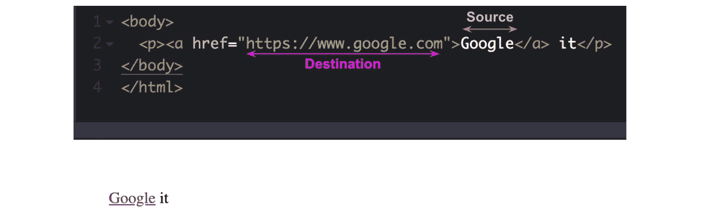
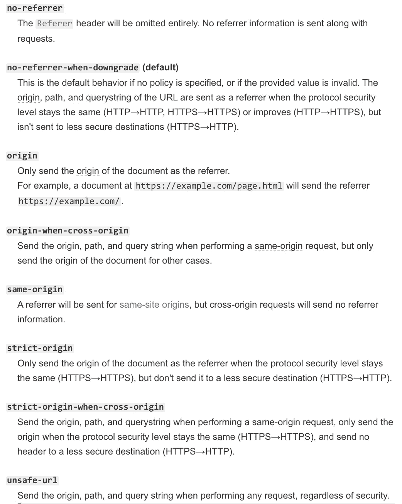
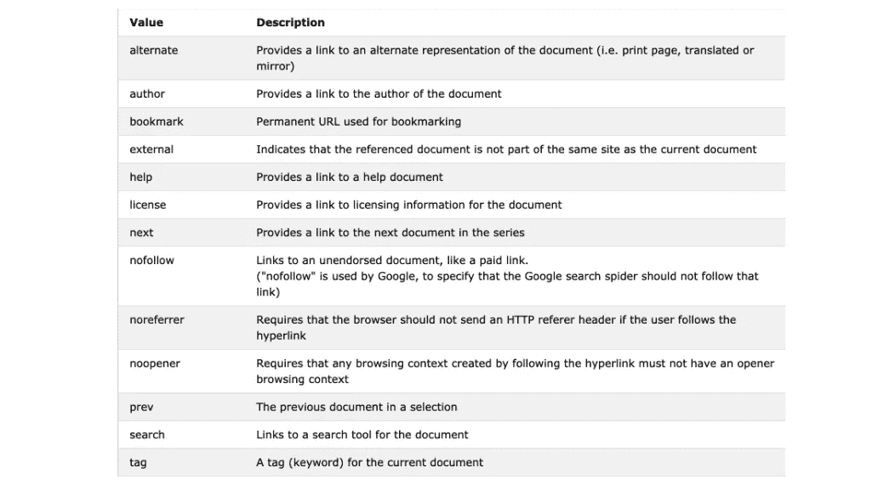
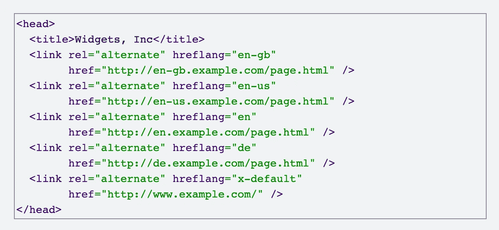
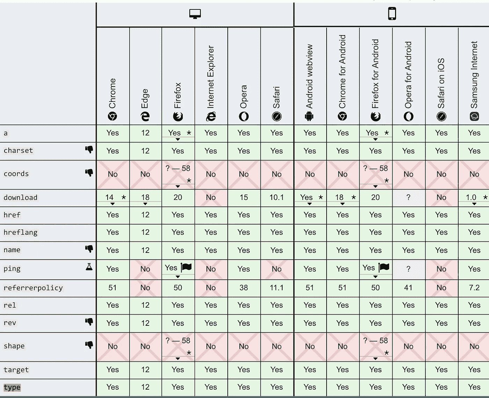

# HTML 链接的剖析

> 原文：<https://betterprogramming.pub/a-primer-on-html-links-af632c4857e0>

## a 元素及其 9 个属性


照片由 [JJ 英](https://unsplash.com/@jjying?utm_source=unsplash&utm_medium=referral&utm_content=creditCopyText)在 [Unsplash](https://unsplash.com/s/photos/link?utm_source=unsplash&utm_medium=referral&utm_content=creditCopyText) 上拍摄

HTML 链接是最容易创建的元素之一。虽然它的默认行为满足大多数用例，但有时我们需要更好地控制用户点击链接时会发生什么。在这种情况下，我们可以利用它的可选属性。

我将简要介绍链接的用途，然后介绍我们可以用来确定用户单击链接时会发生什么的属性，以及提供给用户的关于目标资源的信息。

# 链接的使用

链接将一个 web 资源连接到另一个 web 资源。我们使用它们将一个网站连接到另一个网站，并在同一网站上从一个部分导航到另一个部分。我们还使用链接在用户的电子邮件客户端触发新的电子邮件草稿、电话和文件下载。

# 链接的剖析

链接是使用锚标记创建的，也称为`<a>`元素。

要创建一个，我们需要有一个源锚点(如 Google)和一个目的锚点(如[https://www.google.com)](https://www.google.com))。



源锚点是网页上可视显示的文本，默认情况下带有蓝色下划线。在 HTML 中，源锚点是放置在`<a></a>.`之间的文本

目的锚是我们希望用户浏览的其他 web 资源的地址。它被设置为 HTML 中`href`属性的值。web 资源可以是多媒体文件、程序、HTML 文档甚至 HTML 文件中的元素的形式。

当链接到外部 web 资源时，我们需要使用绝对 URL，即完整的 web 地址(例如，[https://www.google.com](https://www.google.com))。当我们链接到同一站点上的资源时，我们可以使用相对路径。

# 链接的属性

属性是我们可以用来配置 HTML 元素的附加值。它们由名称和值组成，放在元素的开始标记中。


具有 3 个属性的锚定标签集的示例。

一个链接有几个属性，这里介绍了其中的九个。

## 1.Href 属性

`href`属性指定 web 资源的位置(它是目的地锚点)。

`href` 的值可以设置为:

*   `href=”https://www.google.com”`或`href=”nextpage.html”`添加我们想要链接的 web 资源的绝对或相对路径，
*   `href=”#”`添加一个占位符(如果链接没有准备好)，
*   `href="#top"`引用与`id=”top”`在同一个页面上的 HTML 元素，
*   `href=”aboutus.html#bottom”`使用`id=”bottom”`来引用不同页面(关于我们)上的 HTML 元素，
*   `href=”mailto:anemailaddress@gmail.com”`在用户的电子邮件客户端中创建新的电子邮件，该电子邮件被发送到指定的电子邮件`anemailaddress@gmail.com`，并且
*   `href=”tel:{countrycode}{NUMBER}{extension}”`创建电话链接。

## 2.目标属性

`target`属性控制链接是在同一个标签页中打开还是在新标签页中打开。默认情况下，链接在同一个选项卡上打开。

```
target="_self"
```

我们也可以在新标签页中打开它。当我们添加一个链接到另一个网站时，经常会用到这个。一些网站有一个↗️to 图标，向用户显示当用户点击这个链接时，它会打开一个新的标签页。

```
target="_blank"
```

## 3.标题属性

添加 title 属性是为了呈现工具提示。它用于提供附加信息，以帮助阐明或进一步描述链接的目的。

```
<a href=”aboutus.html” title=”this is a link”>
```


## **4。下载属性**

`download`增加了当用户点击链接时触发文件下载的属性。可以添加值，也可以不添加值。

如果没有值，浏览器将建议从各种来源生成的文件名/扩展名:

```
<a href=”anotherfile.html” download>
```

通过一个值，我们可以指定下载文件的名称:

```
<a href=”file2.html” download="anothername.html">
```

## 5.Ping 属性

`ping`属性用于跟踪目的。它将用户的浏览器与作为`ping`属性值列出的 URL 连接起来。

## 6.推荐者策略属性

`referrerpolicy`属性设置跟随超链接时使用的推荐者策略。这将决定请求中应包含多少推荐信息(通过`[Referer](https://developer.mozilla.org/en-US/docs/Web/HTTP/Headers/Referer)`头发送)。


从 [MDN](https://developer.mozilla.org/en-US/docs/Web/HTTP/Headers/Referrer-Policy)



来自 [MDN](https://developer.mozilla.org/en-US/docs/Web/HTTP/Headers/Referrer-Policy) 的 Referrerpolicy 属性值

## 7.相对属性

`rel` 描述从当前 web 资源到目的锚点的关系。



`rel` 属性的值，来自 [w3schools](https://www.w3schools.com/TAGS/att_a_rel.asp)

## 8.Hreflang 属性

`hreflang`用于指定链接资源的语言。



来自[谷歌支持](https://support.google.com/webmasters/answer/189077?hl=en)的例子

## 9.类型属性

最后，type 属性提供链接资源的媒体类型。

# 摘要

总之，我们只需要`<a></a>`，链接文本，和`href`属性来创建一个工作链接。其余的都是额外的配置，如果有一天你可能需要它们，知道这些是很好的。

## 浏览器兼容性



请注意，拇指向下图标表示该属性已被否决。来自 [MDN](https://developer.mozilla.org/en-US/docs/Web/HTML/Element/a) 。

# 资源

*   [HTML 规范中的 a 元素](https://html.spec.whatwg.org/#the-a-element)
*   [推荐人-来自 MDN 的策略](https://developer.mozilla.org/en-US/docs/Web/HTTP/Headers/Referrer-Policy)
*   [来自 W3Schools 的 HTML a 标签](https://www.w3schools.com/tags/tag_a.asp)
*   Jon Duckett 的 HTML 和 CSS