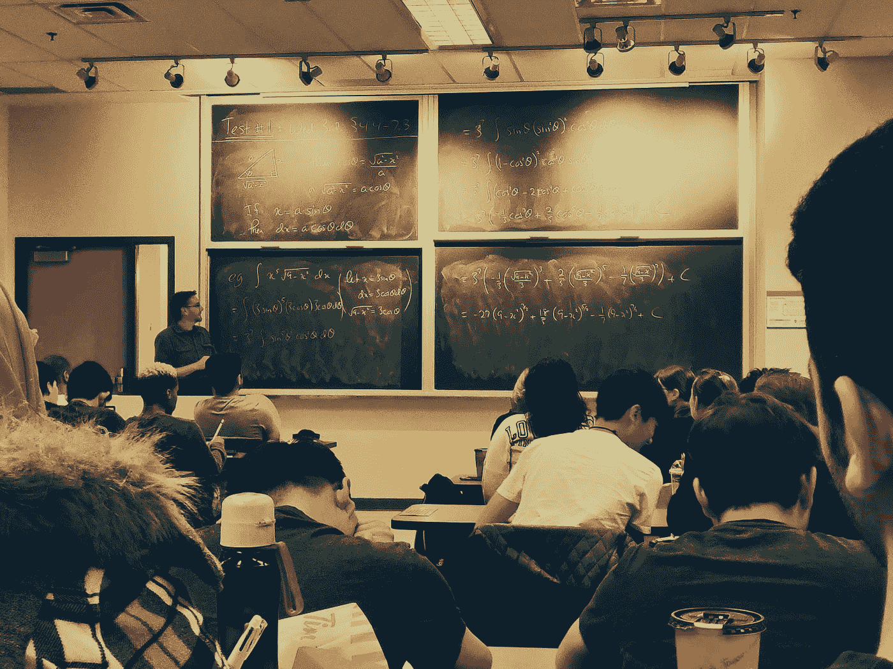

# 一个程序员的遗憾:在大学忽视数学

> 原文：<https://betterprogramming.pub/a-programmers-regret-neglecting-math-at-university-9d937655752b>

## 数学重要吗？数学比你想象的更重要也更不重要…

舒巴姆·莎兰在 [Unsplash](https://unsplash.com?utm_source=medium&utm_medium=referral) 上拍摄的照片

是的，你可以忽略数学，做一名高薪的职业程序员。编程是一个足够广泛的领域，你可以选择你想关注的领域——其中一些不需要数学——并且仍然是成功的。另一方面:

1.  数学是**用来解决专业问题的**工具
2.  **编程**在做数学。

我想给你两者的一些例子，希望这能激励你给数学一个成长的机会。为此，我选择了一些短视频(平均长度为 10 分钟),它们应该会让你兴奋，并比我更好地解释这些概念。

但首先，一个故事。关于我不关心数学…

# 如果你不想学，你就不会学

当我在大学的时候，我真的不明白数学有什么意义。这与我们在高中学的数学有很大的不同，我真正想做的是编程。数学似乎是获得学位的必要条件，这样我就可以从事更多的编程工作。这些证据是所有证据中最没有激励性的，因为我感觉它们只是为了考试而被塞满，对我的编程生涯没有任何价值。我固执的自我感觉如此“有原则”,以至于我拒绝研究证据。这导致我在第一年被安排到一个针对表现不佳学生的特殊小组。太骄傲了(读傻了)，我拒绝研究证明，最终勉强通过，尽管考试的 40%是证明。仍然没有得到消息，我不得不重写一个测试和第二年的考试。考试重写是我最终妥协“原则”的地方，不得不放弃大部分暑假学习证明。我不能破解数学，所以我失去了一个假期，仍然不明白为什么它是重要的。你可能会认为从这次巨大的失败中我会学到一些东西，但我仍然被固执所蒙蔽。可以说，当数学成为选修课时，我没有选择它！事后看来，这是我最大的遗憾之一:五年后我会发现，我觉得最有趣的问题都与数学密切相关。

我终于拿起了一本计算机科学的书，在我交硕士论文的那一周阅读了规定的材料。这时我终于意识到数学和计算机科学以一种我觉得非常有趣的方式联系在一起。从那以后，在我宝贵的下班后的空闲时间里，我一直在努力赶上所有在课堂上认真听讲的学生。这是一个持续了十多年的过程，在这四年里，我本可以只关注它。这十年里，我本可以像那些关注我的同龄人一样学习新东西，但我的数学仍然没有达到研究生水平。有时候我真的觉得自己浪费了生命，但是与其在这个问题上纠缠不清，不如让我们看一些对编程很重要的数学例子。

# 数学作为程序员工具的例子

显然，游戏和电影中的图形编程需要物理知识，但由于精确的物理太昂贵而无法正确模拟，我们通常使用数学中的数值方法，例如使用 Verlet 积分来近似布娃娃物理:

不太明显的可能是谷歌的网络搜索算法。你可能会认为这只是简单地统计网页上的单词，并在顶部显示相关单词计数最高的页面，但这种排名太容易操纵了，例如，一个网页只是重复单词 math，实际上并不包含任何数学。将最相关的结果排在最上面是一个更困难的问题。PageRank 算法考虑了网页的链接数量，并将它们放在一个矩阵中，然后使用线性代数的特征向量的近似值来计算更相关的排名:

人工智能或者更确切地说是机器学习的子领域，是我在学习时发现非常有趣的东西。在跳舞游戏中追踪手势，在网飞上寻找你可能喜欢的电影，识别当前正在播放的歌曲，等等。如果你想帮助建立这些系统，你至少需要很好地理解微积分、概率论和线性代数。

我认为这些例子已经足够了，它们使用数学作为解决专业问题的工具。我现在想谈谈不太明显的东西，并展示数学就是编程，我现在发现这更有趣了。

# 编程就是吃数学

## 作为开胃菜的抽象

抽象是编程中极其重要的一部分。这是我们把复杂的问题分解成小部分的一种方法。我们看到一些模式或者想要隐藏一些复杂性，我们创建一个抽象，例如使用抽象类或接口。我们甚至为如何抽象和抽象那些模式创造模式。我们如何抽象是非常重要的，因为抽象可能非常令人困惑或者非常有用。我们如何发现最有用的抽象？

尽管我们所知道的计算机仅仅出现了几十年，但是计算和计算引擎的设计问题已经存在了几百年。这是一个相当令人惊讶的事实，但与已经存在了几千年的数学相比，它仍然被认为是一个非常年轻的领域。这意味着数学有更多的时间来解决某些问题。我们不妨看看是否有我们可以窃取的想法——事实上，不这么做可能有些自大！

毫不奇怪……数学有一个合适的子领域叫做抽象代数。这里有点抽象代数的味道，有一组解释:

群是加法和乘法的良好抽象，但它也是幺半群的超类。如果你取一个群，去掉元素需要求逆的性质，你就剩下一个幺半群。幺半群是元素的集合，它包括一个单位元和一个结合运算。现在我们有了一个抽象，它不仅适用于加法，还适用于:

这种抽象很有用，因为现在我们可以编写适用于任何幺半群的函数的单一实现。例如:

*   一个简单的函数`mconcat`，它接受一列幺半群元素，并将它们组合成一个元素。对整数列表求和现在等同于叠加图像列表。
*   更复杂的函数`foldMap`可以递归遍历一棵树，并且可以:
    -返回任何元素是否为真，
    -查找是否有任何元素大于 5，或者
    -将可折叠结构转换为集合，
    所有这些都取决于我们使用的幺半群的类型。

我们可以进一步抽象，不仅使这个函数适用于树，还适用于任何可折叠的容器，换句话说，任何可以转换成列表的容器。

了解幺半群在设计库时会很有用。每当你有一个二元函数时，比如 multiply，它接受两个相同类型的参数并返回相同类型的结果，考虑一下 identity 元素是什么是一个好主意。如果你找到了一个，你就找到了一个非常直观的方法来使用你的链表二元函数。您的函数甚至可以在空列表上工作，因为您有一个带有数学属性的合理的默认值，并且它将删除一个错误处理案例，这将简化您的用户代码。

这里我们使用了抽象来创建共享的实现，但是抽象可以而且应该比这更有用。抽象是为了解释或发现联系。

## 主菜的构成

人类解决复杂问题的一个非常流行的方法是分而治之。将问题分解成更小的部分，解决那些更小的问题，然后将这些解决方案组合成更大问题的解决方案。你能想出另一个(通用的)方法吗？…

在编程中，我们把一个问题分解成几个解决小问题的小函数，然后把它们组合成越来越大的函数，最终解决更大的问题。将函数组合在一起的最佳方式是什么？我想知道数学是否有我们可以窃取的想法？

范畴理论是数学的另一个分支，我喜欢称之为抽象的抽象代数，但实际上它是合成的数学，我们研究对象的上下文而不是它们的内容。在这里我们可以找到许多有用的想法，比如:

*   函子，允许我们使用映射函数将函数应用于容器中的每个元素，比如 Python 中的 Lists、Java 中的 Stream API 和 Optional，甚至 Haskell 中的函数。
*   单子，Python 中列表理解的基础，C#中的 LINQ，Scala 中的解析器组合子，Haskell 中的 IO 和大多数并发性，等等。给我找一门编程语言，我会给你找一门有用的语言。
*   f-代数，它允许我们通过递归进行抽象——但是说实话，现在我们已经到了我知识的边缘。

这些极其抽象的概念可能需要一段时间才能在你的大脑中成熟，所以越早开始越好。请看下面一个试图解释单子的短片:

## 证据就在布丁里

这是你数学大餐中最甜蜜也是最后一部分。

现在，你可能还记得我说过，我发现证明是在大学里做数学最没有动力的部分。如果我告诉你，类型可以被看作命题，程序可以被看作证明:

以下是一些可证明的属性:

*   `x + y = y + x`
*   `P & (Q | R) = (P & Q) | (P & R)`
*   `length(filter(predicate,list) ≤ length(list)`
*   C 编译器生成的可执行代码完全是由源 C 程序的语义指定的，参见 [CompCert](http://compcert.inria.fr/compcert-C.html)

现在我知道我可以用编程来证明数学上的东西，我发现证明是编程中最有趣的事情。证明允许我们编写错误更少的更安全的程序，因为我们可以证明属性，而不仅仅是测试它们。

但是，等等，如果你可以用编程来证明事情，难道你不能通过简单地做我们喜欢的事情——写程序——来为数学做出贡献吗？是的，数学非常需要你。证明不只是你难，数学家也难。数学家们总是在证明中制造错误——而这些错误几十年来都没有被发现。同伦类型理论研究不同类型的等式，它用单叶的观点破坏了数学的基础，因为它认为所谓的数学基础是错误的。是的，即使数学也不是完美的，还有很多空间可以贡献。

我对使用编程证明的概念还很陌生，但我发现这非常令人兴奋，迫不及待地想了解更多。我可以推荐阅读[的小打字者](https://mitpress.mit.edu/books/little-typer)，它为任何有递归经验的程序员提供了证明使用依赖类型的很好的介绍。

我们在 Devoxx UK 2022 做了一个关于 Coq Proof Assistant，Correct Code by Construction 的稍长的介绍。如果你想看我穿着建筑工人的服装和一些鸡在高视觉:

那么这个演讲是给你的:

# 寻找灵感，建立基础

似乎我一直不惜一切代价试图避免的事情，变成了我最喜欢做的事情。不要犯和我一样的错误:好好利用你的必修数学科目，否则你以后会后悔的。

如果你的教育者或教育材料没有激发你探索这个广阔的知识领域，那么请转向大量的替代在线资源，如 YouTube、Coursera 或 Edx，或者尝试找到一本更好的书。有人可以解释一个困难的概念并激励你——你只需要花时间去找到他们。你还需要练习使用练习，就像你练习编程一样。

其他时候，我很挣扎，因为我不明白理解新材料所需要的一个基本概念。不要羞于回去修正你的理解。在数学中，许多事情都是建立在彼此之上的，没有坚实的基础，很难取得任何进展。几乎总是值得花时间回去寻找关于这个主题的替代资源，并试图正确地掌握这个关键概念，而不是向前迈进，用头撞墙。

我有一个[待办事项列表](https://github.com/awalterschulze/learning/blob/main/Mathematics.md),我用它来试图补上我错过的所有数学。正如你将看到的，这只是一个漫长而愉快的旅程的开始。数学是一门庞大而令人兴奋的学科，几乎所有的东西都是联系在一起的。看看更大的图景可能会有所帮助:

# 谢谢你

*   [史蒂夫·克鲁恩](http://www.cs.sun.ac.za/~kroon/)一丝不苟的校对。
*   [布兰登·阿什利](https://github.com/ShadowBrandon199)激发了这篇文章。
*   Paul Cadman 提供了一个数学视角。
*   李源碧帮我加了更多的例子。

# 翻译

*   [中文](https://mp.weixin.qq.com/s/VAivA3uVWYkrk-nQ7lFp1A)
*   [阿拉伯语](https://elmestoo.wordpress.com/2019/10/30/%d8%ad%d8%b3%d8%b1%d8%a9-%d9%85%d8%a8%d8%b1%d9%85%d8%ac-%d8%a5%d9%87%d9%85%d8%a7%d9%84%d9%8a-%d9%84%d9%84%d8%b1%d9%8a%d8%a7%d8%b6%d9%8a%d8%a7%d8%aa-%d8%a3%d9%8a%d8%a7%d9%85-%d8%a7%d9%84%d8%ac%d8%a7/)——感谢 [m'estoo](https://twitter.com/elmestoo) 的翻译。

# 引用的

*   [黑客新闻](https://news.ycombinator.com/item?id=20563663) : 234 分[最高排名 12](https://github.com/awalterschulze/waltercv/raw/main/blog/neglecting_math_at_university_hackernews_rank12.png)
*   学习编程 : 1386 分
*   [原帖](https://awalterschulze.github.io/blog/post/neglecting-math-at-university/):有超过 [10000 访客](https://github.com/awalterschulze/waltercv/raw/main/blog/neglecting_math_at_university_10000visitors.png)