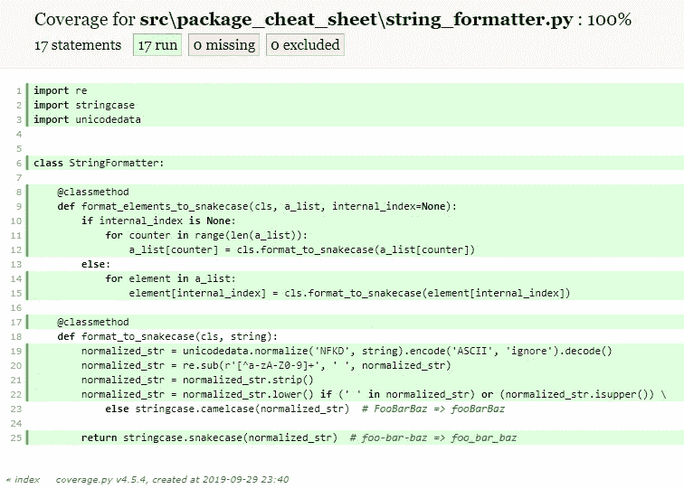

# Python 包开发人员的备忘单

> 原文：<https://betterprogramming.pub/a-python-package-developers-cheat-sheet-3efb9e9454c7>

## 关于如何设计和设置一个干净的 Python 包结构的注意事项和想法


[Leone Venter](https://unsplash.com/@fempreneurstyledstock?utm_source=unsplash&utm_medium=referral&utm_content=creditCopyText) 在 [Unsplash](https://unsplash.com/s/photos/package?utm_source=unsplash&utm_medium=referral&utm_content=creditCopyText) 上拍摄的背景照片

据开发者称，Python 是 2019 年五大编程语言之一[1]。基于其开源社区的实力和在大数据、分析和机器学习等新兴领域的高采用水平，当注意到它在未来几年越来越受欢迎时，没有人会感到惊讶。Python 开发者可用的包的数量也将持续增长。也许你要对其中一些负责。

当发生这种情况时，请记住 Python 在包设置方面非常灵活…顺便说一下，有许多关于这个主题的文档和博客帖子。但有时，我们可能会在如此多的选项中感到困惑，主要是在开始打包开发和发布时。

本文的目标是描述一个干净的包结构，使开发人员更容易测试、构建和发布它，在利用约定的同时编写尽可能少的配置。

# 干净的包装结构

提议的文件夹和文件，包括测试材料，如下所示:

```
project-root
├──src/
   └──package_name/
      └──__init__.py
├──tests/
   └──package_name/
├──.coveragerc
├──.gitignore
├──LICENSE
├──README.md
├──setup.cfg
└──setup.py
```

除了`.gitignore`、`LICENSE`和`README.md`之外，我将研究所有这些文件，因为这些文件广为人知。如果你对他们的内容有疑问，请询问谷歌。

让我从`setup.py`开始，它是包的描述符文件。它由一个 Python 脚本组成，其中可以声明性地设置多个属性，如下所示。这个文件中声明的属性被包管理器如 [pip](https://pypi.org/project/pip/) 和 ide 如 [PyCharm](https://www.jetbrains.com/pycharm/) 所识别，这意味着这是任何包的必备属性。

Python 包备忘单—初始设置文件

一些属性的含义非常简单:`name`、`version`、`author` …但是其他的需要一些解释:

*   `packages`、`package_dir`:用于设置你的包源文件所在的位置以及它们声明的名称空间。在上面的例子中，`src`被配置为源的根文件夹。如果它有子文件夹，默认情况下会扫描它们。只有包含一个`__init__.py`文件[【2】](https://setuptools.readthedocs.io/en/latest/setuptools.html#using-find-packages)的包才能被识别；
*   `install_requires`:包含您的包需要工作的所有依赖关系的元组—警告:仅添加操作依赖关系；任何与测试或构建相关的东西都不应该放在这里(测试依赖关系将在下一节中讨论)。如果你熟悉的话，你也可以认为这是对`requirements.txt`的部分替代。

这些属性允许我们在使用我们提供给用户的包时只捆绑用户需要的文件，这导致了较小的分发文件。此外，他们将只下载每个包运行所需的依赖项，从而避免不必要的网络和存储使用。

有一个实际的练习来看看它的作用。本文的示例代码可以在 GitHub([https://GitHub . com/ricardolsmendes/python-package-cheat-sheet](https://github.com/ricardolsmendes/python-package-cheat-sheet))上获得，并且`pip`允许我们安装托管在那里的包。请安装 Python 3.6+并激活一个 [virtualenv](https://virtualenv.pypa.io/en/latest/) 。然后:

```
pip install git+[https://github.com/ricardolsmendes/python-package-cheat-sheet](https://github.com/ricardolsmendes/python-package-cheat-sheet)pip freeze
```

您会注意到安装了两个包，如下所示:

```
python-package-cheat-sheet==1.0.0
stringcase==1.2.0
```

第一个在`setup.py`中声明，可以在 GitHub repo 上获得。第二个是包的必需(操作)依赖项。

现在，让我们使用 Python 交互式 Shell 调用`package_cheat_sheet.StringFormatter.format_to_snakecase`方法:

```
python
**>>> from package_cheat_sheet import StringFormatter
>>> print(StringFormatter.format_to_snakecase('FooBar'))
foo_bar**
>>> exit()
```

正如您所看到的，`foo_bar`是`StringFormatter.format_to_snakecase('FooBar')`的输出，这意味着软件包安装按预期工作。这是一个简单的演示，展示了如何用几行代码就可以设置一个 Python 包并让用户使用它。

# 包也需要自动化测试

现代软件依赖于自动化测试，如果没有自动化测试，我们甚至不能考虑开始开发一个 Python 包。Pytest 是最常用的库，所以让我们看看如何将它集成到包设置中。

在第一个练习中，我们戴了一顶用户的帽子——现在是时候戴一顶开发者的帽子了。

首先，请卸载从 GitHub 收集的包，克隆示例代码，并从本地源代码重新安装:

```
pip uninstall python-package-cheat-sheetgit clone [https://github.com/ricardolsmendes/python-package-cheat-sheet.git](https://github.com/ricardolsmendes/python-package-cheat-sheet.git)cd python-package-cheat-sheetpip install --editable .
```

基于设置文件触发测试套件的命令是`python setup.py test`。默认情况下它不使用`pytest`，但是有一种方法可以替换默认的测试工具:在包的根文件夹中创建一个`setup.cfg`文件，为`test`命令设置一个别名。并且可以在同一个文件中设置`pytest`参数，如下所示:

```
[aliases]
test = pytest[tool:pytest]
addopts = --cov --cov-report html --cov-report term-missing
```

*   `pytest`从此要求依赖；否则，创建别名后，该命令将失败。依赖关系将被添加到`setup.py`，使用不同的属性:

```
setup_requires=(
    'pytest-runner',
),
tests_require=(
    'pytest-cov',
)
```

*   `pytest-runner`负责添加`pytest`对设置任务的支持
*   `pytest-cov`将帮助我们为我们的代码生成覆盖率统计，正如我们接下来将看到的

软件包的根文件夹中必须包含另一个配置文件:

*   `.coveragerc`控制覆盖脚本范围。当您的项目中有不需要工具监控的文件夹时，这非常有用。在建议的干净结构中，只有`src`文件夹必须被覆盖:

```
[run]
source =
    src
```

我们准备运行`python setup.py test`，现在由`pytest`驱动。默认情况下，`pytest`在`tests`文件夹中查找测试文件。对于您刚刚克隆的 GitHub repo，预期的输出是:

```
plugins: cov-2.8.1
collected 10 itemstests/package_cheat_sheet/string_formatter_test.py ..........                                                                                                                                              [100%]---------- coverage: platform darwin, python 3.7.4-final-0 ---------
Name                                          Stmts   Miss  Cover   
--------------------------------------------------------------------
src/package_cheat_sheet/__init__.py               2      0   100%
src/package_cheat_sheet/string_formatter.py      17      0   100%
--------------------------------------------------------------------
TOTAL                                            19      0   100%
Coverage HTML written to dir htmlcov
```

在运行`pytest`之后，也请检查`htmlcov/index.html`，因为当您需要更深入地理解覆盖率报告时，HTML 输出会很有帮助。



pytest-cov HTML 输出

# 摘要

本文展示了一个简洁的 Python 包结构，涵盖了一般设置和测试工具。它提出了源代码和测试文件的明确分离，使用 Python 标准、约定优于配置和通用工具，通过编写尽可能少的代码来完成工作。

就是这样！

# 参考

*   [1] **Stack Overflow 开发者调查 2019:最受欢迎的技术|编程、脚本和标记语言**:[https://insights . Stack Overflow . com/Survey/2019 # technology-_-Programming-Scripting-and-Markup-Languages](https://insights.stackoverflow.com/survey/2019#technology-_-programming-scripting-and-markup-languages)
*   [2] **用 Setuptools 构建和分发包，使用 find _ Packages()**:[https://setup tools . readthe docs . io/en/latest/setup tools . html # Using-find-Packages](https://setuptools.readthedocs.io/en/latest/setuptools.html#using-find-packages)

## 变更日志

*   2019–10–23:将`pytest.ini`文件内容移动到`setup.cfg`并移除文件。
*   2019–10–30:增加了对`__init__.py`文件和**参考**部分的提及。