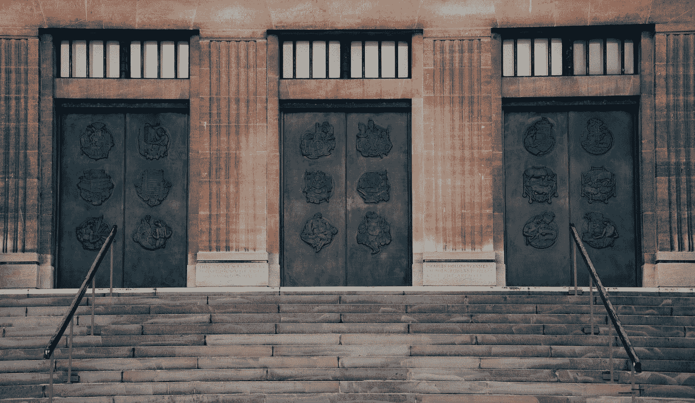
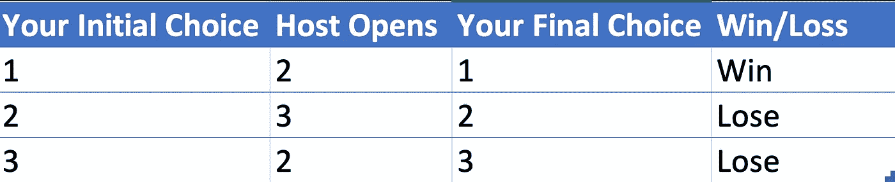
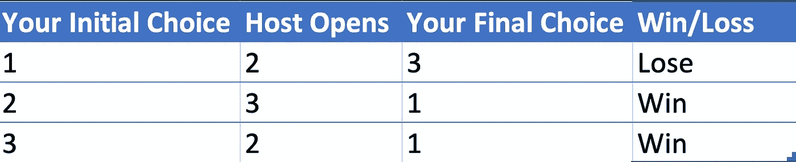
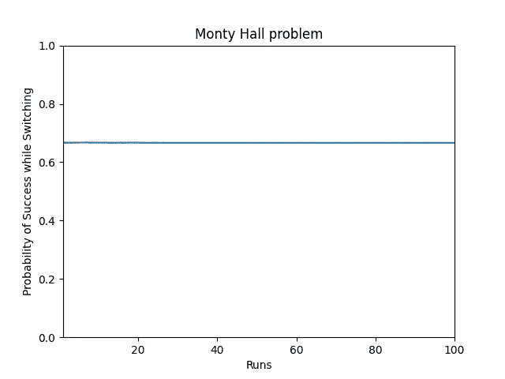

# 蒙蒂霍尔问题的 Python 模拟

> 原文：<https://betterprogramming.pub/a-python-simulation-of-the-monty-hall-problem-25408af314e5>

## 让我们做个交易——给你一个选择，你会改变你的选择吗？



亚当·罗德斯在 [Unsplash](https://unsplash.com?utm_source=medium&utm_medium=referral) 上的照片

假设你在一个游戏节目中，要求你在三扇门中做出选择，一扇门有一辆汽车，另外两扇门有山羊。你做了一个选择，然后主人打开了一扇有山羊的门。换门有什么好处吗，还是应该保留原来的？

直觉上，这听起来没什么区别，因为两个中有一个正确的概率是 1/2，对吗？从数学上来说，这是不成立的。所以如果你换了门，你就有更高的胜算，而且还有 2/3 的胜算，困惑吗？

根据电视节目“让我们做个交易”的主持人的名字，这个难题被称为“蒙蒂霍尔问题”，它也有上述的问题。

# 怎么概率更高？

在史蒂夫·塞尔文(Steve Selvin)于 1975 年给美国统计学家[](https://en.wikipedia.org/wiki/The_American_Statistician)*写了一封信后，沃斯·萨凡特(Vos Savant)对此做出了解释，信中提到了这个问题以及参赛者是否通过转换获得了什么。所以让我们看看为什么会有所不同。*

*所以，1 号门有一辆汽车，2 号门和 3 号门有山羊。*

*所以让我们看看如果你决定坚持你的选择会发生什么*

**

*坚持你的选择*

*所以，如你所见，你只赢了 3 次中的 1 次*

*现在，如果你决定改变，让我们看看会发生什么*

**

*改变你的选择*

*所以，如你所见，你赢了 3 次中的 2 次。*

*这个解决方案对一些人来说是违反直觉的，因为打开一个不包含汽车的门的概率是 1/2，你仍然可以在两者之间进行选择，所以从技术上来说，你仍然可以选择坚持使用原来的门。*

*当且仅当存在真正随机的情况时，这才是真的。然而，他们忽略了一个事实，即当一个不正确的选项从等式中删除时，随机性已经消失了，即 gameshow 主持人暗示，在剩下的两个选择中，哪一个没有汽车，因此在你的选择和剩下的门之间，很有可能剩下的门有汽车。为了证明这一点，让我们看一个使用 Python 的数学解决方案。*

# *用 Python 实现计算机模拟*

*所以，我们从一个实验开始，这个实验做了以下事情:*

1.  *在门 1、2 和 3 中随机选择一个，以标记正确的选项(即包含汽车的门)*
2.  *随机选择一个门作为参赛选手，即初始选择。*
3.  *在剩下的两扇门中，打开有山羊的那扇门，并从参赛者的选择中移除那扇门。*
4.  *现在，从剩下的两扇门中选择另一扇门，即切换选择。*
5.  *如果最终选择(即切换后)与包含汽车的门相同(在步骤 1 中计算)，则返回 1(标记成功)；否则，返回 0(标记失败)。*

*然后，我们多次运行这个实验，找出我们成功的次数。最后，使用这些数据，我们返回成功的概率(即，成功运行的次数/运行的总次数)。*

*我们再次运行这个集合几次，并使用一个名为`matplotlib`的图形库做一个累积图来理解我们趋向的概率。*

*以下是 Python 代码:*

```
*import random
import matplotlib.pyplot as plt

def switch_doors_experiment():
    # compute the correct door randomly
    correct_door = random.choice([1, 2, 3])
    # choose a door randomly
    door = random.choice([1, 2, 3])

    # Among two remaining door, get a random incorrect door
    doors = [1,2,3]
    try:
        doors.remove(door)
        doors.remove(correct_door)
    except:
        pass

    random_incorrect_door = random.choice(doors)

    # Remove the random incorrect door from the options available to you
    doors = [1, 2, 3]
    doors.remove(random_incorrect_door)

    # Now among your original choice of door and the new set of options,
    # switch your choice

    # Remove your original choice from the options
    doors.remove(door)
    # Now as only one option is there within
    final_choice = doors[0]

    # If the final choice is the correct door, then return 1, else return 0
    if final_choice == correct_door:
        return 1
    else:
        return 0

def probability_of_success_on_switch_door(precision):
    switch_door = 0
    # run the switch door experiment precision amount of times 
    # and increment the outcome in switch_door counter
    for i in range(precision):
      switch_door = switch_door + switch_doors_experiment()

    # Probability of success while switching doors = 
    #   num of times the experiment was successful / total number of runs
    return switch_door/precision

# Do 100 runs with precision 100000
runs = 100
total = 0
x = []
y = []
precision = 100000

for i in range(runs):
    total = total + probability_of_success_on_switch_door(precision)
    x.append(i+1)
    y.append(total/(i+1))

# Plot the probability vs runs on a matplotlib graph
plt.plot(x, y)

plt.xlabel('Runs')
plt.ylabel('Probability of Success while Switching')

plt.title('Monty Hall problem')

plt.ylim(0,1)
plt.xlim(1,runs)

plt.show()
print("Probability of Success on switching door for {} precision and {} runs is {}".format(precision, runs, total/runs))*
```

*现在让我们看看执行它的结果*

# *执行结果*

*当我们执行代码时，我们得到下面的图形*

**

*蒙蒂·霍尔问题*

*以及以下结果:*

```
*Probability of Success on switching door for 100000 precision and 100 runs is 0.6664328*
```

*使用计算机模拟，我们在切换到 2/3 时获得了成功的概率，这表明我们应该改变我们的选择，以增加我们赢得汽车的机会。*

# *但是，如果在切换/不切换之间进行随机选择，会发生什么呢？*

*如果人们在第二次机会中随机选择，会发生什么？让我们修改代码，看看所有的场景和随机性是如何相互影响的。*

*在这里，我们将执行以下操作:*

1.  *允许人们在开关/不开关之间进行随机选择*
2.  *记录无开关运行的总数以及我们成功的次数*
3.  *记录总的切换次数以及我们成功的次数*
4.  *记录总运行次数，以及在这种随机场景中我们成功了多少次。*

*我们通过 10000 次迭代运行 10000 次实验来生成真正随机的样本，并使用 matplotlib 绘制它。*

*该场景的 Python 代码如下:*

```
*import random
import matplotlib.pyplot as plt

def experiment(switch_door):
    # compute the correct door randomly
    correct_door = random.choice([1, 2, 3])
    # choose a door randomly
    door = random.choice([1, 2, 3])

    # Among two remaining door, get a random incorrect door
    doors = [1,2,3]
    try:
        doors.remove(door)
        doors.remove(correct_door)
    except:
        pass

    random_incorrect_door = random.choice(doors)

    # Remove the random incorrect door from the options available to you
    doors = [1, 2, 3]
    doors.remove(random_incorrect_door)

    # Now among your original choice of door and the new set of options, switch your choice
    # remove your original choice from the options
    doors.remove(door)
    # Now as only one option is there within
    if switch_door:
        final_choice = doors[0]
    else:
        final_choice = door

    # If the final choice is the correct door, then return 1, else return 0
    if final_choice == correct_door:
        return 1
    else:
        return 0

def iteration(runs):
    total = 0
    switch_door_total = 0
    switch_door_success = 0
    no_switch_door_total = 0
    no_switch_door_success = 0

    for i in range(runs):
        switch_door = random.choice([True, False])
        experiment_success = experiment(switch_door)
        if switch_door:
            switch_door_total = switch_door_total + 1
            switch_door_success = switch_door_success + experiment_success
        else:
            no_switch_door_total = no_switch_door_total + 1
            no_switch_door_success = no_switch_door_success + experiment_success
        total = total + experiment_success

    return total/runs, switch_door_success/switch_door_total, no_switch_door_success/no_switch_door_total

def plot(x, y_total, y_switch, y_no_switch):
    fig, ax = plt.subplots()
    fig.subplots_adjust(right=0.75)

    twin1 = ax.twinx()
    twin2 = ax.twinx()

    # Offset the right spine of twin2\.  The ticks and label have already been
    # placed on the right by twinx above.
    twin2.spines.right.set_position(("axes", 1.2))

    p1, = ax.plot(x, y_total, "b-", label="Success Probability - Random Choice")
    p2, = twin1.plot(x, y_switch, "r-", label="Success Probability - Switch")
    p3, = twin2.plot(x, y_no_switch, "g-", label="Success Probability - No Switch")

    ax.set_ylim(0, 1)
    twin1.set_ylim(0, 1)
    twin2.set_ylim(0, 1)

    ax.set_xlabel("Runs")
    ax.set_ylabel("Success Probability - Random Choice")
    twin1.set_ylabel("Success Probability - Switch")
    twin2.set_ylabel("Success Probability - No Switch")

    ax.yaxis.label.set_color(p1.get_color())
    twin1.yaxis.label.set_color(p2.get_color())
    twin2.yaxis.label.set_color(p3.get_color())

    tkw = dict(size=4, width=1.5)
    ax.tick_params(axis='y', colors=p1.get_color(), **tkw)
    twin1.tick_params(axis='y', colors=p2.get_color(), **tkw)
    twin2.tick_params(axis='y', colors=p3.get_color(), **tkw)
    ax.tick_params(axis='x', **tkw)

    ax.legend(handles=[p1, p2, p3])

    plt.show()

x = []
y_total = []
y_switch = []
y_no_switch = []
for i in range(1000):
    total, switch_door, no_switch_door = iteration(10000)
    y_total.append(total)
    y_switch.append(switch_door)
    y_no_switch.append(no_switch_door)
    x.append(i+1)

plot(x, y_total, y_switch, y_no_switch)*
```

*当我们运行这段代码时，我们得到了下图:*

**

*开关/无开关之间的随机选择*

*从图表中我们可以看到，我们得到了以下结果:*

1.  *如果一个人选择转行，成功的概率在 2/3*
2.  *如果一个人做出不转行的选择，成功的概率是 1/3*
3.  *在一个真正随机的情况下，当人们不带偏见地做出选择时，我们获得成功的概率是 1/2。*

*这大概是第三点让很多人感到困惑。虽然我同意如果你真的随机选择，你也同样有可能赢或输。然而，正如在上面的实验中看到的，你仍然可以通过转换来增加对你有利的几率。*

*简而言之，这就是蒙蒂·霍尔的问题和它造成的所有混乱。*