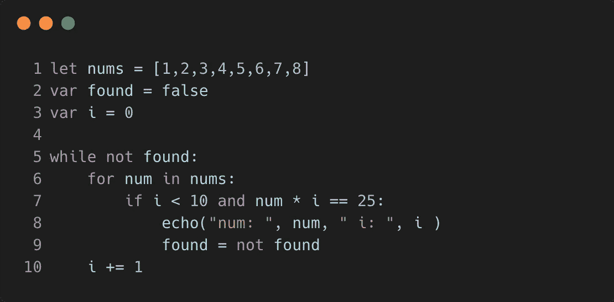
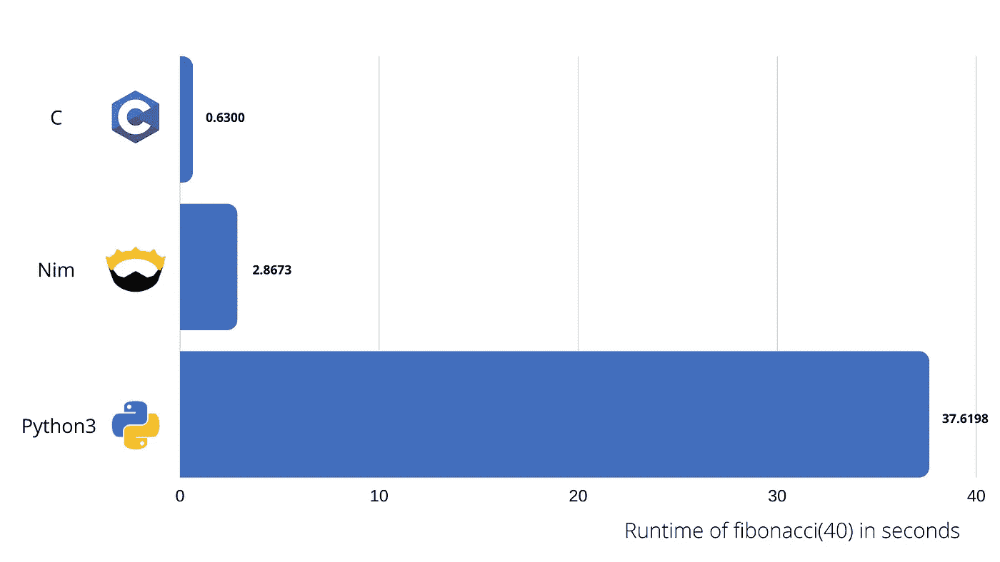

# Python 替代品？我尝试了你从未听说过的最好的编程语言

> 原文：<https://betterprogramming.pub/a-python-substitute-i-tried-out-the-best-programming-language-youve-never-heard-of-9e29cd1893c0>

## 认识 Nim:具有类似 Python 的语法和 C 效率的语言


虽然很有代表性，但上面的图像仅用于说明目的，也就是说，它不是真实结果的实际图表。(图片来源:作者)

几周前，我在浏览 GitHub 时，遇到了一个引起我注意的回购。它托管了一个完全用 Nim 编写的项目。

*尼姆是什么鬼？我想。*

我立即得出结论，这是许多人使用的许多编程语言之一，但我只是不知道它的愚蠢的家伙。但是我没有把它放在一边，而是决定:让我们学习一下这个。

然后我有了两个主要的认识:

*   不，这种语言没有被很多人使用。
*   但也许应该是。

因此，这里要介绍一下我使用 Nim 的经历，这是一个快速编程教程，以及为什么这种语言对我来说非常有前途。

# 给我看看代码！

这是我用 Nim 写的一个没用的程序:



看起来很干净。它也非常简单，即使你以前可能从来没有听说过 Nim，你也可以毫不费力地猜出它是做什么的。(提示:它打印`num: 5 i: 5`。)

因此，让我们来分解一下这里看起来熟悉的东西:

## 变量声明

JavaScript 开发人员对此非常熟悉。虽然有些语言使用`var`，有些使用`let`，但 JS 和 Nim 都允许使用这两种语言中的任何一种进行声明。然而，需要注意的是，它们在两种语言中的意思并不相同。但稍后会详细介绍。

## 块语法

为了在 Nim 中标记一个新的块，我们使用一个冒号后跟一个缩进行。这就是 Python。

## 关键词

这两个循环，以及 if 语句，看起来就像是从 Python 中摘出来的。事实上，从第 5 行开始的所有内容实际上都是有效的 Python(假设我们定义了一个`echo`函数)。

所以是的，很多来自 Python 的关键字和操作符在 Nim 中也是有效的，比如`not`、`is`、`and`、`or`等。

直到现在，尼姆也没有什么特别之处。它看起来只是 Python 的一个糟糕版本(语法方面)，因为我们需要使用`let`或`var`。

但是如果我告诉你:Nim 是一种静态类型的语言，运行速度几乎和 c 一样快。

哦，现在我们在谈话。

# 友好的比赛


照片由 [Victoire Joncheray 拍摄](https://unsplash.com/@victoire_jonch?utm_source=unsplash&utm_medium=referral&utm_content=creditCopyText)

在深入研究 Nim 语法之前(尤其是静态类型部分，我们还没有看到)，让我们试着支持一下关于其速度的说法。为此，我用 Nim、Python 和 c 编写了一个程序让**(即没有动态编程)**计算第 n 个斐波那契数

为了公平起见，我基于针对这个问题的建议的 [Leetcode 解决方案](https://leetcode.com/problems/fibonacci-number/solution/)(方法 1)对实现进行了标准化，并确保在三种语言中尽可能地坚持它。

> **编辑:**不断有人跟我说 [LRU 缓存](https://www.geeksforgeeks.org/python-functools-lru_cache/)。我意识到了。然而，所有语言的实现都可以通过记忆化来改进。这里的要点只是选择一个标准实现并使用它，而不是尽可能地优化。因此我选择了一个简单的实现。

为了给执行计时，我使用了 Bash shell 中`time`输出的“真实”值。

以下是计算第 40 个斐波那契数的结果:



十次运行的平均速度，第一次“冷”运行被丢弃(原因见[此](https://stackoverflow.com/questions/13365914/why-the-first-time-c-program-runs-it-runs-10x-slower))。

是的，发生了。

现在，这是非常有限的，远非科学实验，但它与其他做过更严肃基准测试的人的发现一致[【1】](https://github.com/kostya/benchmarks)[【2】](https://github.com/frol/completely-unscientific-benchmarks)[【3】](https://github.com/the-benchmarker/web-frameworks)。

然而，我在本文中要运行的所有代码都可以在 GitHub 上找到[，包括如何进行这个实验的说明。](https://github.com/yakkomajuri/fibonacci-benchmark)

> 编辑:我注意到，只要给 Nim 编译器传递一个标志，我就可以将它的执行速度提高 10 倍以上。一些人做了测试，发现 Nim 甚至比 c 还要快，这是因为，正如官方文档中所述:“默认情况下，Nim 编译器会生成大量的运行时检查，目的是为了让您调试起来更愉快。使用`*-d:release*`，一些检查[被关闭，优化](https://nim-lang.org/docs/nimc.html#compiler-usage-compile-time-symbols)被打开
> 
> 为了最终的结果，图表将不会更新，但是我认为这一点很重要。更多信息参见[本期](https://github.com/yakkomajuri/fibonacci-benchmark/issues/1)。

那么为什么 Nim 比 Python 快那么多呢？

嗯，我认为有两个主要原因。简单来说，这些是:

*   Nim 是编译的，而 [Python 是解释的](https://github.com/the-benchmarker/web-frameworks)(我知道这是一个争论，但我从文档中抽出来以保持简短)。这意味着当 Python 程序运行时，要做的工作不仅仅是运行程序，因为它需要在实际执行之前被解释。这通常会使语言速度变慢。
*   Nim 是静态类型的。虽然我前面展示的例子没有单一的类型声明或注释，但我们稍后会看到它确实是一种静态类型语言。对于动态类型化的 Python 来说，解释器需要做更多的工作来判断和适当地处理类型，这会降低执行速度。

# 跑得更快，写得更慢

以下是 [Python 文档](https://docs.python.org/3/glossary.html)对解释型语言的看法:

> 解释语言通常比编译语言有更短的开发/调试周期，尽管它们的程序通常也运行得更慢

例如，这句话很好地总结了 Python 和 C 之间的权衡。你可以用 Python 做的任何事情也可以用 C 来做，你的程序运行速度会快很多个数量级。

然而，你将花费更多的时间用 C 语言编写和调试你的代码，而且它会更长，可读性更差。这就是为什么 C 不再流行而 Python 如此流行的原因。简单来说:Python 是“容易的”(当然是相对而言)。

所以，如果 Python 在这个范围的一端，而 C 在另一端，Nim 试图在中间的某个地方:有点快又有点容易？差不多吧。

然而，让 Nim 脱颖而出的是，乍一看，它似乎已经最小化了权衡。换句话说，它比 Python 快得多，但并不像 C 语言那样更难编程(或者简单看起来是这样)。

为了说明这一点，让我们来看看斐波那契实验的代码。

下面是 C 代码:

Python:

还有尼姆:

虽然 Nim 有这个奇怪的`proc`东西，并且，亲爱的上帝，使用`=`来声明函数(或者被称为*过程*，它仍然比 c 干净得多

因此，也许这是一个值得的权衡？比 Python 难写一点，但是快几十倍——我可以接受。

# Nim 语法

以下是关于 Nim 语法的一些要点的简要概述:

## 变量

变量用`var`、`let`或`const`声明。

`var`和`const`的工作本质上类似于 JavaScript，但是`let`是一个不同的故事。

虽然 JavaScript 中的`let`与`var`在作用域上有所不同，但 Nim 中的`let`表示一个变量，其值在初始化后不能改变。我现在被告知，这显然与 Swift 相似。

但那不是一个常数吗？

在尼姆身上，区别如下:

对于`const`，编译器必须能够在编译时确定值，而`let`可以在运行时确定。

文档提供了以下示例:

```
const input = readLine(stdin) *# Error: constant expression expected*let input = readLine(stdin)   *# works*
```

此外，您还可以像这样声明变量:

```
var
    a = 1
    b = 2
    c = 3
    x, y = 10 # Both x, y are assigned to 10
```

## 功能

Nim 中的函数被称为过程，它们的声明是这样完成的:

```
proc procedureName(parameterName: parameterType):returnType =
    return returnVar
```

鉴于这种语言在很多方面看起来像 Python，当你第一次看到过程时，它们肯定会显得有点奇怪。

用`=`代替`{`或`:`尤其奇怪。然而，它在一行程序中看起来更好一点:

```
proc hello(s: string) = echo s
```

此外，您可以从这样的函数返回:

```
proc toString(x: int): string = 
    result = 
        if x < 0: “negative” 
        elif x > 0: “positive” 
        else: “zero”
```

感觉还是应该做`return result`，但是`result`不是变量——是关键字。上面的片段是完全有效的尼姆。

你也可以重载程序:

## 控制流

很像 Python。

```
# if true:# while true:# for num in nums:
```

对于一个范围的迭代，你可以使用`countup(start, finish)`或`countdown(start, finish)`来代替一个范围。或者你可以把整个事情简化，用:`for i in start..finish`。

## 打印和获取用户输入

```
let input = readLine(stdin)
echo input
```

与 Python 相比，`readLine(stdin)`相当于`input()`,`echo`相当于`print`。

`echo`可以带括号也可以不带括号。

我在这里的目的是让您体验一下 Nim，而不是浏览他们的整个手册。因此，我想我将在这里停下来讨论简单的语法，然后浏览一些附加的特性。

# 附加功能

## 面向对象编程

Nim 不是面向对象的，但是对对象有最少的支持。然而，它们不像 Python 类那样简洁。

## 宏指令

Nim 支持宏和元编程，事实上，似乎非常强调这一点。他们的三部分教程系列中有整整一部分是专门针对它的。

这里有一个简单的例子:

```
import macros macro myMacro(arg: static[int]): untyped =   
    echo arg 

myMacro(1 + 2 * 3)
```

## 基本类型

Nim 中的基本类型有:`string`、`char`、`bool`、`int`、`uint`、`float`。

这些也是有效的:

```
int8 int16 int32 int64 uint8 uint16 uint32 uint64 float32 float64
```

此外，与 Python 不同，Nim 中的字符串是可变的。

## 评论

您可能已经在上面的 Python 语法中看到了我的注释，但是与 Python 不同，多行注释也使用散列符号(后跟`[`或`]`):

```
# a comment#[
a
multi
line
comment
]#
```

## JavaScript 编译

来自 Nim 网站:

> “Nim 包括一个一流的 JavaScript 后端，因此您可以毫不费力地同时定位客户端和服务器。”

这很酷，尽管我不确定有多少人会真正使用它。但是如果你想[玩 Nim](https://picheta.me/snake/) 写的浏览器贪吃蛇，可以这么做。不过，这一次我没有建造它。

## 迭代器

除了定义一个`proc`，还可以定义一个`iterator`。然而，Nim 迭代器实际上更像 Python 生成器。这里有一个例子:

```
iterator countup(a, b: int): int = 
    var res = a 
    while res <= b: 
        yield res 
        inc(res)
```

## 案例和强调漠不关心

Nim 不区分大小写和下划线(除了第一个字符)。

因此`HelloWorld`和`helloWorld`是不同的，但是`helloWorld`、`helloworld`和`hello_world`都是相同的，使其有效:

```
proc my_func(s: string) =
    echo smyFunc("hello")
```

# 流行


积极的一面是，Nim 在 GitHub 上有将近 10，000 颗星

也许你看过标题后对自己说:*呃，我听说过尼姆*或者*我用过尼姆！*

那样的话，嘿，我为你高兴。然而，我确实试图得到一些关于这种语言受欢迎程度的信息，它肯定没有那么高。

例如，在 2020 年堆栈溢出调查[中甚至没有提到 Nim。我在 LinkedIn 上找不到任何 Nim 开发人员的工作(位置设置为全球)，该语言的](https://insights.stackoverflow.com/survey/2020)[堆栈溢出标签](https://stackoverflow.com/questions/tagged/nim-lang)只有 349 个问题。(相比之下，Python 为 150 万英镑，Swift 为 27 万英镑。)

因此，假设大多数开发人员都没有使用过它，甚至很多人都没有听说过 Nim 这个名字是很公平的。

# 一个真正的 Python 替代品？

老实说，我觉得尼姆很酷。

为了写这篇文章，我浏览了最低限度，所以还没有太深入，但我可以看到自己在未来使用它。

然而，尽管基本语法与 Python 非常相似，但它很快变得更加复杂，我敢肯定这会让很多 Python 用户/开发人员感到困惑。

就个人而言，我是 Python 的忠实粉丝，但也是静态类型语言的忠实粉丝，所以对我来说，某些情况下的性能提升会大大补偿增加的冗长。

然后，通过写这篇文章我意识到:那 [Go](https://golang.org/) 呢？

我相信你们中的许多人在阅读时也是这么想的，这是一个有根据的观点。尽管 Nim 的语法可能更接近 Python 的语法，但它确实在比 C++语言更好的高性能语言领域竞争，目前由 Go 领先。

有趣的事实:我还偷偷用 Go 进行了速度测试。具体来说，它和 c 一样快。

那么，Nim 能和 Python 抗衡吗？我非常怀疑。我们看到计算机越来越快，编程越来越容易的趋势，即使 Nim 提供了一个很好的折衷方案，正如我所指出的，**我认为这还不足以对付干净和通用的 Python** 。

> 编辑:我和一位 Nim 核心开发人员交谈过，他告诉我他认为 Nim 更适合从 C++过渡的人，而不是从 Python 过渡的人。

然而，它能和围棋抗衡吗？也许吧(如果谷歌没有落后于围棋的话)。语法是友好的，语言是强大的，它比 Go 提供了更好的对 C/C++特性的支持(例如宏和重载)。

也许这就是我接下来要调查的？

感谢阅读！

# 进一步阅读

*   你正在创建一种新的编程语言——它的语法会是什么样的？
*   [厌倦了在网络上使用 Javascript？使用浏览器 Python 代替](https://medium.com/swlh/sick-of-javascript-just-use-browser-python-4b9679efe08b?source=friends_link&sk=40e664d45bfea34d35189c32cd5d0a51)