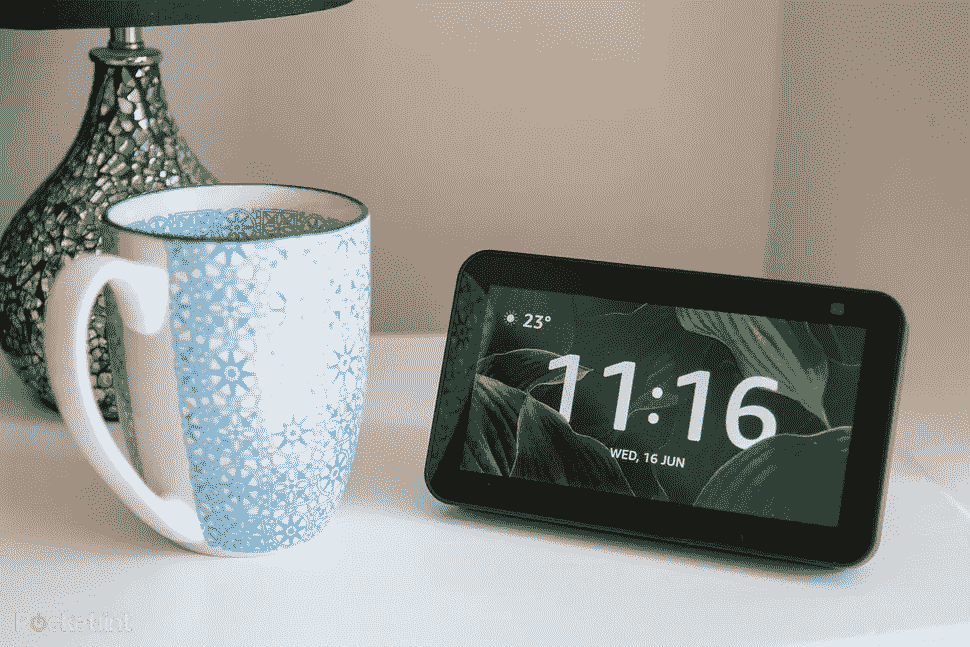
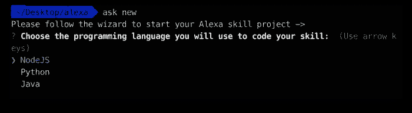
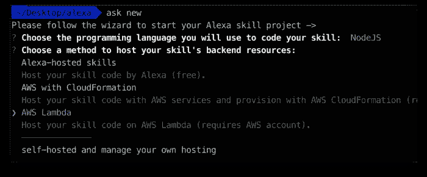
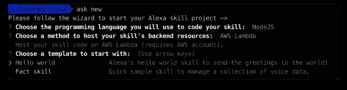
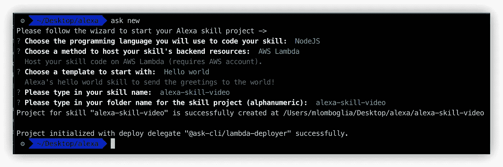
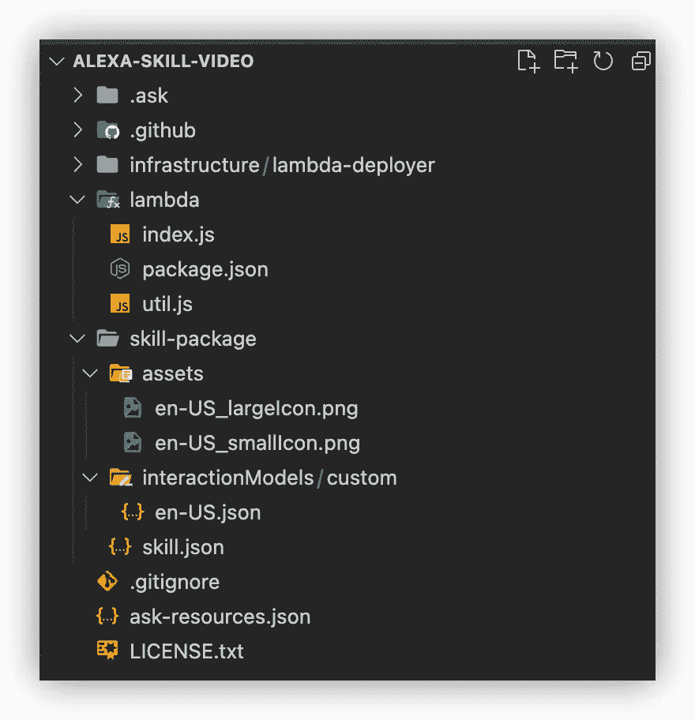
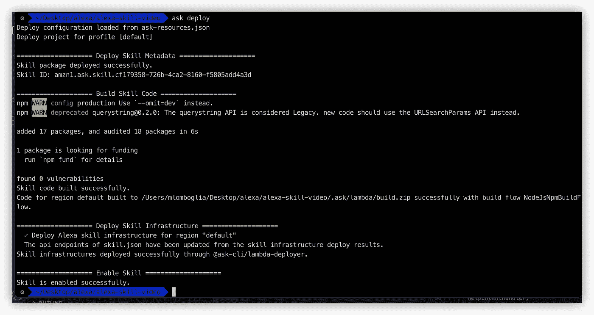

# 一个快速的 Alexa 技能，可以在你的 Echo Show 中播放任何托管的视频

> 原文：<https://betterprogramming.pub/a-quick-alexa-skill-to-play-any-hosted-videos-in-your-echo-show-3c2b422b9199>

## 如何播放视频从你的 Alexa 完整的源代码



# 介绍

你有没有想过在你的 Alexa Echo Show 中播放你托管的视频？

在本教程中，我将指导你如何建立一个 Alexa 技能来播放亚马逊 Echo Show 云中托管的视频。

最棒的是，只需要几行代码就可以做到。我的视频将在 AWS S3 托管，但它可以托管在任何地方，通过公共网址访问。

# 设置

为了让事情变得简单，我将使用 Alexa 技能工具包命令行界面(ASK CLI)来生成我们的样板技能。您可以使用 ASK 开发人员控制台或 ASK 命令行界面(CLI)来创建、管理、测试和发布您的技能。

如果您还不熟悉 ASK-CLI，我鼓励您阅读我以前的一篇文章，这篇文章解释了如何设置和快速运行这个程序。

[](https://medium.com/swlh/quickly-build-an-alexa-skill-using-ask-cli-8ab2977bd126) [## 使用 ASK CLI 快速建立 Alexa 技能

### 从命令行创建、管理、测试和发布你的 Alexa 技能

medium.com](https://medium.com/swlh/quickly-build-an-alexa-skill-using-ask-cli-8ab2977bd126) 

# 创造技能

要创建一个新技能，运行`ask new`，它会提示你为你的技能选择一个语言运行时。我将使用 Node.js 作为首选语言:



然后选择托管技能后端资源的位置。我将使用 AWS Lambda:



然后选择你的模板。选择 Hello World:



选择您的技能名称和文件夹名称，或者保留下面的默认选项。我的技能名是`alexa-skill-video`。



项目已创建！

现在，导航到你的新的`Skill`文件夹:`$ cd alexa-skill-video`

在您最喜欢的 IDE 中打开文件夹。我使用的是 Visual Studio 代码，如下所示:



```
*- infrastructure:*     
    AWS CloudFormation used for deployment. No need for changes in this folder*- lambda:* All of your lambda source code goes in this folder. 
    *index.js* / index.handler is the default starting handler.
    This includes installing the skill's dependencies and producing any build artifacts. 
    For a skill written for Node.js, this means running npm install to install dependencies declared in package.json and packaging it with the JavaScript source code*- skill-package:* Reference to Skill Package API to interact with your skill

    *- assets:* Images associated with your Skill to show in the Alexa Store and any other files referenced by your skill

    - *interactionModels / custom:* These define the voice user interface for your skill which includes the invocation name, intents, slots, and so forth. Only custom skills include interaction models, with one model for each *locale* that the skill supports. The name of the interaction model is <locale>.json, for example en-US.json. In the [skill package format](https://developer.amazon.com/en-US/docs/alexa/smapi/skill-package-api-reference.html#skill-package-format), the interaction models must be in a folder named custom, which itself must be in a folder named interactionModels.

    - *skill.json:* Skill Manifest Schema - JSON representation of your skill.
         The complete Schema definition is available here:
         [https://developer.amazon.com/en-US/docs/alexa/smapi/skill-manifest.html](https://developer.amazon.com/en-US/docs/alexa/smapi/skill-manifest.html) - *ask-resources.json*
     Configuration details of your skill
```

我将从交互模型/自定义开始。我的 Alexa 是 English-GB，所以我会复制 en-US，并将其重命名为 en-GB。确保重命名为您的 Alexa 语言:

*   选择“invocationName”:“视频应用”
*   删除:“HelloWorldIntent”部分
*   添加“播放视频意图”

这样可以让 Alexa 理解你什么时候要求播放视频。

这是我的`en-GB.json`文件:

现在打开你的`skill.json:`

*   地区将引用交互模型文件夹中的 JSON 文件。您可以创建额外的。
*   为您的语言创建区域设置部分，并更新摘要、描述和名称。
*   在 API 部分添加`VIDEO_APP`的接口

我的文件`skill.json:`

现在是最后一部分。让我们在 lambda 部分添加代码。

现在打开你的`lambda/index.js`文件。

编辑`LaunchRequestHandler` 包括播放视频文件的指令。

网址应该是你的视频。我把我的视频文件放在 AWS S3 桶里。代码如下:

# 部署视频技能

要使用您的技能，只需输入:

`$ ask deploy`

会自动提问:

*   部署技能元数据:使用[技能包 API](https://developer.amazon.com/en-US/docs/alexa/smapi/skill-package-api-reference.html) 将技能的`skill-package/`目录内容打包上传到 Alexa Skills。如果这是您第一次部署技能，该命令会在已配置的 Amazon 开发人员帐户中创建一个新技能。
*   构建技能代码:在`lambda/`目录下，并打包构建工件以部署到 AWS。这包括安装技能的依赖项和生产任何构建工件。对于为 Node.js 编写的技能，这意味着运行`npm install`来安装在`package.json`中声明的依赖项，并将其与 JavaScript 源代码打包在一起。
*   部署技能基础设施:为配置好的 AWS Lambda 函数构建工件。如果这是第一次部署技能并且没有配置 Lambda ARN，该命令将创建一个新的 Lambda 函数
*   启用技能

过了一会儿，您的技能就部署在 AWS 中了，可以在开发模式中使用了。尚未公开发布。



# 测试第一个技能

要测试你的技能，只需问你的 Alexa:

用户> Alexa 播放视频应用

您应该会看到您的视频开始在您的 Alexa Echo Show 中播放

你的技能完成了。就这么简单。

所有源代码都可以在我的 [GitHub](https://github.com/mlomboglia/alexa-skill-video) 上获得:

[](https://github.com/mlomboglia/alexa-skill-video) [## GitHub-mlomboglia/Alexa-Skill-video:Alexa 播放 AWS S3 视频的技能

### 此时您不能执行该操作。您已使用另一个标签页或窗口登录。您已在另一个选项卡中注销，或者…

github.com](https://github.com/mlomboglia/alexa-skill-video) 

当部署到 AWS 时，ASK CLI 在`.ask/`目录下生成构建工件。为了从 Git 中排除这些工件，将`.ask/`添加到技能项目的`.gitignore`中。

看看我的其他 Alexa 技能:

[](/how-to-play-youtube-audio-from-your-alexa-e2d4fb8b5ce9) [## 建立一个 Alexa 技能来播放 YouTube 视频中的音频

### 建立一个 Alexa 技能来播放 YouTube 视频中的音频

better 编程. pub](/how-to-play-youtube-audio-from-your-alexa-e2d4fb8b5ce9) [](/a-complete-alexa-skill-to-play-multi-track-audio-from-youtube-videos-9518d5219aa) [## 一个完整的 Alexa 技能，从 YouTube 视频播放多轨音频

### 从 YouTube 到您的 Alexa Echo 播放、暂停、继续、下一个、上一个和循环播放音频

better 编程. pub](/a-complete-alexa-skill-to-play-multi-track-audio-from-youtube-videos-9518d5219aa) 

快乐编码。