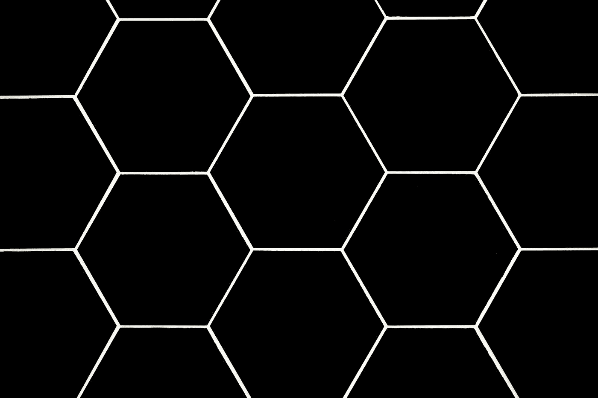
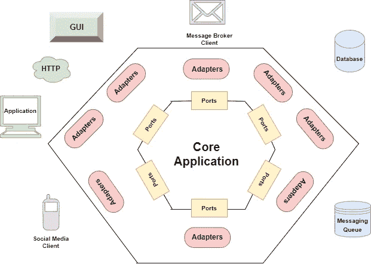

# 一个快速实用的 Java 六边形架构的例子

> 原文：<https://betterprogramming.pub/a-quick-and-practical-example-of-hexagonal-architecture-in-java-8d57c419250d>

## 实践中的软件设计模式



Clark Van Der Beken 在 [Unsplash](https://unsplash.com?utm_source=medium&utm_medium=referral) 上拍摄的照片

# 1.概观

六角形架构是由[阿利斯泰尔·考克伯恩](https://web.archive.org/web/20170730135337/http://alistair.cockburn.us/Hexagonal+architecture)首先提出的一种软件设计模式。它提供了一种使用 Java 或 Java 相关框架(如 Spring)设计 web 应用程序架构的自以为是的方法。在本文中，我们将研究 Java 中的六边形架构，并借助一个使用 Spring 框架实现的实际例子来展示它的用法。

# 2.六角形建筑

六边形架构背后的主要思想是通过接口隔离原则实现清晰的逻辑隔离。此外，六角形架构通过*端口和适配器*的概念创建了松散耦合的应用程序。这里端口指的是接口，适配器指的是它的实现类(如下图所示)。



六角形建筑

上图显示了典型六边形架构中的各种端点。通过应用层，用户通过端口和适配器与核心应用程序逻辑进行交互。应用层由 GUI 客户端、社交媒体客户端、HTTP/API 调用等组成。类似地，应用程序的另一半显示了一个持久层或基础设施层，数据通过它流向其他组件。持久层包含外部组件，如数据库、邮件和消息队列等。

# 3.例子

为了更好地理解六边形架构，让我们考虑一个比萨饼服务应用程序的例子。在该应用中，我们将具有以下特性:

*   列出所有可以买到的比萨饼
*   在数据库中插入新的比萨饼
*   按名字买披萨

# 4.域对象

域或实体对象是六边形架构的核心部分。它可以有状态和行为。该对象不依赖于任何应用程序组件。如果业务需求本身发生了变化，域对象中的任何变化都会发生。

```
public class Pizza {
	private String name;
	private int price;
	private String[] toppings;
	// code for getters & setters
}
```

# 5.港口

六边形结构中的端口是指允许入站或出站流量的接口。入站端口向外界公开核心应用程序功能。例如，对服务接口的 API 调用。

让我们定义一个 *PizzaService* 接口，它将向外部组件公开其功能(比如 API 调用)。这是我们的进港港口。

```
public interface PizzaService {
       public void createPizza(Pizza pizza);
       public Pizza getPizza(String name);
       public List<Pizza> laodPizza();
}
```

类似地，出站端口用于连接一些外部存储库，如数据库。

让我们定义一个将访问外部持久系统(DB)的 *PizzaRepository* 。

```
public interface PizzaRepo {
       public void createPizza(Pizza pizza);
       public Pizza getPizza(String name);
       public List<Pizza> getAllPizza();
}
```

# 6.适配器

适配器指的是六边形架构中它们各自端口的实现类。它们是应用程序的外部部分(如 GUI、API 调用、Webviews、Dao 等)。)并分别通过入站和出站端口与应用程序交互。此外，适配器使得更换应用程序的特定层变得简单。根据所需的更改，我们只需要添加一个实现输入或输出端口的适配器。

# 6.1 主适配器

它们也被称为输入或驱动适配器，因为它们通过使用入站端口调用应用程序的核心部分来驱动应用程序。

让我们将*pizzarestcontroller*定义为 REST 控制器，作为我们的主适配器。它提供了创建和获取披萨的端点，还实现了 *PizzaRestUI* (Webview)。除此之外，它使用 *PizzaService* (入站端口)来调用不同的方法。

```
@RestController
@RequestMapping(value="/pizza")
public class PizzaRestController implements PizzaRestUI {
       @Autowired
       private PizzaService pizzaService;
       @Override
       public void createPizza(@RequestBody Pizza pizza) {
             pizzaService.createPizza(pizza);
       }
       @Override
       public Pizza getPizza(@PathVariable String name) {
             return pizzaService.getPizza(name);
       }
       @Override
       public List<Pizza> listPizza() {
             return pizzaService.laodPizza();
       }
}
```

# 6.2 二级适配器

它们被称为输出或驱动适配器，实现出站端口接口。这些适配器提供了访问应用程序的辅助组件(如数据库、消息队列等)的实现。服务层实现输入端口，而输出端口是使用持久层实现的。

在我们的例子中， *PizzaRepoImpl* 是实现 *PizzaRepo* (出站端口)的出站适配器。

```
@Repository
public class PizzaRepoImpl implements PizzaRepo {
       private Map<String, Pizza> pizzaStore = new HashMap<String, Pizza>();
       @Override
       public void createPizza(Pizza pizza) { 
             pizzaStore.put(pizza.getName(), pizza);
       }
       @Override
       public Pizza getPizza(String name) {
             return pizzaStore.get(name);
       }
       @Override
       public List<Pizza> getAllPizza() {
             return pizzaStore.values().stream().collect(Collectors.toList());
       }
}
```

接下来，我们可以使用任何 API 测试工具(如 Postman)来测试 GET & POST 端点。

我们可以通过*http://localhost:8080/pizza-service/pizza/*测试 POST 端点

```
{
    "name" : "Margherita",
    "price": "25",
    "toppings" : ["tomato","onion","cucumber","jalapeno"]
}
```

同样，我们可以通过 http://localhost:8080/pizza-service/pizza/Margherita 测试 GET 端点

```
{
    "name": "Margherita",
    "price": 25,
    "toppings": [
        "tomato",
        "onion",
        "cucumber",
        "jalapeno"
    ]
}
```

# 7.利益

与传统的分层结构相比，六边形结构有几个优点，例如:

*   它通过分离应用程序的内部和外部组件简化了架构设计
*   核心业务逻辑与任何外部依赖相分离，导致了高度的解耦
*   基于端口的架构允许我们的应用适应新的通道或轻松使用新的通信协议，这对开发[域驱动的应用](https://www.baeldung.com/hexagonal-architecture-ddd-spring)非常有用

# 8.结论

在本文中，我们通过一个在 Spring 框架中实现的简单例子了解了 Java 中的六角形架构。此外，我们已经讨论了使用六边形架构相对于传统分层架构的一些优势。

Github 上的[提供了给定示例的代码。](https://github.com/SumitKumar30/baeldung-tutorials/tree/master/java-hexagon/pizza-service)