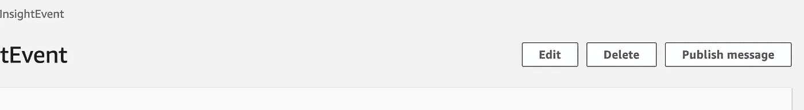
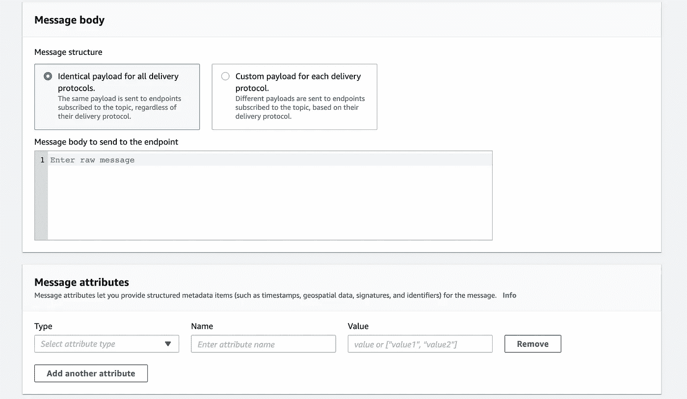
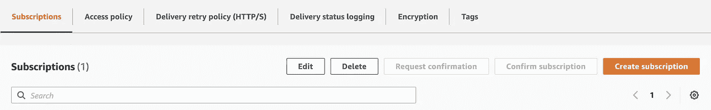
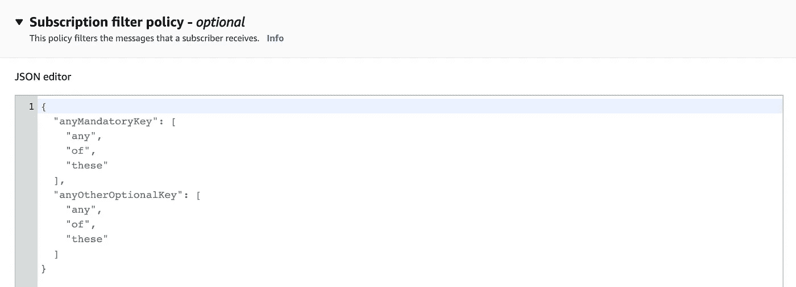

# 亚马逊社交网络订阅过滤政策快速指南

> 原文：<https://betterprogramming.pub/a-quick-guide-to-amazon-sns-subscription-filter-policies-7c91865a9065>

## 知道如何过滤您希望从 AWS SNS 收到的消息


社交网站过滤—按作者分类的模式

Amazon SNS(简单通知服务)是一种发布-订阅服务，它协调向一个或多个接收者发送推送消息。它允许你发送消息给各种用户，包括 Kinesis 数据消防软管，SQS，Lambda 函数，HTTPS 端点，等等。

默认情况下，订阅者会收到发布到 SNS 的所有消息。但是您可以根据自己的标准决定只接收特定的消息。

为此，我们将使用 SNS 订阅过滤策略，它允许根据消息的属性过滤消息！

当然，本“教程”的先决条件是已经创建了一个 SNS 主题，您可以在其中推送您的事件。

# 1.添加消息属性

如果你想过滤你的用户从 SNS 上得到的信息，你必须把你的信息和属性一起推送到 SNS 上。基于这些属性，您将能够创建过滤策略。

## A.将消息发布到社交网络—使用事件生成器

如果你只是想测试或调试你推送到 SNS 的东西，亚马逊创建了一个 SNS 事件生成接口。使用 AWS 控制台，转到您的 SNS 主题并点击`**Publish message**`。



作者截图

从那里可以发送消息，还可以添加`**attributes**`。这是测试您的主题和您想要创建的过滤器策略的一种便捷方式。



作者截图

## B.将消息发布到社交网络——从您的代码

在大多数情况下，你可能会把你的消息从你的代码推送到 SNS。同样，要使用过滤策略，只需将属性和消息一起发送。

下面是一个使用 boto3 (AWS SDK)的 python 示例。要给你的信息添加属性，你只需要包含一个`MessageAttributes`字典。

其他示例可在 [AWS 文档](https://docs.aws.amazon.com/code-samples/latest/catalog/python-sns-sns_basics.py.html)中找到。

# 2.定义过滤器

既然您的消息已经有了属性，那么设置过滤策略就非常简单了。

再次导航到所需的产品升级和技术支持服务主题。从你的话题出发，你可以创建`Subscriptions`，这样 SNS 就可以将消息推送到一个或多个目的地。您可以创建新的订阅，或编辑现有的订阅。



作者截图

创建订阅时，可以通过选择协议来选择目的地。它包括λ，SQS，Kinesis 消防软管，HTTP，电子邮件，等等。

向下滚动，你会找到`Subscription filter policy`部分。在这里，您将定义要使用的过滤器，采用 JSON 格式。



作者截图

## 过滤策略:从简单到高级

默认情况下，没有任何过滤器的订阅会将每条消息推送到其目的地。过滤策略将只包括符合条件的邮件。它的开始非常简单:

**例 1:** 包含属性`website`等于`medium`的每条消息

```
{
 "website": ["medium"]
}
```

**例 2:** 包含属性`website`等于`medium`或`quora`或`stackoverflow`的每条消息

```
{
 "website": [
    "medium",
    "quora",
    "*stackoverflow"* ]
}
```

**例 3:** 包含属性`website`等于`medium`且`language`等于`french`的每条消息

```
{
 "website": ["medium"],
 "language": ["french"]
}
```

**示例 4:** 包括属性`website`不等于`wikipedia`的每条消息

```
{
 "website": [{"anything-but": "wikipedia"}]
}
```

**例 5:** 包含以`+33`开头的属性 phone 的每条消息

```
{
 "phone": [{ "prefix": "+33" }]
}
```

**示例 6:** 包括每条具有属性价格`> 100`的消息

```
{
 "price": [{ "numeric": [ ">=", 100 ] }]
}
```

我们可以结合这些策略来创建许多复杂的过滤器。最后，你可以在 AWS 网站上找到一些文档和例子。

# 结论

SNS 过滤策略是 AWS 提供的一个非常有趣的功能。在构建事件驱动的架构时，这当然是需要考虑的事情。这也是简化数据管道、优化成本或优化架构的好方法。