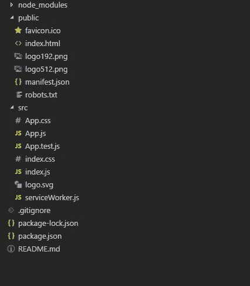
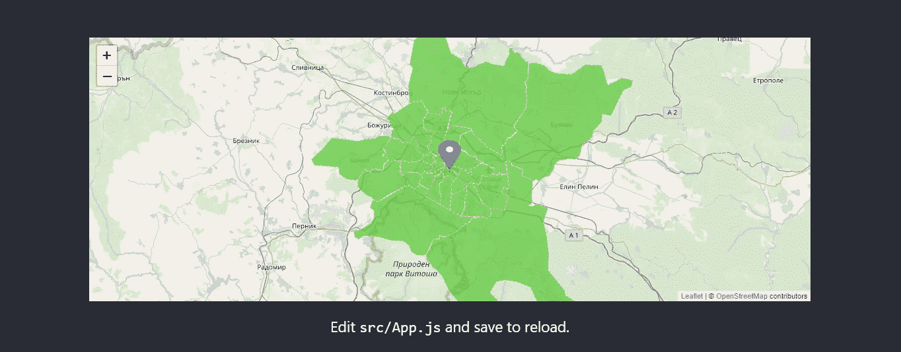

# 集成 Leaflet.js 和 React 的快速指南

> 原文：<https://betterprogramming.pub/a-quick-guide-to-integrating-leaflet-js-and-react-ed89ff92790e>

## 在 React 应用程序中显示地图上不同位置的简单教程


由[塞巴斯蒂安·希奇](https://unsplash.com/@s_hietsch?utm_source=medium&utm_medium=referral)在 [Unsplash](https://unsplash.com?utm_source=medium&utm_medium=referral) 上拍摄的照片

# 概观

对于 web 开发人员来说，我们生活在一个迷人而又困惑的时代。有这么多的框架、库、插件和其他东西，有时很难决定使用哪一个以及如何集成它们以协同工作。

假设您需要在 React 应用程序中的地图上显示不同的位置。你可以选择的最好的库之一是 [Leaflet.js](https://leafletjs.com/) ，“一个用于移动友好的交互式地图的开源 JavaScript 库”。

它使您能够轻松显示托管在公共服务器上的切片 web 地图，以及可选的切片叠加图。

因此，让我们看看如何用最少的步骤将其集成到 React 应用程序中。

# 发展

对于我们的例子，我们将使用我们钟爱的 [Create React App](https://github.com/facebook/create-react-app/blob/master/README.md) 。(有关如何开始的说明，请使用[快速指南](https://github.com/facebook/create-react-app/blob/master/README.md))。

截至 2019 年 9 月，已创建项目的结构如下:



现在，让我们添加传单库。在项目目录中，运行:

```
npm install leaflet
```

最后，我们应该在我们的`index.html`中添加 CSS 引用:

```
<link rel="stylesheet" href="https://npmcdn.com/leaflet@1.0.0-rc.2/dist/leaflet.css" />
```

酷，现在我们准备创建我们的地图组件。我们将使用 [OpenSteetMap](https://www.openstreetmap.org/) 作为我们的瓷砖来源，并将中心设在我的家乡保加利亚索非亚。

下一步是提高水平，并添加一个标记到我们的地图。作为一个例子，我将使用保加利亚国会大厦的坐标。

现在，你可能会说:“是的，一张带有静态标记的地图…非常有用，谢谢”。但是等等，传单可以做得更多，我们只是在热身。

# GeoJSON 简介

当我第一次了解这个图书馆时，让我着迷的是在地图上显示简单的地理特征是多么容易，以 [GeoJSON](https://en.wikipedia.org/wiki/GeoJSON) 格式呈现。

基本上，GeoJSON 是一种开放标准格式，旨在表示简单的地理要素-点(地址和位置)、线串(街道、公共交通线路等)。)、多边形(区域、状态等。).

它的伟大之处在于它基于众所周知的 JSON 格式。

对于我们的例子，我将使用一个简单的 GeoJSON，[在互联网上找到](https://mellyan.carto.com/tables/sofia_regions/public/map)，代表索菲亚的不同地区。

这是结果:



现在让我们在此基础上更进一步。我们将添加这样的功能，当用户单击一个多边形并将其涂上不同的颜色时，可以在多边形的中心移动标记。

为此，我们需要两样东西:

1.  将所选要素(多边形)存储在组件状态中。
2.  将其添加到`useEffect`钩子的依赖项中。

如果你还是 React Hooks 新手，我强烈推荐看看丹·阿布拉莫夫的帖子 [*让 React Hooks*](https://medium.com/@dan_abramov/making-sense-of-react-hooks-fdbde8803889) 有意义。

为了计算多边形的中心，我们将使用[公式](https://en.wikipedia.org/wiki/Centroid#Of_a_polygon)来寻找非自相交闭合多边形的质心，由 *n* 顶点( *x* 0， *y* 0)，( *x* 1， *y* 1)，…，(*xn*1，*yn*1)定义。

这个 StackOverflow 答案的道具。

最后，我们将在每个要素上添加一个 click 处理程序，在这里我们将设置新选择的要素，计算质心，并设置标记的新位置。

# 结论

因此，这是在 React 组件中集成小叶子的一种简单快捷的方法。当然，有许多方法可以进一步改进它。

我希望这篇文章能为读者节省一些时间。