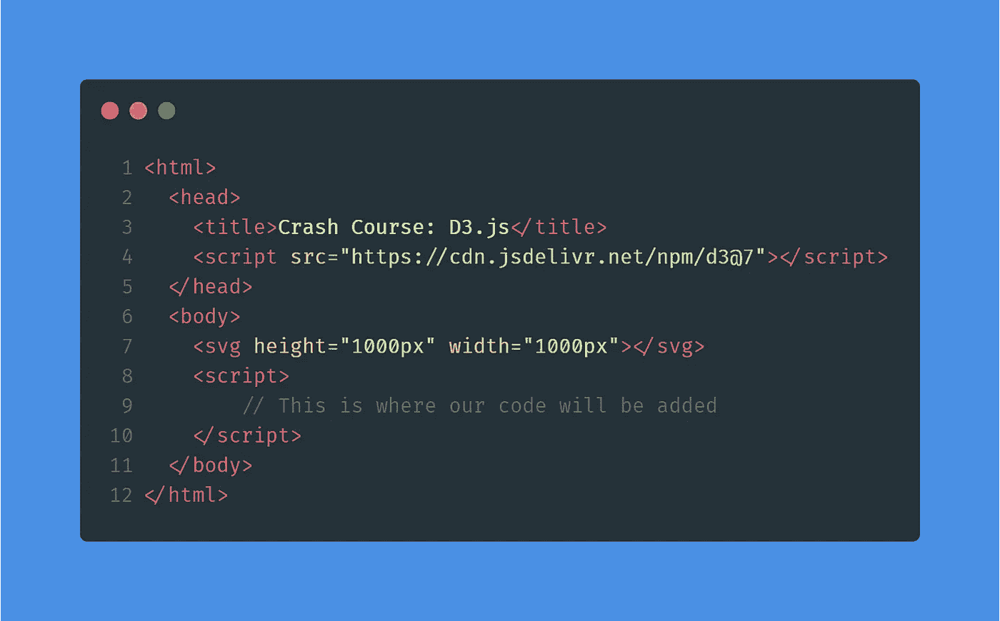
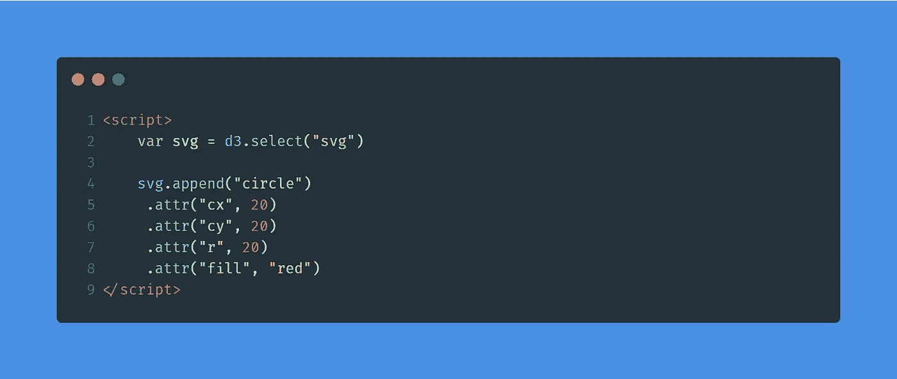
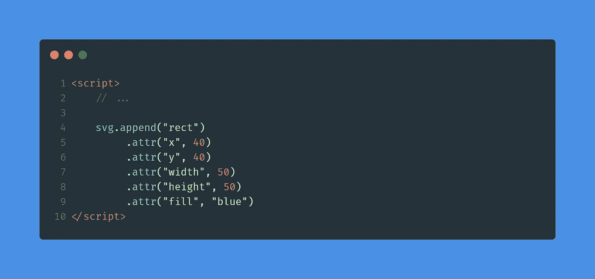
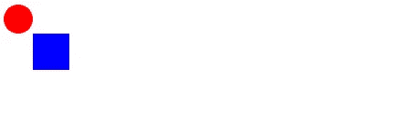
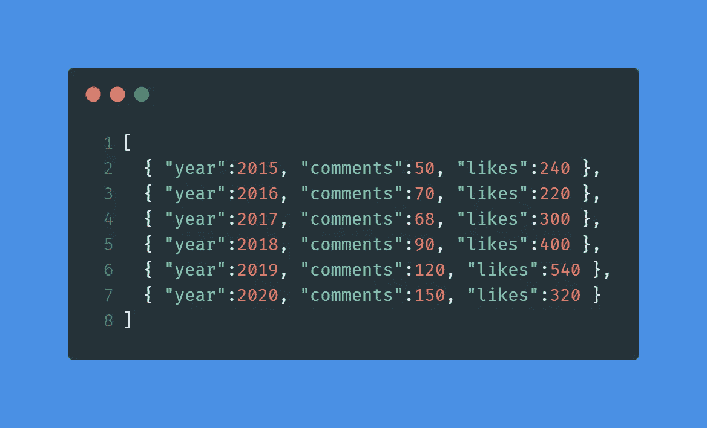
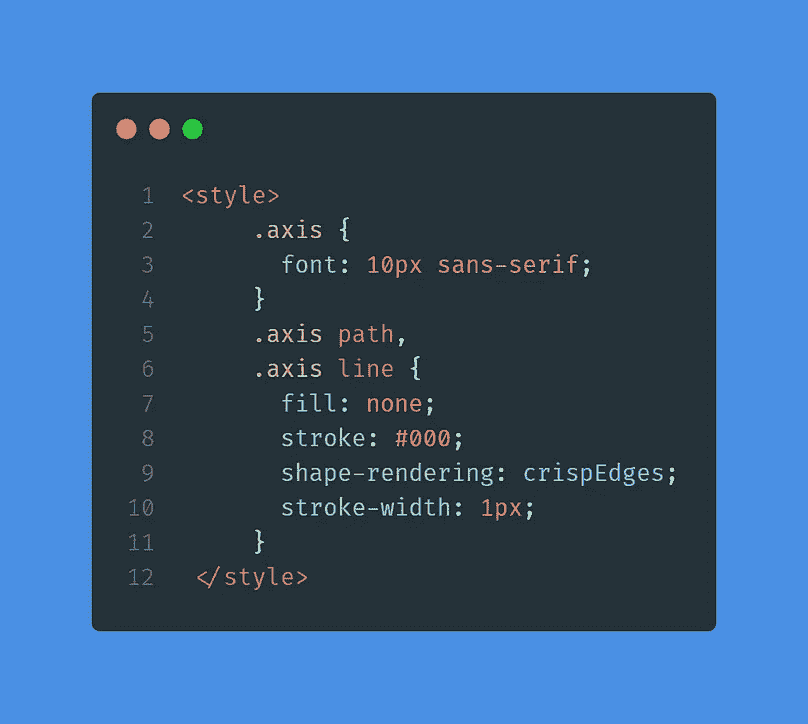
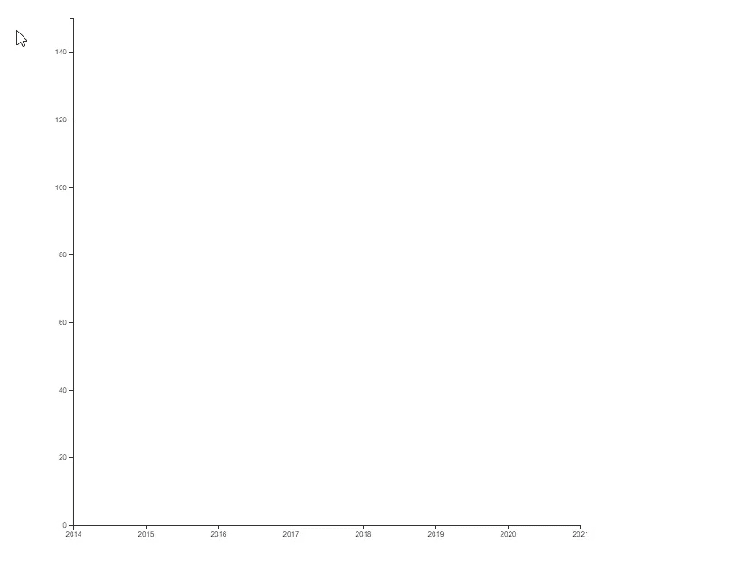
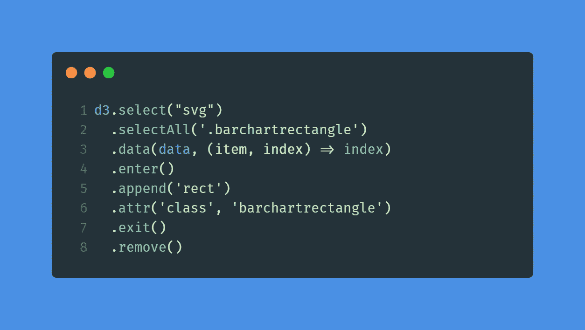
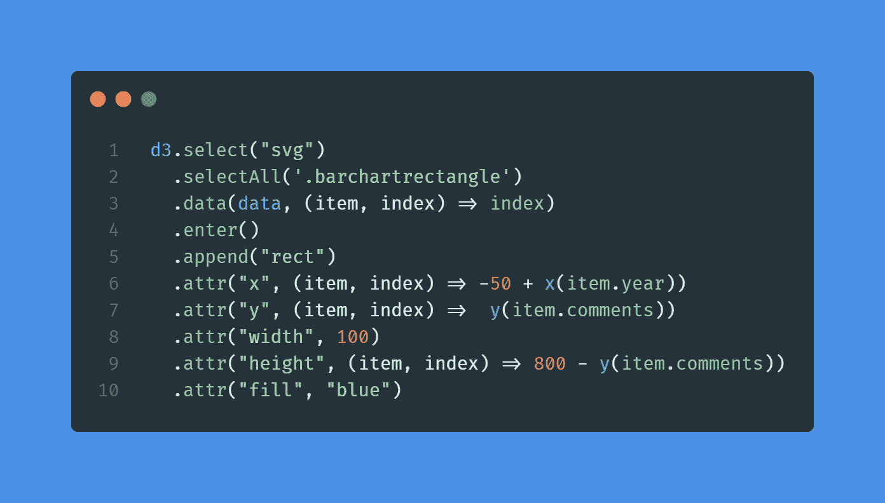
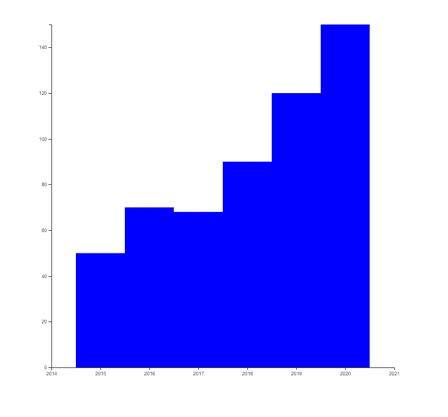

# 快速浏览 D3.js

> 原文：<https://betterprogramming.pub/a-quick-look-at-d3-js-ecc7657556f4>

## 使用 JavaScript 的强大功能将您梦想的任何事情可视化

照片由[卢克·切瑟](https://unsplash.com/@lukechesser?utm_source=medium&utm_medium=referral)在 [Unsplash](https://unsplash.com?utm_source=medium&utm_medium=referral) 拍摄

D3 是数据驱动文档的缩写，是一个 JavaScript 库，它使得以多种方式显示数据成为可能，并有助于 DOM 的检查和操作。

虽然你可能认为它是，D3 不是一个图表库。它提供了更大的灵活性，现有的图表库如 [Recharts](https://recharts.org/en-US/) 、 [C3js](https://c3js.org/) 和 [Raw graphs](https://rawgraphs.io/) 都利用了这一点。D3 很棒，因为当你试图过多地定制它时，你的图表库会崩溃，而 D3 会一直运行下去。

在本文中，您将通过示例了解 D3。总的流程可以归结为:

但是首先，让我们从在网页上画一些不同颜色的形状开始。这将让你习惯使用选择器和形状。

# 画基本形状

那么我们到底该如何使用 D3 绘图呢？我们首先创建一个包含空 SVG(可缩放矢量图形)的 HTML 页面。如果你不知道 SVG 是什么，它是一个由基本形状组成的图像，这使得它非常具有可伸缩性。我们将使用 D3 绘制这些主要形状。

首先，创建一个导入 D3 的 HTML 文档。在整篇文章中，我们将继续使用相同的 HTML 文档。我们将只编辑突出显示的脚本标记之间的代码。

如你所见，在第 4 行我们导入了 D3。如果你使用的是带有 [Node.js](https://nodejs.org/en/) 的前端框架，你可以使用 NPM。在第 7 行，我们定义了一个 SVG 元素，我们将在其中绘制我们的形状。

让我们编写 D3 代码的第一行:

在第 2 行，我们从使用`d3.select()`方法开始。这个选择器函数将使用您传递给它的 CSS 选择器来查找第一个元素。在我们的例子中，页面上只有一个`<svg>`标签，所以它将返回唯一的现有 SVG 元素。

我们稍后会用到的另一个选择函数是`d3.selectAll()`。这个函数将返回所有匹配 CSS 选择器的元素，而不仅仅是第一个。

在第 4 行，我们使用了 SVG 元素，并在它后面添加了一个圆圈。您可以向 SVG 元素添加多种不同的形状。在第 5 行，我们应用了 D3 的方法链接。方法链允许我们一个接一个地调用多个函数，避免我们不得不在每一行都写`svg.function(...)`。

在第 5、6、7 和 8 行，我们使用`d3.attr`函数设置属性。这些属性是形象化我们的圈子所必需的。`cx` 将是我们圆心的 *x* 坐标，`cy` 将是圆心的 *y* 坐标，`r`将是圆的半径，`fill` 将是填充圆的颜色。这些是固定属性。[在 freeCopeCamp 上可以找到这些属性](https://www.freecodecamp.org/news/svg-rectangle-and-other-svg-shapes/)在每个基本形状上的用法示例。

最后，如果你查看你的浏览器，你会看到这样的内容:

这可能看起来不多，但很棒。即使是最复杂的图形也只是一堆简单的形状。

让我们给图像添加另一个正方形:

我们添加一个`rect`形状，并设置正确显示它所需的属性。运行代码会得到以下结果:

现在您已经知道了添加形状的基本知识，让我们从加载一些数据并根据这些数据显示形状开始。

# 加载数据

有多个 D3 函数用于获取不同类型的数据。最有趣的开始是`d3.json('...')`、`d3.csv('...')`、`d3.xml('...')`。

这三个工具都使用 Fetch 来“获取”数据。CSV 不允许嵌套对象，而 JSON 和 XML 允许。

在接下来的章节中，我们将使用来自我们虚构的社交网络(`socialnetwork.json`)的以下数据文件和以下样式:

我们将从构建图书馆图表开始。水平方向显示我们的年份，垂直方向显示我们的评论数量。我们将分别使用`d3.axisBottom()`和`d3.axisLeft()`来实现这一点。在代码中，加载数据和绘制轴是这样的:

代码太多了！别担心，我们会一行一行的来。

在第 3 行，我们从获取 JSON 开始，因为`d3.json()`返回一个承诺，我们必须使用`.then()`或`await`来等待获取完成。第 5 行和第 10 行完成后，我们开始创建尺度函数。

## 比例函数

缩放功能是将数据渲染到屏幕上的关键之一。假设我们从 2015 年到 2020 年，屏幕分辨率为 500 x 500。如果我们在 *x* 轴上显示年份，我们希望将 2015–2020 映射到 0–500。

这就是尺度函数的由来。其中一个是`.scaleLinear()`，它会将一个范围内的数字线性转换成另一个范围。对于`scaleLinear()`函数，我们在第 7 行给出一个范围。我们通过了一个范围`[100,800]`，因为我想在第 100 个像素开始绘制，并在第 800 个像素结束绘制(在 *x* 轴上)。

之后，我们传递一个域，这个域就是我们要映射的数据的范围。`.domain()`需要一个具有最小值和最大值的数组。幸运的是，D3 有函数`d3.extent()`、`d3.max()`和`d3.min()`。在第 8 行，我们将最小值设置为`minimum of years — 1`，将最大值设置为`maximum of years + 1`。我们这样做是为了能够稍后在条形图中使我们的条形居中。

在第 13 行，我做了一些稍微不同的事情，因为我希望坐标轴从 0 开始，到注释的最大值结束。我不想显示评论范围 50-150，但我想显示 0-150 之间的评论。

`d3.extent()`会返回`[max, min]`而不需要你分别调用 min 和 max。

然后是画实际轴的时候了。在第 15 行，我们开始添加 *x* 轴。我们给它一个类用于设计目的(见设计图片),然后我们转换我们的 g 元素，因为一个 *x* 轴总是从左上角的原点开始绘制。所以我们把它翻译到底部。之后我们执行`.call(d3.axisBottom(x).tickFormat(d3.format("d"))`。`.axisBottom`将绘制我们的轴。(注意我们给它的是 range 函数，所以它知道在什么范围/域执行。)然后我们做一个额外的`.tickFormat()`，它告诉 D3 如何显示标签。在我们的例子中，我们想要从 2014 到 2021 的简单数字，所以我们使用`"d"`。

之后，我们对 y 轴做基本相同的事情，除了变换不同，因为我们需要水平平移轴来显示标签。

结果是这样的:

# 选择元素并绑定数据

接下来，我们要根据评论的数量为每一年画矩形。为此，我们将选择我们的 SVG 并绑定我们的数据。

这可以归结为这样写:

首先，我们使用`d3.select()`函数来获取我们的 SVG。(注意，在前面的代码片段中，我们将其保存在一个名为`svg`的变量中。)

*之后，我们调用`.data()`函数。数据函数本身有一个强制参数，即您要呈现的数据，还有一个可选参数，用于指定键。为了指定键，我们给它一个函数，该函数接受一个项和数组中的索引。在这个例子中，我返回了索引。*

*然而！正如我们将在接下来的部分中看到的，您可以在条目上使用一个字段来知道要更新/删除/插入哪些条目。如果我们的数据集中有一个`id`属性，我们可以写类似于`(item, index)=> item.id`的东西。*

*现在我们知道了如何进行数据绑定，让我们添加一些矩形。*

# *创建、更新和删除元素*

*当您更新数组中的数据时(例如，通过过滤)，D3 将比较数组并决定做什么。*

*现在，我将只讨论两个最重要的函数:添加`.enter()`和移除`.exit()`。*

*为了理解这种逻辑，请考虑下面的代码:*

**

*当我们第一次执行这段代码时，考虑我们使用这个数组作为数据`[1,2,3]`。*

*我们的选择器`.barchartrectangle`将返回 0 个元素，所以 D3 知道数组中的项目是三个新的数据。因此，它将使用更改为`.enter()`语句的功能。在这个语句中，我们为每个新的数据添加新的`rect` s ，并给它们一个类`barchartrectangle`。因为没有“删除”，所以`.exit()`语句将被忽略。*

*现在，如果我们将数组更新为[1，2]并再次运行这段代码，`.barchartrectangle`选择器将返回三个现有元素。但是，D3 注意到数组中只有两项。因此，它将使用链接到`.exit()`语句的函数，在本例中是第三个元素`.remove()`。*

*D3 怎么知道要删除哪些元素？这取决于我们之前定义的数据键。在我们的例子中，这仍然是索引，所以它将删除已经添加的第三个元素。然而，如果我们的项目是实际的 id `(item, index)=> item`，我们将数组更新为[1，3]，那么我们的第二个`barchartrectangle`将被移除，而不是第三个。*

*现在你已经知道了`.enter()`和`.exit()`语句是如何工作的，是时候呈现我们的条形图了。*

**

*在第 4 行，我们从使用`.enter()`开始，这样 D3 将知道如何处理新数据。在第 5 行，我们添加了一个新的`rect`，之后我们设置了所有必要的属性。正如您在第 6 行和第 7 行看到的，`.attr()`函数不仅仅接受固定值；相反，它可以采用一个使用该项及其索引的函数。这样我们就可以根据我们的数据来绘制元素。*

*在第 6 行，我们首先通过调用我们的 *x* 缩放函数来获得缩放后的 *x* 位置，该函数是在我们的年份之前定义的。这将返回我们想要放置条形图的像素值。因为我们稍后将宽度设置为 100，所以我们通过执行`-50`来将条调整到值点的中心。对于 *y* 坐标，我们可以简单的调用我们的缩放函数。对于第 9 行的高度，我们必须做`800- y(item.comments)`。这是因为我们的标度函数是相反的。记住我们的范围是`[800, 100`，所以低注释值将被映射到高像素值。这就是为什么我们要通过做`800 — y(item.comments)`来反转它。*

*最后，我们设置填充颜色为蓝色，只是为了美观。最后的结果是:*

**

*这就是我们——我们使用数据在屏幕上渲染了一些东西。D3 就是这么回事！但是请记住，还有很多事情要做。查看 [D3.js 上的酷炫图表和数字——数据驱动文档(d3js.org)](https://d3js.org/)。*

*如果你想更深入地了解 D3 或者获得更多很棒的例子，我推荐 Elijah Meeks 的书 [D3.js in Action](https://www.manning.com/books/d3-js-in-action) 。*

# *结论*

*在本文中，您快速了解了如何使用 D3 库进行渲染。现在，您可以使用动态生成的数据在 SVG 中可视化形状。*

*还有很多东西要学:地理测绘、HTML 操作、网络可视化……这样的例子不胜枚举。但是 3D 的一大优点是几乎没有边界。所以去尝试一下吧！*