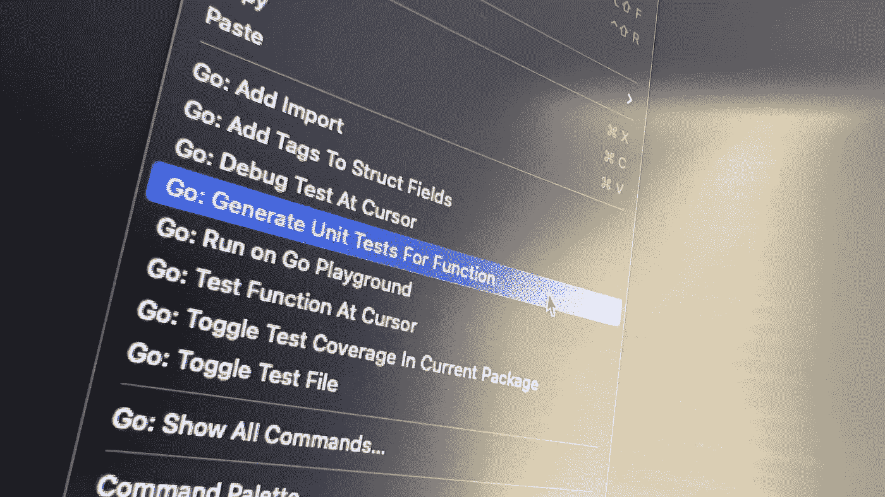
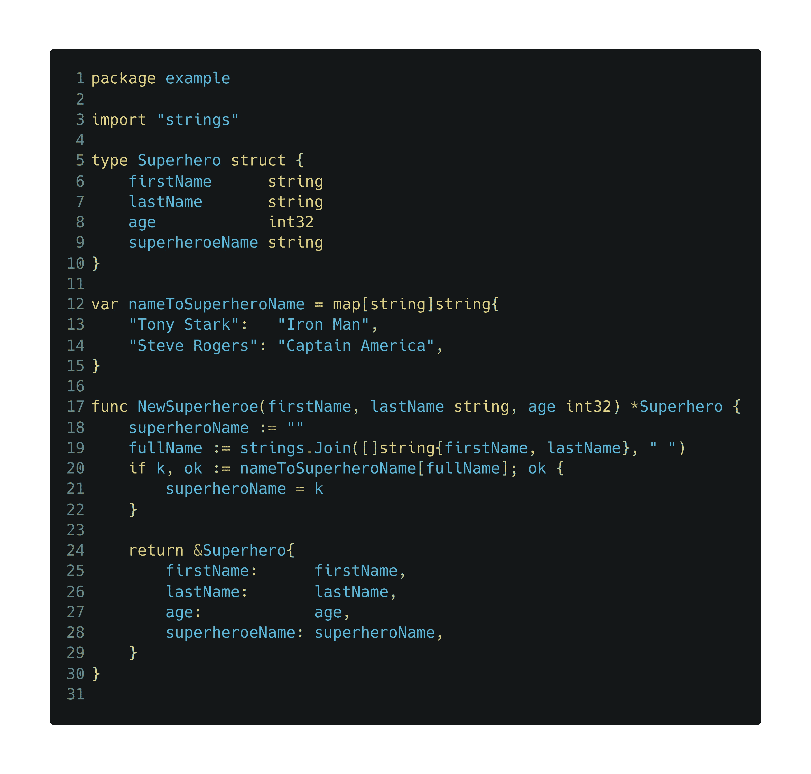
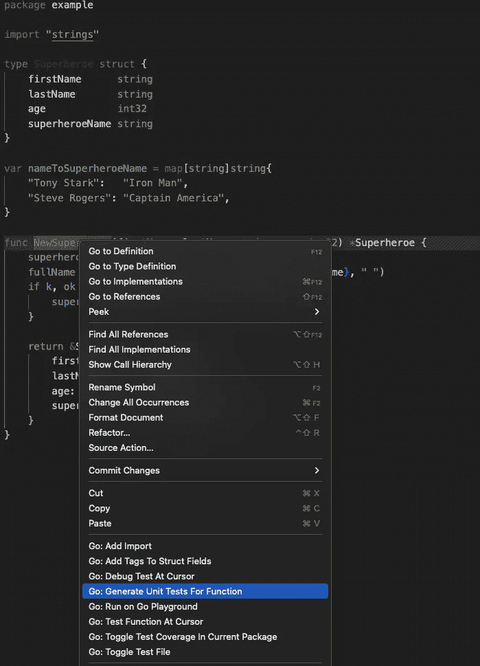
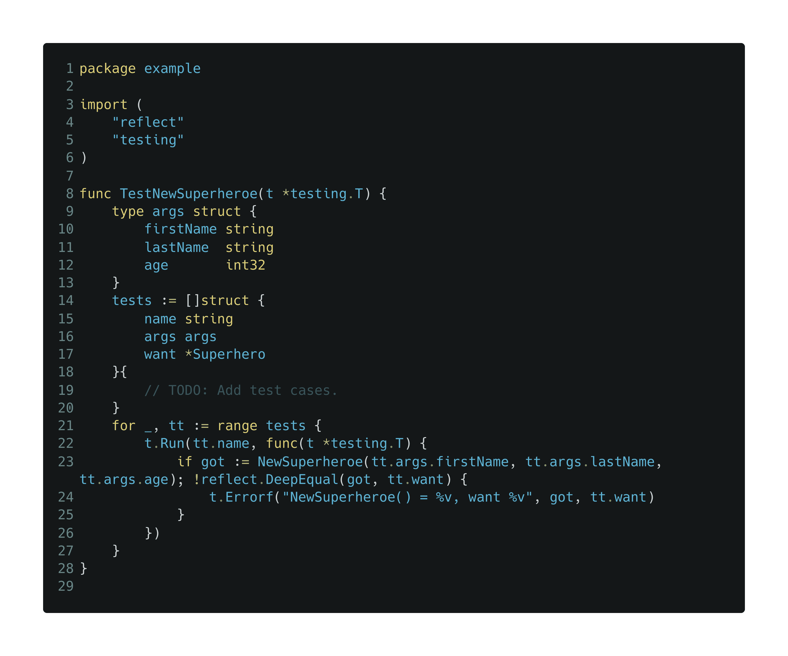
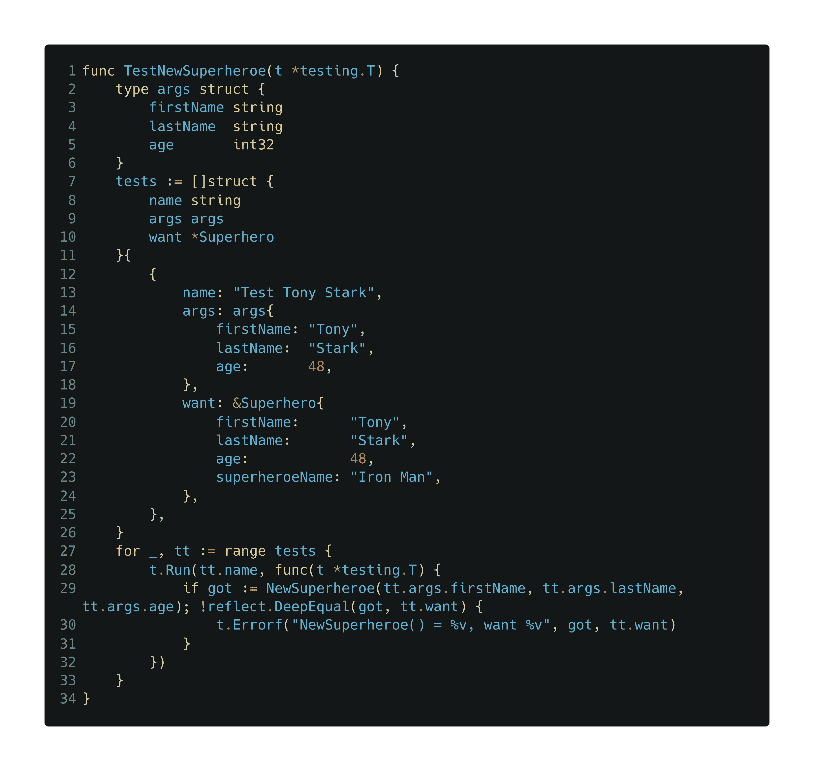
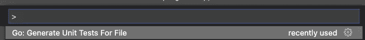
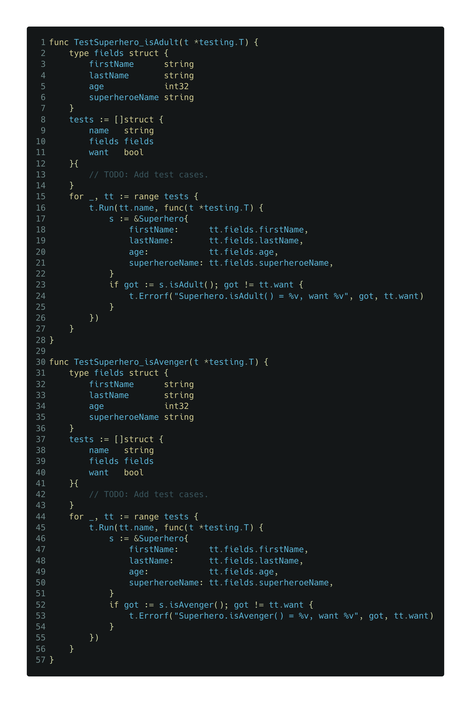

# 在 Visual Studio 代码中快速生成 Go 测试的方法

> 原文：<https://betterprogramming.pub/a-quick-way-to-generate-go-tests-in-visual-studio-code-b7c675b88dac>

## 单击此处生成单元测试



TL；dr:点击这里。

我刚刚学会了一种用 Visual Studio 代码(VSC)编写 Go 测试的快速方法。在与一位同事一起编程时，我注意到他在编辑器中右键单击某个地方后生成了一个测试的样板代码。这引起了我的注意，因为这是我第一次看到魔术。所以，搜索了一下，我发现了他是怎么做到的。在这篇短文中，我将描述这个过程。

创建这个样板代码的工具叫做`gotests`。它生成 Go 的[表驱动测试](https://github.com/golang/go/wiki/TableDrivenTests)，覆盖 Go 文件中的函数，或者从方法的签名中生成它们。要使用它，你可以从命令行安装并执行它，或者直接从 VSC 安装，因为它包含在 VSC 的 Go 插件中。让我们看看怎么做。

假设您有一个这样的 Go 源文件:



它有一个结构`Superhero`，一个映射`nameToSuperheroName`来将超级英雄的真实姓名转换成它的别名，还有一个函数创建一个新的`Superhero`并检查映射是否包含它的别名。要生成样板测试代码，右键单击函数的签名(这里写着`NewSuperhero`)并选择“Go:Generate Unit Tests For Function”



点击这里将创建一个测试文件，其中包含一个名为`TestNewSuperheroe`的测试函数和您开始编写测试所需的框架代码。此测试代码遵循表驱动测试模式，这是一种涉及结构(“表”)的测试类型，该结构的字段包括测试的输入、预期输出和其他信息，如名称。



要填写该表，您需要在第 19 行创建一个匿名结构列表。这个结构由一个`name` `string`组成，用于为测试指定一个名称，一个`args` `struct`由`NewSuperheroefunction`的参数组成，以及`want`，您期望`NewSuperhero`输出的`Superhero`对象。比如下面的截图有我的测试，我命名为`Test Tony Stark`。我将使用这个测试来验证输入`Tony`、`Stark`和`48`是否产生一个看起来如下的`Superhero`对象:

```
&Superhero{
    firstName:      "Tony",
    lastName:       "Stark",
    age:            48,
    superheroeName: "Iron Man",
 }
```



注意字段`superheroeName`是`Iron Man`，因为根据源文件中定义的映射，托尼·斯塔克的名字翻译成了钢铁侠。

但是，如果我们想为一个文件可能具有的所有功能生成测试，该怎么办呢？例如，假设您添加了两个新方法，`isAdult`和`isAvenger`到我们的`Superheroe`结构中:


我们双击每个函数来生成它们的测试吗？不要！您可以通过打开 VSC 的[命令面板](https://code.visualstudio.com/docs/getstarted/userinterface#_command-palette)并选择“Go: Generate Unit Tests For File”选项来为源文件中的每个函数创建测试。



这样做会将以下代码添加到现有的测试文件中:



从这一点上来说，由您来完成您的测试，如果需要的话，修改样板代码来满足您的需求。测试愉快！