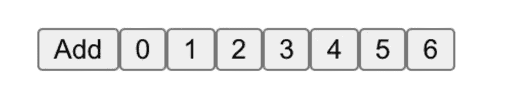
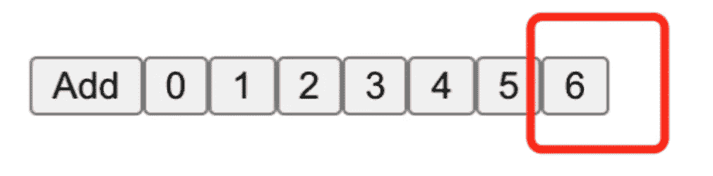
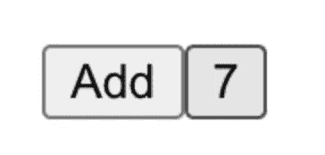
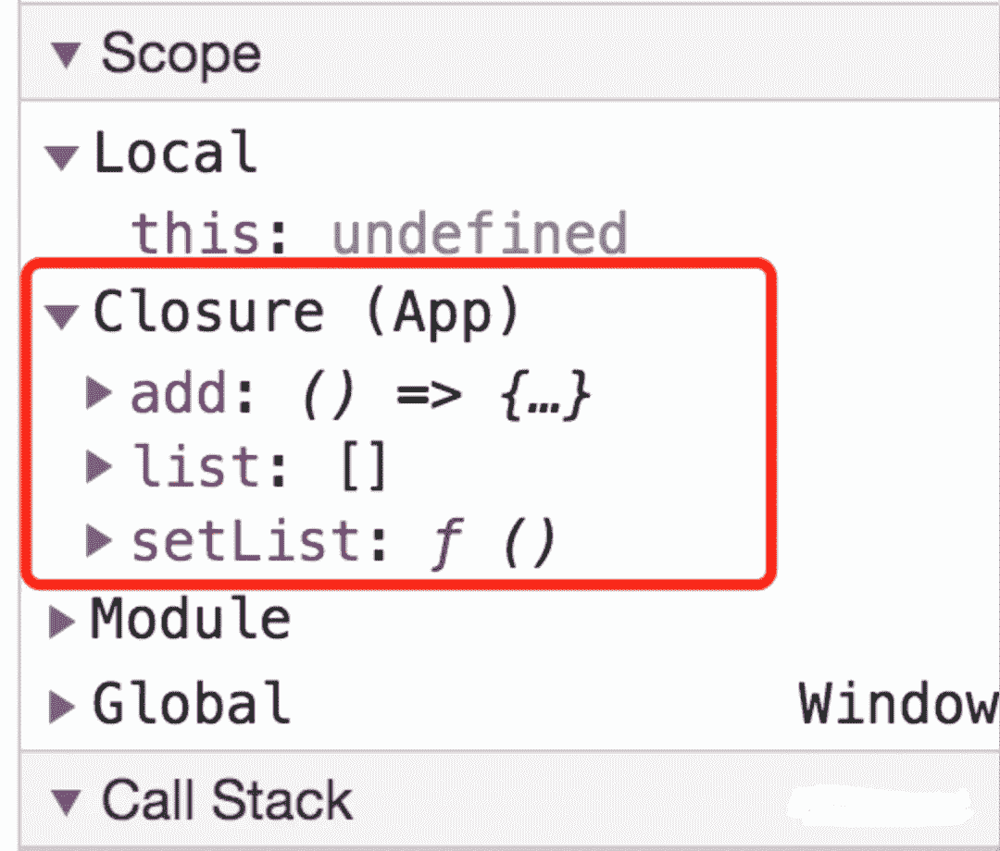
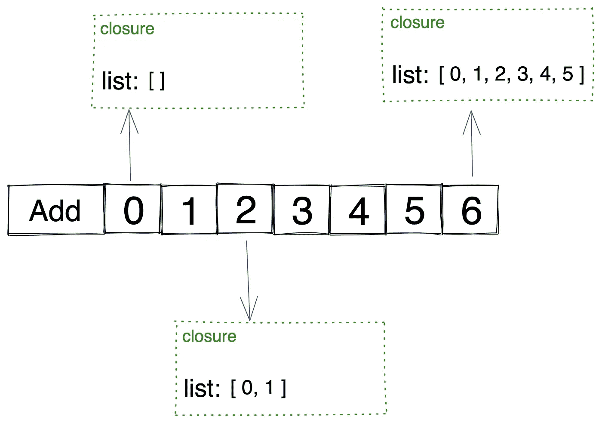
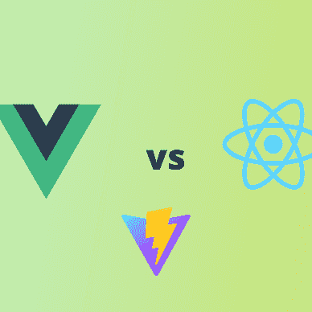
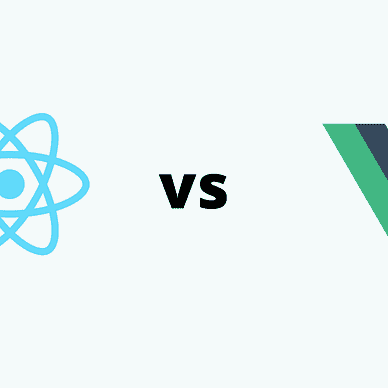

# React 钩子对高级 React 开发者的挑战

> 原文：<https://betterprogramming.pub/a-react-hooks-challenge-for-senior-react-developers-f1190e1939ec>

## 你能解决这个问题吗？


前阵子有个朋友给我发了一个 React 演示，测试我对 React 的理解。

我仔细看了这个演示。虽然代码很小，但它包含以下内容:

*   钩子的闭合问题
*   国家的原则

这确实是一个有趣的挑战。在这里我想和你分享这个挑战。看完这篇文章，你会对功能组件有更深的理解。

# 演示

这个演示的结构很简单:它包含一个按钮和一个列表。

当点击按钮时，它会向列表中添加一些内容，如下所示:

看起来是这样的:


直到现在，这还很简单，不是吗？

有趣而复杂的部分是，当你点击`Add`按钮时，它会向列表中添加一个新按钮，该按钮也有一个`onClick={add}`事件。

所以，如果你点击`Add`七次，页面会是这样的:



你明白了吗？这是一个在线演示:

# 挑战

这里有一个问题:如果我们点击这些数字，会发生什么？

*   如果我们点击按钮`0`，列表会是什么样子？
*   如果我们点击`6`按钮，列表会是什么样子？

你可以在阅读剩下的部分之前，自己思考和练习。

# 答案

一些开发人员可能认为点击一个数字后会有一个新的按钮被推到列表中。

但是这个答案是错误的。当我们点击一个数字时，列表的长度会变成[ `the number` + `1` ]，列表中的最后一个数字会变成[ `the largest number before the click` + `1` ]。

我知道这种说法有点拗口，但让我用几个例子来解释一下。

假设当前列表是这样的:



如果我们点击`0`，列表的长度会变成`0 + 1 = 1`，最后一个数字会变成`6 + 1 = 7`。



现在，如果我们单击`2`，列表的长度将变为`2 + 1 = 3`，最后一个数字将变为`6 + 1 = 7`。


您可以通过提供嵌入式演示来尝试一下。

但是你知道为什么会出现这种现象吗？

# 状态和关闭

这是两个因素共同作用的结果:

*   钩子的闭合问题
*   国家是如何组成的

让我们来看看`add`功能:

点击按钮时，调用`add`函数。然后，闭包将基于它的上下文被创建。

封口包含:

*   `add`功能
*   `list`
*   `setList`



而`list`和`setList`是由`useState`钩子创造的。

这里有一个常见的误解:多次调用`useState`返回的`list`是内存中地址相同的同一个对象。

实际上，每次调用`useState`返回的`list`是基于以下公式计算的:

```
base state + update1 + update2 + … = current state
```

*(作为 React 的投稿人，我确定 React 中的状态是基于一个* `*baseState*` *和一个更新的链接计算出来的。您可以在 React 的源代码中搜索一个名为“processUpdateQueue”的函数，计算就是在那里运行的。)*

所以，多次调用`useState`返回的`list`是内存中地址不同的不同对象。

这就导致了一个很重要的现象:每个数字对应的`add`函数在不同的闭包里，它们的`list`有不同的值。



`i`是模块级变量；它们在每个闭包中都是相同的。

当您点击`0`时，会发生以下情况:

*   `i`是模块级变量，6
*   本关中的`list`是`[]`

所以它实际上执行了下面的代码:

```
setList(
  [].concat(
    <button key={7} onClick={add}>{7}</button>
  )
);
```

于是网页上的列表变成了`[7]`。

当您点击`2`时，会出现以下情况:

*   `i`是模块级变量，6
*   `list`在这封信里是`[0, 1]`

所以它实际上是这样执行的:

```
setList(
  [0, 1].concat(
    <button key={7} onClick={add}>{7}</button>
  )
);
```

并且网页上的列表变成了`[0, 1, 7]`。

你明白了吗？

# 结论

因为国家的组装原则是:

```
base state + update1 + update2 + … = current state
```

所以每次调用`useState`时，它的返回值都是不同的对象。

并且由于闭合，每个数字按钮上记录了不同的`list`值。

这最终导致了文章开头描述的现象。

希望这篇文章对你有用。

# 解决办法

如果不希望出现这种闭合现象，可以将`setList`的参数修改为函数形式。

*   [了解 React 钩子的闭包陷阱](/understanding-the-closure-trap-of-react-hooks-6c560c408cde)
*   [用图表解释 10 个 JavaScript 闭包挑战](/10-javascript-closure-challenges-explained-with-diagrams-c964110805e7)


[字节鱼](https://bytefish.medium.com/?source=post_page-----f1190e1939ec--------------------------------)

## 反应文章

[View list](https://bytefish.medium.com/list/react-articles-f03ed95b6f26?source=post_page-----f1190e1939ec--------------------------------)11 stories