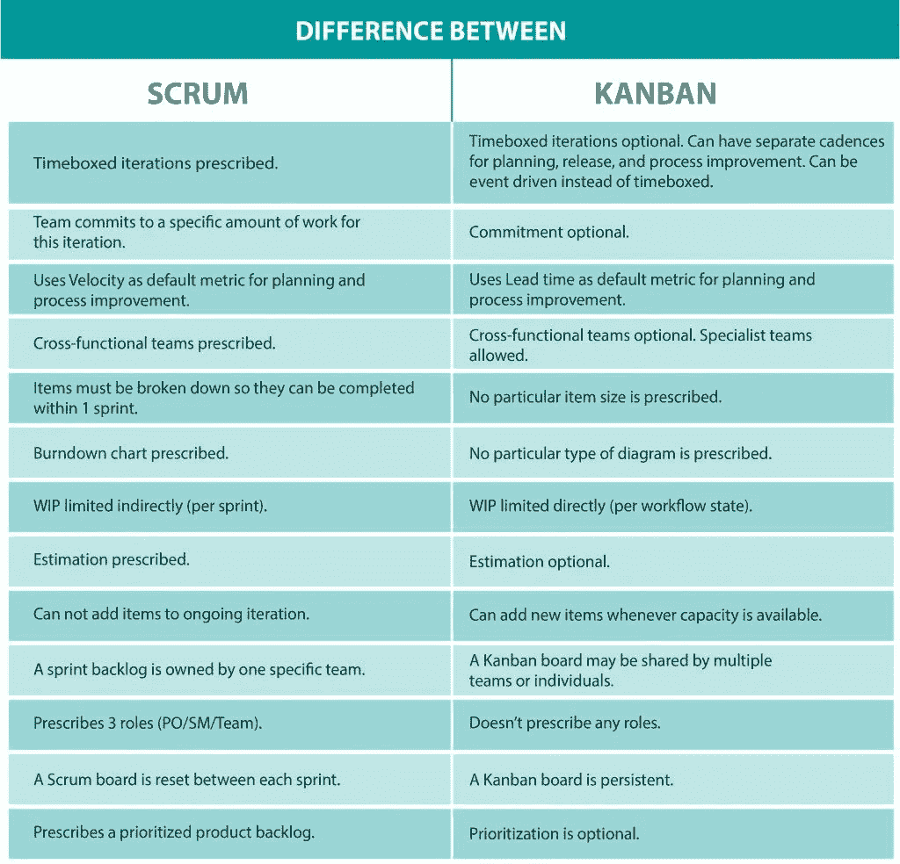

# 对“Scrum 已死”的回应。向看板致敬，新的王者”

> 原文：<https://betterprogramming.pub/a-response-to-scrum-is-dead-all-hail-kanban-the-new-king-19c5ef1ae407>

## 在盲人的世界里，独眼龙是国王

照片由 [Roman Kaiuk](https://www.pexels.com/@romakaiuk?utm_content=attributionCopyText&utm_medium=referral&utm_source=pexels) 拍摄

[Emanuel Marques](https://medium.com/u/dc28a2da147c?source=post_page-----19c5ef1ae407--------------------------------) 写了一篇文章，声称看板优于 Scrum。看了他的文章， [Scrum 死了。所有人都欢呼看板，新国王](https://medium.com/better-programming/scrum-is-dead-all-hail-kanban-the-new-king-2cd6249feef8)，我所能得出的结论是，他的团队从一开始就没有真正实践过 Scrum。

当它实际上是一个与你竞争的跳棋棋子时，很容易推翻国王！

让我剖析一下他文章中的所有误解。我想强调的是，我已经将许多团队从 Scrum 转换到看板，在某些情况下这样做绝对有意义。整个“看板比 Scrum 好”或反之亦然，争论没有意义。我只是对它不感兴趣。

我以前写过这个话题，下面是我对整个 Scrum 与看板之争的立场:

> 我不喜欢 Scrum 或看板。说一个比另一个好是没有意义的。这完全取决于上下文。夏天穿拖鞋很棒。雪地靴在冬天很神奇。though☺.，雪地靴一年四季看起来都很丑 Scrum 和看板也是如此。环境和预期结果决定了哪种方法可能会执行得更好。
> 
> — Maarten Dalmijn，[看板什么时候比 Scrum 好？](https://medium.com/@mdalmijn/when-is-it-better-to-use-kanban-than-scrum-d5032b658ac3)

选择 Scrum 还是看板取决于环境和你想要达到的目标。另外，看板和 Scrum 可以完美地结合使用。看板是 Scrum 的补充。甚至还有针对 Scrum 团队的[看板指南。](https://www.scrum.org/resources/kanban-guide-scrum-teams)

作者声称看板优于 Scrum，Scrum 不是敏捷的，看板是新的王者。当你使用如此强烈的词语时，你最好把你的事实搞清楚！不幸的是，他文章中的论点与 Scrum 无关，而是对 Scrum 的一种孤陋寡闻、自行发明的解释。

这就是我写这篇回应的原因。我不在乎是否有人使用看板或 Scrum。我觉得让你的船漂浮的东西都没问题。只是不要用误解和误解来表明你的观点。

让我们从第一个论点开始:

> 几年后，我开始注意到一件事:在冲刺的最后几天，每个人都急于交付他们在之前两周完成的一切，以避免遗留问题，经常承担不必要的风险。

本段有两个问题:

*   目标是永远不要在冲刺阶段完成所有任务。目标是交付满足冲刺目标的*产品增量。差别很大。目标是稳定的，但你如何实现它是完全灵活的，只要冲刺目标没有风险。并非你的 Sprint 待办事项清单中的所有事情都应该与 Sprint 目标相关。如果你试图在冲刺阶段完成所有事情，要么你没有正确设定冲刺目标，要么你没有使用它们。你永远不应该把你 100%的能力分配给 Sprint Backlog 来实现 Sprint 目标，因为那样就没有空间来处理细节或者处理意外。*
*   只要不危及冲刺目标，遗留问题不是问题。被遗留问题困扰是一个心态问题，不受 Scrum 的影响。Scrum 中没有任何地方说你应该完成 Sprint Backlog 中的所有项目。团队对每个 Sprint 承诺的只有一件事:构建符合 Sprint 目标的产品增量。如果有与 Sprint 目标无关的 Sprint Backlog 项目，你不需要完成它们。

如果你想了解更多关于冲刺目标以及它们对 Scrum 的重要性，我可以推荐[冲刺目标是 Scrum](https://medium.com/serious-scrum/sprint-goals-are-the-beating-heart-of-scrum-bdef2518e828) 跳动的心脏。

下一个论点是，根据 Scrum，遗留问题是不好的:

> 为什么？有些任务不能等到下周吗？在周末之前交付每一项任务都那么重要吗？不，不是的。我们这样做是因为“遗留物是不好的。”

那些任务可以等到下周。这不是问题，除非它们是实现 Sprint 目标所必需的。请指出 scrum 指南中说遗留问题不好的确切段落。它不在那里——它是由团队编造的。我已经写过[为什么当你使用 Scrum 时结转是好的。](https://medium.com/serious-scrum/carry-overs-are-good-when-you-use-scrum-5cbc0cbc415a?source=friends_link&sk=f190a3ced54ac0cd91fbc39dd4a2c9f1)

接下来，作者声称 Scrum 并不敏捷，当你需要处理意想不到的事情时，你的 Sprint 会失败:

> 如果你需要做意想不到的工作(程序错误，生产中的问题，等等)。)，这会影响你的时间，从而使你无法实现在计划会议上做出的承诺。

如果你致力于 Sprint Backlog，并以 100%的能力进行计划，你就是在为失败做准备。那么不可避免的是，你将无法处理意想不到的事情。但你为什么要这么做？这是你的团队做出的选择。

100%产能计划等同于有意识地超过你们共同商定的在制品(WIP)限制。如果 WIP 限制太高，你就在制造自己的问题:积压项目的巨大交通堵塞。就像你在使用看板时不应该超过 WIP 限制一样，致力于 Sprint Backlog 也不是你应该做 Scrum 的方式。

在 Scrum 指南中清楚地陈述了 Sprint Backlog 的灵活性和出现:

> 开发团队在整个 Sprint 期间修改 Sprint Backlog，Sprint Backlog 在 Sprint 期间出现。当开发团队在计划中工作，并了解更多关于实现 Sprint 目标所需的工作时，就会出现这种情况。

灵活的 Sprint Backlog 是做 Scrum 所必需的，否则，你不能包含你所学到的东西来更好地实现 Sprint 目标。scrum 的经验核心的全部要点是在冲刺期间检查和适应*。你必须在冲刺阶段调整冲刺待办事项。冲刺之后再做就来不及了。当你把冲刺填满时，没有经验主义的空间，不可避免地你会遇到问题——惊喜，惊喜:冲刺会失败。*

在这篇文章中，作者指出，最常见的衡量成功的标准是承诺与完成。以下是相关片段:

> 评估成功最常用的指标是承诺与完成，它比较了你在 sprint 开始时承诺的故事和你完成的故事(我甚至懒得提这会带来什么问题)。

只有不使用 Sprint 目标的公司才会关心这个指标。在 Scrum 指南中没有任何地方说你应该使用这个标准，甚至没有说你应该使用故事。你的公司决定使用这个指标，即使你知道这是一个糟糕的指标，你还是继续使用它，为什么？

你应该做的是:

> Sprint 通过确保至少每个日历月对 Sprint 目标的进展进行检查和调整来实现可预测性。
> 
> ——Scrum 指南，2017 年 11 月

团队只致力于冲刺目标。没有对单个 Sprint Backlog 项目的承诺。因此，承诺与完成不再相关。相反，主要问题变成了:我们达到冲刺目标了吗？而如果能通过完成更少的 Sprint Backlog 项来实现 Sprint 目标，那就更好了！

Scrum 是一个过程框架。关键是*你*找到自己更好的工作方式，包括你选择的衡量标准。你的团队没有这么做。事实上，你一直坚持一些不起作用的东西。我相信它比 Scrum 更能说明你的团队、公司和组织文化。

作者随后使用了 Cuelogic 中的一个表格来展示 Scrum 和看板之间的区别。表格中错误百出，显示出对 Scrum 和看板的理解都很差。

图片来自 [Cuelogic](https://www.cuelogic.com/blog/scrum-vs-kanban-a-developers-on-the-project-comparison)

Scrum 在这个表格中的错误:

*   团队并不致力于具体的工作量，他们致力于 Sprint 目标。冲刺目标可能需要比最初计划更少或更多的工作。Sprint 的范围是灵活的，可以协商的，只要 Sprint 的目标仍然可以实现，因此工作量也会根据讨论和决定的内容而有所不同。
*   速度不是默认的度量标准，它甚至不是 Scrum 的一部分。速度是一个可选的、补充的练习。
*   没有规定使用燃尽图。事实上，在 Scrum 指南中甚至没有提到。也许这张桌子使用了古代版本的 Scrum 指南作为它的事实来源？烧毁图表最后一次出现在 2010 版的 Scrum 指南中。
*   您可以在一个正在进行的迭代中添加、变更、删除项目，只要它不危及 Sprint 的目标。

此表中看板的错误:

*   WIP 不必受限于每个工作流状态，您也可以仅受限于整个系统。
*   交付周期不是计划和流程改进的默认指标。对于计划来说，您肯定还需要总体的进行中工作和吞吐量，因此您可以使用利特尔法则来预测工作何时完成。
*   对于流程改进而言，周期时间、每个状态所花费的时间、资源效率和流程效率都很重要。

总的来说，这张表只包含了看板的一个极简版本。甚至还有更多没有提到的东西——流程策略、服务类别、管理流程等等。有人将 Scrum 比作看板的基本版本。

然后作者继续声称 Scrum 使用了这些度量标准:

> Scrum 使用这些度量和图表:
> 
> 速度:每次冲刺交付的故事点的数量
> 
> 承诺与完成:被承诺和交付的故事的百分比
> 
> 燃尽图:显示给定 sprint 的故事发展的图表

绝对假！当你使用 Scrum 时，所有这些指标都是完全可选的。这些指标在 Scrum 指南中都没有出现。你所展示的是，你的团队决定使用的*指标*不起作用。最重要的是，我知道我在重复我自己，你甚至不需要用故事。

# 在你声称 Scrum 不起作用之前，开始做吧

如果你不知道如何使用 Scrum，那么它对你不起作用也就不足为奇了。然而，如果你不熟悉 Scrum，宣扬看板更好是没有意义的。

我试图展示作者提出的所有论点与 Scrum 没有任何关系。所有提出的论点都是对 Scrum 的主观解释的结果——与 Scrum 指南相冲突或者甚至在 Scrum 指南中不存在的元素的混合。

作者的 Scrum 团队发明了他们自己版本的 Scrum 监狱。受限于这些想象的和自己建造的墙，他声称 Scrum 限制了你，并且不敏捷。如果你决定在你想象的 Scrum 监狱里用一把自建的 shiv 割破你的手指，你不能责怪这把刀导致你的手指流血！

看板比你以前做的要好。但是你之前所做的，充其量是类似 Scrum 的东西。你刚刚写了一篇文章，记录了你的团队在你的组织和文化中尝试应用 Scrum 时做出的糟糕决策。在使用 Scrum 时，你也可以决定用不同的方式工作，但是你没有。这是你的责任，而不是 Scrum 的责任。

如果你想再试一次 Scrum，给我写信，我会帮助你正确地开始。