# JetBrains 车队回顾

> 原文：<https://betterprogramming.pub/a-review-of-jetbrains-fleet-4b9c21d3a693>

## 令人兴奋，有趣，备受期待。我们来谈谈吧


在 [Unsplash](https://unsplash.com?utm_source=medium&utm_medium=referral) 上由 [Srikanta H. U](https://unsplash.com/@srikanta?utm_source=medium&utm_medium=referral) 拍摄的照片

上周三，广受欢迎的 IDE [IntelliJ Idea](https://www.jetbrains.com/idea/) 的创造者 JetBrains 宣布，他们已经向公众提供了[舰队预览](https://blog.jetbrains.com/fleet/2022/10/introducing-the-fleet-public-preview/)。你们中的许多人都对 JetBrains 为 Fleet 所做的努力以及社区中围绕 Fleet 的所有噪音感到惊讶。我们来过一遍背后的一些细节和原因。

# 介绍

构建这个新 IDE 的主要原因似乎是为了响应由流行的 [VSCode 文本编辑器](https://code.visualstudio.com/)发起的新趋势。

VSCode 是一个非常轻量级的文本编辑器，它允许您通过添加您可以在[扩展市场](https://code.visualstudio.com/docs/editor/extension-marketplace)中找到的扩展来"*增强*"它。有些开发人员甚至不需要/喜欢像自动完成或代码分析这样的功能。因此，他们觉得使用文本编辑器更舒服。

向文本编辑器添加一些内置工具，使其更加面向编码，但仍然是一个文本编辑器，是当今许多开发人员的首选。

此外，VSCode 中对[远程开发的支持非常强大，并被许多开发人员广泛采用，要么使用远程机器，要么使用 Docker 容器在本地运行，在公司/项目的每个开发人员之间共享一致的开发设置。](https://code.visualstudio.com/docs/remote/remote-overview)

一些公司将开发人员从本地开发环境转移到云中提供可重用的虚拟机，这些虚拟机可以随时轻松地重新创建。这对他们来说是一个巨大的优势，因为跨环境的一致性是避免意外问题和浪费时间调查这些差异的关键。此外，这使得公司可以在笔记本电脑上花更少的钱，因为开发人员现在可以使用像 Macbook Air 这样的轻量级笔记本电脑和连接到虚拟机的轻量级代码编辑器。

根据趋势，VSCode 是目前使用最多的 IDE 中接近顶级的，也是顶级 IDE 中增长最快的。让我们来看看这个顶级 ide 索引:

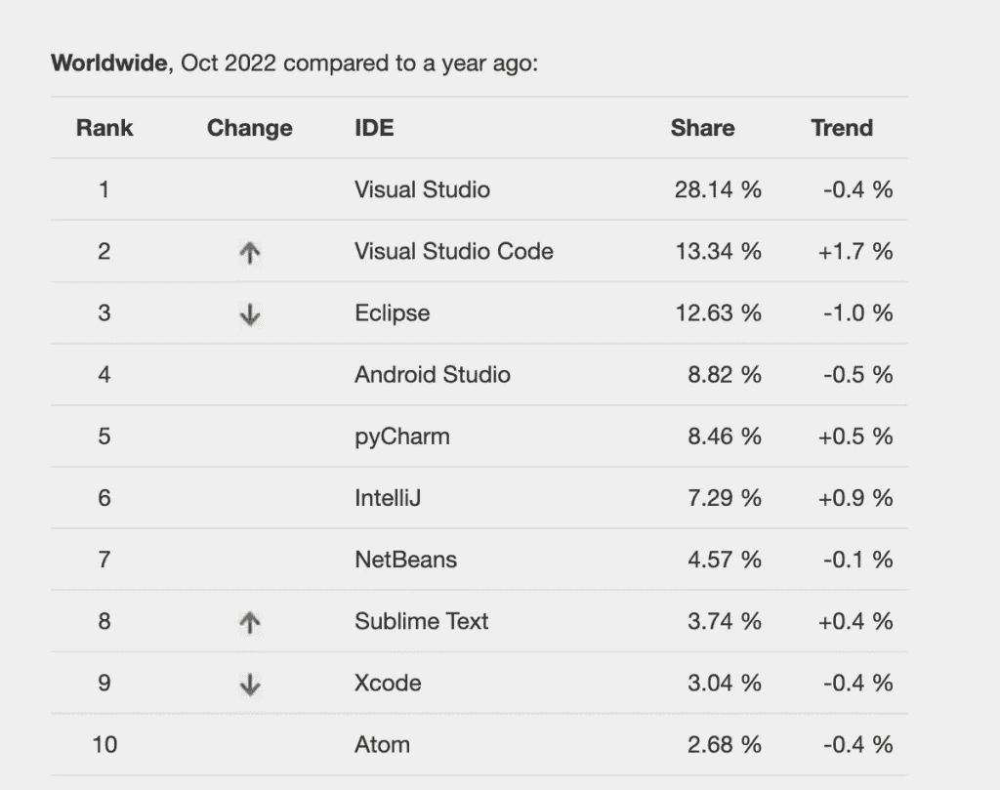

如您所见，VSCode 位列第二，去年增长了 1.7%。IntelliJ 排名第六，但仍增长 0.9%。让我震惊的是，Eclipse 仍然排在第三位，尽管它在最近一年下降了 1%(无意冒犯当前的 Eclipse 用户；) ).

现在让我们仔细看看 Fleet，看看它带来了什么。

# 装置

首先，为了能够安装 Fleet，你需要安装 [JetBrains 工具箱](https://www.jetbrains.com/toolbox-app/)。它会在要安装的“可用”应用程序列表中显示 Fleet，一旦您安装了它，您应该会在您已安装的应用程序列表中看到它，如下面工具箱中的截图所示。

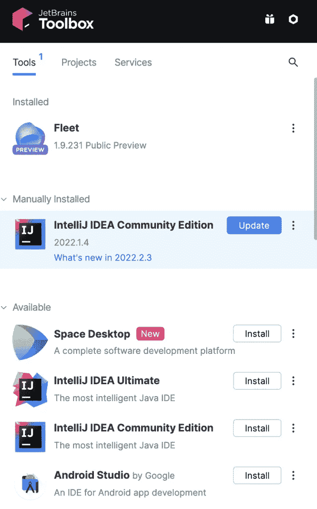

安装后，你可以点击舰队项目，它会为你开始。首先，它比 IntelliJ Idea 启动要快得多，所以这已经是一个进步了。

# 第一印象

一旦你第一次看到这个界面并打开一个 [Kotlin](https://kotlinlang.org/) / [Java](https://www.java.com/en/) 项目，最初，你可能会感到有点困惑，因为它似乎不能识别代码语法，甚至不能识别 [JUnit](https://junit.org/junit5/) 测试。例如，最初，当它检测到一个测试时，它不会显示通常在 JetBrains 的 ide 上显示的“play”绿色按钮。

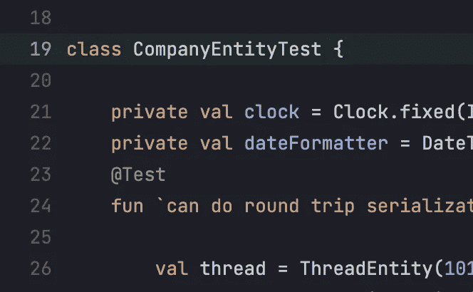

很难确定最初要做什么才能运行测试和编译代码。尽管如果你右击你的任何测试，它会显示一个非常有用的提示:

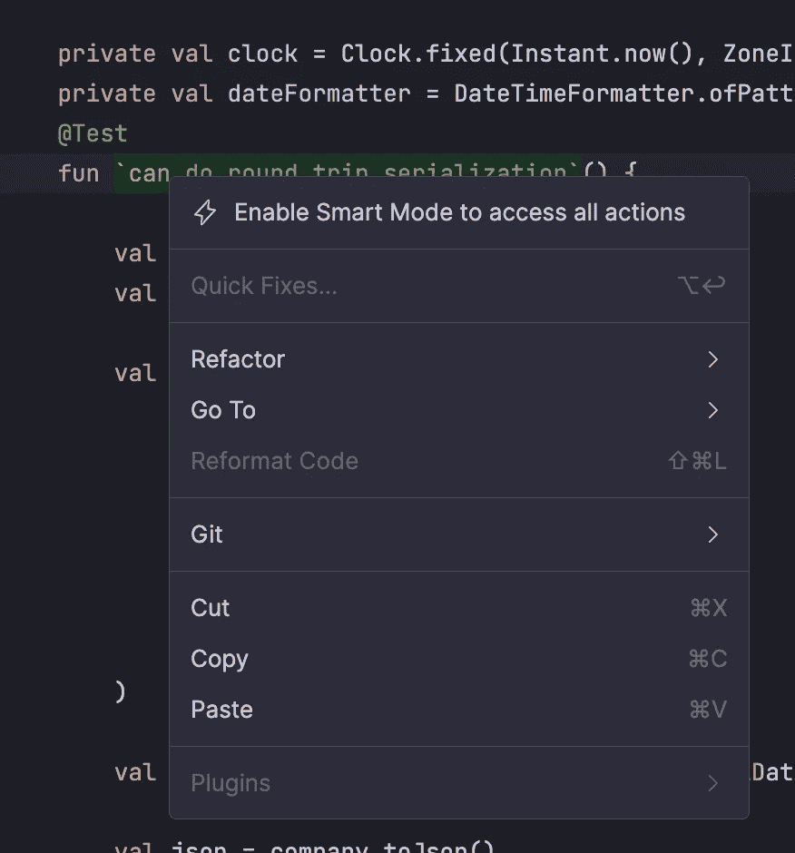

它建议您启用名为“[智能模式](https://www.jetbrains.com/help/fleet/getting-started-with-java-in-fleet.html#smart-mode)”的东西如果你需要一个指南来带你完成你需要做的一切，包括启用智能模式，你可以阅读[“Java 入门”文档](https://www.jetbrains.com/help/fleet/getting-started-with-java-in-fleet.html)。让我们来看看新的“智能模式”

# 智能模式

当您启用[“智能模式”](https://www.jetbrains.com/help/fleet/getting-started-with-java-in-fleet.html)时，IDE 将启动后端服务器，根据一些消息来源，这是 IntelliJ 使用的同一后端。这个后端服务将允许你进行实时编译、自动补全、代码分析等。

虽然一开始我对如何实现这一切感到困惑，但考虑到我是一名 Kotlin/Java 开发人员，这对于一般开发人员来说是一个非常好的特性。我认识的一些开发人员甚至不使用实时编译器，可能是因为他们使用的语言的性质或他们所做的工作的种类。

例如，我认识一个使用 Python 的 Quant 开发人员，他使用一个不错的文本编辑器，运行他的程序来检测运行时的编译问题。我们必须记住，不是所有的语言都是[编译语言](https://en.wikipedia.org/wiki/Compiled_language)。Python 是一种[解释语言](https://en.wikipedia.org/wiki/Interpreter_(computing))。因此，它将在运行时被编译。

这意味着一些开发人员有时更喜欢纯文本编辑器。在 Java/Kotlin 中，由于各种原因，这是不切实际的。

要启用“智能模式”，您必须在 IDE 的右上角找到一个看起来像雷声的小图标。顺便说一下，我不得不说，这在开始时很难发现。

当您点击该图标时，将允许您启用智能模式:

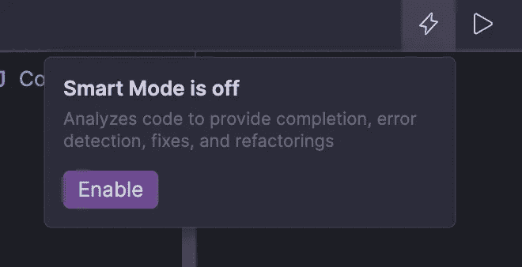

一旦我们启用了“智能模式”，我们就可以看到事情是如何突然变化的。您首先会注意到，智能模式图标已经突出显示，表明它现在已启用。

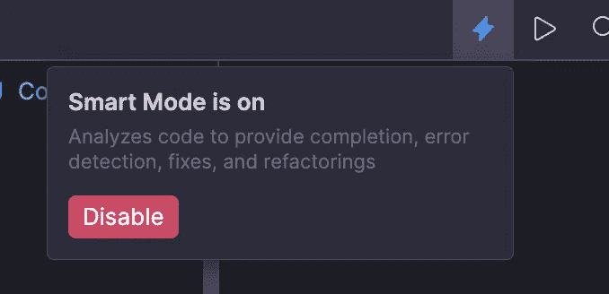

一旦构建了索引，编译错误也会立即显示出来，测试也会被检测到，这样您现在就可以从 GUI 运行它们了。我们如何在车队中进行测试？让我们找出答案。

# 运行配置/测试

有两种方法来运行测试:通过点击出现在左侧的 play 按钮，或者通过创建一个新的配置。您可以在这里查看如何创建运行配置[。](https://www.jetbrains.com/help/fleet/getting-started-with-java-in-fleet.html#run-debug)

在下面显示的三个图像中，您可以看到创建新运行配置的步骤:单击右上角的 play 按钮，“在 run.json 中创建运行配置…”并编辑您的`run.json`以包含您的新运行配置。此外，默认情况下，它检测我的 Spring Boot 应用程序。我可以在不创建新配置的情况下启动我的应用程序。

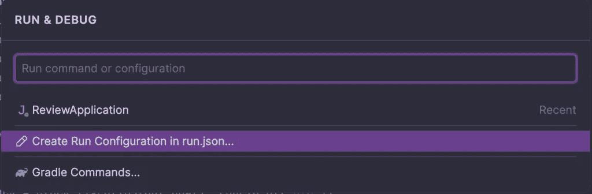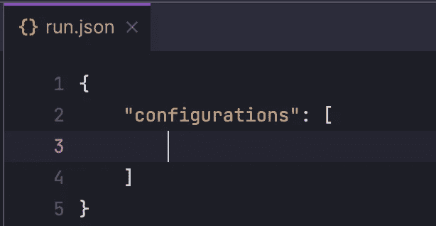

我在这里看到的主要问题是，您需要事先知道`run.json`文件的语法，这最初会产生混淆。我必须查阅文档来理解如何为我的测试创建一个运行。结果是这样的:

```
{
    "configurations": [
      {
        "name": "gradle test",
        "type": "gradle",
        "tasks": [
          "test"
        ]
      }
    ]
}
```

老实说，最初，我很失望。但这可能是因为我们都不喜欢改变。过了一会儿，我意识到这是个好主意。为什么我们需要为每种语言和默认可用的工具提供数百个运行配置？即使我们永远用不到其中的 90%!

在我看来，运行配置的新设计要简单得多，并且避免了给编辑器增加不必要的复杂性。开发人员知道他们使用的工具，应该能够定义只需要一次的工具，并且总是重用它们。我现在唯一的疑问是，如何检查或定义快捷方式，因为在这些操作中没有任何提示。现在，我们来看看面板的配置！

# 嵌板

我喜欢 Fleet 的另一个方面是管理工具面板的简单性。通过选择左上角的按钮，可以展开或折叠工具面板。默认情况下，底部和右侧面板是折叠的。如果你点击其中任何一个，你会看到一个(默认)空面板，允许你只添加你需要的。

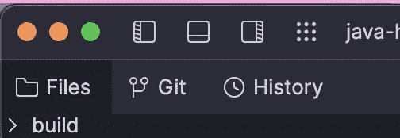

我认为这也是一个很大的进步。消除所有的混乱，让开发人员自由地只启用他们想要的东西总是好的！如果你点击“打开工具”，它会给你一些选项，你可以完全自由地放置你的工具。我觉得这太神奇了！

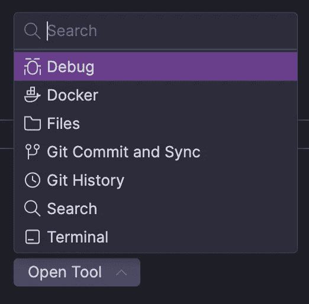

# 设置

车队中另一个发生重大变化的方面是设置管理。IntelliJ 有太多的设置，有时候很难找到你想要修改的。

Fleet 修改了设置，现在可以放在一个页面上。此外，项目设置现在位于新标签页的同一页面上，因此您不必像在 IntelliJ 上那样从首选项跳到项目设置。

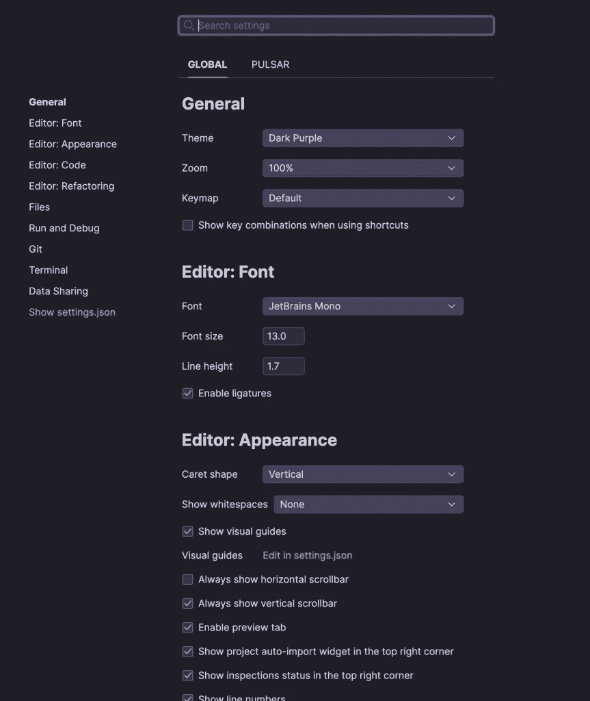

我们已经了解了 Fleet 用户界面的一些关键方面。让我们看看这个新 IDE 的性能方面。

# 表演

从性能上来说，舰队似乎总的来说更快。对于大型项目，第一次更新索引并准备好 IDE 需要几分钟时间，因为后端与 IntelliJ 目前使用的相同。

如果我们看一下内存使用情况，它看起来并不低。如果我们打开 [VisualVM](https://visualvm.github.io/) ，我们会看到 Fleet 运行两个进程——后端和 IDE 本身。

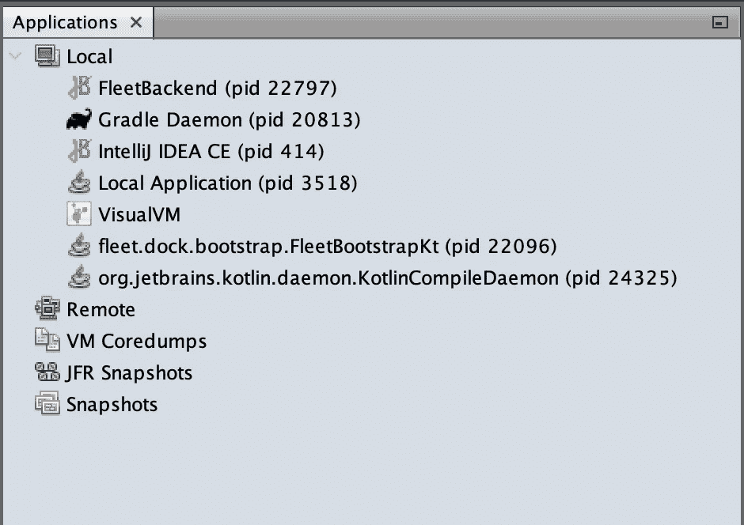

当我们查看后端时，一个大型项目需要大约 1300MB 的堆空间。不过，这对于 IntelliJ 来说应该是类似的。我们过会儿会检查那个。请注意，这些指标是在 IDE 只是为我们的代码库提供实时支持，而没有运行测试或任何应用程序时得出的。

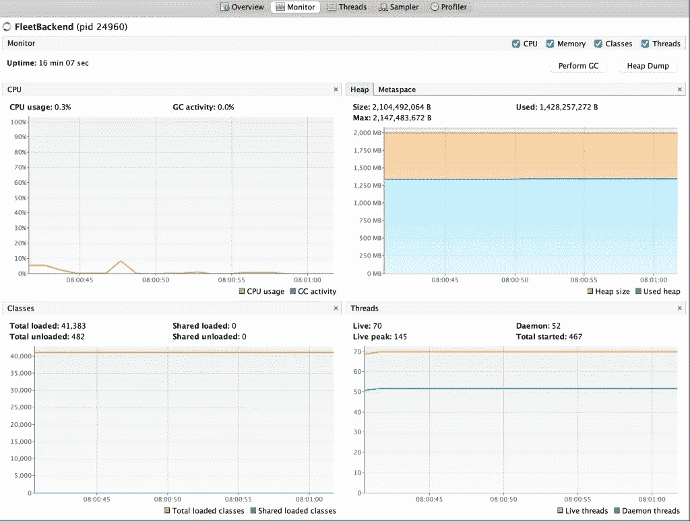

关于 UI，考虑到这只是 GUI，内存使用也不低。总体而言，Fleet 在我们的主机中使用了 1.6GB 的内存。

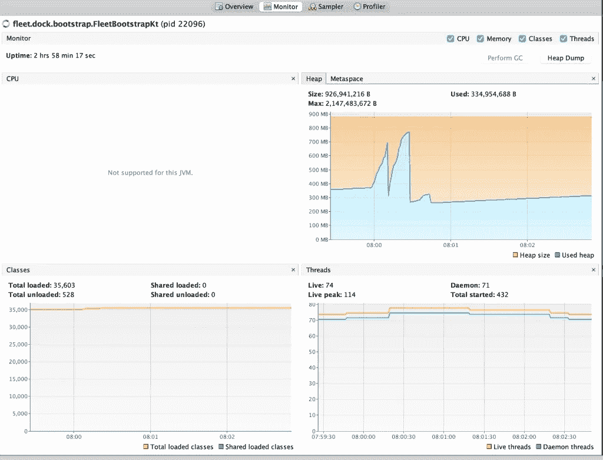

如果我们将这些指标与 IntelliJ IDEA 进行比较，我们可以看到 Fleet 消耗了更多的内存。有些事情很令人失望，因为我期望找到一个更低的内存消耗的 IDE，它应该更“轻量级”然而，当在 IntelliJ 上索引文件时，CPU 看起来更高，这可能表明 IntelliJ 上的垃圾收集活动更高。

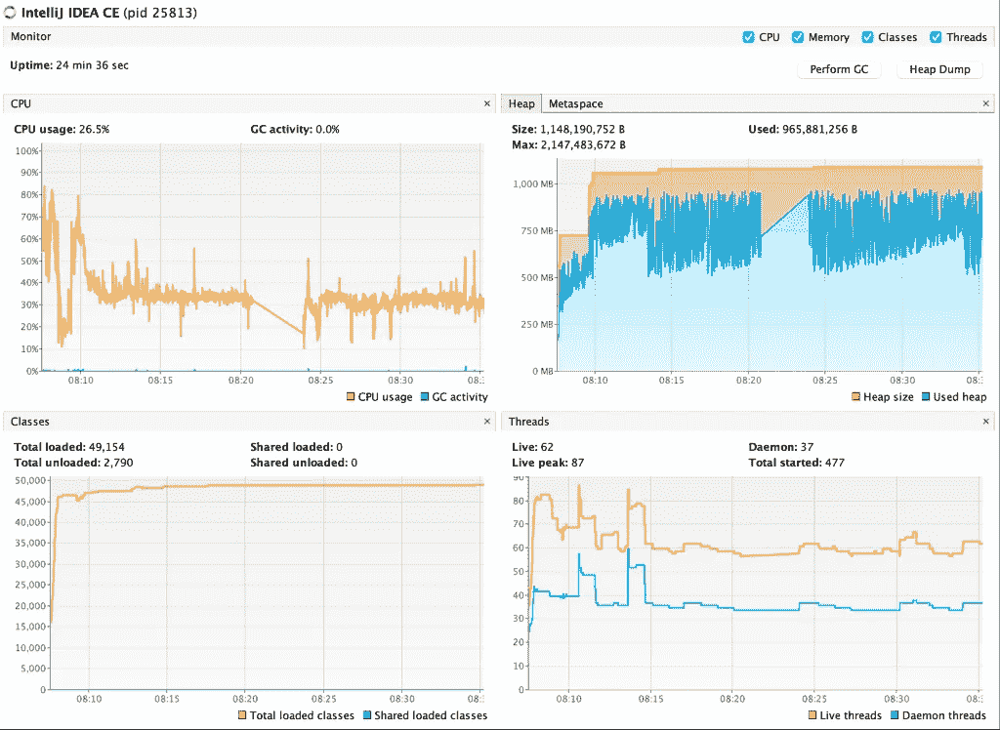

# 结论

总的来说，舰队已经朝着这个目标迈出了很好的步伐。然而，我们认为还有很多工作要做，例如在可扩展性方面需要澄清。目前还不清楚开发者是否可以像 VS 代码一样添加扩展。此外，还可以提高性能以获得更好的用户体验。

请记住，Fleet 目前正处于公开预览阶段，所以它可能还不成熟，甚至不处于可交付状态。这意味着完全理解舰队的真正可能性可能还为时过早。

这都是我们送的。

我们希望你喜欢这支舰队的初步审查。