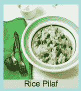
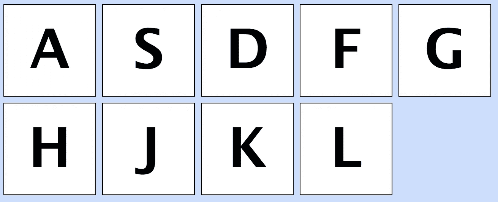
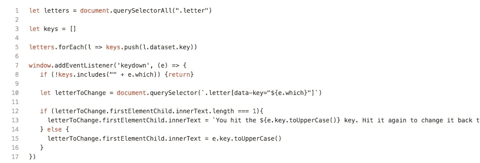

# HTML5 中数据属性的概述

> 原文：<https://betterprogramming.pub/a-rundown-dataset-attributes-in-html5-55872dad558b>

## 改进客户端功能的工具—示例

由[马库斯·斯皮斯克](https://unsplash.com/@markusspiske?utm_source=medium&utm_medium=referral)在 [Unsplash](https://unsplash.com?utm_source=medium&utm_medium=referral) 拍摄的照片

当我第一次遇到 HTML 中的数据属性时，我有点迷惑。我知道如何很容易地设置它们，但没有真正理解它们的用途。

事实证明，我是想给它们增加根本不存在的重量。它们只是开发人员给 HTML 元素提供一些额外信息的有用工具。反过来，这些信息可以用来在客户端执行复杂的任务，提供一种与元素交互的不同方式，而不是通过它们的 ID 和/或类来操作它们。

# 我们什么时候使用数据属性？

一个 HTML 元素可能拥有的属性已经太多了，比如`id`、`class`、`src`……不胜枚举。有时，我们可能希望以某种方式标记一个现有属性没有覆盖的元素。输入数据属性。

数据属性可以用于单个或多个 HTML 元素。最常见的是，它们被用在多个 HTML 元素中，表示它们共享某种质量(见下面的例子)。此时，您可能会想，“为什么不直接使用一个类呢？”这是一个完全有效的参数——在许多情况下，数据属性并不合适，应该使用类(或者更罕见的是 id)来代替。然而，一门课只能涵盖这么多。

类通常更多地用于风格方法，并且只能给出关于元素的这么多信息。另一方面，数据属性也可以用于样式化，但是它们真正的作用在于提供关于元素的额外细节。

这个信息有点特殊，因为用户是否看到它并不重要。正如在[文档](https://developer.mozilla.org/en-US/docs/Learn/HTML/Howto/Use_data_attributes)中看到的，你不希望把应该对用户可见的数据单独放在数据属性中。

原因是它们不像在元素中的某个地方提供数据那样容易访问。也有这样的情况，数据属性可能包含我们不希望用户立即看到的信息，但是他们以后可能会访问这些信息(稍后将提供一个这样的例子)。

下面，我提供了几个数据属性有用的例子。你可以在 [this GitHub repo](https://github.com/TimeSmash/testing-dataset-attributes) 查看这些例子的代码。

# **使用数据属性改变配方卡的可见性**

在我们的第一个例子中，我们正在开发一个处理食谱的应用程序。在这样的应用程序中，我们以包含菜谱图片及其名称的`div`形式链接到每个菜谱。我们可以把这个`div`称为食谱卡。

食谱卡。它显示配方的名称和图片。

一份食谱有很多细节。这包括卡路里计数、饮食限制、潜在的过敏原等等。在食谱的显示页面上，你可能会显示这些信息，但是在卡片上提供这些信息会很快变得混乱。考虑到这个元素的大小，它会显得太杂乱，更不用说用户的信息过载了。

这是数据属性的大好机会。我们可以用它们来描述一个食谱的各个方面，而不用马上展示给用户。例如，您可能想要标记哪些食谱卡是素食的，以便稍后排序和/或美观。为了让我们的食谱卡片看起来简单，我们可以为有素食食谱的卡片建立一个数据饮食属性。

例如，我们的食谱之一是米饭抓饭。这是一道简单的素菜，所以让我们使用`data-diet`的数据属性来标记它:

食谱卡代码示例。注意 div 中 data 属性的使用。

很简单，对吧？我们只是在自定义属性名前面加上单词 *data* ，并将其设置为一个字符串。这是创建数据属性时的一般规则:它们总是以单词 *data、*开头，后面的单词用破折号分隔。唯一的值数据属性可以设置为字符串(这意味着如果您想将它们指定为数字或数组，您必须首先将该数据设置为字符串，并从那里对其进行操作)

为了简单起见，我会制作另外两张食谱卡， *Aglio y Olio* (意大利面加油)和*法国鸡肉*，前者有一个`vegan`的`data-diet`，后者有一个`omni`的`data-diet`(代表杂食)。

假设一个页面上显示了如此多的食谱，用户可能想要过滤这些结果，所以只显示素食者的结果。现在我们已经设置了`data-diet`属性，我们可以写出如下所示的解决方案:

点击这个按钮将会看到食谱卡，任何不是素食者都看不见

这段代码将一个事件侦听器添加到一个预先建立的按钮上，然后该按钮查看页面上的所有食谱卡元素。它会查看它们的`data-diet`，如果不是`veggie`，它会将这些食谱卡的可见性设置为`hidden`，这意味着用户不会看到它们。单击按钮亲自尝试一下。

这是一个基本的示例，在现实生活中很可能会有所不同，但是想象一下应用程序——您可以根据需要添加任意多的数据属性，允许您之前已经指定到后端的大量客户端复杂性。根据所涉及的过程，您可能会以这种方式节省更多的时间，而不是为每一件小事都进行各种后端获取。

# **使用带键码的数据属性触发事件**

我还想到了另一个例子，它在很大程度上受到了 JavaScript30 练习的启发，这是 Wes Bos 的一套免费课程，可以帮助您发展 JavaScript 技能。在这个例子中，我们将有显示 home 行键的字母的`div`:

然后，如果我们按下那个键，应该会弹出一条消息说我们按下了它，我们可以通过再次按下它来恢复它。

按键，得到一条信息。再次按键，删除信息。

数据属性是如何影响这一点的？如果我们给每个字母一个与其键码相等的数据键属性，我们就可以很容易地控制字母的变化，如下所示:

信函示例:

我们看到每个字母只是一个`div`加上一个`h2`。每个`div`都有一个`letter`类，每个`h2`都有一个`single-letter`类。我们还看到每个`div`都分配了一个数据键，数字(作为一个字符串)是该字母的等价键码。

提供切换能力的代码:

请注意:由于 Medium 显示 gistss 的方式，像这样的长 gist 在链接时不会正确显示。为便于阅读，请参见此处的链接[。](http://bit.ly/38lwjS7)

我们可以将所有的字母放在一个`NodeList`中，并将它们的`data-key`放入一个数组中。从那里，我们可以向窗口添加一个事件监听器，它将在任何时候按下一个键时激活。事件监听器将检查按键的键码是否是按键数组中的`data-key`之一。如果不是，没人关心，所以我们只是通过抛出一个返回来提前结束函数。

如果被按下的键*的键码是包含在键数组中的*，我们就更进一步。在此步骤中，我们将变量`letterToChange`指定为字母，其`data-key`与按下的键的键码相同。

在我们继续之前，让我们注意一下这一行中使用的语法。因为我们使用的是`querySelector`，我们必须确保我们使用的是括号中的字符串。我们还必须使用一种特殊的符号来表示我们正在寻找的`data-key`的值，通过使用括号和引号，伴随着模板文字的使用，这样`e.which`的值可以被适当地转置。

如果该元素的第一个子元素的`innerText`只有一个字符长，那么我们应该显示一条消息说这个键被按下了。如果该消息已经显示出来(它的长度比一个字符长得多)，那么将它还原为键。

除此之外，我们还在卡内的`h2`元素上切换单字母类的添加/删除，以便我们的消息正确显示。(如果您注释掉这段代码的类切换方面，您将看到消息太大，无法正确显示。当我们从`h2`中移除单字母类时，它会正确显示，因为它没有单字母的风格化。)

据此，我们开发了一个应用程序，展示了利用数据属性的简单方法。

尽管这些只是简单的例子，但它显示了键码是多么有用。你可以用这种逻辑让应用程序具有动态特性，只需按一下按钮就可以访问。你可以做一个游戏。使用数据属性可以给你的应用增加一层复杂性，同时保持它在前端的整洁和简约。

尝试重新编写一些代码来合并数据属性。这将有助于您熟悉它们，并可能优化应用程序中的一些功能。一如既往，享受乐趣，快乐编码！