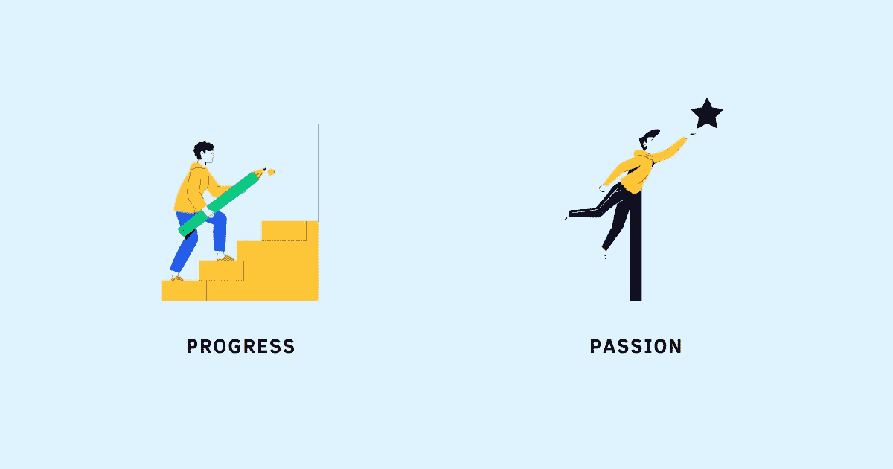

# 热爱你所做的工作的秘诀是:“将进步置于激情之上”

> 原文：<https://betterprogramming.pub/a-secret-to-loving-the-work-you-do-prioritize-progress-over-passion-91a85962128>

## 如果做得不够，你怎么能擅长任何事情，当你甚至不擅长它时，你怎么能让自己爱上它？

鸣谢:作者

那些最终热爱自己所做的事情的人和那些无止境地追求一件事来满足自己却只能沮丧、不满和不快乐的人之间有什么区别？

我以为激情就是答案。如果你对某件事充满热情，你会喜欢你所做的工作，这将使你产生伟大的作品，这将进一步激发你做更多的事情，并给工作带来快乐和满足感，否则很难找到。

史蒂夫·乔布斯在 2005 年对斯坦福大学毕业班的毕业典礼演讲中强调了这一思路，他说:“你必须找到你热爱的东西。…做伟大工作的唯一方法是热爱你的工作。如果你还没找到，继续找，不要安定。”

# 激情是答案吗？

史蒂夫演讲后不久，数百篇文章和视频宣传了这样一个观点:工作快乐的关键是找到你的激情。

“找到你的目标。”

“跟随你的心。”

“不要和解。”

“激情是开启你梦想的钥匙。”

“追随我的激情”的想法绝对令人激动。立即引起一阵兴奋的事情。我喜笑颜开，充满动力地寻找我的激情。终于放心了，有了方向。毕竟，找到我的激情有多难？伙计，我错了！

寻找激情的渴望很快被怀疑和焦虑的感觉所取代:

*   我如何找到我喜欢的工作？
*   我怎么知道我会不会爱上它？预先知道我最终会爱上什么不是很难吗？
*   如果我不热爱我的工作怎么办？
*   如果我永远找不到我的激情呢？这是否意味着我的余生都将痛苦不堪？
*   如果我想在人生的不同阶段做不同的事情呢？随着我的成长，我的生活会改变，我的优先事项也会改变。我需要在我的余生中坚持做一件事，我最热爱的事吗？

我有很多问题。我越想追随自己的激情，就越意识到这是个陷阱。我怎样才能做好一件事却做得不够，当我甚至都不擅长它的时候，我怎样才能让自己爱上它？

> “我们认为激情是第一位的，我们的欲望是第一位的；但是如果我们真的被呼召，工作总是在我们准备好之前到来。尽管感觉毫无准备，但我们将不得不采取行动。”—杰夫·戈因斯，“工作的艺术:一条发现你应该做什么的成熟途径”

# 如果激情不是答案，那是什么？

在寻找这个答案的过程中，我意识到，我不喜欢我的工作，因为我对它充满热情。我对我的工作充满热情，因为我热爱我的工作。换句话说，首先是热爱我所做的事情，然后才是激情。

所以我怎么能热爱我的工作呢？简单地说，就是通过努力工作，坚持不懈，提高我的技能，让自己变得更好，并有一种进步感。“先做工作”的想法没有“找到我的激情”的想法令人兴奋，但它肯定更现实。

进步而不是激情是我一直在寻找的答案。以下是这些年来让我热爱我所做的事情，同时让我的激情在幕后成长的三个策略:

## **1。采用工匠心态，而不是激情心态**

卡尔·纽波特在他的书《太好了，他们不能忽视你》中写道

他建议，在我们努力寻找自己热爱的工作时，我们需要采用工匠心态，而不是激情心态。

工匠心态=专注于你在工作中创造的价值。

激情思维=关注你的工作能给你带来什么价值。

他提出了两个反对激情思维的论点:

1.  当你只关注工作给你带来的东西时，它会让你对自己不喜欢的东西过度警觉，导致长期的不快乐。
2.  驱动激情心态的深层问题——“我是谁？”和“我真正爱的是什么？”基本上无法确认。“这是真正的我吗？”和“我喜欢这个吗？”很少简化为明确的是或否的回答。

另一方面，采用工匠心态提供了清晰的思路，相比之下，激情心态只会增加困惑和焦虑。为了采取工匠心态，他建议:

1.  抛开以自我为中心的担心，不管你的工作是否“刚刚好”，而是低下头，埋头苦干，让[变得真他妈的好](https://www.techtello.com/how-to-stand-out-at-work/)。没有人欠你一个伟大的事业；你需要去赢得它——这个过程不会很容易。
2.  把你的工作是否是你真正热爱的问题放在一边，而是把你的注意力转向变得优秀到让他们无法忽视你。也就是说，不管你以什么为生，像一个真正的表演者一样对待你的工作。

工匠心态通过投资于更好的工作来关注进步。一点点进步带来很多希望。一点点希望带来许多快乐。这小小的快乐累积起来就是创造你热爱的工作，热爱你所做的事情。

## 2.对这个过程要有耐心

要做好任何事，你必须努力。你必须在这呆足够长的时间。你需要积累经验。你必须对这个过程有耐心。你必须[给时间](https://www.techtello.com/power-of-yet/)让你的技能成形。

不要在你的结果中寻找一个巨大的飞跃，承诺每天提高一点点。即使没人注意，即使工作很难，即使你不喜欢，也要去做。

没人说这会很容易。这将是非常困难的。最终热爱自己工作的人是那些学会克服前进道路上的障碍和挑战的人，而不是那些拒绝冒险、坐在舒适区的人。研究表明，人类从生活中经常需要努力的部分中获得最深刻和持久的快乐。

我们因进步而茁壮成长，而进步往往来自努力。与其过多考虑激情，不如花时间和精力将你的想法付诸行动。

## **3。面对你的批评**

最后，进步感来自于实际的提高。亨利·福特说过:“如果你总是做你一直做的事情，你就会一直得到你一直得到的东西。”

如果你不愿意[面对你的批评者](https://www.techtello.com/how-to-deal-with-criticism/)，你就无法进步。别人能看到你看不到的东西。他们可以指出你从来不知道存在的缺陷。他们可以对你的想法和想法给你公正的意见，这可以防止你做出错误的决定。他们可以帮助你更开放地接受不同的观点，而不是坚持自己的世界观。

> “如果你认为你已经知道了，你就学不会。如果你确信自己是最好的，你就不会变得更好。接受反馈的艺术是生活中一项至关重要的技能，尤其是苛刻和批评性的反馈。我们不仅需要接受这种苛刻的反馈，还需要积极地征求反馈，当我们的朋友、家人和大脑告诉我们我们做得很好时，努力找出负面的反馈。”—瑞安·哈乐黛，“自我是敌人”

人生进步的首要原则是[获得反馈](https://www.techtello.com/getting-feedback/)并根据反馈采取行动。不是每一条建议都会有用，也不是每一条建议都会舒服。你必须学会大海捞针。你需要穿过噪音，找到能给你的工作带来价值的智慧。与其说是科学，不如说是艺术，是只有通过经验才能获得的东西。

进步始于批评，止于学习。一旦你开始将批评视为让自己变得更好的手段，你会更担心错过有价值的反馈，而不是它带来的不适。

下次你担心找不到你的激情时，记住激情是一个副作用，而不是热爱你所做工作的原因。热爱你所做的事情的唯一方法是做得更好，这需要采用工匠心态，对过程保持耐心，并学会面对批评。

# 摘要

1.  所有关于寻找激情的建议都忽略了一个关键点——除非你做了工作，否则你无法知道自己对什么有激情，除非你努力做得更好，否则你无法爱上它。
2.  热爱你所做的事情，进步感比找到你的激情更重要。
3.  培养一种工匠心态，这需要专注于你通过工作创造的价值，而不是专注于你的工作为你提供的价值的激情心态。
4.  通过练习、坚持和耐心，你几乎可以在任何事情上做得更好。进步感来自于将你的想法付诸行动，而不是追逐一些激情。
5.  最后，通过接受批评，你可以在学习和提高能力方面创造奇迹。每一个进步都创造了一种进步感，这进一步鼓励你寻求更多的反馈并采取行动。

在 Twitter 上关注我，了解更多故事。

*这个故事最初发表于*[*【https://www.techtello.com】*](https://www.techtello.com/progress-not-passion/)*。*