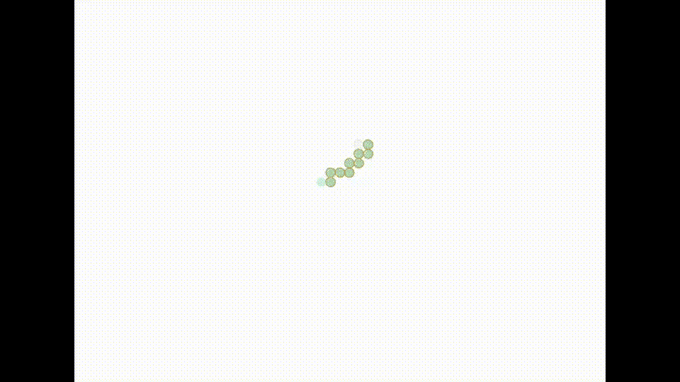

# SwiftUI 里的一个自我回避的行者

> 原文：<https://betterprogramming.pub/a-self-avoiding-walker-in-swiftui-9d2922ee1837>

## 创造一条害怕自己的蛇

沃克试图避开自己。如果需要，可以回溯

前几天构建了一个贪吃蛇游戏后，我想到我可以使用这个源代码来构建一个类似但又不同的东西:一个自我回避的行走者。事实证明，这项任务比你想象的要难。

目标是修改蛇源，以便它创建一个不断增长的蛇，永远不会碰到自己。一个有趣的小项目，花了一天左右的时间才工作得相当好，因为在其中我必须实现一个回溯例程。

# 旅程

我从复制我已经编写的 snake 代码开始，并以此为基础。我创建了一个`snakeBody`结构，我可以通过向它随机添加段来增长它。代码如下:

然后我画了一个定时循环的身体，每秒钟在蛇上随机添加一段。尽管事实远不止如此。

随机可以是四个方向之一；理论上只有三个。我用这段简单的代码做到了这一点:

简而言之，它向四个方向移动，直到无法移动。其中不能位是最难弄清楚的。

问题是这样的:随着蛇的生长，它需要跟踪它所占据的细胞。由于回合完全是随机的，它不仅可能而且很有可能会变成一个盲目的盟友，需要退出，直到它找到一个空闲的细胞继续前进。下面是我用来处理这个问题的代码:

`snakeHead`包含建议移动的坐标。如果是好的，就加在身上，继续下去。如果不是，if loops 将搜索所有四个方向，以查看是否有空闲路径。如果有，就继续。

当它无法找到自由路径时，比如在一个死胡同中，它会移除蛇的最后几段，并将这个死胡同添加到一个不可用单元的列表中——重复前面的过程，看看它是否可以逃脱。

所有这些都把我带到了这个超级短片的结尾。

看着它慢慢接管屏幕。很迷人。这里是完整的[源](https://gist.github.com/b294df5a1fdac8e62ed1f37aa972d20a.git)如果你想玩它。

感谢阅读！