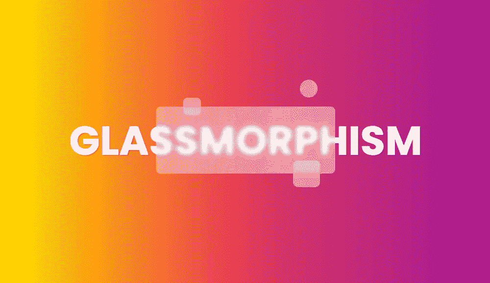
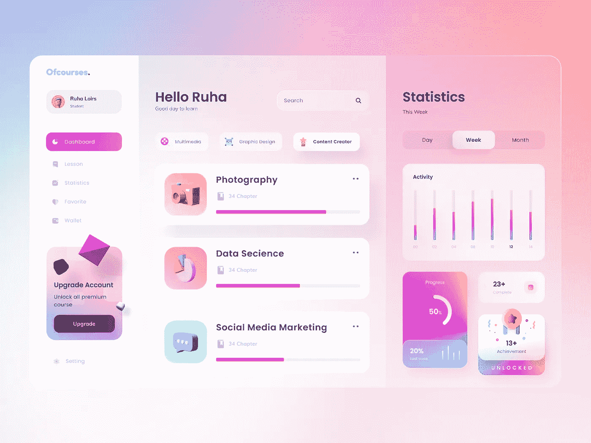
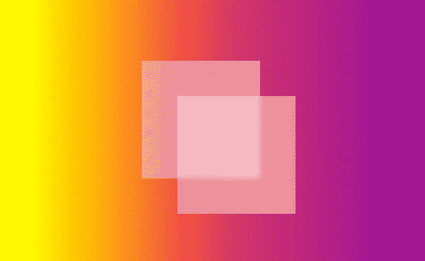

# 如何在纯 CSS 中创建玻璃形态元素的简短指南

> 原文：<https://betterprogramming.pub/a-short-guide-on-how-to-create-glassmorphic-elements-in-pure-css-4d52f81089ab>

## 以及玻璃态的介绍



图片来源:作者

去年的[变态性](https://uxdesign.cc/neumorphism-in-user-interfaces-b47cef3bf3a6)趋势是可怕和糟糕的。在 2020 年，我预计会有更糟糕的事情发生，但是新形态主义风格的创造者 Michał Malewicz 写了一些新鲜而好看的东西——**[玻璃形态主义](https://uxdesign.cc/glassmorphism-in-user-interfaces-1f39bb1308c9)风格。**

**让我们来看看吧。**

# **新趋势**

**Glassmorphism 是一种新趋势，在像 [Dribbble](https://dribbble.com/tags/glassmorphism) 和 Behance 这样的服务上变得越来越流行。**

****

**[Rudi harto no 的课程仪表板](https://dribbble.com/shots/13984220-Courses-Dashboard)**

**它的典型特征是:**

*   **透明度(磨砂玻璃)**
*   **鲜艳或柔和的颜色**
*   **浅色边框**

# **玻璃形态 CSS 之路**

**对于前端开发人员来说，Glassmorphism 很容易实现。我们可以使用一个主要的 CSS 属性:`[backdrop-filter](https://developer.mozilla.org/en-US/docs/Web/CSS/backdrop-filter)`。此属性允许您对组件后面的区域应用多种效果，如模糊、棕褐色和灰度。由于它适用于组件后面的所有内容，要查看效果，您必须使该元素至少部分透明。**

**要创建 glassmorphism 效果，您应该使用`backdrop-filter: blur()`。**

```
<div class="basic">
  <div class="blur"></div>
</div>.basic {
  width: 200px;
  height: 200px;
  background: rgba(255,255,255,0.4);
  position: relative;
}
.blur {
  position: absolute;
  bottom: 25px;
  right: 162px;
  width: 200px;
  height: 200px;
  background: rgba(255,255,255,0.4);
  backdrop-filter: blur(5px);
}
```

****

**基本组件**

**身后的影像已经直了`background: rgba(255,255,255,0.4)`。上面的元素是第一个元素的副本，但是增加了一个`backdrop-filter: blur(10px)`属性。**

**这是一个新趋势的最简单的例子。但是我们可以更进一步。你可以像 Michał Malewicz 建议的那样，添加一个边框半径，白色边框，和一点点模糊。**

**你可以尝试的最后一件事是给你的形状添加一个 1px 的透明内边框。它模拟玻璃边缘，可以使形状在背景中更加突出。**

```
<div class="basic">
  <div class="blur"></div>
</div>.basic {
  width: 200px;
  height: 200px;
  background: rgba(255,255,255,0.4);
  position: relative;
}
.blur {
  position: absolute;
  bottom: 25px;
  right: 162px;
  width: 200px;
  height: 200px;
  background: rgba(255,255,255,0.4);
  backdrop-filter: blur(10px);
  border-radius: 10px;
  border: 1px solid rgba(255,255,255,0.2);
}
```

****

**圆形边框和白色边框**

# **玻璃形态 2021**

**我希望玻璃形态在 2021 年成为时尚。我希望看到以这种风格构建的真正的应用程序，或者有机会自己构建它们。**

**在 [codepen](https://codepen.io/walickialbert/pen/xxOvPmb) 上玩我的英雄形象。**

# **浏览器兼容性**

**根据[我能用](https://caniuse.com/css-backdrop-filter)吗，属性`backdrop-filter`完全支持 Chrome、Safari、iOS、Android 浏览器、Edge。默认情况下不支持 Firefox，但可以启用。**