# CSS 定位的简短指南

> 原文：<https://betterprogramming.pub/a-short-guide-to-css-positioning-a481c3556d60>

## 固定、相对、绝对等等


照片由[格雷格·拉科齐](https://unsplash.com/@grakozy?utm_source=medium&utm_medium=referral)在 [Unsplash](https://unsplash.com?utm_source=medium&utm_medium=referral) 上拍摄

我一直做 web 前端开发，用 CSS 用的挺多的。我以为我对 CSS 的基本知识了如指掌。但是在我内心深处，我知道我对 CSS 的了解并不能涵盖一切。还有很多东西我不知道。所以我决定踏上探索 CSS 世界的旅程，这是第一章。

在这篇文章中，我将解释 CSS `position`特性，你们可能都已经知道了，但是我将尝试提出一些你们以前可能没有听说过的东西。

## 阅读前

在阅读了 CSS 规范之后，我试图用我的研究中的一些例子来组织这些。

当然，最好是阅读官方文档来获得更准确的信息。此外，可能会有错误的信息或遗漏的信息，如果您能纠正我，我将不胜感激。

# 什么是包容块？

在 CSS 中，有一个概念叫做包含块 (CB)的*，在开始使用 CSS `position`之前，你应该知道这个概念。*

包含块是您创建的 DOM 元素的抽象区域。当需要计算`width`、`height`、`top`、`left`时，由后代元素使用。CB 是其后代元素的标准。换句话说，CB 通常被称为父元素——从技术上来说，这是不对的，但是许多文档认为 CB 等同于父元素，以便于解释。

每个 DOM 元素在创建时都会创建它的 CB。CB 和制造它的东西一模一样。区别在于 CB 实际上并不用于在浏览器上绘制 DOM 元素，因为它们是抽象的概念。他们所做的是帮助后代元素决定他们的`width`或`height`应该是什么，或者他们的`top`和`left`应该是什么。

元素和 CBs 之间的关系如下图所示:

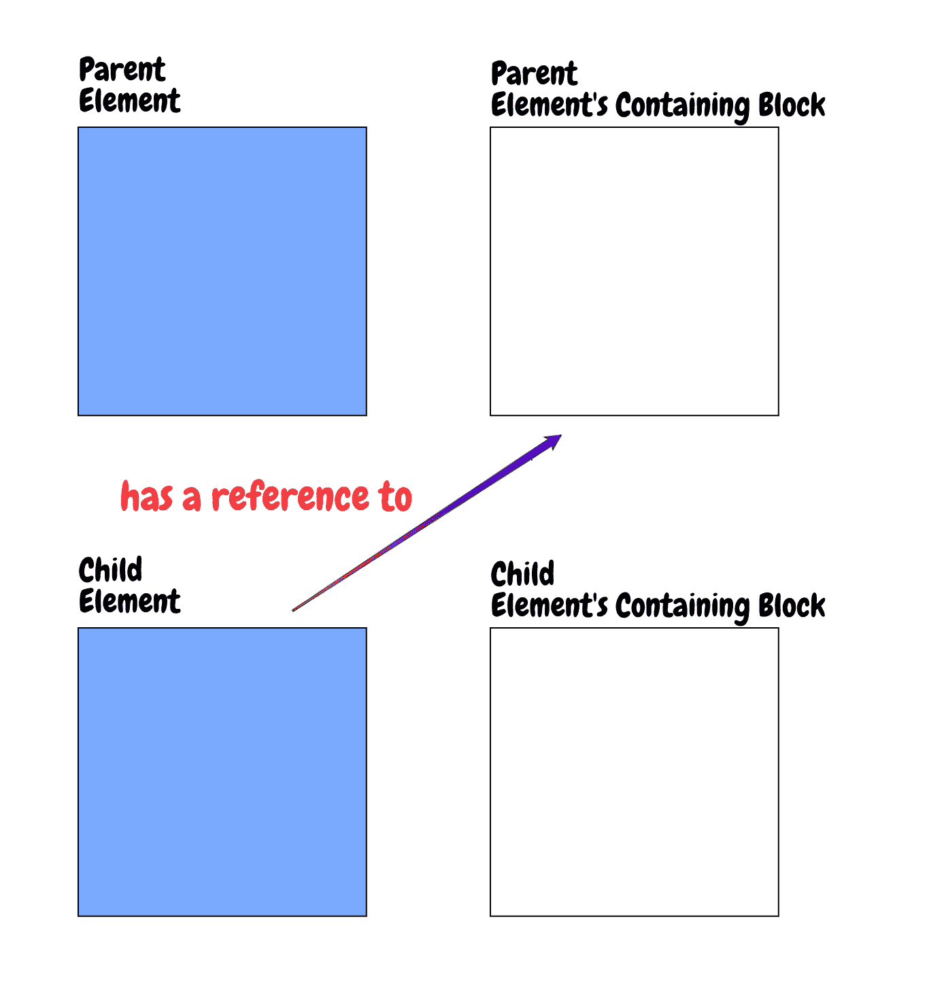

根据`position`属性的类型，CB 可能有所不同。

```
div {  
  position: fixed;
}p { 
  position: absolute; 
}h1 {   
  position: relative; 
}section { 
  position: sticky; 
}
```

*   `div` — `fixed`始终指视口
*   `p` — `absolute`，指`position`不是`static`的最近的父元素 CB。如果它们都不满足条件，则使用视口。
*   `h1` — `relative`并遵循正常的 DOM 流程。有趣的是，`relative`元素使用左上角的坐标(0，0)作为 CB 的坐标。我将在这篇文章的后面更详细地解释这一点。
*   `section` — `sticky`指`nearest`父元素的 CB，其中`overflow`设置为`scroll`或`auto`。如果它们都不满足条件，则使用视口。在这篇文章的后面，我会对此进行更深入的解释。

# 绝对位置

一个`absolute`元素不包含在普通的 DOM 流中。它从不关心其他元素的位置或大小。

`absolute`元素的位置可以根据它所引用的元素而变化。基本上，`absolute`元素指的是`position`属性不是`static`的最近的父元素的 CB。

```
<div id="outer">   
  Outer   
  <div id="inner">
     Inner
     <p id="p1">
       Position Absolute
     </p>
  </div>
</div>
```

假设我们有一棵像这样的 DOM 树。

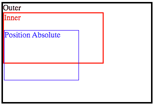

`inner`元素的位置现在是`static`，这是没有设置`position`属性时的默认值。因此，`p1`指的是`outer`的 CB。

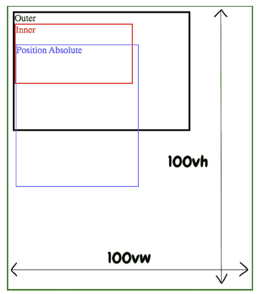

如果所有元素位置都是静态的，则绝对位置指的是视口

现在`outer`的位置是`static`，这是默认值。如果没有父元素被设置为非`static`的值，那么`absolute`元素，在本例中为`p1`，引用视口。

但有一件事我应该澄清一下。值为`absolute`的元素不在正常的 DOM 流中。不过，看起来它还在流行。实际上，`p1`元件的位置如下。

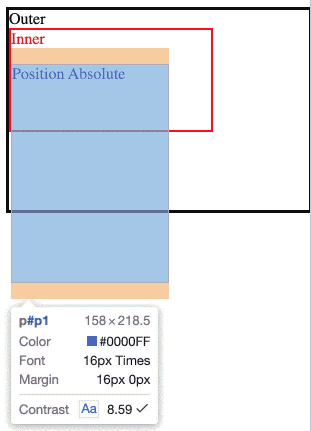

默认字体大小为 16px

你首先能看到的是`p1`的`margin`。此时`p1`的`margin`值为 1 `em`，换算成 16px。默认情况下，`em`受父元素的`font-size`值的影响，该值可以继承给子元素。Chrome 中默认的`font-size`是 16px，也就是说`p1`的父元素的`font-size`也是 16px，因为我没有碰过。所以`p1`的`margin`大小也将是`16px * 1em = 16px`。

```
#inner {
  font-size: 10px;
}
```

如果我把`inner`的`font-size`改成 10px 会怎么样，因为`inner`是`p1`的父节点？

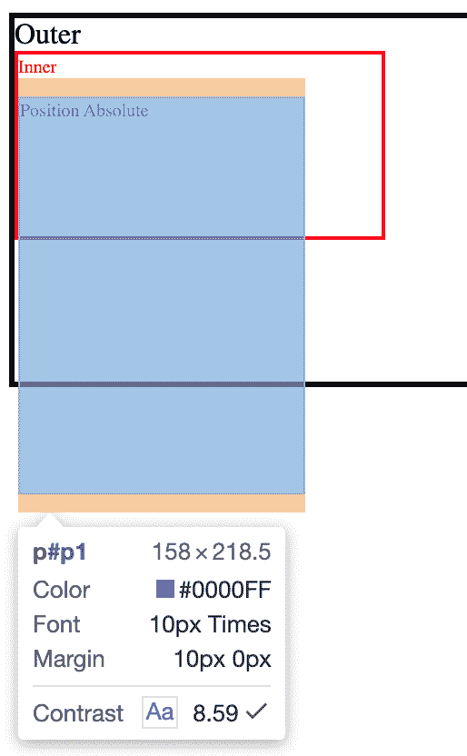

现在字体大小改为 10px

然后`p1`的`margin`也被重新计算为 10px。

而且，我也没有给`p1`的`top`属性赋予任何值，但是为什么它会从最顶端的元素偏移一些像素呢？从表面上看，它大约是文本“外部”和“内部”高度的总和嗯，没错。

CSS 规范对`top`属性的描述如下:

> “‘顶’和‘底’是‘自动’，而‘高度’不是‘自动’，那么将‘顶’设置为静态位置。”

换句话说，这意味着即使`p1`是一个`absolute`定位的元素，它也像一个`relative`定位的元素一样工作——除非它的`top`或`left`被设置。

```
#p1 {
  top: 0;
}
```

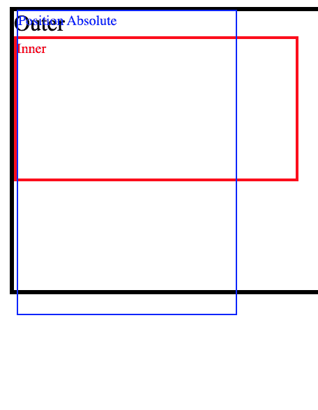

在 top 被设置为 0 后，绝对元素最终粘在了 top 上

给了`p1`一个`top`的值后，终于，上了 CB 的顶。

## 快速测验

`p1`仍不在左起 0 处。这是为什么呢？(提示:`p1`的`left`还是`auto`。)

# 位置固定

`fixed`元素与`absolute`元素非常相似，除了一个巨大的区别——它们总是将视口称为 CB。

在本例中，`outer`从顶部偏移 50px，并且`left`和`top`被设置为`position: fixed`的`0`。

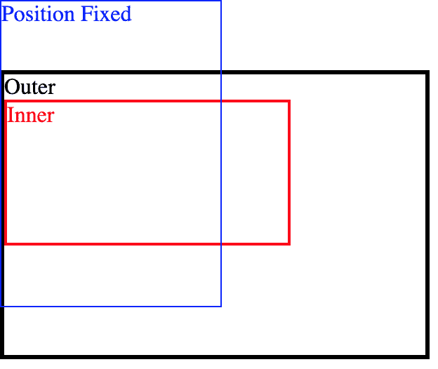

固定元素总是查看视口的 CB

你可以看到`p1`贴在视窗的顶部。

# 相对位置

`relative`元素遵循正常的 DOM 流。它们总是参考父元素的 CB 来确定大小和位置(`top`、`left`等)。).但是，它们引用自己的 CB 位置，该位置包含在父元素的 DOM 流中，作为开始位置。

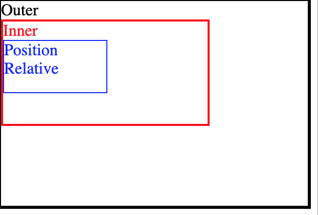

相对元素总是查看父元素的 CB

`relative`和`absolute`元素有相同的共同特征——它们可以与其他元素重叠。

```
#p1 {   
  top: 50%; 
}
```

`p1`这里的 top 是 50%。由于`p1`引用父元素的 CB，因此`top`值将是父元素高度的 50%。但是它没有从父元素 CB 的顶部偏移。是从它的 CB 上面。

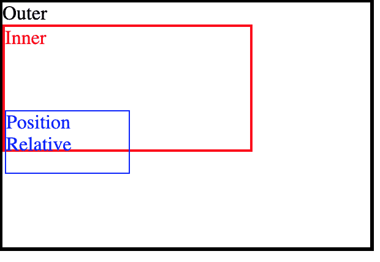

相对元素与父元素重叠

`relative`和`absolute`是有区别的。`absolute`元素无论如何都应该在浏览器上呈现，除非它们的`display`被设置为`none` —例如，`relative`元素根据其父元素的`overflow`属性决定是否在浏览器上显示。

这个我再深入解释一下。一旦创建了 DOM 元素，该元素就执行两项任务。第一项工作是为它的后代元素建立看起来完全相同的 CB，这些后代元素将在以后需要时引用它的 CB。另一个任务是确定必要时要参考的 CB。

这类似于 JavaScript 的`prototype`。当一个子元素在它所引用的 CB 之外时，浏览器通过查看子元素所引用 CB 的元素的`overflow`属性来决定是否显示该子元素。如果`overflow`属性被设置为`scroll`或`auto`，浏览器必须使子元素可见。

更简单的解释是:如果 CB 所引用的元素的`overflow`属性是`scroll`或`auto`，那么子元素将被显示。

让我们看看这是不是真的。

```
#inner {   
  overflow: scroll; 
}#p1 {   
  top: 200%; 
}
```

`inner`有`overflow: scroll``p1`离顶挺远的，一开始看不到。但是如果你向下滚动，浏览器允许你看到它。

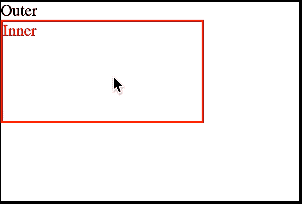

无论如何，必须显示相关元素

相反，如果`inner`的`overflow`是`hidden`就不会显示。如果`overflow`没有设置，默认为`visible`。

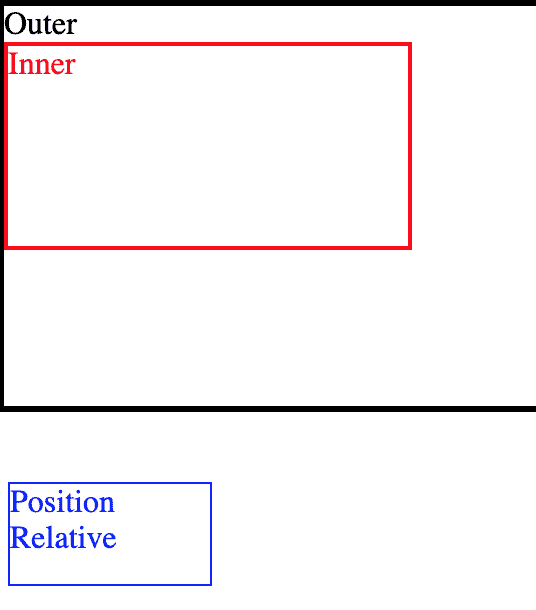

当父元素的溢出属性可见时，相对元素将像这样显示

# 位置粘性

`sticky`很有用，但也很奇怪。CSS 规范将其描述为类似于`relative`。`sticky`像`relative`一样工作，直到元素位于某个阈值点。*某个阈值点，在此上下文中的*是指决定元素位置的值，如`top`或`left`。但是谁的`top`和`left`？

`sticky`元素是指`overflow`设置为`scroll`的最近的父元素的 CB。如果它们都不满足条件，则一个`sticky`元素引用视口。

例如，如果`top`是 50px，那么`sticky`元素就像`relative`元素一样工作，直到它从 CB 的顶部偏移 50px。

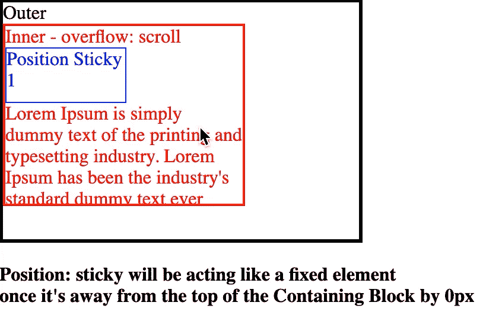

图一。粘的

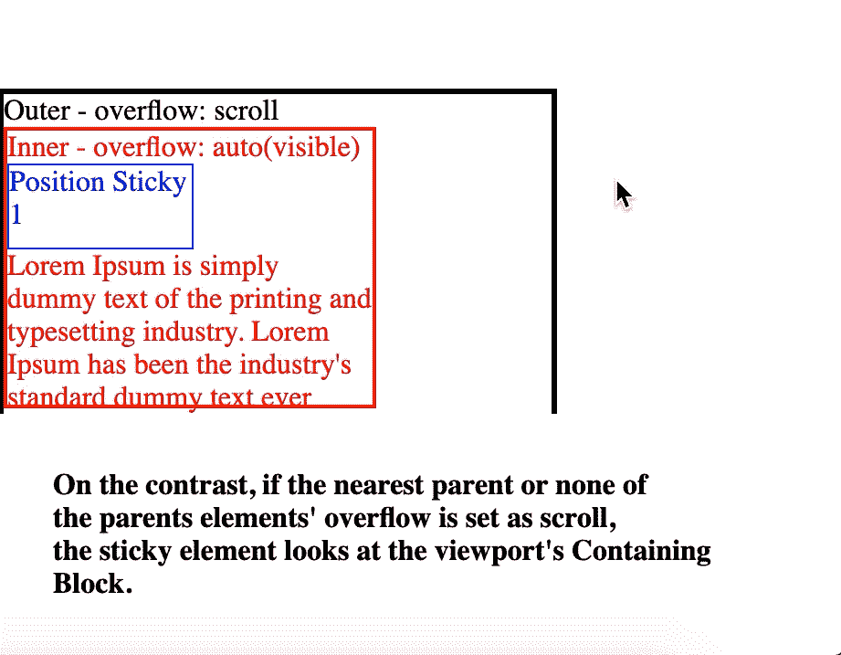

图二。粘的

# 其他有用信息

如果同时设置了`left`和`right`，则`left`获胜。如果同时设置了`top`和`bottom`，则`top`获胜。

但是，如果父元素的`direction`属性设置为`rtl`，从右到左，上面的优先级将相反。

```
div {   
  position: absolute;
  top: 0; 
  bottom: 0;  
  left: 0;  
  right: 0; 
}
```

上面的 CSS 表达式其实如下。

```
div {   
  position: absolute;
  top: 0; 
  left: 0;  
}
```

# 结论

我试图组织 CSS 规范描述 CSS 的位置，给出一些例子以便更好地理解。即使我知道如何使用它们，我也不知道它们为什么这样或那样工作。所以这项研究对我来说很有意义。

顺便说一下，`position: sticky`比其他特性更晚被添加到规范中。所以目前没有很多浏览器支持这个功能。这个有一个聚合填充。希望以后有机会可以说说。

# 资源

*   [“包含块”的定义— CSS 模型 2](https://www.w3.org/TR/CSS2/visudet.html#containing-block-details)
*   [内容高度:“高度”属性— CSS 模型 2](https://www.w3.org/TR/CSS21/visudet.html#propdef-height)
*   [布局和包含块— MDN](https://developer.mozilla.org/en-US/docs/Web/CSS/Containing_block)
*   [CSS 非替换和替换元素— LittleWebHut](http://www.littlewebhut.com/css/info_nonreplaced_replaced/)
*   [职位:粘性浏览器支持—我可以使用](https://caniuse.com/#feat=css-sticky)