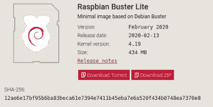
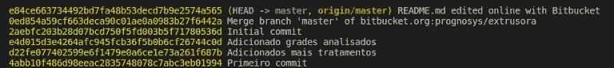

# 围棋散列法简明指南

> 原文：<https://betterprogramming.pub/a-short-guide-to-hashing-in-go-e8bb0173e97e>

## 如何散列一个字符串或文件


里卡多·戈麦斯·安吉尔在 [Unsplash](https://unsplash.com?utm_source=medium&utm_medium=referral) 上的照片。

哈希函数是现代密码学最重要的特征之一。既然我已经决定学习[围棋](https://golang.org/)，为什么不试着实现一个文件哈希函数只是为了好玩呢？

*注意:本教程使用的 Go 版本是 1.13.4。*

# 介绍

哈希函数是一种将可变长度的输入映射到固定长度的输出的算法。这个函数的返回值被称为哈希值、摘要或简称为 hash。

主要用于解决密码学的完整性[原理。在发送者和接收者之间的通信期间，消息可以被改变。哈希函数可以确保消息不被修改。](https://www.thegeekstuff.com/2012/07/cryptography-basics/)

哈希函数的主要特征是:

*   固定长度输出:散列函数接收任意大小的消息(输入),并且总是产生相同大小的输出。
*   效率:它必须在计算上不难执行。
*   确定性:相同的消息将总是产生相同的哈希值。

要在加密中使用，它必须具有以下属性:

*   前映像阻力:给定一个哈希值，应该很难找到产生它的消息。
*   第二个前像阻力:给定一个消息 *m* ，应该很难找到另一个消息 *n* 产生与 *m* 相同的 hash。
*   抗冲突性:很难找到两个不同的消息产生相同的散列。

哈希函数用于互联网上的许多应用，例如:

*   文档完整性:例如，你以前肯定从 FTP 站点下载过非常大的文件。他们可能有一个指示哈希。



Raspbian zip 文件及其哈希——照片来自 [Raspberry Pi](https://www.raspberrypi.org/downloads/raspberry-pi-os/) 。

*   密码存储:您的密码不是以明文形式保存，而是以散列形式保存在数据库中。至少好的系统做到了。
*   唯一 ID:因为每条消息必须产生相同的输出，并且没有其他消息产生相同的输出，所以可以使用散列来唯一地标识文档或消息。例如，Git 就是用这个来识别每个提交的。



作者照片。

*   工作证明:对于一个用户来说，要执行一个动作或者发布一些东西，他们必须证明他们已经执行了一个任务。该证明是用户花费一些时间生成满足评估者条件的答案的保证。例如，这在区块链使用。

一些流行的哈希函数包括`MD5`、`SHA`和`Whirpool`。

# **字符串哈希**

我们需要`[crypto](https://golang.org/pkg/crypto/)`包来计算散列。以下是可用的哈希函数:

为了从一个字符串或字节片计算一个散列，我们可以从我们想要的算法的给定包中使用`Sum`函数:

输出:

```
 MD5: 1356c67d7ad1638d816bfb822dd2c25d
  SHA1: 201a6b3053cc1422d2c3670b62616221d2290929
SHA256: 1cbec737f863e4922cee63cc2ebbfaafcd1cff8b790d8cfd2e6a5d550b648afa
```

# 文件散列

要从文件中计算散列，我们需要根据其内容创建散列值:

*   从一个`crypto`包中创建一个新的`hash.Hash`(我们想要使用的算法)。
*   通过写入其`io.Writer`函数来添加它。
*   通过调用`Sum`函数提取总和。

分块读取文件内容，以避免使用大量内存。

# 结论

多亏了可用的`crypto`包，使用 Go 从字符串或文件计算哈希值变得很简单。